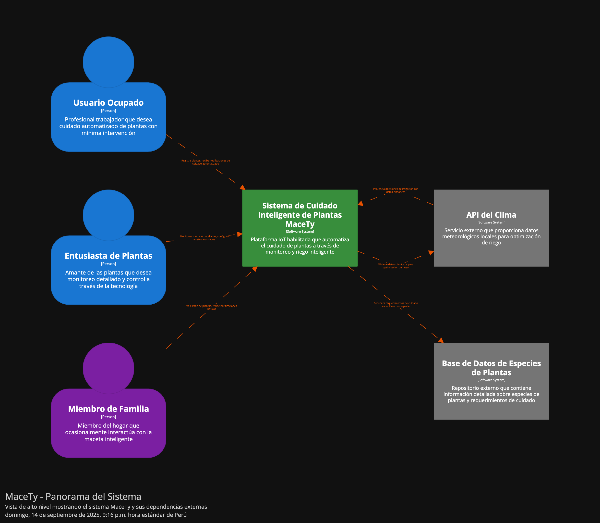
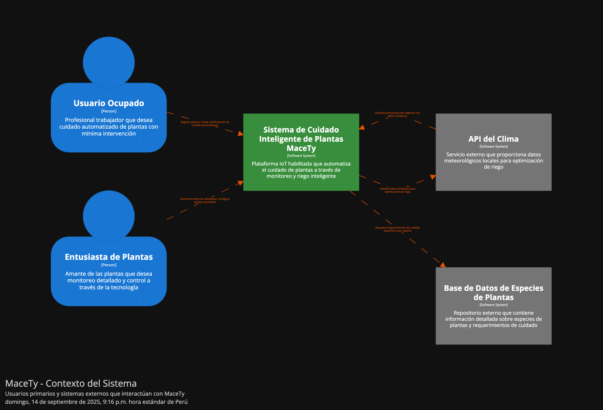
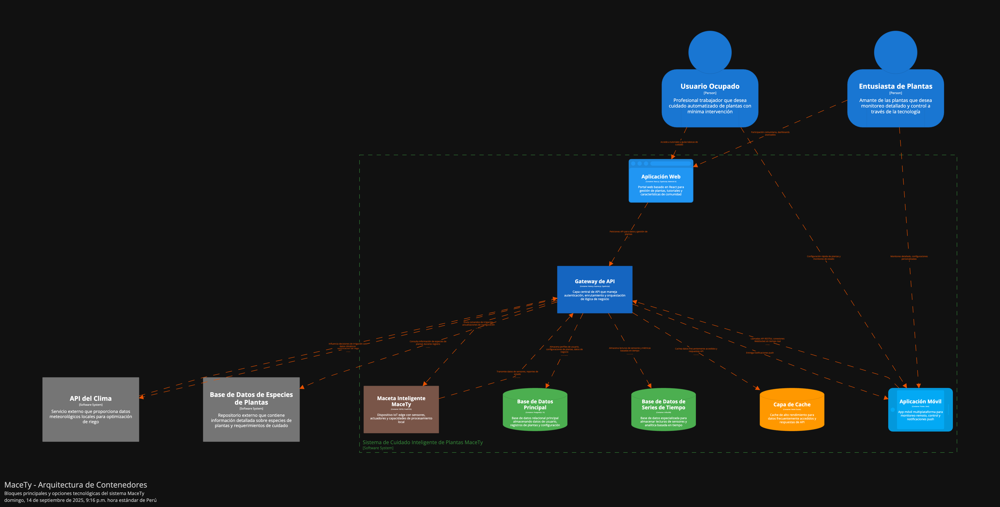
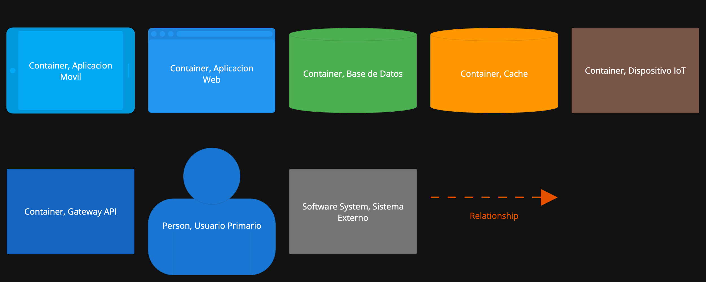
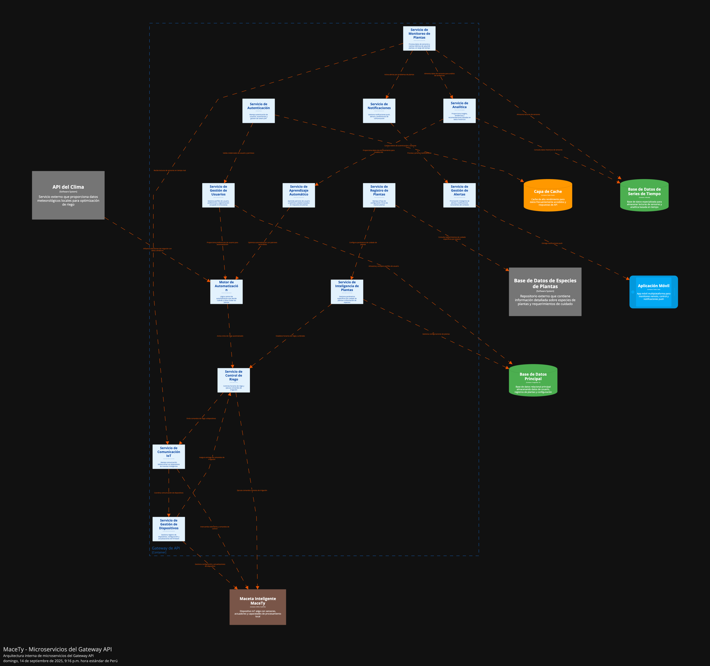
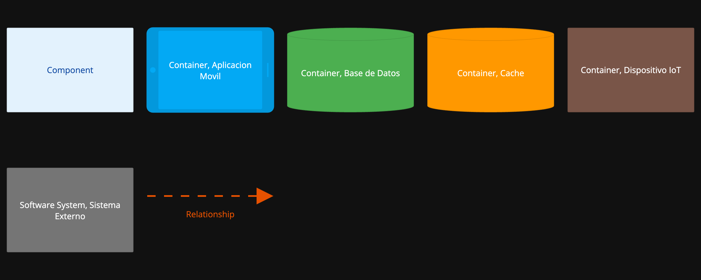
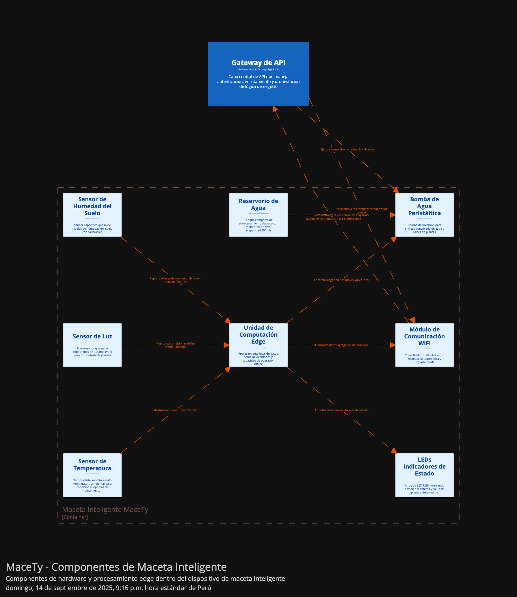
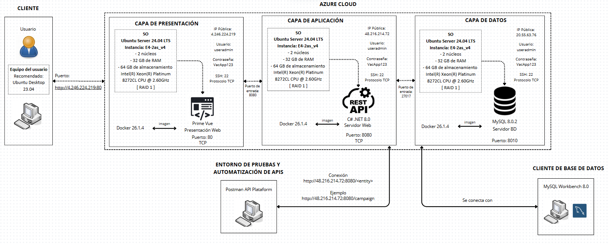
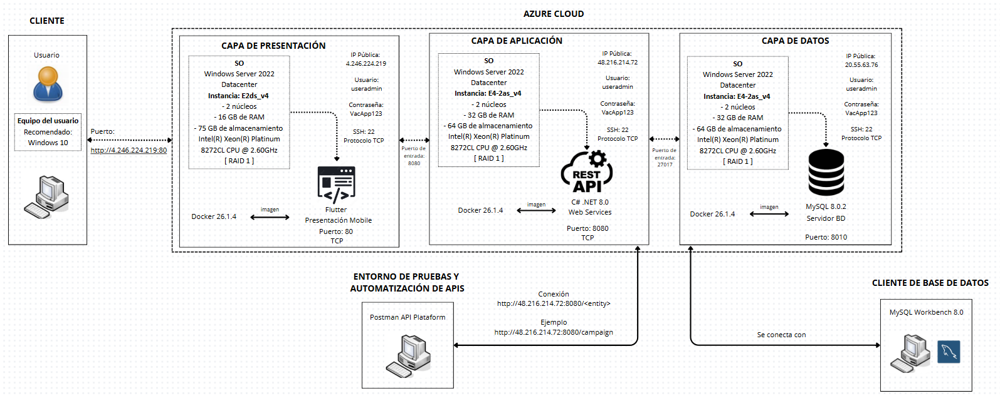

  

  <strong>UNIVERSIDAD PERUANA DE CIENCIAS APLICADAS</strong> 
  <strong>FACULTAD DE INGENIERÍA</strong> 
  <strong>PROGRAMA ACADÉMICO DE INGENIERÍA DE SOFTWARE</strong> 
  <strong>1ASI0572-2520-3414 - DESARROLLO DE SOLUCIONES IoT</strong>

  <em><strong>MaceTy</strong></em> 
  <em><strong>TB1</strong></em>

  <strong>DOCENTE:</strong> 
  Marco Antonio Leon Baca

  <strong>STARTUP:</strong> 
  NaturaFy

<h3 align="center">Team Members:</h3>

| **Member**               | **Code**   |
| ------------------------ | ---------- |
| Rojas Velasquez, Maycol  | U202219984 |
| Gómez Vallejos, Sergio   | U20221D401 |
|                          |            |

<strong>Septiembre 2025</strong>

# Registro de Versiones del Informe

| Versión | Fecha       | Autor                         | Descripción de modificación                |
|---------|-------------|-------------------------------|--------------------------------------------|
| TB1     | 14/09/2025  | Maycol Jhordan Rojas Velásquez | Creación inicial del documento  |
| TB1     | 14/09/2025  | Maycol Jhordan Rojas Velásquez | Estructuración del documento |
| TB1     | 14/09/2025  | Maycol Jhordan Rojas Velásquez | Descripcion del StartUp |
| TB1     | 14/09/2025  | Maycol Jhordan Rojas Velásquez | Segmento Objetivo |
| TB1     | 14/09/2025  | Maycol Jhordan Rojas Velásquez | Ubiquitous Language |
| TB1     | 14/09/2025  | Maycol Jhordan Rojas Velásquez | Software Architecture |
| TB1     | 14/09/2025  | Maycol Jhordan Rojas Velásquez | Software Architecture System Landscape Diagram |
| TB1     | 14/09/2025  | Maycol Jhordan Rojas Velásquez | Software Architecture Context Level Diagrams |
| TB1     | 14/09/2025  | Maycol Jhordan Rojas Velásquez | Software Architecture Container Level Diagrams |
| TB1     | 14/09/2025  | Maycol Jhordan Rojas Velásquez | Software Architecture Deployment Diagrams |
| TB1     | 14/09/2025  | Sergio André Gómez Vallejos | Implementación de Antecedentes y problematica  |
| TB1     | 14/09/2025  | Sergio André Gómez Vallejos | Implementación de los Competidores  |
| TB1     | 14/09/2025  | Sergio André Gómez Vallejos | Implementación de Analisis de los competidores  |
| TB1     | 14/09/2025  | Sergio André Gómez Vallejos | Creación de las tácticas y entrategias frente a competidores  |
| TB1     | 14/09/2025  | Sergio André Gómez Vallejos | Creación de analisis de las entrevistas  |

# Project Report Collaboration Insights
#### 1. URL del Repositorio en GitHub

| Repositorio del Informe en GitHub |
|-----------------------------------|
| https://github.com/orgs/NaturaFy/repositories |

#### 2. Actividades de Elaboración del Informe

| Actividad                           | Descripción                                                                                          |
|-------------------------------------|------------------------------------------------------------------------------------------------------|
| Comunicación de avances            | Se realizaron breves reuniones donde se comentaban los avances de cada integrante para garantizar un trabajo en equipo sincronizado y estar al tanto de cada modificación.                                |
| Delegación de responsabilidades    | Se organizaron charlas y reuniones para la delegación de tareas, promoviendo el trabajo en equipo y el avance continuo de manera asíncrona.                            |
| Recopilación de datos              | Se realizó un estudio del mercado, utilizando los segmentos objetivos para extraer datos significativos mediante entrevistas. Además, se utilizaron referencias bibliográficas para investigar información relevante dentro del desarrollo del informe                                                          |
| Documentación             | Se desarrollaron diferentes capítulos del informe, utilizando las técnicas, herramientas y metodologías requeridas.                                                         |

#### 3. Capturas de Imagen de los Analíticos de Colaboración y Commits en GitHub

| Métrica                         | Descripción                                                                                          |
|---------------------------------|------------------------------------------------------------------------------------------------------|
| Número de commits por autor     |  |
| Historial de cambios            |  |

#### 4. Participación de Todos los Miembros del Equipo

| Evidencia                       | Descripción                                                                                          |
|---------------------------------|------------------------------------------------------------------------------------------------------|
| Contribuciones en GitHub       | Cada integrante del equipo completó sus tareas y subió sus avances al repositorio de GitHub. Adempas, cada uno colaboró revisando el trabajo de sus compañeros. |
| Discusiones y actividades      | Se organizaron encuentros virtuales para compartir avances, resolver dudas y atender los desafíos de cada actividad. |
| Exposiciones del proyecto       | Se llevaron a cabo sesiones para exponer el trabajo realizado antes de la fecha orrespondiente y prepararnos adecuadamente para la presentación final. |

# Tabla de Contenidos  

## Capítulo I: Introducción  

- [1.1. Startup Profile](#11-startup-profile)  
  - [1.1.1. Descripción de la Startup](#111-descripción-de-la-startup)  
  - [1.1.2. Perfiles de integrantes del equipo](#112-perfiles-de-integrantes-del-equipo)  
- [1.2. Solution Profile](#12-solution-profile)  
  - [1.2.1. Antecedentes y problemática](#121-antecedentes-y-problemática)  
  - [1.2.2. Lean UX Process](#122-lean-ux-process)  
    - [1.2.2.1. Lean UX Problem Statements](#1221-lean-ux-problem-statements)  
    - [1.2.2.2. Lean UX Assumptions](#1222-lean-ux-assumptions)  
    - [1.2.2.3. Lean UX Hypothesis Statements](#1223-lean-ux-hypothesis-statements)  
    - [1.2.2.4. Lean UX Canvas](#1224-lean-ux-canvas)  
- [1.3. Segmentos objetivo](#13-segmentos-objetivo)  

---

## Capítulo II: Requirements Elicitation & Analysis  

- [2.1. Competidores](#21-competidores)  
  - [2.1.1. Análisis competitivo](#211-análisis-competitivo)  
  - [2.1.2. Estrategias y tácticas frente a competidores](#212-estrategias-y-tácticas-frente-a-competidores)  
- [2.2. Entrevistas](#22-entrevistas)  
  - [2.2.1. Diseño de entrevistas](#221-diseño-de-entrevistas)  
  - [2.2.2. Registro de entrevistas](#222-registro-de-entrevistas)  
  - [2.2.3. Análisis de entrevistas](#223-análisis-de-entrevistas)  
- [2.3. Needfinding](#23-needfinding)  
  - [2.3.1. User Personas](#231-user-personas)  
  - [2.3.2. User Task Matrix](#232-user-task-matrix)  
  - [2.3.3. User Journey Mapping](#233-user-journey-mapping)  
  - [2.3.4. Empathy Mapping](#234-empathy-mapping)  
- [2.4. Ubiquitous Language](#24-ubiquitous-language)  
- [2.5. Big Picture EventStorming](#25-big-picture-eventstorming)  

---

## Capítulo III: Requirements Specification  

- [3.1. User Stories](#31-user-stories)  
- [3.2. Product Backlog](#32-product-backlog)  
- [3.3. Impact Mapping](#33-impact-mapping)  

---

## Capítulo IV: Solution Software Design  

- [4.1. Strategic-Level Domain-Driven Design](#41-strategic-level-domain-driven-design)  
  - [4.1.1. Design-Level EventStorming](#411-design-level-eventstorming)  
    - [4.1.1.1. Candidate Context Discovery](#4111-candidate-context-discovery)  
    - [4.1.1.2. Domain Message Flows Modeling](#4112-domain-message-flows-modeling)  
    - [4.1.1.3. Bounded Context Canvases](#4113-bounded-context-canvases)  
  - [4.1.2. Context Mapping](#412-context-mapping)  
  - [4.1.3. Software Architecture](#413-software-architecture)  
    - [4.1.3.1. Software Architecture System Landscape Diagram](#4131-software-architecture-system-landscape-diagram)  
    - [4.1.3.2. Software Architecture Context Level Diagrams](#4132-software-architecture-context-level-diagrams)  
    - [4.1.3.3. Software Architecture Container Level Diagrams](#4133-software-architecture-container-level-diagrams)  
    - [4.1.3.4. Software Architecture Deployment Diagrams](#4134-software-architecture-deployment-diagrams)  
- [4.2. Tactical-Level Domain-Driven Design](#42-tactical-level-domain-driven-design)  

- [Conclusiones](#61-conclusiones)  
- [Bibliografía](#62-bibliografía)  
- [Anexos](#63-anexos)  

# STUDENT OUTCOME
El curso contribuye al cumplimiento del Student Outcome ABET: 
##### ABET – EAC - Student Outcome 5
Criterio:  La capacidad de funcionar efectivamente en un equipo cuyos miembros
juntos proporcionan liderazgo, crean un entorno de colaboración e inclusivo,
establecen objetivos, planifican tareas y cumplen objetivos.

| **Criterio específico** | **Acciones realizadas** | **Conclusiones** |  
|-------------------------|------------------------|------------------|
|Trabaja en equipo para proporcionar liderazgo en forma conjunta |   1. Rojas Velasquez, Maycol Jhordan *TB1:*  Apliqué | |
| Crea un entorno colaborativo e inclusivo, establece metas, planifica tareas y cumple objetivos.|    1. Rojas Velasquez, Maycol Jhordan *TB1:*  Apliqué| |

# Capítulo I: Introducción  

## 1.1. Startup Profile

### 1.1.1. Descripción de la Startup

  

Naturafy es una startup dedicada al desarrollo de soluciones IoT para el hogar, enfocada en mejorar la experiencia de los usuarios y optimizar el uso de recursos naturales. 

  

Su producto principal, **MaceTy**, es una maceta inteligente que combina sensores, conectividad y automatización para cuidar automáticamente las plantas de interior, haciendo el riego más eficiente y mejorando la salud de las plantas.  

### Objetivo  

Diseñar una maceta inteligente IoT que:  
- Mida la humedad del suelo  
- Controle automáticamente el riego mediante una mini bomba de agua  
- Permita monitoreo en tiempo real desde una app o plataforma web  

### Colaboraciones Estratégicas  

Naturafy establece alianzas con viveros, tiendas de jardinería, fabricantes de sensores y comunidades de usuarios de plantas de interior. Trabajamos con estos socios para garantizar que nuestras soluciones tecnológicas respondan a sus necesidades, facilitando el cuidado automatizado de plantas y mejorando la experiencia del usuario.  

### Innovación y Tecnología  

**MaceTy** utiliza tecnologías IoT avanzadas para ofrecer un sistema de riego inteligente y automatizado. Los sensores de humedad, luz y temperatura permiten monitoreo continuo, mientras que la bomba controlada automáticamente asegura un riego óptimo. La app/web proporciona datos en tiempo real, alertas y control remoto, integrando tecnología accesible y diseño centrado en el usuario.  

### Comunidad y Funciones Sociales  

MaceTy no es solo un producto; es también un espacio de aprendizaje y conexión. La plataforma permite a los usuarios compartir consejos de cuidado, estrategias de riego y mantenerse informados sobre nuevas prácticas de jardinería inteligente. Esta comunidad activa fomenta el intercambio de conocimiento y la adopción de hábitos sostenibles.  

### Visión  

Visualizamos hogares donde la tecnología y la naturaleza se integran para facilitar la vida de los usuarios y mejorar la salud de sus plantas. MaceTy será sinónimo de innovación en jardinería inteligente, un aliado indispensable para quienes buscan un cuidado eficiente, sostenible y conectado de sus plantas.  

### Misión  

Ofrecer un producto integral que empodere a los usuarios con herramientas inteligentes de cuidado de plantas, mejorando comodidad, eficiencia y bienestar en el hogar. Naturafy, a través de MaceTy, promueve el ahorro de agua, la sostenibilidad ambiental y la conexión con la naturaleza, siendo símbolo de excelencia, innovación y compromiso con un estilo de vida más verde y consciente.

### 1.1.2. Perfiles de integrantes del equipo  

| Integrante                                                                                                                                                                                                                                                       | Conocimientos técnicos / Habilidades                                                                                                                                                                                                                               |
| ---------------------------------------------------------------------------------------------------------------------------------------------------------------------------------------------------------------------------------------------------------------- | ------------------------------------------------------------------------------------------------------------------------------------------------------------------------------------------------------------------------------------------------------------------ |
| | Maycol Jhordan Rojas Velasquez – Ingeniería de Software – u202219984 Elegí la carrera de Ingeniería de Software debido a mi gusto por la innovación y la implementación de la tecnología en cualquier rubro social, de una manera creativa y en todos los aspectos. Me considero una persona creativa, en busca de ideas y estrategias con mente nueva. También me gusta escuchar ideas de mi equipo, dar propuestas de mejora, evaluar las ventajas y desventajas.Además, tengo conocimientos de programación en C++, HTML, Python, Angular, Backend en Java, y domino Flutter. También cuento con experiencia en LangChain aplicado con LLM y RAG.Tengo un enfoque responsable y dedicado, acompañado de un aprendizaje rápido, lo que me permite ayudar a mis compañeros en sus dudas. Por otro lado, mis hobbies son ver series, jugar, escuchar música, nadar y manejar.|
|     | Sergio André Gómez Vallejos – Ingeniería de Software – u20221d401   Soy una persona resiliente que, sin importar cuántas veces caiga, siempre encuentra la manera de levantarse. Tengo habilidades sociales sólidas y una amplia experiencia en la resolución de problemas de código. Suelo ser el miembro más activo de mi equipo de trabajo. Me apasionan los lenguajes de programación y la tecnología, y constantemente me esfuerzo por alcanzar mis objetivos y contribuir al desarrollo del startup.      |
|     |       |

## 1.2. Solution Profile  
La solución propuesta por Naturafy, **MaceTy**, combina hardware y software para ofrecer un sistema de riego inteligente y automatizado para plantas de interior. La plataforma permite monitoreo en tiempo real, control remoto mediante app/web y optimización del uso de agua.  
Se busca que MaceTy no solo sea funcional, sino también accesible, escalable y fácil de usar, integrando principios de diseño centrado en el usuario y soluciones tecnológicas de bajo costo.

### 1.2.1. Antecedentes y problemática  

En los últimos años, el acceso a libros y material educativo ha cambiado drásticamente con la llegada de plataformas digitales. Sin embargo, en el Perú y gran parte de Latinoamérica aún existe una **brecha significativa en el acceso a contenidos educativos** debido a los altos costos de los libros físicos, la limitada disponibilidad de títulos en formato digital y la falta de integración de estas plataformas con las necesidades de los estudiantes y las instituciones educativas.  
Muchos alumnos enfrentan dificultades para adquirir los textos requeridos en sus cursos, lo que **afecta su rendimiento académico** y limita sus oportunidades de aprendizaje. Por otro lado, los autores y editoriales locales suelen encontrar barreras para difundir sus obras en plataformas internacionales, lo que reduce su alcance y dificulta la valorización de su trabajo. Si bien existen competidores que ofrecen bibliotecas digitales o acceso a libros electrónicos, estas soluciones suelen ser **costosas, poco personalizables o enfocadas en mercados extranjeros**, sin considerar las realidades y necesidades de los usuarios en contextos educativos de la región.  
Ante esta problemática, surge **BookSphere** como una propuesta que busca democratizar el acceso a libros y audiolibros, integrando una **plataforma digital accesible, flexible y adaptada** tanto a estudiantes como a instituciones. Nuestro enfoque no solo se centra en facilitar la obtención de materiales académicos, sino también en **fomentar la lectura, apoyar a los autores locales y crear una comunidad participativa** alrededor de la literatura y el conocimiento.

### 1.2.2. Lean UX Process  
#### 1.2.2.1. Lean UX Problem Statements  
#### 1.2.2.2. Lean UX Assumptions  
#### 1.2.2.3. Lean UX Hypothesis Statements  
#### 1.2.2.4. Lean UX Canvas  

## 1.3. Segmentos objetivo  

La **Maceta Inteligente** ha sido diseñada para atender a usuarios con distintos perfiles y necesidades, ofreciendo soluciones tecnológicas que faciliten el cuidado de las plantas y mejoren la experiencia de jardinería en el hogar. Cada segmento presenta motivaciones y desafíos específicos que nuestra plataforma busca atender con funcionalidades prácticas, accesibles y sostenibles.

A continuación, se detalla el perfil de nuestros principales segmentos objetivos, identificando sus características, motivaciones y problemáticas, con el fin de adaptar y mejorar constantemente nuestros servicios para ofrecerles el mayor valor posible.

## 1. Personas Ocupadas en la Ciudad

**Descripción:**  
Este segmento está compuesto por individuos que residen en zonas urbanas de Perú, principalmente en Lima, Arequipa y Trujillo. Buscan mantener plantas saludables sin invertir demasiado tiempo o esfuerzo, adaptándose a un estilo de vida acelerado y con limitaciones de espacio en departamentos o casas pequeñas.

**Objetivos Principales:**

- Facilitar el cuidado de sus plantas mediante riego automático y alertas inteligentes.
- Mantener plantas estéticamente atractivas con mínima intervención.
- Optimizar tiempo y recursos dedicados al cuidado de plantas.

**Problemáticas y Desafíos:**

- Falta de tiempo para regar y monitorear las plantas de forma constante.
- Desconocimiento sobre las necesidades específicas de riego, luz y nutrientes de cada planta.
- Espacios limitados que dificultan la instalación de plantas tradicionales.

**Datos Cuantitativos del Problema:**

- Se estima que el 70% de las personas en zonas urbanas de Perú que intentan cultivar plantas en casa abandonan su cuidado en los primeros 3 meses por falta de tiempo o conocimiento.
- Cerca del 60% de las plantas en hogares urbanos mueren por riego inadecuado o exposición incorrecta a la luz.

**Variables Geográficas, Demográficas y Psicográficas:**

- **Geográficas:** Zonas urbanas de Perú (Lima, Arequipa, Trujillo).  
- **Demográficas:** Edad: 18-50 años; Género: Femenino/Masculino; Nivel socioeconómico: medio a alto; Ocupación: profesionales, estudiantes, trabajadores con tiempo limitado.  
- **Psicográficas:** Buscan comodidad, eficiencia, valoran la estética y el diseño en el hogar; estilo de vida urbano y ocupado.

---

## 2. Jardineros

**Descripción:**  
Este segmento está compuesto por personas apasionadas por la jardinería, interesadas en la tecnología aplicada al cuidado de plantas. Incluye tanto aficionados como semi-profesionales que buscan monitorear y optimizar el crecimiento de sus plantas mediante dispositivos inteligentes y aplicaciones móviles.

**Objetivos Principales:**

- Monitorear en tiempo real las condiciones de humedad, luz y nutrientes de sus plantas.
- Automatizar funciones de cuidado avanzadas para mejorar la salud y el crecimiento de las plantas.
- Obtener datos y recomendaciones precisas sobre el cuidado de cada especie.

**Problemáticas y Desafíos:**

- Necesidad de herramientas precisas para medir y ajustar condiciones ambientales.
- Falta de soluciones tecnológicas que integren monitoreo y automatización de forma accesible.
- Deseo de personalización y control sobre cada planta sin perder tiempo en tareas repetitivas.

**Datos Cuantitativos del Problema:**

- Aproximadamente el 55% de los jardineros aficionados en Perú invierten más de 1 hora diaria en tareas de cuidado que podrían automatizarse.
- Solo el 30% de los sistemas de cuidado de plantas en el hogar ofrecen monitoreo en tiempo real y alertas personalizadas.

**Variables Geográficas, Demográficas y Psicográficas:**

- **Geográficas:** Zonas urbanas y suburbanas de Perú con espacio disponible para plantas.  
- **Demográficas:** Edad: 18-65 años; Género: Femenino/Masculino; Nivel socioeconómico: medio a alto; Ocupación: profesionales, técnicos, emprendedores y entusiastas de la jardinería.  
- **Psicográficas:** Personas curiosas, detallistas, interesadas en tecnología y sostenibilidad; disfrutan del control y optimización del cuidado de sus plantas.

# Capítulo II: Requirements Elicitation & Analysis  

## 2.1. Competidores  
### 2.1.1. Análisis competitivo
<table> <tr> <td align="center" colspan="6"><b>Competitive Analysis Landscape</b></td> </tr> <tr> <td colspan="2"><b>¿Porqué llevar a cabo este análisis?</b></td> <td colspan="4"> Para entender las fortalezas y debilidades de MaceTy frente a competidores internacionales y así definir estrategias de diferenciación en el mercado peruano y latinoamericano. </td> </tr> <tr> <td colspan="2"><b>¿Cómo podemos proporcionar un buen servicio?</b></td> <td colspan="4"> ¿Cómo podemos ofrecer un cuidado de plantas inteligente, accesible y sostenible que combine IoT, automatización y comunidad de usuarios para mejorar la experiencia de jardinería en el hogar? </td> </tr> <tr align="center"> <td colspan="2"></td><td><b>Naturafy – MaceTy</b></td><td><b>Click & Grow</b></td><td><b>Parrot Pot</b></td><td><b>Xiaomi Smart Flower Pot</b></td> </tr> <tr> <td rowspan="2"><b>Perfil</b></td><td><b>Overview</b></td> <td>Startup peruana con una maceta inteligente IoT que mide humedad, luz y temperatura, controla riego automático y se conecta vía app/web.</td> <td>Empresa internacional con sistema de jardinería inteligente basado en cápsulas y riego automático.</td> <td>Maceta inteligente con sensores de humedad, luz y fertilización, conectada vía app.</td> <td>Maceta de bajo costo con sensores básicos y conectividad Bluetooth/WiFi.</td> </tr> <tr> <td><b>Ventaja competitiva</b></td> <td>Accesible y adaptada al mercado latinoamericano; combina IoT + comunidad + sostenibilidad.</td> <td>Gran reconocimiento global, productos “plug & play” fáciles de usar.</td> <td>Alta precisión de sensores, diseño elegante y conectividad avanzada.</td> <td>Precios bajos, distribución masiva gracias al ecosistema Xiaomi.</td> </tr> <tr> <td rowspan="2"><b>Perfil de Marketing</b></td><td><b>Mercado Objetivo</b></td> <td>Usuarios urbanos peruanos y latinoamericanos (profesionales, estudiantes, jardineros aficionados).</td> <td>Consumidores urbanos de Europa y EE.UU. interesados en jardinería indoor.</td> <td>Amantes de la tecnología y plantas de gama media-alta.</td> <td>Usuarios de hogar inteligente en mercados asiáticos.</td> </tr> <tr> <td><b>Estrategias de Marketing</b></td> <td>Redes sociales, alianzas con viveros locales, ferias y comunidades de jardinería.</td> <td>E-commerce internacional, influencers de estilo de vida verde.</td> <td>Marketing en ferias tecnológicas y jardinería premium.</td> <td>Integración en ecosistema Xiaomi + ventas retail masivas.</td> </tr> <tr> <td rowspan="3"><b>Perfil de Producto</b></td><td><b>Productos & Servicios</b></td> <td>Maceta IoT con sensores, riego automático, app/web y comunidad integrada.</td> <td>Sistemas de cultivo inteligente con cápsulas de semillas.</td> <td>Maceta IoT con sensores avanzados y app.</td> <td>Maceta básica con sensores de humedad y luz.</td> </tr> <tr> <td><b>Precios & Costos</b></td> <td>Medio-bajo (adaptado al poder adquisitivo peruano).</td> <td>Alto (USD 80–150 + cápsulas).</td> <td>Alto (USD 90–120).</td> <td>Bajo (USD 30–50).</td> </tr> <tr> <td><b>Canales de distribución</b></td> <td>App/web, e-commerce local, alianzas con viveros y tiendas.</td> <td>Web oficial, Amazon, retailers.</td> <td>E-commerce y tiendas especializadas.</td> <td>Marketplace Xiaomi y distribuidores globales.</td> </tr> <tr> <td rowspan="5"><b>Análisis SWOT</b></td><td><b>Fortalezas</b></td> <td>Adaptación local, sostenibilidad, accesibilidad y comunidad en LATAM.</td> <td>Experiencia global y gran comunidad de usuarios.</td> <td>Alta precisión tecnológica.</td> <td>Precios accesibles y ecosistema Xiaomi.</td> </tr> <tr> <td><b>Debilidades</b></td> <td>Startup en desarrollo, requiere inversión para escalar.</td> <td>Costos altos y dependencia de cápsulas.</td> <td>Precio elevado y limitada disponibilidad.</td> <td>Funciones limitadas, enfoque en bajo costo.</td> </tr> <tr> <td><b>Oportunidades</b></td> <td>Creciente interés en sostenibilidad y cuidado de plantas en hogares urbanos de LATAM.</td> <td>Expansión hacia mercados emergentes.</td> <td>Alianzas con marcas de jardinería premium.</td> <td>Integración con otros dispositivos IoT.</td> </tr> <tr> <td><b>Amenazas</b></td> <td>Competencia de gigantes tecnológicos y falta de inversión local.</td> <td>Competencia de bajo costo y productos alternativos.</td> <td>Nuevas startups con precios más accesibles.</td> <td>Saturación del mercado asiático.</td> </tr> </table>
 
### 2.1.2. Estrategias y tácticas frente a competidores  

Para enfrentarnos a la competencia en el sector de plataformas digitales de lectura, nuestra estrategia se centrará en ofrecer una aplicación accesible, intuitiva y adaptada a las necesidades de estudiantes y lectores en el Perú y Latinoamérica.  

A diferencia de competidores como **Click & Grow** u otras plataformas internacionales de distribución de libros, **BookSphere** destacará por su enfoque en la **personalización del contenido**, la **integración con instituciones educativas** y la **creación de comunidad lectora**.  

Nuestras tácticas incluirán:  
- **Campañas de marketing digital segmentadas**, utilizando redes sociales y medios especializados en educación y cultura.  
- **Alianzas estratégicas con universidades, colegios y editoriales locales**, lo que permitirá fortalecer la presencia de la aplicación en el ámbito académico.  
- **Modelos de suscripción flexibles y accesibles**, adaptados a estudiantes, instituciones y usuarios independientes.  
- **Innovación constante en la experiencia del usuario**, incorporando reseñas, recomendaciones personalizadas y funciones sociales que fomenten la interacción entre autores y lectores.  

De esta forma, BookSphere no solo será una plataforma de acceso a libros y audiolibros, sino también un espacio para conectar a los usuarios con el conocimiento, la educación y la literatura en una experiencia digital enriquecedora.

## 2.2. Entrevistas  
### 2.2.1. Diseño de entrevistas  

El diseño de entrevistas se centra en validar la propuesta de valor de **MaceTy**, una maceta inteligente que combina hardware y software para ofrecer un sistema de riego automatizado y monitoreo en tiempo real, con el fin de facilitar el cuidado de plantas de interior.  
Se busca comprender mejor las necesidades de los usuarios potenciales, sus hábitos, motivaciones y desafíos en relación al cuidado de plantas, además de explorar la disposición que tendrían hacia una solución tecnológica accesible y fácil de usar.  

Para ello, se definieron dos segmentos de entrevistas: **Personas Ocupadas en la Ciudad** y **Jardineros**, cada uno con un guion adaptado a sus características.  

#### Entrevista – Personas Ocupadas en la Ciudad  

**Preguntas iniciales (contexto):**  
1. ¿Cómo te llamas?  
2. ¿Dónde vives actualmente?  
3. ¿Qué edad tienes?  

**Preguntas principales:**  
4. ¿Tienes plantas en tu casa o departamento?  
5. ¿Cuántas veces a la semana sueles regarlas o cuidarlas?  
6. ¿Alguna vez se te han muerto plantas por falta de tiempo o desconocimiento? ¿Qué pasó?  
7. ¿Qué tan importante es para ti tener plantas bonitas en tu hogar? (Nada – Poco – Importante – Muy importante)  
8. Si tuvieras una maceta que se riega sola y te avisa si tu planta necesita luz o nutrientes, ¿la usarías? ¿Por qué?  
9. ¿Qué características valoras más en un producto para el hogar? (ej. estética, facilidad de uso, precio, tecnología)  
10. ¿Cuánto estarías dispuesto a pagar por una maceta inteligente que cuide tus plantas automáticamente?  
11. ¿Qué aplicación móvil usas más en tu día a día y por qué te gusta?  
12. ¿Qué tan seguido olvidas regar o cuidar tus plantas? (Casi nunca – A veces – Frecuente – Siempre)  
13. ¿Prefieres recibir alertas en tu celular o que el sistema se encargue solo sin notificaciones?  
14. ¿Cuál sería el mayor beneficio para ti de tener una maceta inteligente?  
15. ¿Qué obstáculos crees que podrías tener para usar un producto así? (precio, desconfianza en la tecnología, instalación, etc.)  
16. ¿Recomendarías este tipo de solución a familiares o amigos que también tienen plantas? ¿Por qué?  

---

#### Entrevista – Jardineros (aficionados o semi-profesionales)  

**Preguntas iniciales (contexto):**  
1. ¿Cómo te llamas?  
2. ¿Dónde vives actualmente?  
3. ¿Qué edad tienes?  

**Preguntas principales:**  
4. ¿Qué tipo de plantas cultivas con más frecuencia?  
5. ¿Cuánto tiempo al día o a la semana dedicas al cuidado de tus plantas?  
6. ¿Usas alguna herramienta o aplicación para monitorear riego, humedad o luz? ¿Cuál?  
7. ¿Qué problemas enfrentas más seguido en el cuidado de tus plantas?  
8. ¿Te interesaría un sistema que te muestre datos en tiempo real (riego, nutrientes, luz) de cada planta? ¿Por qué?  
9. ¿Prefieres tener el control total sobre el cuidado (ajustar tú mismo) o que el sistema se encargue automáticamente?  
10. ¿Qué tan dispuesto estarías a invertir en tecnología que mejore la salud y el crecimiento de tus plantas?  
11. ¿Qué tan importante es para ti llevar un registro histórico del crecimiento y estado de tus plantas?  
12. ¿Qué tan cómodo te sientes usando aplicaciones móviles o dispositivos inteligentes?  
13. ¿Te gustaría compartir tus logros (ej. fotos, estadísticas de crecimiento) en redes sociales o comunidades de jardinería?  
14. ¿Qué funciones extra te gustaría que tenga una maceta inteligente además de riego y monitoreo?  
15. ¿Qué esperas en cuanto al diseño? (ej. algo moderno, estético, simple, robusto)  
16. Si una maceta inteligente pudiera conectarse con otras (ej. crear un ecosistema de plantas), ¿lo verías útil? ¿Por qué?  

### 2.2.2. Registro de entrevistas  
### 2.2.3. Análisis de entrevistas  

## 2.3. Needfinding  
### 2.3.1. User Personas  
### 2.3.2. User Task Matrix  
### 2.3.3. User Journey Mapping  
### 2.3.4. Empathy Mapping  

## 2.4. Ubiquitous Language  
# Ubiquitous Language

A continuación se presenta un glosario de términos utilizados en el dominio de macetas inteligentes y jardinería, incluyendo tanto términos formales como coloquiales, para asegurar que todos los miembros del equipo y stakeholders compartan un lenguaje común.

| Término (Inglés)          | Término (Español)               | Definición                                                                                  |
|----------------------------|---------------------------------|---------------------------------------------------------------------------------------------|
| Plant                      | Planta                          | Organismo vivo que requiere agua, luz y nutrientes para crecer y desarrollarse.             |
| Pot                        | Maceta                          | Recipiente donde se cultiva la planta; puede ser de plástico, cerámica, barro u otros.     |
| Smart Pot                  | Maceta Inteligente              | Maceta equipada con sensores y sistemas automáticos para riego, monitoreo y cuidado de la planta. |
| Soil                       | Sustrato / Tierra               | Mezcla que sirve como soporte físico y nutricional para la planta.                          |
| Watering                   | Riego                           | Acción de suministrar agua a la planta según sus necesidades.                               |
| Light Exposure             | Exposición a la Luz             | Cantidad de luz que recibe la planta para su fotosíntesis.                                  |
| Humidity                   | Humedad                         | Nivel de agua presente en el aire o sustrato, importante para el crecimiento de la planta. |
| Fertilizer                 | Fertilizante                    | Sustancia que aporta nutrientes esenciales a la planta.                                     |
| Seedling                   | Plántula                        | Planta joven recién germinada o en etapa inicial de crecimiento.                            |
| Growth Stage               | Etapa de Crecimiento            | Fase de desarrollo de la planta: germinación, vegetativa, floración o fructificación.       |
| Sprout                     | Brote / Chiquita                | Primeros tallos o hojas que emergen del sustrato; término coloquial usado por aficionados. |
| Leaf Drop                  | Caída de Hojas                  | Pérdida de hojas de la planta, puede indicar estrés o necesidad de cuidado.                |
| Automated Care             | Cuidado Automatizado            | Funciones que regulan riego, luz o humedad sin intervención manual.                         |
| Health Monitoring          | Monitoreo de Salud              | Seguimiento del estado de la planta mediante sensores y alertas.                            |
| Water Sensor               | Sensor de Agua                  | Dispositivo que mide la humedad del sustrato.                                               |
| Light Sensor               | Sensor de Luz                   | Dispositivo que mide la cantidad de luz que recibe la planta.                               |
| User Preferences           | Preferencias del Usuario        | Configuraciones definidas por el usuario para el cuidado de sus plantas.                   |
| Plant Buddy                | Compañero de Planta             | Término coloquial para referirse a la planta que se cuida con atención.                    |
| Alert System               | Sistema de Alertas              | Notificaciones enviadas al usuario sobre necesidades de la planta (riego, luz, nutrientes).|
| Green Thumb                | Pulgar Verde                    | Expresión coloquial que describe habilidad o talento para cuidar plantas.                  |

## 2.5. Big Picture EventStorming  

# Capítulo III: Requirements Specification  

## 3.1. User Stories  
## 3.2. Product Backlog  
## 3.3. Impact Mapping  

# Capítulo IV: Solution Software Design  

## 4.1. Strategic-Level Domain-Driven Design  
### 4.1.1. Design-Level EventStorming  
#### 4.1.1.1. Candidate Context Discovery  
#### 4.1.1.2. Domain Message Flows Modeling  
#### 4.1.1.3. Bounded Context Canvases  

### 4.1.2. Context Mapping  

### 4.1.3. Software Architecture

En esta sección se presentan los diagramas C4 que describen la arquitectura del sistema de la Maceta Inteligente MaceTy, una solución integral para el cuidado automatizado de plantas domésticas en entornos urbanos. Estos diagramas ilustran desde una vista general de alto nivel hasta el detalle de contenedores y componentes internos, mostrando cómo interactúan los sensores, la plataforma IoT y las aplicaciones móviles y web.  

#### 4.1.3.1. System Landscape Diagram  

El Diagrama del Paisaje del Sistema muestra la relación de MaceTy con actores externos, como usuarios urbanos y jardineros, así como aplicaciones móviles, servicios de notificación y bases de datos de especies. También ilustra la interacción con sistemas externos clave, como APIs climáticas y repositorios especializados, que enriquecen las recomendaciones de cuidado.  

  

**Leyenda del diagrama:**  
  

#### 4.1.3.2. Context Level Diagram  

El Diagrama de Contexto detalla cómo los distintos actores (usuarios, jardineros) se comunican con el sistema a través de la aplicación móvil y la plataforma web. También representa la conexión con el MaceTy Urban IoT Device, que recolecta datos del entorno (humedad, temperatura, luz) y los transmite al ecosistema vía el MaceTy API Gateway.  

  

**Leyenda del diagrama:**  
  

#### 4.1.3.3. Container Level Diagram  

El **Diagrama de Contenedores** describe los principales bloques funcionales del sistema:  

- **MaceTy Mobile App**: Permite al usuario monitorear y controlar su planta en tiempo real.  
- **MaceTy Web Platform**: Proporciona un dashboard con métricas y comunidad de usuarios.  
- **MaceTy API Gateway**: Administra la comunicación entre dispositivos IoT, aplicaciones y base de datos.  
- **MaceTy Urban Database**: Almacena información de sensores, preferencias del usuario y patrones urbanos.  
- **Servicios externos**: Repositorios de especies que enriquecen las recomendaciones.  

  

**Leyenda del diagrama:**  
  

#### Software Component Diagram  

El Diagrama de Componentes detalla la lógica interna de los microservicios en el **MaceTy API Gateway**, como:  

- Procesamiento de datos de sensores.  
- Módulo de alertas inteligentes de riego.  
- Módulo de recomendaciones basadas en patrones urbanos y clima.  
- API de integración con aplicaciones móviles y web.  

  

**Leyenda del diagrama:**   
  

#### Software IoT Diagram  

El **Diagrama IoT** representa el **MaceTy Urban IoT Device**, un dispositivo basado en ESP32 con sensores de humedad, temperatura y luz ambiental, además de una mini bomba de riego controlada automáticamente. Este dispositivo envía telemetría cada 15–30 minutos mediante protocolos como MQTT/HTTP, asegurando comunicación confiable con el API Gateway y retroalimentación en tiempo real hacia las aplicaciones.  

  

**Índice:**  
  

#### 4.1.3.4. Software Architecture Deployment Diagrams  

Los Deployment Diagrams (diagramas de despliegue) forman parte de la arquitectura de software y son esenciales para representar cómo los componentes del sistema se distribuyen físicamente en el entorno de ejecución. Estos diagramas muestran la disposición de hardware (nodos) y la manera en que los artefactos de software se instalan en ellos, permitiendo visualizar la infraestructura que soporta la aplicación. Su propósito principal es ilustrar la relación entre el software y el hardware, detallando aspectos como servidores, dispositivos de red, bases de datos, y cómo interactúan entre sí.

**Web App**

**Mobile App**

## 4.2. Tactical-Level Domain-Driven Design  

## Bibliografía

- Verified Market Reports. (2024). *Insights de mercado de plantas inteligentes en macetas*. Recuperado de [https://www.verifiedmarketreports.com/es/product/smart-potted-plant-market/](https://www.verifiedmarketreports.com/es/product/smart-potted-plant-market/)  
- Global Growth Insights. (2025). *Tamaño del mercado del mercado de macetas y plantadores*. Recuperado de [https://www.globalgrowthinsights.com/es/market-reports/home-flower-pots-and-planters-market-113156](https://www.globalgrowthinsights.com/es/market-reports/home-flower-pots-and-planters-market-113156)  
- Business Research Insights. (2023). *Tamaño y pronóstico del mercado de macetas de plástico para el hogar*. Recuperado de [https://www.businessresearchinsights.com/es/market-reports/home-plastic-flower-pots-and-planters-market-112521](https://www.businessresearchinsights.com/es/market-reports/home-plastic-flower-pots-and-planters-market-112521)
