<p align="center">
</p>

<br><br>

<p align="center">
  <strong style="font-size: 20px;">UNIVERSIDAD PERUANA DE CIENCIAS APLICADAS</strong><br>
  <strong style="font-size: 18px;">FACULTAD DE INGENIERÍA</strong><br>
  <strong style="font-size: 16px;">PROGRAMA ACADÉMICO DE INGENIERÍA DE SOFTWARE</strong><br>
  <strong style="font-size: 14px;">1ASI0572-2520-3414 - DESARROLLO DE SOLUCIONES IoT</strong>
</p>
<p align="center">
  <strong style="font-size: 18px;">DOCENTE:</strong><br>
  <span style="font-size: 16px;">  Marco Antonio Leon Baca </span>
</p>

<p align="center">
<span style="font-size: 1.8em; font-weight: bold; font-style: italic;">Informe de Trabajo Final</span><br>
</p>
<p align="center">
  <strong style="font-size: 18px;">STARTUP:</strong><br>
  <span style="font-size: 16px;">NaturaFy</span>
</p>
<p align="center">
  <strong style="font-size: 18px;">Producto:</strong><br>
  <span style="font-size: 16px;">MaceTy</span>
</p>
<p align="center">
  <strong style="font-size: 18px;">INTEGRANTES DEL EQUIPO:</strong>
</p>

<div align="center">

| Código     | Apellidos y Nombres            |
|-----------|---------------------------------|
| U20221D401 | Gómez Vallejos, Sergio         |
| U202111451 | Leon Rioja, Carlos Andres      |
| U202219984 | Rojas Velasquez, Maycol        |
| U202111952 | Valera Garces, Samuel          |
| U202225466 | Jaque Peña, Estefano           |

</div>
<p align="center"><strong style="font-size: 18px;">Noviembre 2025</strong></p>

<div style="page-break-before: always;"></div>

# Registro de Versiones del Informe

| Versión | Fecha       | Autor                         | Descripción de modificación                |
|---------|-------------|-------------------------------|--------------------------------------------|
| TB1     | 14/09/2025  | Maycol Jhordan Rojas Velásquez | Creación inicial del documento  |
| TB1     | 14/09/2025  | Maycol Jhordan Rojas Velásquez | Estructuración del documento |
| TB1     | 14/09/2025  | Maycol Jhordan Rojas Velásquez | Descripción del StartUp |
| TB1     | 14/09/2025  | Sergio André Gómez Vallejos | Implementación de Antecedentes y problemática  |
| TB1     | 15/09/2025  | Estefano Jaque Peña | Lean UX Process   |
| TB1     | 15/09/2025  | Maycol Jhordan Rojas Velásquez | Segmento Objetivo |
| TB1     | 15/09/2025  | Sergio André Gómez Vallejos | Implementación de los Competidores  |
| TB1     | 15/09/2025  | Sergio André Gómez Vallejos | Implementación de Análisis de los competidores  |
| TB1     | 15/09/2025  | Sergio André Gómez Vallejos | Creación de las tácticas y estrategias frente a competidores  |
| TB1     | 16/09/2025  | Sergio André Gómez Vallejos | Creación de análisis de las entrevistas  |
| TB1     | 16/09/2025  | Samuel Valera Garces | Needfinding   |
| TB1     | 17/09/2025  | Maycol Jhordan Rojas Velásquez | Ubiquitous Language |
| TB1     | 17/09/2025  | Samuel Valera Garces | User Stories   |
| TB1     | 18/09/2025  | Samuel Valera Garces | Product Backlog   |
| TB1     | 19/09/2025  | Carlos Andres Leon Rioja | Candidate Context Discovery Diagram  |
| TB1     | 20/09/2025  | Carlos Andres Leon Rioja | Domain Message Flows Modeling Diagram  |
| TB1     | 20/09/2025  | Carlos Andres Leon Rioja | Bounded Context Canvases Diagram  |
| TB1     | 20/09/2025  | Samuel Valera Garces | Bounded Context: Notification Management   |
| TB1     | 20/09/2025  | Samuel Valera Garces | Bounded Context: Sensor Management   |
| TB1     | 20/09/2025  | Maycol Jhordan Rojas Velásquez | Software Architecture |
| TB1     | 20/09/2025  | Maycol Jhordan Rojas Velásquez | Software Architecture System Landscape Diagram |
| TB1     | 20/09/2025  | Maycol Jhordan Rojas Velásquez | Software Architecture Context Level Diagrams |
| TB1     | 20/09/2025  | Maycol Jhordan Rojas Velásquez | Software Architecture Container Level Diagrams |
| TB1     | 20/09/2025  | Maycol Jhordan Rojas Velásquez | Software Architecture Deployment Diagrams |
| TB1     | 20/09/2025  | Carlos Andres Leon Rioja | Context Mapping |
| TB1     | 20/09/2025  | Carlos Andres Leon Rioja | Impact Mapping |
| TP      | 01/10/2025  | Maycol Jhordan Rojas Velásquez | Style Guidelines |
| TP      | 02/10/2025  | Maycol Jhordan Rojas Velásquez | Information Architecture |
| TP      | 04/10/2025  | Maycol Jhordan Rojas Velásquez | Landing Page UI Design  |
| TP      | 04/10/2025  | Maycol Jhordan Rojas Velásquez | Deploy Landing |
| TP      | 05/10/2025  | Samuel Valera                  | Applications Wireframes |
| TP      | 06/10/2025  | Samuel Valera                  | Applications Wireflow Diagrams |
| TP      | 06/10/2025  | Sergio Gomez                   | Applications Mock-ups |
| TP      | 07/10/2025  | Samuel Valera                  | Applications User Flow Diagrams |
| TP      | 07/10/2025  | Samuel Valera                  | Applications Prototyping |
| TP      | 08/10/2025  | Sergio Gomez                   | Software Development Environment Configuration |
| TP      | 08/10/2025  | Sergio Gomez                   | Source Code Management |
| TP      | 08/10/2025  | Sergio Gomez                   | Source Code Style Guide & Conventions |
| TP      | 08/10/2025  | Sergio Gomez                   | Software Deployment Configuration |
| TP      | 09/10/2025  | Estefano Jaque                 | Landing Page, Services & Applications Implementation |
| TP      | 09/10/2025  | Estefano Jaque                 | Sprint 1 – Planning |
| TP      | 09/10/2025  | Estefano Jaque                 | Aspect Leaders and Collaborators |
| TP      | 09/10/2025  | Estefano Jaque                 | Sprint Backlog 1 |
| TP      | 09/10/2025  | Carlos León                    | Development Evidence for Sprint Review |
| TP      | 09/10/2025  | Carlos León                    | Testing Suite Evidence for Sprint Review |
| TP      | 09/10/2025  | Carlos León                    | Execution Evidence for Sprint Review |
| TP      | 09/10/2025  | Carlos León                    | Services Documentation Evidence for Sprint Review |
| TP      | 09/10/2025  | Carlos León                    | Software Deployment Evidence for Sprint Review |
| TP      | 09/10/2025  | Carlos León                    | Team Collaboration Insights during Sprint |
| TB2     | 13/11/2025  | Estefano Jaque                 | Sprint Planning 2 |
| TB2     | 13/11/2025  | Estefano Jaque                 | Aspect Leaders and Collaborators |
| TB2     | 13/11/2025  | Estefano Jaque                 | Sprint Backlog 2 |
| TB2     | 14/11/2025  | Sergio Gomez                   | Development Evidence for Sprint Review |
| TB2     | 14/11/2025  | Carlos León                    | Execution Evidence for Sprint Review |
| TB2     | 14/11/2025  | Maycol Rojas                   | Software Deployment Evidence for Sprint Review |
| TB2     | 14/11/2025  | Carlos León                    | Team Collaboration Insights during Sprint |
| TB2     | 14/11/2025  | Maycol Rojas                   | Diseño de Entrevistas |
| TB2     | 14/11/2025  | Todos los integrantes          | Registro de Entrevistas |
| TB2     | 15/11/2025  | Estefano Jaque                 | Testing Suite Evidence for Sprint Review |
| TB2     | 15/11/2025  | Estefano Jaque                 | Services Documentation Evidence for Sprint Review |
| TB2     | 15/11/2025  | Maycol Rojas                   | Evaluaciones según heurísticas |
| TB2     | 15/11/2025  | Samuel Valera                  | Video About-the-Product |
| TB2     | 15/11/2025  | Maycol Rojas                   | Conclusiones TB2 |
| TF      | 25/11/2025  | Sergio Gomez                   | Terminar versión final frontend |
| TF      | 27/11/2025  | Samuel Valera                  | Terminar versión microservices backend |
| TF      | 28/11/2025  | Carlos León                    | Hacer el prototipo IoT |
| TF      | 28/11/2025  | Maycol Rojas                   | Sprint 3 - Introducción general |
| TF      | 29/11/2025  | Sergio Gomez                   | Sprint Planning 3 |
| TF      | 29/11/2025  | Samuel Valera                  | Aspect Leaders and Collaborators |
| TF      | 30/11/2025  | Sergio Gomez                   | Sprint Backlog 3 |
| TF      | 30/11/2025  | Samuel Valera                  | Development Evidence for Sprint Review |
| TF      | 01/12/2025  | Carlos León                    | Testing Suite Evidence for Sprint Review |
| TF      | 01/12/2025  | Samuel Valera                  | Execution Evidence for Sprint Review |
| TF      | 01/12/2025  | Maycol Rojas                   | Services Documentation Evidence for Sprint Review |
| TF      | 01/12/2025  | Samuel Valera                  | Software Deployment Evidence for Sprint Review |
| TF      | 01/12/2025  | Estefano Jaque                 | Team Collaboration Insights during Sprint |
| TF      | 01/12/2025  | Maycol Rojas                   | Conclusiones Finales del Proyecto |
| TF      | 01/12/2025  | Maycol Rojas                   | Bibliografía Consolidada |
| TF      | 01/12/2025  | Maycol Rojas                   | Anexos Finales |
| TF      | 01/12/2025  | Todos los integrantes          | Video About-the-Team |

# Project Report Collaboration Insights
#### 1. URL del Repositorio en GitHub
| Repositorio del Informe en GitHub |
|-----------------------------------|
| https://github.com/orgs/NaturaFy/repositories |
#### 2. Actividades de Elaboración del Informe
| Actividad                           | Descripción                                                                                          |
|-------------------------------------|------------------------------------------------------------------------------------------------------|
| Planificación y Ejecución del Sprint 2 | Se coordinó y ejecutó el segundo sprint de desarrollo, enfocándose en la implementación de funcionalidades clave de la aplicación web y móvil, siguiendo la planificación establecida en Trello. |
| Diseño y Ejecución de Entrevistas de Validación | Se diseñó un guion estructurado para validar el prototipo con usuarios de los segmentos objetivo. Se realizaron y grabaron sesiones de usabilidad para recopilar feedback cualitativo sobre la experiencia. |
| Análisis de Feedback y Hallazgos   | Se sintetizaron los resultados de las entrevistas de validación para identificar fortalezas, debilidades y oportunidades de mejora, consolidando los hallazgos en el informe. |
| Implementación y Despliegue        | Se continuó con el desarrollo de componentes del frontend y backend, y se realizaron despliegues en los entornos de prueba para la revisión de avances funcionales. |
| Creación de Contenido Multimedia   | Se produjo el video "About-the-Product", incluyendo la grabación de un demo funcional de la aplicación y la edición final para presentar la propuesta de valor. |
| Documentación y Consolidación      | Se documentaron todas las evidencias del Sprint 2 (desarrollo, pruebas, despliegue) y los resultados de la validación. Se redactaron las conclusiones finales del proyecto. |

#### 3. Capturas de Imagen de los Analíticos de Colaboración y Commits en GitHub
| Métrica                         | Descripción                                                                                          |
|---------------------------------|------------------------------------------------------------------------------------------------------|
| Número de commits por autor     | 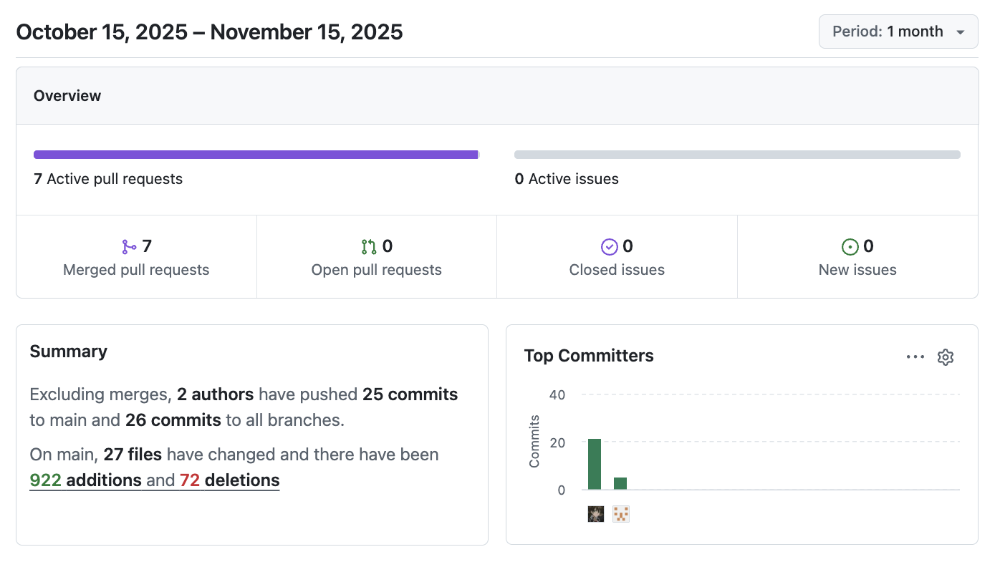 |
| Historial de cambios            | 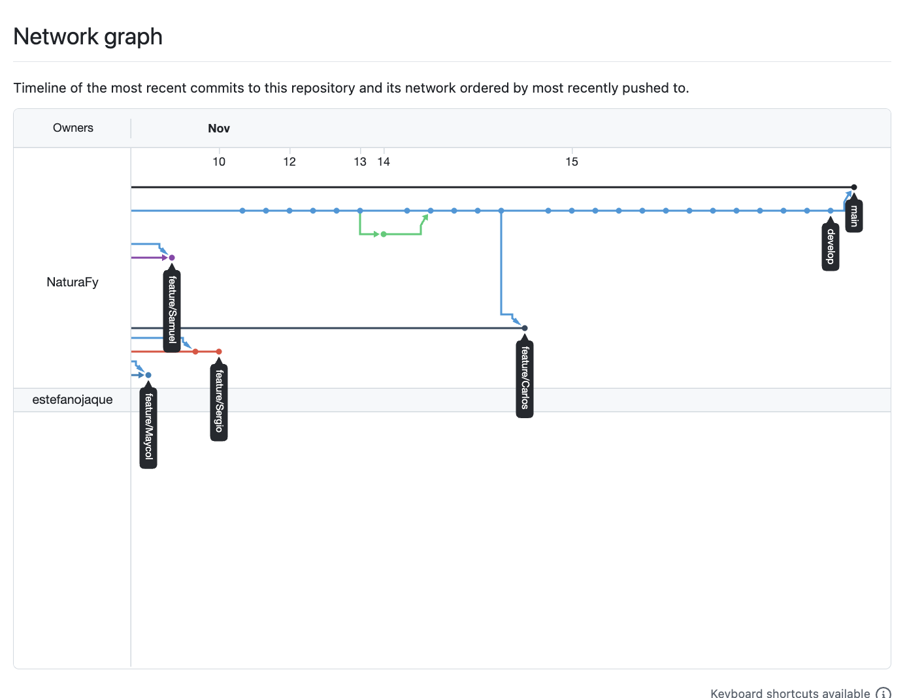 |
#### 4. Participación de Todos los Miembros del Equipo
| Evidencia                       | Descripción                                                                                          |
|---------------------------------|------------------------------------------------------------------------------------------------------|
| Contribuciones en GitHub       | Cada integrante del equipo completó sus tareas y subió sus avances al repositorio de GitHub. Adempas, cada uno colaboró revisando el trabajo de sus compañeros. |
| Discusiones y actividades      | Se organizaron encuentros virtuales para compartir avances, resolver dudas y atender los desafíos de cada actividad. |
| Exposiciones del proyecto       | Se llevaron a cabo sesiones para exponer el trabajo realizado antes de la fecha orrespondiente y prepararnos adecuadamente para la presentación final. |

# Tabla de Contenidos  

## Capítulo I: Introducción  

- [1.1. Startup Profile](#11-startup-profile)  
  - [1.1.1. Descripción de la Startup](#111-descripción-de-la-startup)  
  - [1.1.2. Perfiles de integrantes del equipo](#112-perfiles-de-integrantes-del-equipo)  
- [1.2. Solution Profile](#12-solution-profile)  
  - [1.2.1.  y problemática](#121--y-problemática)  
  - [1.2.2. Lean UX Process](#122-lean-ux-process)  
    - [1.2.2.1. Lean UX Problem Statements](#1221-lean-ux-problem-statements)  
    - [1.2.2.2. Lean UX Assumptions](#1222-lean-ux-assumptions)  
    - [1.2.2.3. Lean UX Hypothesis Statements](#1223-lean-ux-hypothesis-statements)  
    - [1.2.2.4. Lean UX Canvas](#1224-lean-ux-canvas)  
- [1.3. Segmentos objetivo](#13-segmentos-objetivo)  

---

## Capítulo II: Requirements Elicitation & Analysis  

- [2.1. Competidores](#21-competidores)  
  - [2.1.1. Análisis competitivo](#211-análisis-competitivo)  
  - [2.1.2. Estrategias y tácticas frente a competidores](#212-estrategias-y-tácticas-frente-a-competidores)  
- [2.2. Entrevistas](#22-entrevistas)  
  - [2.2.1. Diseño de entrevistas](#221-diseño-de-entrevistas)  
  - [2.2.2. Registro de entrevistas](#222-registro-de-entrevistas)  
  - [2.2.3. Análisis de entrevistas](#223-análisis-de-entrevistas)  
- [2.3. Needfinding](#23-needfinding)  
  - [2.3.1. User Personas](#231-user-personas)  
  - [2.3.2. User Task Matrix](#232-user-task-matrix)  
  - [2.3.3. User Journey Mapping](#233-user-journey-mapping)  
  - [2.3.4. Empathy Mapping](#234-empathy-mapping)  
- [2.4. Ubiquitous Language](#24-ubiquitous-language)  
- [2.5. Big Picture EventStorming](#25-big-picture-eventstorming)  

---

## Capítulo III: Requirements Specification  

- [3.1. User Stories](#31-user-stories)  
- [3.2. Product Backlog](#32-product-backlog)  
- [3.3. Impact Mapping](#33-impact-mapping)  

---

## Capítulo IV: Solution Software Design  

- [4.1. Strategic-Level Domain-Driven Design](#41-strategic-level-domain-driven-design)  
  - [4.1.1. Design-Level EventStorming](#411-design-level-eventstorming)  
    - [4.1.1.1. Candidate Context Discovery](#4111-candidate-context-discovery)  
    - [4.1.1.2. Domain Message Flows Modeling](#4112-domain-message-flows-modeling)  
    - [4.1.1.3. Bounded Context Canvases](#4113-bounded-context-canvases)  
  - [4.1.2. Context Mapping](#412-context-mapping)  
  - [4.1.3. Software Architecture](#413-software-architecture)  
    - [4.1.3.1. Software Architecture System Landscape Diagram](#4131-software-architecture-system-landscape-diagram)  
    - [4.1.3.2. Software Architecture Context Level Diagrams](#4132-software-architecture-context-level-diagrams)  
    - [4.1.3.3. Software Architecture Container Level Diagrams](#4133-software-architecture-container-level-diagrams)  
    - [4.1.3.4. Software Architecture Deployment Diagrams](#4134-software-architecture-deployment-diagrams)  
- [4.2. Tactical-Level Domain-Driven Design](#42-tactical-level-domain-driven-design)  
  - [4.2.1. Bounded Context: IAM Management](#421-bounded-context-iam-management)  
    - [4.2.1.1. Domain Layer](#4211-domain-layer)  
    - [4.2.1.2. Interface Layer](#4212-interface-layer)  
    - [4.2.1.3. Application Layer](#4213-application-layer)  
    - [4.2.1.4. Infrastructure Layer](#4214-infrastructure-layer)  
    - [4.2.1.5. Bounded Context Software Architecture Component Level Diagrams](#4215-bounded-context-software-architecture-component-level-diagrams)  
    - [4.2.1.6. Bounded Context Software Architecture Code Level Diagrams](#4216-bounded-context-software-architecture-code-level-diagrams)  
      - [4.2.1.6.1. Bounded Context Domain Layer Class Diagrams](#42161-bounded-context-domain-layer-class-diagrams)  
      - [4.2.1.6.2. Bounded Context Database Design Diagram](#42162-bounded-context-database-design-diagram)  
  - [4.2.2. Bounded Context: Plant Management](#422-bounded-context-plant-management)  
    - [4.2.2.1. Domain Layer](#4221-domain-layer)  
    - [4.2.2.2. Interface Layer](#4222-interface-layer)  
    - [4.2.2.3. Application Layer](#4223-application-layer)  
    - [4.2.2.4. Infrastructure Layer](#4224-infrastructure-layer)  
    - [4.2.2.5. Bounded Context Software Architecture Component Level Diagrams](#4225-bounded-context-software-architecture-component-level-diagrams)  
    - [4.2.2.6. Bounded Context Software Architecture Code Level Diagrams](#4226-bounded-context-software-architecture-code-level-diagrams)  
      - [4.2.2.6.1. Bounded Context Domain Layer Class Diagrams](#42261-bounded-context-domain-layer-class-diagrams)  
      - [4.2.2.6.2. Bounded Context Database Design Diagram](#42262-bounded-context-database-design-diagram)  
  - [4.2.3. Bounded Context: Sensor Management](#423-bounded-context-sensor-management)  
    - [4.2.3.1. Domain Layer](#4231-domain-layer)  
    - [4.2.3.2. Interface Layer](#4232-interface-layer)  
    - [4.2.3.3. Application Layer](#4233-application-layer)  
    - [4.2.3.4. Infrastructure Layer](#4234-infrastructure-layer)  
    - [4.2.3.5. Bounded Context Software Architecture Component Level Diagrams](#4235-bounded-context-software-architecture-component-level-diagrams)  
    - [4.2.3.6. Bounded Context Software Architecture Code Level Diagrams](#4236-bounded-context-software-architecture-code-level-diagrams)  
      - [4.2.3.6.1. Bounded Context Domain Layer Class Diagrams](#42361-bounded-context-domain-layer-class-diagrams)  
      - [4.2.3.6.2. Bounded Context Database Design Diagram](#42362-bounded-context-database-design-diagram)  
  - [4.2.4. Bounded Context: IA Management](#424-bounded-context-ia-management)  
    - [4.2.4.1. Domain Layer](#4241-domain-layer)  
    - [4.2.4.2. Interface Layer](#4242-interface-layer)  
    - [4.2.4.3. Application Layer](#4243-application-layer)  
    - [4.2.4.4. Infrastructure Layer](#4244-infrastructure-layer)  
    - [4.2.4.5. Bounded Context Software Architecture Component Level Diagrams](#4245-bounded-context-software-architecture-component-level-diagrams)  
    - [4.2.4.6. Bounded Context Software Architecture Code Level Diagrams](#4246-bounded-context-software-architecture-code-level-diagrams)  
      - [4.2.4.6.1. Bounded Context Domain Layer Class Diagrams](#42461-bounded-context-domain-layer-class-diagrams)  
      - [4.2.4.6.2. Bounded Context Database Design Diagram](#42462-bounded-context-database-design-diagram)  
  - [4.2.5. Bounded Context: Notification Management](#425-bounded-context-notification-management)  
    - [4.2.5.1. Domain Layer](#4251-domain-layer)  
    - [4.2.5.2. Interface Layer](#4252-interface-layer)  
    - [4.2.5.3. Application Layer](#4253-application-layer)  
    - [4.2.5.4. Infrastructure Layer](#4254-infrastructure-layer)  
    - [4.2.5.5. Bounded Context Software Architecture Component Level Diagrams](#4255-bounded-context-software-architecture-component-level-diagrams)  
    - [4.2.5.6. Bounded Context Software Architecture Code Level Diagrams](#4256-bounded-context-software-architecture-code-level-diagrams)  
      - [4.2.5.6.1. Bounded Context Domain Layer Class Diagrams](#42561-bounded-context-domain-layer-class-diagrams)  
      - [4.2.5.6.2. Bounded Context Database Design Diagram](#42562-bounded-context-database-design-diagram)    

## Capítulo V: Solution UI/UX Design

- [5.1. Style Guidelines](#51-style-guidelines)  
  - [5.1.1. General Style Guidelines](#511-general-style-guidelines)  
  - [5.1.2. Web, Mobile and IoT Style Guidelines](#512-web-mobile-and-iot-style-guidelines)  
- [5.2. Information Architecture](#52-information-architecture)  
  - [5.2.1. Organization Systems](#521-organization-systems)  
  - [5.2.2. Labeling Systems](#522-labeling-systems)  
  - [5.2.3. SEO Tags and Meta Tags](#523-seo-tags-and-meta-tags)  
  - [5.2.4. Searching Systems](#524-searching-systems)  
  - [5.2.5. Navigation Systems](#525-navigation-systems)  
- [5.3. Landing Page UI Design](#53-landing-page-ui-design)  
  - [5.3.1. Landing Page Wireframe](#531-landing-page-wireframe)  
  - [5.3.2. Landing Page Mock-up](#532-landing-page-mock-up)  
- [5.4. Applications UX/UI Design](#54-applications-uxui-design)  
  - [5.4.1. Applications Wireframes](#541-applications-wireframes)  
  - [5.4.2. Applications Wireflow Diagrams](#542-applications-wireflow-diagrams)  
  - [5.4.3. Applications Mock-ups](#543-applications-mock-ups)  
  - [5.4.4. Applications User Flow Diagrams](#544-applications-user-flow-diagrams)  
- [5.5. Applications Prototyping](#55-applications-prototyping)  

## Capítulo VI: Product Implementation, Validation & Deployment

- [6.1. Software Configuration Management](#61-software-configuration-management)  
  - [6.1.1. Software Development Environment Configuration](#611-software-development-environment-configuration)  
  - [6.1.2. Source Code Management](#612-source-code-management)  
  - [6.1.3. Source Code Style Guide & Conventions](#613-source-code-style-guide--conventions)  
  - [6.1.4. Software Deployment Configuration](#614-software-deployment-configuration)  
- [6.2. Landing Page, Services & Applications Implementation](#62-landing-page-services--applications-implementation)  
  - [6.2.1. Sprint 1](#621-sprint-1)  
    - [6.2.1.1. Sprint Planning 1](#6211-sprint-planning-1)  
    - [6.2.1.2. Aspect Leaders and Collaborators](#6212-aspect-leaders-and-collaborators)  
    - [6.2.1.3. Sprint Backlog 1](#6213-sprint-backlog-1)  
    - [6.2.1.4. Development Evidence for Sprint Review](#6214-development-evidence-for-sprint-review)  
    - [6.2.1.5. Testing Suite Evidence for Sprint Review](#6215-testing-suite-evidence-for-sprint-review)  
    - [6.2.1.6. Execution Evidence for Sprint Review](#6216-execution-evidence-for-sprint-review)  
    - [6.2.1.7. Services Documentation Evidence for Sprint Review](#6217-services-documentation-evidence-for-sprint-review)  
    - [6.2.1.8. Software Deployment Evidence for Sprint Review](#6218-software-deployment-evidence-for-sprint-review)  
    - [6.2.1.9. Team Collaboration Insights during Sprint](#6219-team-collaboration-insights-during-sprint)  
  - [6.2.2. Sprint 2](#622-sprint-2)  
    - [6.2.2.1. Sprint Planning 2](#6221-sprint-planning-2)  
    - [6.2.2.2. Aspect Leaders and Collaborators](#6222-aspect-leaders-and-collaborators)  
    - [6.2.2.3. Sprint Backlog 2](#6223-sprint-backlog-2)  
    - [6.2.2.4. Development Evidence for Sprint Review](#6224-development-evidence-for-sprint-review)  
    - [6.2.2.5. Testing Suite Evidence for Sprint Review](#6225-testing-suite-evidence-for-sprint-review)  
    - [6.2.2.6. Execution Evidence for Sprint Review](#6226-execution-evidence-for-sprint-review)  
    - [6.2.2.7. Services Documentation Evidence for Sprint Review](#6227-services-documentation-evidence-for-sprint-review)  
    - [6.2.2.8. Software Deployment Evidence for Sprint Review](#6228-software-deployment-evidence-for-sprint-review)  
    - [6.2.2.9. Team Collaboration Insights during Sprint](#6229-team-collaboration-insights-during-sprint)  
  - [6.2.3. Sprint 3](#623-sprint-3)  
    - [6.2.3.1. Sprint Planning 3](#6231-sprint-planning-3)  
    - [6.2.3.2. Aspect Leaders and Collaborators](#6232-aspect-leaders-and-collaborators)  
    - [6.2.3.3. Sprint Backlog 3](#6233-sprint-backlog-3)  
    - [6.2.3.4. Development Evidence for Sprint Review](#6234-development-evidence-for-sprint-review)  
    - [6.2.3.5. Testing Suite Evidence for Sprint Review](#6235-testing-suite-evidence-for-sprint-review)  
    - [6.2.3.6. Execution Evidence for Sprint Review](#6236-execution-evidence-for-sprint-review)  
    - [6.2.3.7. Services Documentation Evidence for Sprint Review](#6237-services-documentation-evidence-for-sprint-review)  
    - [6.2.3.8. Software Deployment Evidence for Sprint Review](#6238-software-deployment-evidence-for-sprint-review)  
    - [6.2.3.9. Team Collaboration Insights during Sprint](#6239-team-collaboration-insights-during-sprint)  
- [6.3. Validation Interviews](#63-validation-interviews)  
  - [6.3.1. Diseño de Entrevistas](#631-diseño-de-entrevistas)  
  - [6.3.2. Registro de Entrevistas](#632-registro-de-entrevistas)  
  - [6.3.3. Evaluaciones según heurísticas](#633-evaluaciones-según-heurísticas)  
- [6.4. Video About-the-Product](#64-video-about-the-product)  

- [Conclusiones](#71-conclusiones)  
- [Video About-the-Team](#72-video-about-the-team)
- [Bibliografía](#73-bibliografía)  
- [Anexos](#74-anexos)  

# STUDENT OUTCOME
El curso contribuye al cumplimiento del Student Outcome ABET: 
##### ABET – EAC - Student Outcome 5
Criterio:  La capacidad de funcionar efectivamente en un equipo cuyos miembros
juntos proporcionan liderazgo, crean un entorno de colaboración e inclusivo,
establecen objetivos, planifican tareas y cumplen objetivos.


| **Criterio específico** | **Acciones realizadas** | **Conclusiones** |  
|-------------------------|------------------------|------------------|
| **Trabaja en equipo para proporcionar liderazgo en forma conjunta** |<br><br> **1. Rojas Velasquez, Maycol Jhordan**<br>*TB1:*<br> Apliqué liderazgo conjunto durante el desarrollo del proyecto **MaceTy**, coordinando con todo el equipo la distribución de tareas técnicas y de investigación. Lideré la **arquitectura de software**, diagramas **C4** y el **diseño del sistema IoT**, mientras facilitaba la integración del trabajo de los cinco miembros del equipo, asegurando coherencia entre los bounded contexts y componentes técnicos.<br>*TP:*<br> Diseñé los **wireframes y mockups** de la **landing page**, incluyendo la sección de contacto e interacción inicial con el usuario. Además, colaboré en la definición de los **estilos visuales (Style Guidelines)** y la **arquitectura de información (Information Architecture)**, garantizando la coherencia entre la parte visual, funcional y técnica del sistema.<br>*TB2:*<br> Lideré la fase de validación del producto, diseñando las **entrevistas de usuario** y realizando la **evaluación heurística** para analizar el feedback. Además, gestioné la evidencia de **despliegue de software** del Sprint 2 y redacté las **conclusiones finales** del proyecto, colaborando con todo el equipo en el registro de las entrevistas.<br>*TF:*<br> Coordiné la integración completa del ecosistema MaceTy, liderando la conexión entre el **prototipo IoT**, los **microservicios de backend** y el **frontend web**. Supervisé la arquitectura de despliegue y la documentación técnica final, asegurando que todos los bounded contexts funcionaran de manera cohesiva.<br><br> **2. Gómez Vallejos, Sergio André**<br>*TB1:*<br> Ejercí liderazgo compartido en la **investigación de mercado y análisis competitivo**, coordinando con el equipo completo para asegurar coherencia entre los antecedentes, problemática y la propuesta técnica. Lideré las secciones de **competidores** y **análisis de entrevistas**, facilitando la comunicación entre todos los miembros para mantener una visión unificada del proyecto.<br>*TP:*<br> Lideré la **implementación del entorno de desarrollo y control de versiones**, documentando los apartados de **Software Development Environment Configuration**, **Source Code Management** y **Source Code Style Guide & Conventions**, garantizando buenas prácticas y estándares unificados durante la implementación del proyecto.<br>*TB2:*<br> Me encargué de recopilar y documentar la **evidencia de desarrollo** para el Sprint 2, asegurando que los avances de codificación estuvieran correctamente registrados para la revisión. Colaboré activamente con el equipo en la ejecución de las **entrevistas de validación**.<br>*TF:*<br> Finalicé la **versión definitiva del frontend**, implementando las mejoras identificadas durante las validaciones de usuario. Lideré la optimización de la arquitectura de microservicios y coordiné el proceso de **CI/CD** para el despliegue automatizado.<br><br> **3. Valera Garcés, Samuel Ignacio**<br>*TB1:*<br> Lideré la elaboración de **2.3 Needfinding**, **2.3.1 User Personas**, **2.3.2 User Task Matrix**, **2.3.3 User Journey Mapping**, **2.3.4 Empathy Mapping**, **2.5 Big Picture EventStorming**, la **entrevista con el segmento 1**, así como **3.1 User Stories** y **3.2 Product Backlog**. Coordiné con los cinco integrantes del equipo para integrar estos insumos al documento final, asegurando coherencia y cumplimiento de los objetivos del proyecto **MaceTy**.<br>*TP:*<br> Desarrollé los apartados de **Applications Wireframes**, **Wireflow Diagrams** y **User Flow Diagrams**, representando la experiencia de usuario y su interacción con las funcionalidades principales. Además, colaboré en el apartado de **Applications Prototyping**, integrando los flujos de navegación y validando la usabilidad general del sistema.<br>*TB2:*<br> Lideré la creación del video **About-the-Product**, un entregable clave que resume la propuesta de valor y el funcionamiento del sistema. Participé junto al resto del equipo en la realización de las **entrevistas de validación** con usuarios.<br>*TF:*<br> Completé la **versión final de los microservicios de backend**, implementando los bounded contexts críticos y asegurando la integración con el frontend y el hardware IoT. Documenté la arquitectura de servicios y los contratos de API.<br><br> **4. Leon Rioja, Carlos Andres**<br>*TB1:*<br> Asumí el liderazgo en el diseño de **contextos delimitados y modelado de dominios**. Desarrollé el **4.1.1.1 Candidate Context Discovery**, **4.1.1.2 Domain Message Flows Modeling** y **4.1.1.3 Bounded Context Canvases**, colaborando estrechamente con el equipo para asegurar que los bounded contexts reflejaran correctamente los procesos de negocio identificados en las fases previas del proyecto.<br>*TP:*<br> Elaboré la evidencia técnica del **Testing Suite**, **Development Evidence**, **Execution Evidence** y **Services Documentation** para la **Sprint Review**, asegurando que los módulos del sistema cumplieran con los criterios de calidad y funcionalidad esperados.<br>*TB2:*<br> Fui responsable de documentar la **evidencia de ejecución** y los **insights de colaboración** del equipo durante el Sprint 2, demostrando el funcionamiento del producto y analizando la dinámica del equipo. Colaboré en el **registro de entrevistas** de validación.<br>*TF:*<br> Desarrollé el **prototipo físico de MaceTy**, integrando sensores de humedad, temperatura y luz con el ESP32. Implementé la lógica de control de la bomba de agua y los LEDs indicadores, asegurando la comunicación con el backend mediante MQTT.<br><br> **5. Jaque Peña, Estefano Oscar**<br>*TB1:*<br> Lideré la conceptualización y desarrollo del **1.2.2 Lean UX Process**, incluyendo **problem statements**, **assumptions** y **hypothesis statements**, que sirvieron como base metodológica del proyecto. Coordiné con los demás miembros para asegurar que el enfoque Lean UX se mantuviera consistente desde la investigación hasta la arquitectura técnica.<br>*TP:*<br> Me encargué del **despliegue de la Landing Page**, la **implementación de servicios** y la planificación del **Sprint 1**, detallando **Sprint Planning**, **Aspect Leaders**, **Sprint Backlog**, y la coordinación con Carlos para la revisión de evidencias. Documenté también la implementación completa de los módulos en el apartado **Landing Page, Services & Applications Implementation**.<br>*TB2:*<br> Lideré la planificación y documentación del **Sprint 2**, gestionando el **Sprint Planning**, **Aspect Leaders**, y el **Sprint Backlog**. También me encargué de la evidencia de **pruebas (Testing Suite)** y la **documentación de servicios**, colaborando con el equipo en las entrevistas de validación.<br>*TF:*<br> Coordiné la planificación del **Sprint 3** y gestioné los **insights de colaboración del equipo** durante el sprint final. Documenté el proceso de **Team Collaboration** y aseguré que todas las evidencias de despliegue estuvieran correctamente registradas. | **Conclusión TB1:**<br>Durante el TB1, los cinco miembros del equipo demostraron capacidades de liderazgo complementarias y distribuidas estratégicamente. **Maycol** lideró la arquitectura técnica e IoT, **Sergio** la investigación de mercado, **Samuel** el análisis de usuarios, **Carlos** el modelado de dominio, y **Estefano** el marco metodológico Lean UX. Esta sinergia permitió integrar conocimientos técnicos, analíticos y metodológicos en un producto sólido, coherente y escalable.<br><br> **Conclusión TP:**<br>En el TP, el equipo fortaleció su liderazgo conjunto aplicando los conocimientos técnicos adquiridos para la implementación del sistema **MaceTy**. Se logró una integración efectiva entre el diseño UX/UI, la configuración del entorno de desarrollo, la validación funcional mediante pruebas, y el despliegue final de la landing page y servicios. El liderazgo compartido permitió mantener una estructura organizada y colaborativa, logrando cumplir los objetivos de las secciones 5.4 y 6.2 con altos estándares de calidad técnica y visual.<br><br> **Conclusión TB2:**<br>Para la entrega TB2, el equipo demostró madurez en la gestión del ciclo de vida del producto. El liderazgo se distribuyó eficazmente para cubrir la planificación y ejecución del Sprint 2, la validación del producto con usuarios reales y la consolidación de entregables finales. **Estefano** lideró la planificación del sprint, **Sergio** y **Carlos** las evidencias de desarrollo y ejecución, **Maycol** la fase de validación y despliegue, y **Samuel** la creación del video del producto. La colaboración de todo el equipo en las entrevistas de validación fue clave para obtener insights valiosos, demostrando una sinergia efectiva que permitió cerrar el proyecto cumpliendo con todos los objetivos.<br><br> **Conclusión TF:**<br>En la entrega final, el equipo alcanzó su máxima expresión de liderazgo conjunto al integrar exitosamente el ecosistema completo de MaceTy: hardware IoT, microservicios de backend, frontend optimizado y arquitectura de despliegue en la nube. **Sergio** finalizó el frontend, **Samuel** completó los microservicios, **Carlos** desarrolló el prototipo físico funcional, **Maycol** supervisó la integración técnica completa, y **Estefano** coordinó la documentación y retrospectiva final. El equipo demostró capacidad para entregar un producto funcional end-to-end, validado con usuarios reales y desplegado en producción, cumpliendo con todos los objetivos técnicos, metodológicos y de negocio del proyecto. |
| **Crea un entorno colaborativo e inclusivo, establece metas, planifica tareas y cumple objetivos.** |<br><br> **1. Rojas Velasquez, Maycol Jhordan**<br>*TB1:*<br> Apliqué metodologías colaborativas estableciendo reuniones regulares con los cinco miembros del equipo, usando **GitHub** para el control de versiones y coordinación técnica. Establecí metas claras por sprint: definición de segmentos objetivo, arquitectura del sistema y documentación técnica, coordinando con **Carlos** para los bounded contexts y **Samuel** para la integración de user stories.<br>*TP:*<br> Fortalecí la colaboración durante la etapa de desarrollo visual y despliegue, coordinando el flujo de trabajo entre diseño, front-end y documentación técnica. Promoví la planificación ágil del equipo para cumplir los plazos establecidos y mantener la coherencia técnica en los entregables de la **Landing Page** y las **Applications UX/UI**.<br>*TB2:*<br> Fomenté un entorno colaborativo durante la fase de validación, organizando las sesiones de entrevistas con usuarios y estableciendo metas claras para la recopilación y análisis de feedback. Planifiqué las tareas de documentación final y despliegue, asegurando que el equipo cumpliera con los objetivos de la entrega final.<br>*TF:*<br> Lideré las reuniones de sincronización final del equipo, estableciendo metas específicas para la integración IoT-Cloud-Frontend. Utilicé Trello para la gestión visual de tareas críticas y aseguré que todos los miembros tuvieran claridad sobre sus responsabilidades en el sprint final.<br><br> **2. Gómez Vallejos, Sergio André**<br>*TB1:*<br> Fomenté un entorno inclusivo donde cada integrante aportó desde sus fortalezas. Planifiqué las tareas de investigación y análisis competitivo en coordinación con **Samuel** y **Estefano**, estableciendo metas semanales y cumpliendo con los objetivos del equipo.<br>*TP:*<br> Promoví la colaboración técnica en la **configuración del entorno de desarrollo** y la **gestión del código fuente**, guiando al equipo en la adopción de estándares de versionamiento y estructura de repositorios. Coordiné revisiones grupales para asegurar la uniformidad del código y cumplimiento de buenas prácticas.<br>*TB2:*<br> Colaboré activamente en la planificación de tareas del Sprint 2, estableciendo metas para la generación de evidencia de desarrollo. Participé en las reuniones de equipo para sincronizar avances y asegurar el cumplimiento de los objetivos de validación con usuarios.<br>*TF:*<br> Coordiné las sesiones de revisión de código y pair programming para la finalización del frontend. Establecí metas de performance y optimización, colaborando con **Samuel** en la integración con microservicios y asegurando el cumplimiento de los plazos de entrega.<br><br> **3. Valera Garcés, Samuel Ignacio**<br>*TB1:*<br> Organicé reuniones de coordinación semanales y definí metas por sección, promoviendo la comunicación continua. Utilicé herramientas colaborativas como **GitHub** y **Docs compartidos**, asegurando la integración y coherencia de las entregas.<br>*TP:*<br> Coordiné la creación de prototipos y diagramas de flujo, garantizando que la comunicación entre diseño y desarrollo fuera fluida. Mantuvimos revisiones conjuntas con **Maycol** y **Sergio** para unificar criterios visuales y de experiencia de usuario.<br>*TB2:*<br> Establecí metas claras para la producción del video del producto, planificando las tareas de guion, grabación y edición. Participé en un entorno colaborativo durante las entrevistas, aportando a la discusión y al análisis de los resultados para cumplir los objetivos de validación.<br>*TF:*<br> Organicé sesiones de trabajo colaborativo para la finalización de los microservicios, estableciendo metas de integración con el hardware IoT. Promoví la comunicación abierta sobre bloqueos técnicos y facilitó la resolución de problemas mediante sesiones de troubleshooting en equipo.<br><br> **4. Leon Rioja, Carlos Andres**<br>*TB1:*<br> Establecí un ambiente colaborativo para el desarrollo de la arquitectura de dominio, trabajando con **Maycol** y **Samuel** para alinear los bounded contexts con los requerimientos funcionales. Planifiqué tareas semanales y mantuve constante comunicación para validar avances.<br>*TP:*<br> Coordiné con **Estefano** y **Maycol** durante la etapa de pruebas y despliegue, planificando metas de testing y documentando resultados. Contribuí en la integración de evidencias para la **Sprint Review**, fortaleciendo la colaboración técnica en las fases finales del proyecto.<br>*TB2:*<br> Promoví la colaboración para la recolección de evidencias de ejecución y análisis del equipo. Planifiqué las tareas de documentación de la colaboración y participé activamente en las reuniones para establecer metas y cumplir con los objetivos del Sprint 2.<br>*TF:*<br> Establecí metas específicas para la finalización del prototipo IoT, coordinando con **Maycol** y **Samuel** las pruebas de integración hardware-software. Documenté los resultados de las pruebas y facilité sesiones de troubleshooting colaborativo para resolver problemas de conectividad.<br><br> **5. Jaque Peña, Estefano Oscar**<br>*TB1:*<br> Creé un marco metodológico colaborativo basado en **Lean UX**, que permitió la participación equitativa del equipo. Establecí metas claras por fase y coordiné la integración de aportes con **Sergio**, **Samuel**, **Carlos** y **Maycol**, asegurando una participación balanceada.<br>*TP:*<br> Lideré la colaboración en el **despliegue de la aplicación** y la coordinación general de los **sprints**, planificando metas conjuntas con **Carlos** para evidencias y validaciones. Mantuvimos comunicación continua para asegurar la entrega completa y funcional del sistema **MaceTy**.<br>*TB2:*<br> Organicé el entorno colaborativo para el Sprint 2, utilizando Trello para planificar tareas y establecer metas claras. Fomenté la participación de todos en la definición del backlog y en las revisiones de pruebas y servicios, asegurando el cumplimiento de los objetivos del sprint.<br>*TF:*<br> Coordiné la retrospectiva final del proyecto, facilitando una discusión inclusiva donde todos los miembros compartieron aprendizajes y propuestas de mejora. Documenté los insights de colaboración y aseguré que las lecciones aprendidas fueran registradas para futuros proyectos. | **Conclusión TB1:**<br>El equipo de cinco integrantes logró construir un entorno de trabajo colaborativo, estableciendo metas claras y cumpliendo objetivos mediante la comunicación constante, planificación efectiva y un liderazgo compartido. El uso de herramientas colaborativas y metodologías ágiles permitió mantener la cohesión y el cumplimiento de todos los entregables del TB1.<br><br> **Conclusión TP:**<br>Durante el TP, el equipo consolidó su entorno colaborativo al coordinar la implementación práctica del sistema. Cada integrante asumió responsabilidades específicas en diseño, desarrollo, pruebas y despliegue, demostrando un compromiso sólido y sinergia constante. El trabajo conjunto permitió cumplir exitosamente con las metas de las secciones 5.4 y 6.2, evidenciando una gestión de equipo madura y eficiente.<br><br> **Conclusión TB2:**<br>En la fase TB2, el equipo operó en un entorno altamente colaborativo para ejecutar el Sprint 2 y la validación con usuarios. Se establecieron metas claras para cada actividad, desde la planificación del sprint hasta la producción del video final. La planificación de tareas en Trello y las reuniones de sincronización permitieron cumplir con todos los objetivos de la entrega, demostrando una capacidad consolidada para trabajar de manera inclusiva y orientada a resultados.<br><br> **Conclusión TF:**<br>En la entrega final, el equipo demostró excelencia en la creación de un entorno colaborativo e inclusivo. Las sesiones de pair programming, las revisiones cruzadas de código, las retrospectivas regulares y el uso efectivo de herramientas de gestión visual (Trello, GitHub Projects) permitieron una coordinación fluida entre hardware, backend, frontend y documentación. El equipo no solo cumplió con todas las metas establecidas, sino que superó las expectativas al entregar un producto completamente funcional, validado con usuarios reales y desplegado en producción. La capacidad del equipo para adaptarse a desafíos técnicos, apoyarse mutuamente y mantener la comunicación abierta fue clave para el éxito del proyecto MaceTy. |

# Capítulo I: Introducción  
## 1.1. Startup Profile
### 1.1.1. Descripción de la Startup
<p align="center">
  
</p>
Naturafy es una startup dedicada al desarrollo de soluciones IoT para el hogar, enfocada en mejorar la experiencia de los usuarios y optimizar el uso de recursos naturales. 
<p align="center">
  
</p>
Su producto principal, **MaceTy**, es una maceta inteligente que combina sensores, conectividad y automatización para cuidar automáticamente las plantas de interior, haciendo el riego más eficiente y mejorando la salud de las plantas.  
### Objetivo  

Diseñar una maceta inteligente IoT que:  
- Mida la humedad del suelo  
- Controle automáticamente el riego mediante una mini bomba de agua  
- Permita monitoreo en tiempo real desde una app o plataforma web  
### Colaboraciones Estratégicas  
Naturafy establece alianzas con viveros, tiendas de jardinería, fabricantes de sensores y comunidades de usuarios de plantas de interior. Trabajamos con estos socios para garantizar que nuestras soluciones tecnológicas respondan a sus necesidades, facilitando el cuidado automatizado de plantas y mejorando la experiencia del usuario.  
### Innovación y Tecnología  
**MaceTy** utiliza tecnologías IoT avanzadas para ofrecer un sistema de riego inteligente y automatizado. Los sensores de humedad, luz y temperatura permiten monitoreo continuo, mientras que la bomba controlada automáticamente asegura un riego óptimo. La app/web proporciona datos en tiempo real, alertas y control remoto, integrando tecnología accesible y diseño centrado en el usuario.  
### Comunidad y Funciones Sociales  
MaceTy no es solo un producto; es también un espacio de aprendizaje y conexión. La plataforma permite a los usuarios compartir consejos de cuidado, estrategias de riego y mantenerse informados sobre nuevas prácticas de jardinería inteligente. Esta comunidad activa fomenta el intercambio de conocimiento y la adopción de hábitos sostenibles.  
### Visión  
Visualizamos hogares donde la tecnología y la naturaleza se integran para facilitar la vida de los usuarios y mejorar la salud de sus plantas. MaceTy será sinónimo de innovación en jardinería inteligente, un aliado indispensable para quienes buscan un cuidado eficiente, sostenible y conectado de sus plantas.  
### Misión  
Ofrecer un producto integral que empodere a los usuarios con herramientas inteligentes de cuidado de plantas, mejorando comodidad, eficiencia y bienestar en el hogar. Naturafy, a través de MaceTy, promueve el ahorro de agua, la sostenibilidad ambiental y la conexión con la naturaleza, siendo símbolo de excelencia, innovación y compromiso con un estilo de vida más verde y consciente.
### 1.1.2. Perfiles de integrantes del equipo  

| **Integrante** | **Conocimientos técnicos / Habilidades** |
|----------------|-------------------------------------------|
|  | **Maycol Jhordan Rojas Velasquez** – Ingeniería de Software – U202219984<br><br>Elegí la carrera de Ingeniería de Software debido a mi gusto por la innovación y la implementación de la tecnología en cualquier rubro social, de una manera creativa y en todos los aspectos. Me considero una persona creativa, en busca de ideas y estrategias con mente nueva. También me gusta escuchar ideas de mi equipo, dar propuestas de mejora, evaluar las ventajas y desventajas.<br><br>**Conocimientos técnicos:** C++, HTML, Python, Angular, Backend en Java, Flutter, LangChain aplicado con LLM y RAG.<br><br>**Habilidades:** Enfoque responsable y dedicado, aprendizaje rápido, liderazgo técnico, resolución de problemas.<br><br>**Hobbies:** Ver series, jugar videojuegos, escuchar música, nadar y manejar. |
|  | **Sergio André Gómez Vallejos** – Ingeniería de Software – U20221D401<br><br>Soy una persona resiliente que, sin importar cuántas veces caiga, siempre encuentra la manera de levantarse. Tengo habilidades sociales sólidas y una amplia experiencia en la resolución de problemas de código. Suelo ser el miembro más activo de mi equipo de trabajo.<br><br>**Conocimientos técnicos:** Diversos lenguajes de programación y tecnologías de desarrollo.<br><br>**Habilidades:** Liderazgo en investigación de mercado, análisis competitivo, resolución de problemas, comunicación efectiva.<br><br>**Fortalezas:** Me apasionan los lenguajes de programación y la tecnología, constantemente me esfuerzo por alcanzar mis objetivos y contribuir al desarrollo del startup. |
|  | **Carlos Andres Leon Rioja** – Ingeniería de Software – U202111451<br><br>Me considero una persona responsable, comprensible y con ganas de aprender. Mi enfoque principal está en el desarrollo de arquitecturas sólidas y el modelado de dominios complejos.<br><br>**Conocimientos técnicos:** C#, C++, Java, SQL, Vue, Angular, Python, Node.js, JavaScript.<br><br>**Habilidades:** Diseño de contextos delimitados, modelado de dominios, arquitectura de software, trabajo colaborativo.<br><br>**Especialización:** Domain-Driven Design, Context Discovery, Message Flows Modeling, Bounded Context Canvases. |
|  | **Samuel Ignacio Valera Garces** – Ingeniería de Software – U202111952<br><br>Hola, mi nombre es Samuel, estudiante de la carrera de Ingeniería de software. Me considero una persona responsable, empática y con adaptación rápida al trabajo en equipo. Mi objetivo a futuro es utilizar la tecnología para el desarrollo de aplicaciones que necesite la sociedad en el día a día.<br><br>**Conocimientos técnicos:** Diversos lenguajes de programación, diseño de experiencia de usuario, análisis de requerimientos.<br><br>**Habilidades:** Needfinding, User Stories, Product Backlog, investigación de usuarios, análisis de requerimientos.<br><br>**Hobbies:** Practicar guitarra y leer en mis tiempos libres. |
|  | **Estefano Oscar Jaque Peña** – Ingeniería de Software – U202225466<br><br>Me especializo en metodologías ágiles y marcos de trabajo centrados en el usuario. Mi enfoque principal está en establecer bases metodológicas sólidas que guíen el desarrollo de productos tecnológicos exitosos.<br><br>**Conocimientos técnicos:** Metodologías ágiles, Lean UX, Design Thinking, análisis de procesos de negocio.<br><br>**Habilidades:** Liderazgo metodológico, Lean UX Process, Problem Statements, Assumptions, Hypothesis Statements, facilitación de equipos.<br><br>**Especialización:** Conceptualización de productos, validación de hipótesis, marcos de trabajo ágiles. |

## 1.2. Solution Profile  
La solución propuesta por Naturafy, **MaceTy**, combina hardware y software para ofrecer un sistema de riego inteligente y automatizado para plantas de interior. La plataforma permite monitoreo en tiempo real, control remoto mediante app/web y optimización del uso de agua.  
Se busca que MaceTy no solo sea funcional, sino también accesible, escalable y fácil de usar, integrando principios de diseño centrado en el usuario y soluciones tecnológicas de bajo costo.
### 1.2.1. Antecedentes y problemática  
En los últimos años, el interés por la jardinería urbana y el cultivo de plantas de interior ha crecido en ciudades peruanas como Lima, Arequipa y Trujillo, donde los espacios reducidos y el estilo de vida acelerado limitan el tiempo y los conocimientos necesarios para un cuidado adecuado. Este fenómeno responde a una tendencia global hacia la búsqueda de bienestar, contacto con la naturaleza y sostenibilidad dentro del hogar.

Sin embargo, diversos estudios y experiencias muestran que la mayoría de los intentos por mantener plantas en entornos urbanos fracasan en los primeros meses. Entre los principales factores destacan:

- Riego inadecuado (exceso o falta de agua), responsable de la muerte de hasta el 60% de plantas en hogares urbanos.

- Falta de tiempo para realizar tareas constantes de monitoreo y riego.

- Desconocimiento sobre las necesidades específicas de cada especie en cuanto a humedad, luz y nutrientes.

Estas limitaciones generan frustración en los usuarios, abandono de la jardinería y pérdida de recursos económicos y naturales. Surge entonces la necesidad de una solución accesible, escalable y adaptada al contexto urbano peruano y latinoamericano, que permita automatizar el riego, monitorear en tiempo real y brindar recomendaciones confiables a los usuarios.
La problemática impacta tanto a personas urbanas ocupadas, que buscan plantas como parte de su decoración y bienestar sin invertir demasiado tiempo, como a jardineros aficionados, que desean optimizar el cuidado de sus plantas con apoyo tecnológico.
### 1.2.2. Lean UX Process 
El **Lean UX Process** es una metodología ágil que combina los principios del Design Thinking, Lean Startup y desarrollo ágil para crear productos centrados en el usuario de manera iterativa y eficiente. Esta aproximación nos permite validar rápidamente nuestras hipótesis sobre las necesidades de los usuarios urbanos y jardineros tecnológicos, reduciendo el riesgo de desarrollar características innecesarias y asegurando que MaceTy resuelva problemas reales.
En el contexto de MaceTy, aplicamos Lean UX para entender profundamente los desafíos que enfrentan las personas al cuidar plantas en entornos urbanos, donde factores como la falta de tiempo, espacios reducidos y conocimientos limitados sobre jardinería generan altas tasas de mortalidad vegetal. Esta metodología nos guía desde la identificación del problema hasta la formulación de hipótesis testeable, pasando por la comprensión de las necesidades del usuario y la definición de métricas de éxito.
El proceso Lean UX para MaceTy se estructura en cuatro etapas fundamentales: **Problem Statements** (definición clara del problema a resolver), **Assumptions** (suposiciones sobre usuarios, negocio y solución), **Hypothesis Statements** (hipótesis testeable con métricas específicas) y **Lean UX Canvas** (síntesis visual de todos los elementos). Esta estructura nos permite mantener el foco en el valor para el usuario mientras desarrollamos una solución IoT que sea tanto tecnológicamente viable como comercialmente sostenible.
#### 1.2.2.1. Lean UX Problem Statements  
Nuestro contexto requiere información oportuna y confiable para cuidar plantas de interior en hogares urbanos; con esta información, los usuarios esperan mantener la vitalidad de sus plantas y optimizar el consumo de agua.
Hemos observado que muchos usuarios reportan pérdidas recurrentes de plantas y riego inconstante, lo que se manifiesta en marchitez, hojas amarillas y variaciones bruscas de humedad que no son detectadas a tiempo.
¿Cómo podemos reducir la pérdida de plantas por riego inadecuado y mejorar la constancia del cuidado sin incrementar la carga diaria del usuario?
#### 1.2.2.2. Lean UX Assumptions  

Business Assumptions:

1. Creo que mis clientes necesitan mantener sus plantas sanas sin invertir tiempo ni conocimientos técnicos, evitando riegos incorrectos.

2. Estas necesidades se pueden resolver con una maceta IoT con sensores de humedad/luz/temperatura, riego automático, y app/web con alertas y recomendaciones.

3. Mis clientes iniciales son (early adopters) personas urbanas ocupadas de 18–40 años que ya usan dispositivos smart-home y jardineros aficionados tech-friendly de 25–55 años en Lima/Arequipa/Trujillo.

4. El valor #1 que un cliente quiere de mi servicio es “que la planta no se muera”: riego automático confiable.

5. El cliente también puede obtener estos beneficios adicionales: ahorro de agua (20–30%), historial y recomendaciones por especie, estética premium, comunidad en español, integración futura con asistentes de voz.

6. Voy a adquirir la mayoría de mis clientes a través de alianzas con viveros/tiendas, contenido en IG/TikTok, referidos in-app y demos en ferias universitarias.

7. Haré dinero a través de venta del hardware, suscripción freemium (analítica/recetas/alertas avanzadas/backup en la nube), consumibles (sustrato/fertilizante) y B2B para viveros e instituciones.

8. Mi competencia principal en el mercado será macetas inteligentes importadas (p. ej., Xiaomi, Click & Grow), sistemas de riego por goteo básicos y apps de recordatorios genéricas.

9. Los venceremos debido a precio local competitivo, soporte y posventa en LATAM, personalización por especie y clima local, comunidad en español y diseño plug-and-play.

10. Mi mayor riesgo de producto es fallas del riego automático o alertas imprecisas, fricción en instalación/pareo, y costo BOM no competitivo.

11. Resolveremos esto a través de pilotos en hogares + pruebas de bancada, calibración por especie, onboarding guiado con failsafe (botón de riego manual), telemetría/alertas robustas (MQTT/Cloud con reintentos), y pruebas de coste para asegurar margen.

User assumptions:

1. Quién es el usuario?
Personas urbanas ocupadas (profesionales, estudiantes) que desean tener plantas en casa pero carecen de tiempo o conocimientos, y jardineros aficionados que buscan optimizar el cuidado de sus plantas con tecnología.

2. Dónde encaja nuestro producto, en su trabajo o vida?
En su hogar o espacio personal (departamentos, casas, oficinas), como parte de su rutina diaria de decoración, bienestar y conexión con la naturaleza, integrándose también con otros dispositivos inteligentes del hogar.

3. Qué problemas tiene nuestro producto y cómo se pueden resolver?

Problema: Las plantas mueren por falta de riego o exceso de agua.
> Solución: Sensores de humedad + riego automático controlado por app/web.

Problema: Los usuarios no saben qué cuidados específicos requiere cada especie.
> Solución: App con recomendaciones personalizadas y alertas inteligentes.

Problema: Falta de tiempo para dedicar a la jardinería.
> Solución: Automatización del riego y monitoreo remoto.

4. Cuándo y cómo es usado nuestro producto?
Se usa todos los días, de manera pasiva (riego automático) y activa (consultando la app/web). El usuario recibe notificaciones en tiempo real sobre el estado de la planta y puede revisar métricas o activar funciones manualmente en cualquier momento.

5. Qué características son importantes?

Fácil instalación y configuración en menos de 10 minutos.

Riego automático confiable y configurable.

Alertas precisas y no invasivas.

Diseño estético y moderno que combine con la decoración del hogar.

Compatibilidad con dispositivos móviles (Android/iOS) y web.

Bajo consumo energético y eficiencia en el uso del agua.

6. Cómo debe verse nuestro producto y cómo debe comportarse?

Visualmente: Diseño minimalista, colores neutros y acabados elegantes que encajen en entornos urbanos modernos.

Comportamiento: Rápido, confiable, silencioso, con respuesta inmediata a la app, generando confianza en que la planta está bien cuidada incluso sin intervención constante del usuario.


* Business Outcomes (Empresa – NaturaFy / MaceTy)

1. Se busca incrementar la cartera de clientes en el mercado urbano y de jardineros aficionados.

2. Se busca posicionar a MaceTy como la maceta inteligente líder en Latinoamérica.

3. Se busca generar ingresos sostenibles mediante hardware, suscripciones y alianzas estratégicas.

4. Se busca expandir la marca a viveros, universidades y comunidades de jardinería.

5. Se busca fortalecer la innovación en IoT accesible y sostenible para el hogar.

* User Outcomes (Clientes/Usuarios de MaceTy)

1. El usuario busca mantener sus plantas sanas sin esfuerzo ni conocimientos especializados.

2. El usuario busca ahorrar tiempo y agua gracias a la automatización del riego.

3. El usuario busca recibir alertas claras y confiables para cuidar mejor sus plantas.

4. El usuario busca un producto estético que embellezca su hogar mientras cuida sus plantas.

5. El usuario busca participar en una comunidad que comparta consejos y experiencias de jardinería inteligente.
#### 1.2.2.3. Lean UX Hypothesis Statements  

HYPOTHESIS 1:

Creemos que al ofrecer un sistema de riego automático y confiable, lograremos incrementar la cartera de clientes urbanos y jardineros aficionados.

Sabremos que estamos bien.

Cuando alcancemos un aumento del 20% en ventas trimestrales y comentarios positivos sobre la facilidad de uso en entrevistas y encuestas.

HYPOTHESIS 2:

Creemos que posicionar a MaceTy como la primera maceta inteligente adaptada al mercado latinoamericano nos permitirá diferenciarnos de competidores internacionales.

Sabremos que estamos bien.

Cuando obtengamos un crecimiento del 15% en la participación de mercado local y comentarios cualitativos de usuarios que valoran la adaptación cultural y económica.

HYPOTHESIS 3:

Creemos que implementar un modelo mixto de ingresos (hardware + suscripciones + alianzas) generará sostenibilidad financiera.

Sabremos que estamos bien.

Cuando logremos que al menos el 30% de usuarios de hardware se conviertan en suscriptores activos y alianzas con 3 viveros en el primer año.

HYPOTHESIS 4:

Creemos que expandir la marca mediante alianzas con viveros, universidades y comunidades de jardinería aumentará la adquisición de clientes.

Sabremos que estamos bien.

Cuando firmemos convenios con al menos 5 instituciones y observemos un aumento del 25% en clientes provenientes de estos canales.

HYPOTHESIS 5:

Creemos que mantener la innovación en IoT accesible y sostenible fortalecerá la confianza de los clientes y la retención de usuarios.

Sabremos que estamos bien.

Cuando obtengamos un NPS ≥ 40, comentarios positivos sobre sostenibilidad y una tasa de recompra del 20% en clientes actuales.
#### 1.2.2.4. Lean UX Canvas  

<table border="1" cellpadding="10" cellspacing="0">
    <tr>
        <td><strong>Lean UX Canvas – Proyecto MaceTy</strong></td>
        <td><strong>Fecha:</strong> 14/04/2025</td>
        <td><strong>Primera Iteración</strong></td>
    </tr>
    <tr>
        <td>
            <strong>Business Problem</strong><br>
            - Muchas personas desean tener plantas en casa, pero mueren por falta de tiempo o conocimientos.<br>
            - Esto genera frustración, pérdida de dinero y abandono de la jardinería.<br>
            - No existen soluciones accesibles y locales que integren riego automático, monitoreo en tiempo real y recomendaciones personalizadas.
        </td>
        <td>
            <strong>Solution Ideas</strong><br>
            - Maceta IoT con sensores de humedad, luz y temperatura.<br>
            - Riego automático mediante mini bomba controlada digitalmente.<br>
            - App/web con notificaciones y métricas en tiempo real.<br>
            - Comunidad integrada para compartir consejos y experiencias.<br>
            - Integración futura con asistentes de voz y smart home.
        </td>
        <td>
            <strong>Business Outcomes</strong><br>
            - Incrementar la cartera de clientes urbanos y jardineros aficionados.<br>
            - Posicionar a MaceTy como la maceta inteligente líder en Latinoamérica.<br>
            - Generar ingresos sostenibles con hardware, suscripción y alianzas.<br>
            - Expandir la marca en viveros, universidades y comunidades de jardinería.<br>
            - Fortalecer la innovación en IoT accesible y sostenible.
        </td>
    </tr>
    <tr>
        <td>
            <strong>Users & Customers</strong><br>
            - Personas urbanas ocupadas (profesionales, estudiantes) que quieren plantas sin invertir demasiado tiempo.<br>
            - Jardineros aficionados y semi-profesionales interesados en optimizar y medir el cuidado de sus plantas.
        </td>
        <td>
            <strong>Hypotheses</strong><br>
            - Creemos que al automatizar el riego y monitorear humedad, luz y temperatura, los usuarios podrán mantener sus plantas vivas con menos esfuerzo.<br>
            - Sabremos que hemos tenido éxito cuando logremos reducir la mortalidad de plantas en un 50% y recibamos comentarios positivos sobre ahorro de tiempo y facilidad de uso.<br>
            - Creemos que integrar alertas personalizadas y recomendaciones aumentará la confianza en el cuidado de plantas.<br>
            - Sabremos que hemos tenido éxito cuando un 30% de los clientes activos se suscriban al plan premium de la aplicación.
        </td>
        <td>
            <strong>User Benefits</strong><br>
            - Ahorro de tiempo en el cuidado de las plantas.<br>
            - Mayor confianza y tranquilidad en el estado de sus plantas.<br>
            - Hogar más estético y natural sin esfuerzo adicional.<br>
            - Conexión con una comunidad de jardinería digital.<br>
            - Ahorro de agua gracias a un riego más eficiente.
        </td>
    </tr>
    <tr>
        <td>
            <strong>What's the most important thing we need to learn first?</strong><br>
            - Validar si las personas urbanas aceptarían pagar por un sistema IoT de riego automático.<br>
            - Conocer cuánto valoran la automatización vs. control manual.<br>
            - Identificar las especies de plantas más comunes en hogares urbanos.<br>
            - Medir disposición a suscribirse a un servicio complementario.
        </td>
        <td colspan="2">
            <strong>What's the least amount of work we need to do to learn the most important?</strong><br>
            - Encuestas y entrevistas con dueños de plantas en zonas urbanas.<br>
            - Prototipo de baja fidelidad (mockup app + demo hardware básico).<br>
            - Prueba piloto en 10–15 hogares con plantas de interior.<br>
            - Recoger métricas de uso, feedback y disposición de pago.
        </td>
    </tr>
</table>

## 1.3. Segmentos objetivo  

La **Maceta Inteligente** ha sido diseñada para atender a usuarios con distintos perfiles y necesidades, ofreciendo soluciones tecnológicas que faciliten el cuidado de las plantas y mejoren la experiencia de jardinería en el hogar. Cada segmento presenta motivaciones y desafíos específicos que nuestra plataforma busca atender con funcionalidades prácticas, accesibles y sostenibles.

A continuación, se detalla el perfil de nuestros principales segmentos objetivos, identificando sus características, motivaciones y problemáticas, con el fin de adaptar y mejorar constantemente nuestros servicios para ofrecerles el mayor valor posible.
## 1. Personas Ocupadas en la Ciudad
**Descripción:**  
Este segmento está compuesto por individuos que residen en zonas urbanas de Perú, principalmente en Lima, Arequipa y Trujillo. Buscan mantener plantas saludables sin invertir demasiado tiempo o esfuerzo, adaptándose a un estilo de vida acelerado y con limitaciones de espacio en departamentos o casas pequeñas.
**Objetivos Principales:**
- Facilitar el cuidado de sus plantas mediante riego automático y alertas inteligentes.
- Mantener plantas estéticamente atractivas con mínima intervención.
- Optimizar tiempo y recursos dedicados al cuidado de plantas.
**Problemáticas y Desafíos:**
- Falta de tiempo para regar y monitorear las plantas de forma constante.
- Desconocimiento sobre las necesidades específicas de riego, luz y nutrientes de cada planta.
- Espacios limitados que dificultan la instalación de plantas tradicionales.
**Datos Cuantitativos del Problema:**
- Se estima que el 70% de las personas en zonas urbanas de Perú que intentan cultivar plantas en casa abandonan su cuidado en los primeros 3 meses por falta de tiempo o conocimiento.
- Cerca del 60% de las plantas en hogares urbanos mueren por riego inadecuado o exposición incorrecta a la luz.
**Variables Geográficas, Demográficas y Psicográficas:**
- **Geográficas:** Zonas urbanas de Perú (Lima, Arequipa, Trujillo).  
- **Demográficas:** Edad: 18-50 años; Género: Femenino/Masculino; Nivel socioeconómico: medio a alto; Ocupación: profesionales, estudiantes, trabajadores con tiempo limitado.  
- **Psicográficas:** Buscan comodidad, eficiencia, valoran la estética y el diseño en el hogar; estilo de vida urbano y ocupado.
## 2. Jardineros
**Descripción:**  
Este segmento está compuesto por personas apasionadas por la jardinería, interesadas en la tecnología aplicada al cuidado de plantas. Incluye tanto aficionados como semi-profesionales que buscan monitorear y optimizar el crecimiento de sus plantas mediante dispositivos inteligentes y aplicaciones móviles.
**Objetivos Principales:**
- Monitorear en tiempo real las condiciones de humedad, luz y nutrientes de sus plantas.
- Automatizar funciones de cuidado avanzadas para mejorar la salud y el crecimiento de las plantas.
- Obtener datos y recomendaciones precisas sobre el cuidado de cada especie.
**Problemáticas y Desafíos:**
- Necesidad de herramientas precisas para medir y ajustar condiciones ambientales.
- Falta de soluciones tecnológicas que integren monitoreo y automatización de forma accesible.
- Deseo de personalización y control sobre cada planta sin perder tiempo en tareas repetitivas.
**Datos Cuantitativos del Problema:**
- Aproximadamente el 55% de los jardineros aficionados en Perú invierten más de 1 hora diaria en tareas de cuidado que podrían automatizarse.
- Solo el 30% de los sistemas de cuidado de plantas en el hogar ofrecen monitoreo en tiempo real y alertas personalizadas.
**Variables Geográficas, Demográficas y Psicográficas:**
- **Geográficas:** Zonas urbanas y suburbanas de Perú con espacio disponible para plantas.  
- **Demográficas:** Edad: 18-65 años; Género: Femenino/Masculino; Nivel socioeconómico: medio a alto; Ocupación: profesionales, técnicos, emprendedores y entusiastas de la jardinería.  
- **Psicográficas:** Personas curiosas, detallistas, interesadas en tecnología y sostenibilidad; disfrutan del control y optimización del cuidado de sus plantas.
# Capítulo II: Requirements Elicitation & Analysis  
## 2.1. Competidores  
### 2.1.1. Análisis competitivo
<table> <tr> <td align="center" colspan="6"><b>Competitive Analysis Landscape</b></td> </tr> <tr> <td colspan="2"><b>¿Porqué llevar a cabo este análisis?</b></td> <td colspan="4"> Para entender las fortalezas y debilidades de MaceTy frente a competidores internacionales y así definir estrategias de diferenciación en el mercado peruano y latinoamericano. </td> </tr> <tr> <td colspan="2"><b>¿Cómo podemos proporcionar un buen servicio?</b></td> <td colspan="4"> ¿Cómo podemos ofrecer un cuidado de plantas inteligente, accesible y sostenible que combine IoT, automatización y comunidad de usuarios para mejorar la experiencia de jardinería en el hogar? </td> </tr> <tr align="center"> <td colspan="2"></td><td><b>Naturafy – MaceTy</b></td><td><b>Click & Grow</b></td><td><b>Parrot Pot</b></td><td><b>Xiaomi Smart Flower Pot</b></td> </tr> <tr> <td rowspan="2"><b>Perfil</b></td><td><b>Overview</b></td> <td>Startup peruana con una maceta inteligente IoT que mide humedad, luz y temperatura, controla riego automático y se conecta vía app/web.</td> <td>Empresa internacional con sistema de jardinería inteligente basado en cápsulas y riego automático.</td> <td>Maceta inteligente con sensores de humedad, luz y fertilización, conectada vía app.</td> <td>Maceta de bajo costo con sensores básicos y conectividad Bluetooth/WiFi.</td> </tr> <tr> <td><b>Ventaja competitiva</b></td> <td>Accesible y adaptada al mercado latinoamericano; combina IoT + comunidad + sostenibilidad.</td> <td>Gran reconocimiento global, productos “plug & play” fáciles de usar.</td> <td>Alta precisión de sensores, diseño elegante y conectividad avanzada.</td> <td>Precios bajos, distribución masiva gracias al ecosistema Xiaomi.</td> </tr> <tr> <td rowspan="2"><b>Perfil de Marketing</b></td><td><b>Mercado Objetivo</b></td> <td>Usuarios urbanos peruanos y latinoamericanos (profesionales, estudiantes, jardineros aficionados).</td> <td>Consumidores urbanos de Europa y EE.UU. interesados en jardinería indoor.</td> <td>Amantes de la tecnología y plantas de gama media-alta.</td> <td>Usuarios de hogar inteligente en mercados asiáticos.</td> </tr> <tr> <td><b>Estrategias de Marketing</b></td> <td>Redes sociales, alianzas con viveros locales, ferias y comunidades de jardinería.</td> <td>E-commerce internacional, influencers de estilo de vida verde.</td> <td>Marketing en ferias tecnológicas y jardinería premium.</td> <td>Integración en ecosistema Xiaomi + ventas retail masivas.</td> </tr> <tr> <td rowspan="3"><b>Perfil de Producto</b></td><td><b>Productos & Servicios</b></td> <td>Maceta IoT con sensores, riego automático, app/web y comunidad integrada.</td> <td>Sistemas de cultivo inteligente con cápsulas de semillas.</td> <td>Maceta IoT con sensores avanzados y app.</td> <td>Maceta básica con sensores de humedad y luz.</td> </tr> <tr> <td><b>Precios & Costos</b></td> <td>Medio-bajo (adaptado al poder adquisitivo peruano).</td> <td>Alto (USD 80–150 + cápsulas).</td> <td>Alto (USD 90–120).</td> <td>Bajo (USD 30–50).</td> </tr> <tr> <td><b>Canales de distribución</b></td> <td>App/web, e-commerce local, alianzas con viveros y tiendas.</td> <td>Web oficial, Amazon, retailers.</td> <td>E-commerce y tiendas especializadas.</td> <td>Marketplace Xiaomi y distribuidores globales.</td> </tr> <tr> <td rowspan="5"><b>Análisis SWOT</b></td><td><b>Fortalezas</b></td> <td>Adaptación local, sostenibilidad, accesibilidad y comunidad en LATAM.</td> <td>Experiencia global y gran comunidad de usuarios.</td> <td>Alta precisión tecnológica.</td> <td>Precios accesibles y ecosistema Xiaomi.</td> </tr> <tr> <td><b>Debilidades</b></td> <td>Startup en desarrollo, requiere inversión para escalar.</td> <td>Costos altos y dependencia de cápsulas.</td> <td>Precio elevado y limitada disponibilidad.</td> <td>Funciones limitadas, enfoque en bajo costo.</td> </tr> <tr> <td><b>Oportunidades</b></td> <td>Creciente interés en sostenibilidad y cuidado de plantas en hogares urbanos de LATAM.</td> <td>Expansión hacia mercados emergentes.</td> <td>Alianzas con marcas de jardinería premium.</td> <td>Integración con otros dispositivos IoT.</td> </tr> <tr> <td><b>Amenazas</b></td> <td>Competencia de gigantes tecnológicos y falta de inversión local.</td> <td>Competencia de bajo costo y productos alternativos.</td> <td>Nuevas startups con precios más accesibles.</td> <td>Saturación del mercado asiático.</td> </tr> </table>
<br/>

### 2.1.2. Estrategias y tácticas frente a competidores  
Para posicionar a **MaceTy** en el mercado latinoamericano frente a competidores internacionales, se plantean las siguientes estrategias y tácticas:  
**Estrategias:**  
- **Diferenciación local:** Ofrecer un producto adaptado al contexto peruano y latinoamericano, con precios accesibles y funciones útiles para usuarios urbanos.  
- **Valor agregado comunitario:** Crear una comunidad de usuarios que compartan experiencias, consejos y recomendaciones sobre jardinería urbana.  
- **Sostenibilidad como eje central:** Destacar el ahorro de agua, el uso responsable de recursos y la promoción de un estilo de vida verde.  
- **Alianzas estratégicas:** Establecer vínculos con viveros, universidades, municipalidades y empresas de tecnología local.  
**Tácticas:**  
- **Marketing digital segmentado:** Uso de redes sociales, influencers locales y contenido educativo sobre jardinería inteligente.  
- **Ferias y eventos verdes:** Participación activa en ferias de tecnología, sostenibilidad y agricultura urbana.  
- **Modelos de suscripción y servicios postventa:** Planes que incluyan soporte técnico, actualizaciones y recomendaciones personalizadas vía app/web.  
- **Distribución híbrida:** Venta en línea (e-commerce local) y presencia en viveros y tiendas de hogar.  
- **Innovación constante:** Integrar nuevas funciones como alertas inteligentes, compatibilidad con asistentes virtuales y mejoras en la experiencia de usuario.  
## 2.2. Entrevistas  
### 2.2.1. Diseño de entrevistas  
El diseño de entrevistas se centra en validar la propuesta de valor de **MaceTy**, una maceta inteligente que combina hardware y software para ofrecer un sistema de riego automatizado y monitoreo en tiempo real, con el fin de facilitar el cuidado de plantas de interior.  
Se busca comprender mejor las necesidades de los usuarios potenciales, sus hábitos, motivaciones y desafíos en relación al cuidado de plantas, además de explorar la disposición que tendrían hacia una solución tecnológica accesible y fácil de usar.  
Para ello, se definieron dos segmentos de entrevistas: **Personas Ocupadas en la Ciudad** y **Jardineros**, cada uno con un guion adaptado a sus características.  
#### Entrevista – Personas Ocupadas en la Ciudad  
**Preguntas iniciales (contexto):**  
1. ¿Cómo te llamas?  
2. ¿Dónde vives actualmente?  
3. ¿Qué edad tienes?  
**Preguntas principales:**  
4. ¿Tienes plantas en tu casa o departamento?  
5. ¿Cuántas veces a la semana sueles regarlas o cuidarlas?  
6. ¿Alguna vez se te han muerto plantas por falta de tiempo o desconocimiento? ¿Qué pasó?  
7. ¿Qué tan importante es para ti tener plantas bonitas en tu hogar? (Nada – Poco – Importante – Muy importante)  
8. Si tuvieras una maceta que se riega sola y te avisa si tu planta necesita luz o nutrientes, ¿la usarías? ¿Por qué?  
9. ¿Qué características valoras más en un producto para el hogar? (ej. estética, facilidad de uso, precio, tecnología)  
10. ¿Cuánto estarías dispuesto a pagar por una maceta inteligente que cuide tus plantas automáticamente?  
11. ¿Qué aplicación móvil usas más en tu día a día y por qué te gusta?  
12. ¿Qué tan seguido olvidas regar o cuidar tus plantas? (Casi nunca – A veces – Frecuente – Siempre)  
13. ¿Prefieres recibir alertas en tu celular o que el sistema se encargue solo sin notificaciones?  
14. ¿Cuál sería el mayor beneficio para ti de tener una maceta inteligente?  
15. ¿Qué obstáculos crees que podrías tener para usar un producto así? (precio, desconfianza en la tecnología, instalación, etc.)  
16. ¿Recomendarías este tipo de solución a familiares o amigos que también tienen plantas? ¿Por qué?  
---
#### Entrevista – Jardineros (aficionados o semi-profesionales)  
**Preguntas iniciales (contexto):**  
1. ¿Cómo te llamas?  
2. ¿Dónde vives actualmente?  
3. ¿Qué edad tienes?  
**Preguntas principales:**  
4. ¿Qué tipo de plantas cultivas con más frecuencia?  
5. ¿Cuánto tiempo al día o a la semana dedicas al cuidado de tus plantas?  
6. ¿Usas alguna herramienta o aplicación para monitorear riego, humedad o luz? ¿Cuál?  
7. ¿Qué problemas enfrentas más seguido en el cuidado de tus plantas?  
8. ¿Te interesaría un sistema que te muestre datos en tiempo real (riego, nutrientes, luz) de cada planta? ¿Por qué?  
9. ¿Prefieres tener el control total sobre el cuidado (ajustar tú mismo) o que el sistema se encargue automáticamente?  
10. ¿Qué tan dispuesto estarías a invertir en tecnología que mejore la salud y el crecimiento de tus plantas?  
11. ¿Qué tan importante es para ti llevar un registro histórico del crecimiento y estado de tus plantas?  
12. ¿Qué tan cómodo te sientes usando aplicaciones móviles o dispositivos inteligentes?  
13. ¿Te gustaría compartir tus logros (ej. fotos, estadísticas de crecimiento) en redes sociales o comunidades de jardinería?  
14. ¿Qué funciones extra te gustaría que tenga una maceta inteligente además de riego y monitoreo?  
15. ¿Qué esperas en cuanto al diseño? (ej. algo moderno, estético, simple, robusto)  
16. Si una maceta inteligente pudiera conectarse con otras (ej. crear un ecosistema de plantas), ¿lo verías útil? ¿Por qué?  
### 2.2.2. Registro de entrevistas  
## Segmento 1: Personas Ocupadas en la Ciudad:

| **Aspecto** | **Entrevista 1** | **Entrevista 2** | **Entrevista 3** |
|-------------|------------------|------------------|------------------|
| **Entrevistado** | Enzo Sanamamur | Ariana Martinez | Camila Morales |
| **Sexo** | Masculino | Femenino | Femenino |
| **Edad** | 23 años | 25 años | 20 años |
| **Domicilio** | Comas, Lima, Perú | Santiago de Surco, Lima, Perú | San Miguel, Lima, Perú |
| **Duración** | 03:35 | 03:30 | 04:47 |
| **Imagen** |  |  |  |

### Resúmenes de Entrevistas

**Entrevista 1: Enzo Sanamamur**

Enzo, estudiante de 23 años residente en Comas, considera las plantas como un elemento vital que aporta vida y mejora el ambiente de su hogar. Aunque mantiene una rutina de riego de 1-2 veces por semana, reconoce que frecuentemente olvida cuidarlas, resultando en la pérdida de plantas por falta de atención constante. Mostró gran interés en una maceta inteligente que automatice el riego y proporcione alertas sobre luz y nutrientes, valorando especialmente la facilidad de uso y un diseño atractivo que complemente su decoración. Su disposición de pago se sitúa entre 100-200 soles, identificando el precio y la complejidad de uso como principales barreras de adopción. Expresó su intención de recomendar el producto a amigos y familiares que, como él, viven en departamentos y valoran las plantas, evidenciando una oportunidad de mercado en jóvenes urbanos que buscan soluciones tecnológicas prácticas.

**Entrevista 2: Ariana Martinez**

Ariana, diseñadora de interiores de 25 años que vive en un departamento en Surco, mantiene plantas como elementos esenciales para crear ambientes más vivos y atractivos. Aunque revisa sus plantas diariamente, la inconsistencia en su rutina ha resultado en la pérdida de algunas por descuido. Demostró gran entusiasmo por una maceta inteligente capaz de detectar automáticamente necesidades de riego, temperatura y luz, valorando especialmente un sistema de notificaciones que le facilite el día a día y le permita ahorrar tiempo. Su disposición de pago alcanza los 300 soles, siempre que el producto incluya instrucciones claras para instalación y conectividad móvil. Identifica la complejidad de uso como el principal obstáculo potencial, pero confirma su intención de recomendar la solución a su círculo social, representando el segmento de jóvenes profesionales interesados en integrar tecnología práctica en sus hogares.

**Entrevista 3: Camila Morales**

Camila, estudiante universitaria de 20 años residente en San Miguel, mantiene varias plantas ornamentales y en macetas con un programa de riego de 2-3 veces por semana. Sin embargo, experimenta interrupciones en el cuidado durante períodos de exámenes y viajes, resultando en pérdida de plantas por olvidos o desconocimiento sobre cuidados específicos. Considera muy importante tener plantas bonitas en casa por el frescor y vida que aportan al ambiente. Expresó fuerte interés en una maceta inteligente con riego automático y alertas móviles, valorando la tranquilidad y continuidad del cuidado incluso durante ausencias o períodos de alta ocupación. Prioriza facilidad de uso, estética y precio razonable, con disposición de pago entre 150-200 soles. Identifica costo e instalación compleja como posibles barreras, pero confirma su intención de recomendar el producto a familiares y amigos con plantas, utilizando principalmente WhatsApp para comunicación diaria por su simplicidad y rapidez.

## Segmento 2: Jardineros:

| **Aspecto** | **Entrevista 1** | **Entrevista 2** |
|-------------|------------------|------------------|
| **Entrevistado** | Ramiro Guzmán | Gabriela Baza |
| **Sexo** | Masculino | Femenino |
| **Edad** | 24 años | 26 |
| **Domicilio** | Bellavista Callao, Lima, Perú | Yanahuara, Arequipa , Perú |
| **Duración** | 03:26 | 06:14 |
| **Imagen** |  |  |


### Resumen de Entrevista

**Entrevista 1: Ramiro Guzmán**

Ramiro, jardinero aficionado de 24 años residente en Bellavista, Callao, cultiva principalmente plantas ornamentales y algunas comestibles como tomates y lechugas, dedicando entre 1-2 horas diarias más tiempo adicional los fines de semana. Utiliza métodos manuales de observación para monitorear la tierra y las hojas, enfrentando desafíos como plantas que se secan por exceso de exposición solar o descuidos en el riego. Mostró gran interés en un sistema de monitoreo en tiempo real que mida riego, nutrientes y luz, prefiriendo una maceta inteligente que permita automatización con la posibilidad de ajustes manuales para mantener control sobre el proceso. Su disposición de inversión alcanza 250-300 soles para una maceta confiable, valorando especialmente la capacidad de registrar el crecimiento de sus plantas, recibir recomendaciones personalizadas y conectar múltiples plantas en un ecosistema controlable desde un dispositivo único. Prioriza un diseño moderno, minimalista y estético que se integre armoniosamente con su hogar, y disfruta compartir experiencias y estadísticas de jardinería en redes sociales y comunidades especializadas, evidenciando su perfil de jardinero tecnológico con interés en optimización y análisis de datos.

**Entrevista 2: Gabriela Baza**
Gabriela (26, Yanahuara–Arequipa) cuida rosas, suculentas y aromáticas; dedica ~1 h diaria y usa medidor de humedad y temporizador de goteo. Sus dolores: olvidos de riego, sol excesivo en verano y plagas detectadas tarde. Valora datos en tiempo real y un sistema automático con opción de ajuste manual; cómoda con apps/domótica y dispuesta a pagar S/ 250–S/ 300. Pide alertas de plagas y recomendaciones de fertilización; diseño moderno, robusto y fácil de limpiar, con gestión multi-maceta por zonas. Para adoptarlo, exige onboarding claro y eficiencia energética.
### 2.2.3. Análisis de entrevistas

#### Segmento 1: Personas Ocupadas en la Ciudad

**Análisis Demográfico:**
- **Rango de edad:** 20-25 años, representando jóvenes profesionales y estudiantes universitarios
- **Ubicación geográfica:** Concentrados en Lima metropolitana (Comas, Surco, San Miguel)
- **Perfil ocupacional:** Estudiantes y profesionales jóvenes con limitaciones de tiempo

**Análisis de Comportamiento y Hábitos:**

**Rutinas de Cuidado de Plantas:**
- **Frecuencia de riego:** 1-3 veces por semana, con inconsistencias frecuentes
- **Problema recurrente:** 100% de los entrevistados admitió haber perdido plantas por descuido u olvido
- **Factores de interferencia:** Períodos de exámenes, trabajo intenso, viajes y rutinas cambiantes

**Motivaciones Principales:**
- **Estética del hogar:** Valoran las plantas como elementos decorativos que aportan vida y frescura
- **Bienestar ambiental:** Reconocen los beneficios de las plantas para mejorar el ambiente del hogar
- **Conexión con la naturaleza:** Buscan mantener un vínculo con elementos naturales en entornos urbanos

**Receptividad hacia MaceTy:**
- **Nivel de interés:** 100% mostró entusiasmo por una solución automatizada
- **Beneficios valorados:**
  - Riego automático (eliminación del factor humano)
  - Alertas contextuales sobre necesidades de la planta
  - Tranquilidad durante ausencias prolongadas
  - Ahorro de tiempo en rutinas de cuidado

**Disposición de Pago:**
- **Rango promedio:** S/ 150 - S/ 300 soles
- **Factores determinantes:** Facilidad de uso, diseño atractivo, funcionalidad completa
- **Barreras identificadas:** Complejidad de instalación y configuración

**Preferencias Tecnológicas:**
- **Aplicación preferida:** WhatsApp (comunicación simple y directa)
- **Expectativas de UX:** Interfaces intuitivas, instalación guiada, notificaciones no intrusivas

#### Segmento 2: Jardineros

**Análisis Demográfico:**
- **Rango de edad:** 24-26 años, jardineros aficionados con conocimientos intermedios
- **Distribución geográfica:** Lima Metropolitana y Arequipa
- **Nivel de experiencia:** Aficionados con 1-3 años de experiencia práctica

**Análisis de Comportamiento y Prácticas:**

**Dedicación Temporal:**
- **Tiempo invertido:** 1-2 horas diarias + tiempo adicional los fines de semana
- **Tipos de plantas:** Combinación de ornamentales, aromáticas y comestibles
- **Métodos actuales:** Observación manual, herramientas básicas (medidores de humedad, temporizadores)

**Desafíos Técnicos Identificados:**
- **Problemas climáticos:** Exposición solar excesiva, variaciones estacionales
- **Detección tardía:** Plagas, enfermedades y deficiencias nutricionales
- **Optimización:** Necesidad de datos precisos para mejorar rendimiento

**Expectativas hacia la Tecnología:**
- **Monitoreo en tiempo real:** Datos continuos de humedad, luz, temperatura
- **Control híbrido:** Automatización con capacidad de intervención manual
- **Análisis de datos:** Históricos, tendencias y recomendaciones personalizadas
- **Escalabilidad:** Gestión simultánea de múltiples plantas

**Inversión y ROI:**
- **Disposición de pago:** S/ 250 - S/ 300 soles
- **Justificación:** Mejora en resultados de cultivo y optimización de recursos
- **Características valoradas:** Precisión de sensores, robustez del sistema, integración tecnológica

**Perfil Tecnológico:**
- **Competencia digital:** Alta comodidad con aplicaciones móviles y dispositivos inteligentes
- **Interés en comunidad:** Disposición a compartir experiencias y datos en redes especializadas

#### Insights Transversales y Conclusiones Estratégicas

**Validación del Problem-Market Fit:**
- **Problema confirmado:** Mortalidad alta de plantas urbanas (60-70% según entrevistados)
- **Causas principales:** Inconsistencia en cuidados, falta de tiempo, conocimientos limitados
- **Impacto emocional:** Frustración y sensación de fracaso al perder plantas

**Diferenciación por Segmento:**

| Aspecto | Personas Ocupadas | Jardineros |
|---------|------------------|------------|
| **Prioridad #1** | Automatización completa | Datos y control granular |
| **Interfaz ideal** | Minimalista, pocas alertas | Dashboard completo con métricas |
| **Frecuencia de uso** | Consulta esporádica | Monitoreo regular |
| **Valor percibido** | Ahorro de tiempo | Optimización de resultados |

**Oportunidades de Mercado Identificadas:**
- **Mercado primario:** Jóvenes urbanos 20-30 años en Lima metropolitana
- **Mercado secundario:** Jardineros aficionados en ciudades principales del país
- **Expansión geográfica:** Arequipa como segundo mercado prioritario

**Requerimientos del Producto Validados:**
- **Funcionalidad core:** Riego automático con sensores de humedad
- **Features diferenciadores:** Alertas inteligentes, diseño estético, app intuitiva
- **Requisitos técnicos:** Instalación simple (<10 min), conectividad estable, batería duradera

**Estrategia de Precio Confirmada:**
- **Sweet spot:** S/ 200 - S/ 250 soles para capturar ambos segmentos
- **Modelo freemium:** Hardware básico + suscripción opcional para features avanzadas

**Canales de Distribución Validados:**
- **Digital:** E-commerce y marketplace locales
- **Físico:** Viveros, tiendas de hogar y decoración
- **Referidos:** Boca a boca entre usuarios satisfechos (100% disposición a recomendar)

Esta investigación cualitativa confirma la viabilidad comercial de MaceTy y proporciona direcciones claras para el desarrollo del producto, la estrategia de mercado y la experiencia de usuario diferenciada por segmento.
## 2.3. Needfinding  

El **Needfinding** es una fase fundamental en el proceso de diseño centrado en el usuario que nos permite profundizar en la comprensión de las necesidades, comportamientos, motivaciones y desafíos reales de nuestros usuarios objetivo. Esta etapa va más allá de los datos cuantitativos obtenidos en las entrevistas, transformándolos en insights accionables que guían el desarrollo del producto MaceTy.

A través de diversas técnicas de investigación cualitativa y herramientas de síntesis, el needfinding nos ayuda a identificar patrones de comportamiento, puntos de dolor no expresados verbalmente y oportunidades de innovación que no son evidentes en un análisis superficial. Para MaceTy, este proceso es especialmente crítico dado que nuestros dos segmentos objetivos personas ocupadas urbanas y jardineros tecnológicos presentan necesidades y contextos de uso significativamente diferentes.

El proceso de needfinding para MaceTy se estructura en cuatro componentes principales: **User Personas** (arquetipos representativos basados en datos reales de investigación), **User Task Matrix** (mapeo de tareas y su importancia relativa), **User Journey Mapping** (visualización de la experiencia completa del usuario) y **Empathy Mapping** (comprensión profunda de pensamientos, sentimientos y motivaciones). Esta metodología integral nos permite diseñar una solución IoT que no solo sea técnicamente viable, sino que resuene genuinamente with las necesidades emocionales y prácticas de nuestros usuarios urbanos.

### 2.3.1. User Personas  

Las **User Personas** son representaciones semi-ficticias de nuestros usuarios ideales, construidas a partir de datos reales obtenidos durante la investigación de usuarios. Estas personas nos ayudan a mantener el foco en necesidades específicas y contextos de uso reales durante todo el proceso de diseño y desarrollo de MaceTy.

Para el proyecto MaceTy, hemos desarrollado dos personas principales que representan nuestros segmentos objetivo identificados: personas ocupadas en entornos urbanos y jardineros aficionados con interés tecnológico. Cada persona incluye información demográfica, psicográfica, objetivos, frustraciones, canales de comunicación preferidos y patrones de comportamiento específicos relacionados con el cuidado de plantas.

Estas personas sirven como herramienta de validación constante, asegurando que cada decisión de diseño, funcionalidad del producto y estrategia de comunicación esté alineada con las necesidades reales de nuestros usuarios objetivo en el contexto urbano peruano.

### Segmento Objetivo: Personas Ocupadas en la Ciudad

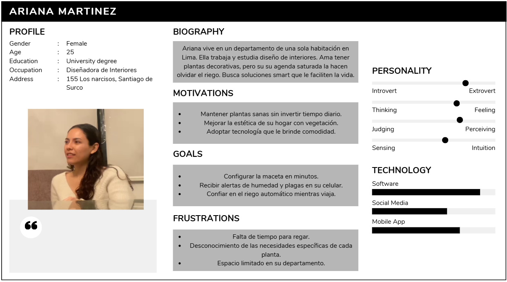

### Segmento Objetivo: Jardineros

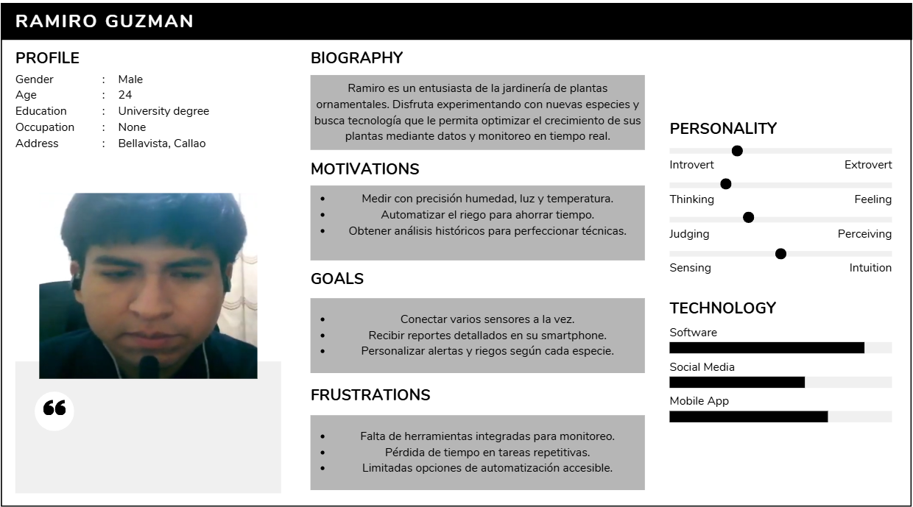

### 2.3.2. User Task Matrix  

La **User Task Matrix** es una herramienta de análisis que nos permite identificar y priorizar las tareas que nuestros usuarios realizan en relación con el cuidado de plantas, evaluando tanto la frecuencia con la que las ejecutan como la importancia que les asignan. Esta matriz es fundamental para determinar qué funcionalidades debe priorizar MaceTy y cómo debe estructurarse la experiencia de usuario.

La matriz se construye sobre dos dimensiones clave: **Frequency** (qué tan frecuentemente el usuario realiza cada tarea) y **Importance** (qué tan crítica es esa tarea para lograr sus objetivos). Esta evaluación cruzada nos ayuda a identificar las tareas de alta frecuencia y alta importancia que deben ser automatizadas o simplificadas al máximo, así como aquellas tareas menos frecuentes pero críticas que requieren interfaces intuitivas y guías claras.

Para MaceTy, la User Task Matrix revela diferencias significativas entre nuestros dos segmentos: mientras las personas ocupadas priorizan tareas de bajo mantenimiento y automatización, los jardineros valoran el control granular y el acceso a datos detallados. Esta comprensión nos permite diseñar interfaces y funcionalidades diferenciadas que satisfagan las necesidades específicas de cada segmento.
### Segmento Objetivo: Personas Ocupadas en la Ciudad

| Task                                             | Frequency | Importance |
|--------------------------------------------------|-----------|-----------|
| Configurar la maceta y conectarla al WiFi/Bluetooth | Medium   | High      |
| Revisar humedad y temperatura desde la app       | High     | High      |
| Recibir alertas de riego y plagas                | High     | High      |
| Activar riego automático                         | Medium   | High      |
| Consultar historial de datos ambientales         | Low      | Medium    |

### Segmento Objetivo: Jardineros

| Task                                                     | Frequency | Importance |
|----------------------------------------------------------|-----------|-----------|
| Monitorear en tiempo real luz, humedad y temperatura     | High     | High      |
| Ajustar parámetros de riego desde la app                 | Medium   | High      |
| Analizar datos históricos para optimizar el crecimiento  | Medium   | High      |
| Detectar plagas mediante sensor de movimiento            | Medium   | High      |
| Personalizar notificaciones y reportes                   | Medium   | Medium    |


### 2.3.3. User Journey Mapping  


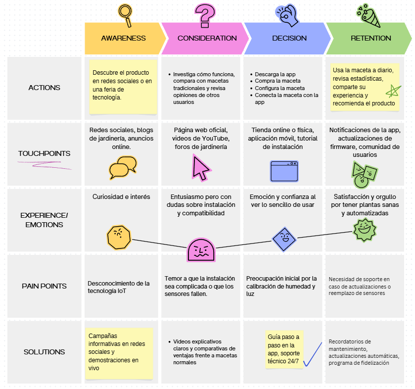


### 2.3.4. Empathy Mapping  


### Segmento Objetivo: Personas Ocupadas en la Ciudad

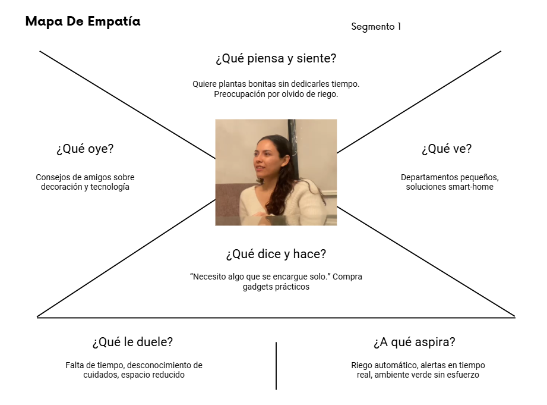

### Segmento Objetivo: Jardineros

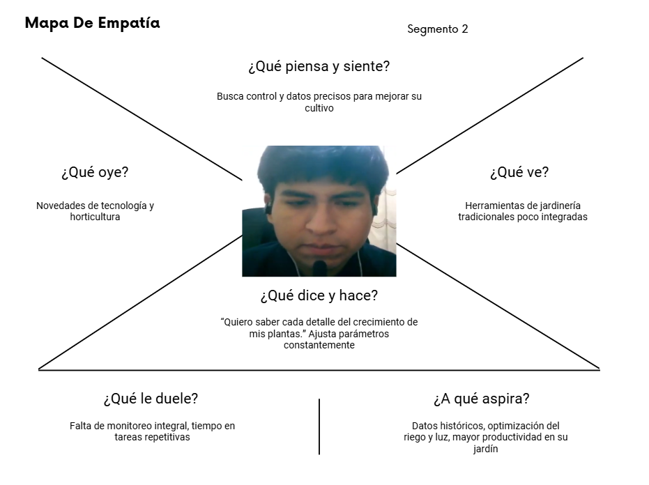


## 2.4. Ubiquitous Language  
# Ubiquitous Language

A continuación se presenta un glosario de términos utilizados en el dominio de macetas inteligentes y jardinería, incluyendo tanto términos formales como coloquiales, para asegurar que todos los miembros del equipo y stakeholders compartan un lenguaje común.

| Término (Inglés)          | Término (Español)               | Definición                                                                                  |
|----------------------------|---------------------------------|---------------------------------------------------------------------------------------------|
| Plant                      | Planta                          | Organismo vivo que requiere agua, luz y nutrientes para crecer y desarrollarse.             |
| Pot                        | Maceta                          | Recipiente donde se cultiva la planta; puede ser de plástico, cerámica, barro u otros.     |
| Smart Pot                  | Maceta Inteligente              | Maceta equipada con sensores y sistemas automáticos para riego, monitoreo y cuidado de la planta. |
| Soil                       | Sustrato / Tierra               | Mezcla que sirve como soporte físico y nutricional para la planta.                          |
| Watering                   | Riego                           | Acción de suministrar agua a la planta según sus necesidades.                               |
| Light Exposure             | Exposición a la Luz             | Cantidad de luz que recibe la planta para su fotosíntesis.                                  |
| Humidity                   | Humedad                         | Nivel de agua presente en el aire o sustrato, importante para el crecimiento de la planta. |
| Fertilizer                 | Fertilizante                    | Sustancia que aporta nutrientes esenciales a la planta.                                     |
| Seedling                   | Plántula                        | Planta joven recién germinada o en etapa inicial de crecimiento.                            |
| Growth Stage               | Etapa de Crecimiento            | Fase de desarrollo de la planta: germinación, vegetativa, floración o fructificación.       |
| Sprout                     | Brote / Chiquita                | Primeros tallos o hojas que emergen del sustrato; término coloquial usado por aficionados. |
| Leaf Drop                  | Caída de Hojas                  | Pérdida de hojas de la planta, puede indicar estrés o necesidad de cuidado.                |
| Automated Care             | Cuidado Automatizado            | Funciones que regulan riego, luz o humedad sin intervención manual.                         |
| Health Monitoring          | Monitoreo de Salud              | Seguimiento del estado de la planta mediante sensores y alertas.                            |
| Water Sensor               | Sensor de Agua                  | Dispositivo que mide la humedad del sustrato.                                               |
| Light Sensor               | Sensor de Luz                   | Dispositivo que mide la cantidad de luz que recibe la planta.                               |
| User Preferences           | Preferencias del Usuario        | Configuraciones definidas por el usuario para el cuidado de sus plantas.                   |
| Plant Buddy                | Compañero de Planta             | Término coloquial para referirse a la planta que se cuida con atención.                    |
| Alert System               | Sistema de Alertas              | Notificaciones enviadas al usuario sobre necesidades de la planta (riego, luz, nutrientes).|
| Green Thumb                | Pulgar Verde                    | Expresión coloquial que describe habilidad o talento para cuidar plantas.                  |
## 2.5. Big Picture EventStorming

El Big Picture EventStorming es una técnica de modelado colaborativo que nos permite explorar y visualizar el dominio completo de MaceTy desde la perspectiva de eventos del negocio. Esta técnica nos ayuda a identificar los eventos más importantes que ocurren en el sistema de la maceta inteligente, desde el registro inicial del usuario hasta el mantenimiento continuo de las plantas urbanas.

### Metodología Aplicada para MaceTy

Para realizar este Big Picture EventStorming seguimos una metodología estructurada de 9 pasos consolidados, cada uno enfocado en aspectos específicos del dominio de cuidado inteligente de plantas urbanas:

#### Paso 1: Unstructured Exploration (Exploración No Estructurada)
Comenzamos con una lluvia de ideas identificando todos los eventos significativos que ocurren en el dominio de MaceTy. Durante esta fase exploratoria, nos enfocamos en capturar eventos críticos como "Usuario se registra en la plataforma", "Planta es configurada por primera vez", "Sensor detecta humedad crítica", "Sistema activa riego automático", "Usuario recibe notificación de alerta", entre otros eventos relevantes para el ecosistema de cuidado urbano de plantas.

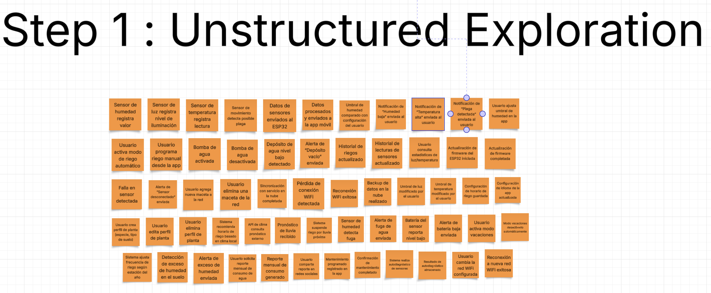

#### Paso 2: Timelines (Líneas Temporales)
Organizamos los eventos identificados en una línea temporal coherente que representa el flujo natural del proceso de negocio. Esta organización temporal abarca desde la configuración inicial de MaceTy hasta el monitoreo continuo y mantenimiento de plantas en espacios urbanos, considerando los diferentes patrones de uso de nuestros segmentos objetivo: usuarios ocupados urbanos y jardineros tecnológicos.

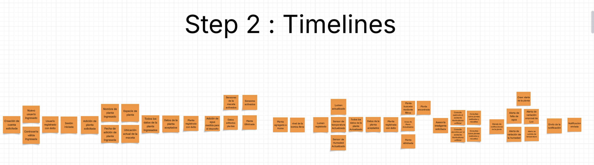

#### Paso 3: Pain Points (Puntos de Dolor)
Identificamos y marcamos los puntos problemáticos o áreas de fricción en el flujo de eventos. Estos pain points incluyen situaciones como "Pérdida de conectividad WiFi", "Sensor defectuoso", "Depósito de agua vacío", "Usuario olvida configurar tipo de planta", que representan desafíos críticos que el sistema MaceTy debe resolver para garantizar una experiencia de usuario exitosa.

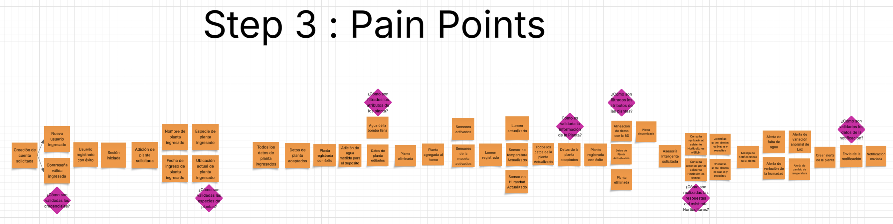

#### Paso 4: Pivotal Points (Puntos Pivotales)
Definimos los eventos pivotales o momentos críticos que determinan el éxito o fracaso del proceso. Estos puntos incluyen decisiones clave como "Usuario decide automatizar completamente el riego" vs "Usuario prefiere control manual", "Sistema detecta condiciones críticas de la planta", que bifurcan el flujo hacia diferentes escenarios de uso según las preferencias del segmento objetivo.

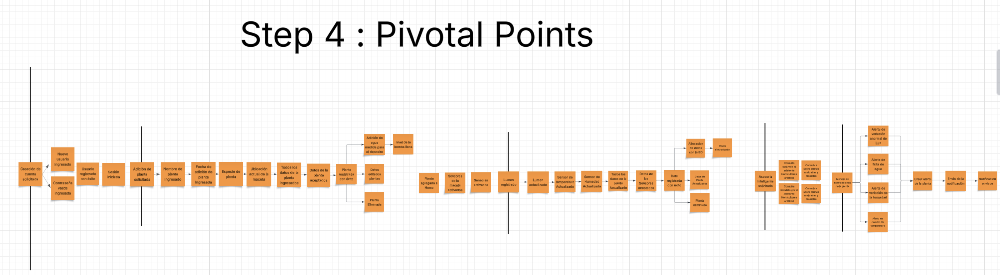

#### Paso 5: Commands (Comandos)
Para cada evento identificado, determinamos qué comandos o acciones específicas los desencadenan. Establecemos comandos como "Configurar nueva planta", "Solicitar datos de especie", "Activar riego manual", "Generar alerta de humedad", "Actualizar configuraciones de usuario", creando una relación clara de causa-efecto en el sistema MaceTy.

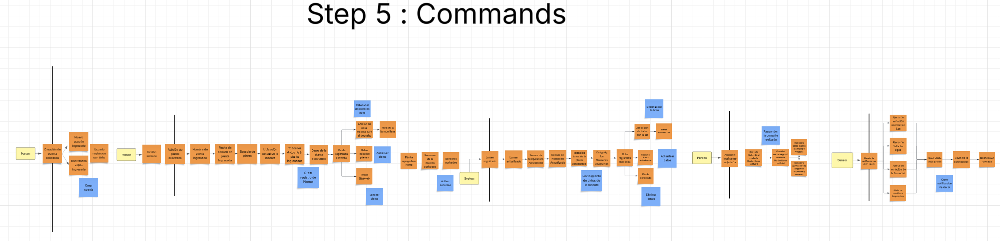

#### Paso 6: Policies (Políticas de Negocio)
Establecimos las reglas de negocio y políticas que conectan eventos con comandos subsecuentes. Definimos políticas críticas como "Cuando la humedad del sustrato está por debajo del 30%, activar riego automático", "Si el usuario es jardinero tecnológico, mostrar métricas detalladas y históricos", "En caso de falla del sensor, notificar inmediatamente y activar modo manual".

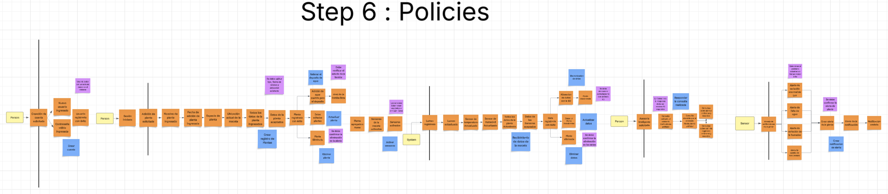

#### Paso 7: Read Models (Modelos de Lectura)
Determinamos qué información específica necesita consultar cada actor en diferentes momentos del proceso: dashboards simplificados para usuarios ocupados, métricas avanzadas y análisis para jardineros tecnológicos, históricos detallados de sensores, reportes de crecimiento de plantas, y alertas contextualizadas según el perfil del usuario.

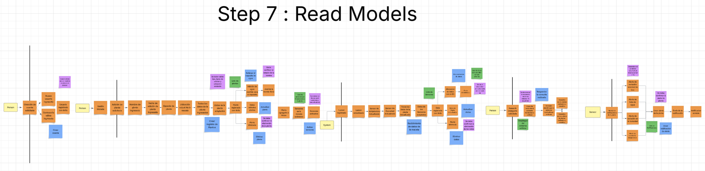

#### Paso 8: External Systems (Sistemas Externos)
Mapeamos las integraciones necesarias con sistemas externos, principalmente la Base de Datos de Especies de Plantas que se consulta únicamente durante el registro inicial de una nueva planta. Esta optimización permite que el sistema funcione de forma autónoma después de la configuración inicial, reduciendo dependencias externas y mejorando el rendimiento general del sistema.

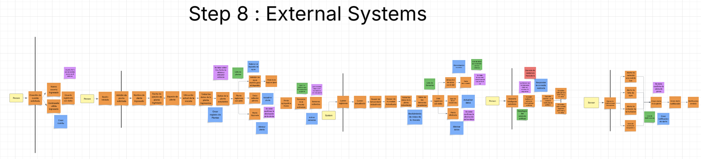

#### Paso 9: Aggregates & Bounded Contexts (Agregados y Contextos Delimitados)
Organizamos los eventos relacionados en contextos delimitados específicos para MaceTy: "Gestión de Usuarios Urbanos", "Monitoreo Inteligente de Plantas", "Control IoT de Dispositivos", "Automatización de Riego", y "Análisis de Datos de Plantas". Adicionalmente, marcamos las áreas problemáticas o hotspots de alta complejidad que requieren atención especial, como la sincronización entre dispositivos IoT y la nube, la gestión optimizada de alertas para usuarios ocupados, y la adaptación del sistema a condiciones urbanas específicas.

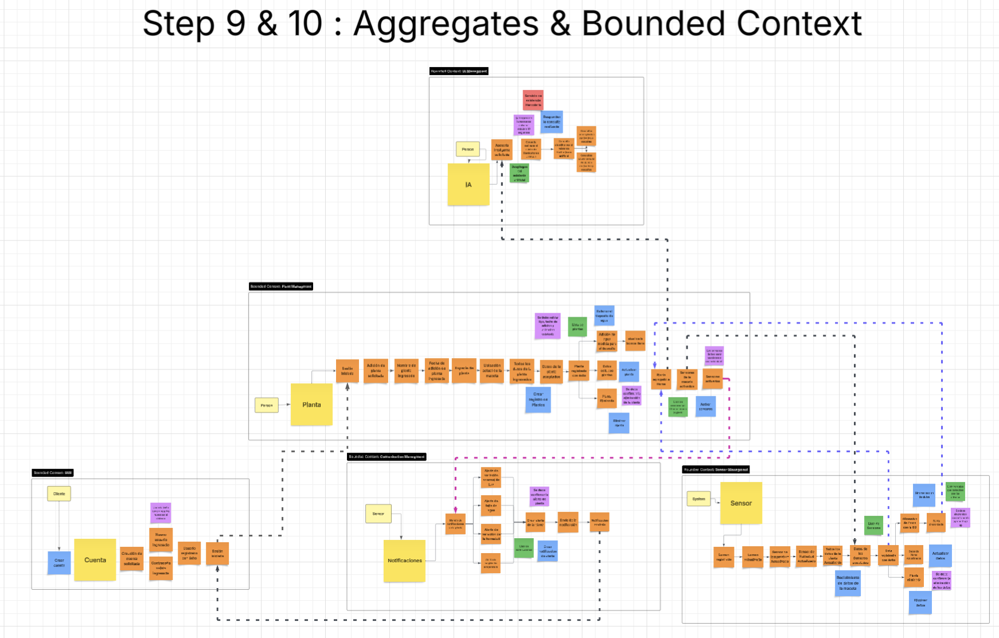

### Resultado del Big Picture EventStorming

El siguiente diagrama presenta el resultado consolidado de nuestro Big Picture EventStorming para MaceTy, integrando todos los elementos identificados en una vista unificada del dominio de cuidado inteligente de plantas urbanas:

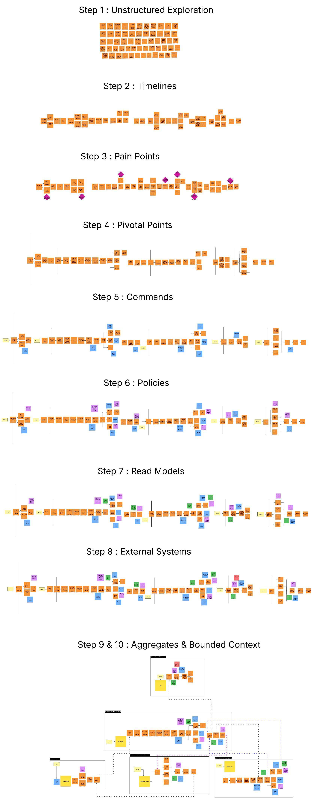

**Enlace interactivo:** [https://lucid.app/lucidchart/b67df073-d2bc-4ff2-9ab6-425a3e713360/edit?invitationId=inv_43dc8df3-420e-4f16-bf31-d07c7c357ee1](https://lucid.app/lucidchart/b67df073-d2bc-4ff2-9ab6-425a3e713360/edit?invitationId=inv_43dc8df3-420e-4f16-bf31-d07c7c357ee1)

### Principales Descubrimientos del EventStorming

Durante el proceso de EventStorming identificamos varios aspectos clave específicos para MaceTy:

**Flujos Diferenciados por Segmento:**
- Los usuarios ocupados urbanos requieren automatización máxima con alertas mínimas y no intrusivas
- Los jardineros tecnológicos demandan datos detallados, control granular y métricas de rendimiento

**Eventos Críticos de Automatización:**
- La detección automática de humedad baja, falta de luz o temperatura inadecuada son eventos centrales
- Estos eventos disparan múltiples procesos de cuidado inteligente y notificaciones contextuales

**Optimizaciones para Entorno Urbano:**
- El sistema debe adaptarse a espacios urbanos limitados y redes WiFi inestables
- Consideración de variaciones de luz natural en departamentos y condiciones específicas de la ciudad

**Integración Externa Optimizada:**
- La consulta a la Base de Datos de Especies solo ocurre durante la configuración inicial
- El sistema funciona autónomamente con los parámetros configurados, mejorando la eficiencia

**Flujos de Recuperación:**
- Identificamos escenarios críticos: pérdida de conectividad, fallos de sensor, agotamiento del depósito
- Definimos estrategias de recuperación automática y notificaciones de contingencia

**Bounded Contexts Identificados:**
1. **IAM Management** - Gestión de identidad, acceso y autenticación de usuarios urbanos
2. **Plant Management** - Administración del ciclo de vida de plantas y sus configuraciones específicas
3. **IA Management** - Inteligencia artificial para análisis predictivo y recomendaciones de cuidado
4. **Notification Management** - Sistema de alertas contextuales y comunicaciones push
5. **Sensor Management** - Control y monitoreo de dispositivos IoT y telemetría de sensores

Este modelo nos proporciona una visión holística del dominio MaceTy y sirve como base sólida para el diseño de la arquitectura IoT y la implementación de los bounded contexts identificados, asegurando que el sistema responda efectivamente a las necesidades reales de cuidado de plantas en entornos urbanos peruanos.
# Capítulo III: Requirements Specification  

## 3.1. User Stories

Las **User Stories** son una técnica fundamental en el desarrollo ágil que nos permite traducir las necesidades y objetivos de nuestros usuarios en requerimientos específicos y accionables para el desarrollo de MaceTy. Cada historia de usuario sigue el formato estándar "Como [tipo de usuario], quiero [funcionalidad] para [beneficio]", asegurando que mantengamos el foco en el valor que proporcionamos a nuestros segmentos objetivo.

Para MaceTy, las User Stories se organizan en **Épicas** (EP) que representan funcionalidades de alto nivel y se descomponen en **Stories** (ST) más específicas y manejables. Esta estructura jerárquica nos permite priorizar el desarrollo basándose en el valor para el usuario y la complejidad técnica, mientras mantenemos la trazabilidad desde los insights del needfinding hasta la implementación final.

Las historias han sido priorizadas considerando los hallazgos de nuestras entrevistas y análisis de usuarios: los **usuarios ocupados urbanos** requieren automatización máxima y simplicidad de uso, mientras que los **jardineros tecnológicos** valoran el control granular y acceso a datos detallados. Esta diferenciación se refleja en nuestras épicas, que abarcan desde funcionalidades core como monitoreo de sensores y riego automático, hasta características avanzadas como integración con ecosistemas smart home y análisis predictivo.

Cada User Story incluye **Criterios de Aceptación** claros y medibles que definen exactamente cuándo una funcionalidad se considera completada y lista para ser entregada a nuestros usuarios. Estos criterios aseguran que el producto final no solo cumpla con las expectativas técnicas, sino que realmente resuelva los problemas identificados durante la fase de investigación de usuarios y proporcione una experiencia excepcional en el cuidado automatizado de plantas urbanas.


| Epic / Story ID | Título | Descripción | Criterios de Aceptación | Relacionado con (Epic ID) |
|-----------------|-------|------------|-------------------------|---------------------------|
| **EP-01** | Monitoreo de Humedad | Como usuario quiero que la maceta mida la humedad del suelo para conocer el nivel de riego necesario. | - La app muestra en tiempo real el porcentaje de humedad.<br>- Actualización mínima cada 5 min. | — |
| ST-01 | Lectura de humedad en tiempo real | Mostrar el nivel actual de humedad del sustrato. |**-Scenario 1: Visualización de humedad actual en la app**</p>Dado que el usuario abrió la sección “Humedad Actual” en la app</p>Cuando el sensor envía el porcentaje de humedad en tiempo real</p>Entonces el Sistema muestra el valor en % en la app</p>Y el Sistema verifica que el error máximo sea de ±5%.</p>**-Scenario 2: Actualización periódica del valor de humedad**</p>Dado que el usuario se encuentra en la vista de humedad</p>Cuando transcurren 5 minutos desde la última lectura</p>Entonces el Sistema actualiza automáticamente el porcentaje de humedad</p>Y el Sistema muestra la nueva lectura en la app y la plataforma web. | EP-01 |
| ST-02 | Historial de humedad | Guardar registros diarios de humedad. |**-Scenario 1: Registro diario de humedad**</p>Dado que el sistema recibe mediciones de humedad durante el día</p>Cuando se completa el día calendario</p>Entonces el Sistema guarda los valores diarios en el historial</p>Y el Sistema los muestra en gráficos por día, semana y mes.<p/>**- Scenario 2: Exportación del historial** <p/>Dado que el usuario accede a la sección “Historial de Humedad”<p/>Cuando selecciona la opción “Exportar en .csv”<p/>Entonces el Sistema genera un archivo .csv con los registros almacenados<p/>Y el Sistema permite descargar el archivo en la app o web. | EP-01 |
| **EP-02** | Monitoreo de Luz | Como usuario quiero conocer la cantidad de luz recibida para asegurar el crecimiento óptimo. | - Lectura en lux disponible en app/web.<br>- Actualización cada 10 min. | — |
| ST-03 | Lectura de luz | Mostrar luminosidad actual. | **- Scenario 1: Mostrar luminosidad actual**<p/>Dado que el usuario está en la sección “Luz Actual”<p/>Cuando el sensor envía la lectura de luminosidad<p/>Entonces el Sistema muestra el valor en lux<p/>Y verifica que la precisión sea de ±10%.<p/>**- Scenario 2: Actualización periódica de luminosidad**<p/>Dado que la app se encuentra mostrando la lectura de luz<p/>Cuando transcurren 10 minutos desde la última actualización<p/>Entonces el Sistema solicita una nueva lectura al sensor<p/>Y muestra el nuevo valor en lux en la app y web.| EP-02 |
| ST-04 | Alertas de luz insuficiente | Enviar alerta si la luz está fuera del rango óptimo configurado. | **- Scenario 1: Alerta por luz bajo el umbral**<p*>Dado que el usuario configuró un rango mínimo de luminosidad<p*>Cuando el sensor detecta que la luz está por debajo del rango óptimo<p*>Entonces el Sistema envía una notificación push en menos de 30 segundos<p*>Y registra el evento en el historial de alertas.<p/>**- Scenario 2: Alerta por luz excesiva**<p/>Dado que el usuario configuró un rango máximo de luminosidad<p/>Cuando la lectura del sensor excede el límite superior<p/>Entonces el Sistema envía una notificación push al usuario en menos de 30 segundos<p/>Y muestra en la app el valor de lux detectado.| EP-02 |
| **EP-03** | Monitoreo de Temperatura | Como usuario quiero medir la temperatura ambiental de la planta para protegerla de cambios bruscos. | - Sensor registra temperatura °C cada 5 min. | — |
| ST-05 | Lectura de temperatura | Visualizar temperatura en tiempo real. | **- Scenario 1: Visualización de temperatura actual**<p/>Dado que el usuario abrió la sección “Temperatura Actual”<p/>Cuando el sensor envía la lectura de temperatura<p/>Entonces el Sistema muestra el valor en °C<p/>Y verifica que esté dentro del rango 0–50 °C.<p/>**- Scenario 2: Actualización periódica de temperatura**<p/>Dado que el sistema recibe valores de temperatura cada 5 minutos<p/>Cuando se recibe una nueva lectura<p/>Entonces la app actualiza el valor mostrado en tiempo real<p/>Y registra la lectura en memoria temporal. | EP-03 |
| ST-06 | Historial de temperatura | Guardar histórico diario/semanal. | **- Scenario 1: Registro diario del historial**<p/>Dado que existe medición continua durante el día<p/>Cuando termina el día calendario<p/>Entonces el Sistema almacena el promedio, mínimo y máximo diario<p/>Y los muestra en gráficos consultables en la app.<p/>**- Scenario 2: Consulta del historial**<p/>Dado que el usuario accede al módulo “Historial de Temperatura”<p/>Cuando selecciona un rango de días<p/>Entonces el Sistema muestra gráficos del periodo seleccionado<p/>Y presenta la variación diaria de manera detallada. | EP-03 |
| **EP-04** | Riego Automático | Como usuario quiero que la maceta riegue automáticamente cuando la humedad esté por debajo del umbral. | - Bomba de agua se activa/desactiva según umbral. | — |
| ST-07 | Configurar umbral de riego | Permitir al usuario fijar % de humedad mínimo. |**- Scenario 1: Configuración de umbral por el usuario**<p/>Dado que el usuario abrió la sección “Configuración de Riego”<p/>Cuando ingresa un porcentaje mínimo de humedad<p/>Entonces el Sistema guarda el nuevo umbral<p/>Y confirma la configuración mediante un mensaje en pantalla.<p/>**- Scenario 2: Validación de umbral ingresado**<p/>Dado que el usuario ingresa un valor de umbral fuera del rango permitido<p/>Cuando hace clic en “Guardar”<p/>Entonces el Sistema muestra un mensaje de error<p/>Y no permite guardar la configuración.<p/>| EP-04 |
| ST-08 | Activar riego automático | Riego se activa cuando humedad < umbral. |**- Scenario 1: Activación automática por humedad baja**<p/>Dado que el usuario configuró un umbral mínimo de humedad<p/>Cuando el sensor detecta un valor inferior al umbral<p/>Entonces el Sistema activa automáticamente la bomba de riego<p/>Y registra en la app un log de inicio del riego.<p/>**- Scenario 2: Finalización automática del riego**<p/>Dado que la bomba de riego está activa<p/>Cuando la humedad alcanza nuevamente el umbral mínimo establecido<p/>Entonces el Sistema detiene la bomba<p/>Y registra un log de finalización de riego en la app.<p/>| EP-04 |
| ST-09 | Riego manual desde app | Permitir riego inmediato desde app. | **- Scenario 1: Activación manual**<p/>Dado que el usuario está en la sección “Riego Manual”<p/>Cuando presiona el botón “Regar ahora”<p/>Entonces el Sistema activa inmediatamente la bomba<p/>Y muestra un mensaje de “Riego iniciado”.<p/>**- Scenario 2: Confirmación de finalización**<p/>Dado que se activó el riego manual<p/>Cuando la acción termina su ciclo predefinido<p/>Entonces el Sistema muestra un mensaje de “Riego completado”<p/>Y registra el evento en el historial de riegos.<p/>| EP-04 |
| **EP-05** | Notificaciones y Alertas | Como usuario quiero recibir alertas ante cambios críticos para actuar a tiempo. | - Push/email ante condiciones fuera de rango. | — |
| ST-10 | Alerta de humedad crítica | Enviar notificación si humedad < umbral de seguridad. | **- Scenario 1: Envío de alerta por humedad crítica**<p/>Dado que el sistema monitorea la humedad continuamente<p/>Cuando la humedad cae por debajo del umbral crítico<p/>Entonces el Sistema envía una notificación push en menos de 30 segundos<p/>Y muestra en pantalla el valor detectado.<p/>**- Scenario 2: Registro del evento**<p/>Dado que ocurrió una alerta de humedad crítica<p/>Cuando el usuario revisa el historial de alertas<p/>Entonces el Sistema muestra el evento registrado<p/>Y permite visualizar fecha y hora del evento.<p/> | EP-05 |
| ST-11 | Alerta de temperatura extrema | Avisar si temperatura excede rangos definidos. | **- Scenario 1: Alerta por temperatura alta**<p/>Dado que el sensor detecta la temperatura actual<p/>Cuando supera el rango máximo permitido<p/>Entonces el Sistema envía una alerta inmediata<p/>Y muestra la temperatura exacta en la notificación.<p/>**- Scenario 2: Alerta por temperatura baja**<p/>Dado que existe un rango mínimo configurado<p/>Cuando la temperatura cae por debajo de dicho rango<p/>Entonces el Sistema envía una notificación push<p/>Y marca el evento como “temperatura extrema” en el historial.<p/> | EP-05 |
| ST-12 | Confirmación de envío | Registrar confirmación de que la alerta fue entregada. | **- Scenario 1: Registro de entrega de alerta**<p/>Dado que se envió una notificación al usuario<p/>Cuando el sistema recibe confirmación del proveedor de envío<p/>Entonces marca el estado como “Enviada”<p/>Y actualiza el panel de alertas.<p/>**- Scenario 2: Error en el envío**<p/>Dado que se intentó enviar una alerta<p/>Cuando el proveedor devuelve un error<p/>Entonces el Sistema muestra estado “Error de envío”<p/>Y registra el fallo en el panel.<p/> | EP-05 |
| **EP-06** | App/Web y Comunidad | Como usuario quiero administrar y compartir datos de mis plantas desde app y web. | - Acceso multiplataforma (iOS/Android/Web). | — |
| ST-13 | Registro y login de usuario | Permitir crear cuenta y autenticarse. |**- Scenario 1: Registro exitoso**<p/>Dado que el usuario se encuentra en el formulario de registro<p/>Cuando ingresa email válido y contraseña<p/>Entonces el Sistema crea la cuenta<p/>Y muestra un mensaje de confirmación.<p/>**- Scenario 2: Error en login**<p/>Dado que el usuario está en la pantalla de login<p/>Cuando ingresa credenciales incorrectas<p/>Entonces el Sistema muestra un mensaje de error claro<p/>Y permanece en la misma pantalla.<p/> | EP-06 |
| ST-14 | Dashboard de métricas | Mostrar humedad, luz, temperatura y riego. |**- Scenario 1: Visualización de métricas en tiempo real**<p/>Dado que el usuario accede al dashboard<p/>Cuando el sistema recibe datos de humedad, luz, temperatura y riego<p/>Entonces el Sistema muestra las métricas en tiempo real<p/>Y actualiza los gráficos correspondientes.<p/>**- Scenario 2: Error de obtención de datos**<p/>Dado que el dashboard requiere datos de sensores<p/>Cuando el Sistema no puede obtener una lectura<p/>Entonces muestra un mensaje de “Datos no disponibles”<p/>Y conserva la última lectura válida mostrada.<p/>| EP-06 |
| ST-15 | Comunidad de usuarios | Compartir consejos y fotos. | **- Scenario 1: Publicación de contenido**<p/>Dado que el usuario accede a la sección Comunidad<p/>Cuando publica un consejo o foto<p/>Entonces el Sistema registra la publicación<p/>Y la muestra inmediatamente en el foro interno.<p/>**- Scenario 2: Comentario en una publicación**<p/>Dado que el usuario observa una publicación existente<p/>Cuando escribe un comentario<p/>Entonces el Sistema guarda el comentario<p/>Y lo muestra debajo de la publicación.<p/> | EP-06 |
| **EP-07** | Integraciones Futuras | Como usuario quiero integrar la maceta con asistentes de voz y otros dispositivos smart home. | - API/documentación disponible. | — |
| ST-16 | API para integraciones | Ofrecer endpoints REST/ MQTT para terceros. |**- Scenario 1: Acceso a endpoint seguro**<p/>Dado que un tercero desea consumir la API<p/>Cuando envía una solicitud con token válido<p/>Entonces el Sistema permite el acceso<p/>Y devuelve los datos solicitados.<p/>**- Scenario 2: Token inválido**<p/>Dado que un tercero realiza una solicitud<p/>Cuando envía un token inválido o expirado<p/>Entonces el Sistema rechaza la petición<p/>Y devuelve un mensaje de error de autenticación.<p/> | EP-07 |
| ST-17 | Compatibilidad con asistentes de voz | Enviar/recibir comandos básicos. | **- Scenario 1: Recepción de comando de voz**<p/>Dado que el usuario configuró su asistente de voz<p/>Cuando envía un comando como “Consultar humedad”<p/>Entonces el Sistema procesa la solicitud<p/>Y responde con los valores actuales de humedad.<p/>**- Scenario 2: Envío de comando hacia la maceta**<p/>Dado que el usuario usa un asistente compatible<p/>Cuando ordena “Activa el riego”<p/>Entonces el Sistema recibe el comando<p/>Y ejecuta la acción en la maceta inteligente.<p/> | EP-07 |
| **EP-08** | Mantenimiento y Seguridad | Como usuario quiero asegurar el correcto funcionamiento y la protección de mis datos. | - Encriptación y respaldo de datos. | — |
| ST-18 | Backup en la nube | Guardar configuraciones y métricas. | **- Scenario 1: Backup diario automático**<p/>Dado que el día calendario llega a su fin<p/>Cuando el proceso programado se ejecuta<p/>Entonces el Sistema realiza un respaldo automático<p/>Y guarda métricas y configuraciones en la nube.<p/>**- Scenario 2: Restaurar desde backup**<p/>Dado que existe un respaldo previo<p/>Cuando el usuario selecciona “Restaurar configuración”<p/>Entonces el Sistema recupera los datos<p/>Y restaura las configuraciones anteriores.<p/> | EP-08 |
| ST-19 | Calibración de sensores | Permitir calibración desde app. | **- Scenario 1: Iniciar calibración**<p/>Dado que el usuario abre la sección “Calibración”<p/>Cuando presiona “Iniciar calibración”<p/>Entonces el Sistema muestra una guía paso a paso<p/>Y comienza el proceso de ajuste del sensor.<p/>**- Scenario 2: Confirmar calibración**<p/>Dado que el proceso de calibración ha finalizado<p/>Cuando el usuario confirma la lectura obtenida<p/>Entonces el Sistema guarda los nuevos parámetros<p/>Y muestra un mensaje de calibración exitosa.<p/> | EP-08 |
| ST-20 | Notificación de mantenimiento | Avisar cuando se requiera limpieza/batería. | **- Scenario 1: Aviso por limpieza necesaria**<p/>Dado que el sistema detecta acumulación de suciedad o reducción de rendimiento<p/>Cuando la condición alcanza nivel crítico<p/>Entonces el Sistema envía un push y correo de recordatorio<p/>Y registra el evento en el historial de mantenimiento.<p/>**- Scenario 2: Aviso por batería baja**<p/>Dado que la batería de la maceta se encuentra en nivel mínimo<p/>Cuando el sensor reporta carga inferior al umbral<p/>Entonces el Sistema envía un aviso al usuario<p/>Y recomienda acciones para mantener el equipo operativo.<p/> | EP-08 |
| ST-21 | Gestión de usuarios y roles | Permitir varios usuarios por maceta con permisos. | **- Scenario 1: Añadir usuario invitado**<p/>Dado que el usuario administrador accede a “Gestión de usuarios”<p/>Cuando ingresa el email de un nuevo invitado<p/>Entonces el Sistema agrega al usuario con rol invitado<p/>Y le otorga permisos limitados.<p/>**- Scenario 2: Cambio de rol**<p/>Dado que existe un usuario invitado<p/>Cuando el administrador modifica su rol a “Administrador”<p/>Entonces el Sistema actualiza los permisos asignados<p/>Y muestra la confirmación de cambio de rol.<p/> | EP-08 |


## 3.2. Product Backlog

El **Product Backlog** es una lista priorizada de funcionalidades, características y requerimientos que define lo que se debe construir para MaceTy. Esta lista viva y dinámica se organiza por valor de negocio, riesgo técnico y dependencies, asegurando que el equipo de desarrollo se enfoque en entregar las funcionalidades más críticas primero.

Para MaceTy, el Product Backlog se estructura considerando las necesidades diferenciadas de nuestros segmentos objetivo: **automatización máxima** para usuarios ocupados urbanos y **control granular** para jardineros tecnológicos. Las user stories se priorizan usando la técnica de **Story Points** (escala Fibonacci: 1, 2, 3, 5, 8) que estima la complejidad relativa y el esfuerzo requerido.

La priorización se basa en tres criterios principales: **valor para el usuario** (impacto directo en la experiencia), **viabilidad técnica** (complejidad de implementación) y **dependencies** (prerequisitos técnicos). Esta metodología asegura un desarrollo incremental que entrega valor temprano y continuo a nuestros usuarios urbanos.


# Product Backlog – MaceTy

| # Orden | User Story ID | Título | Descripción | Story Points (1/2/3/5/8) |
|--------|--------------|-------|-------------|-------------------------|
| 1 | ST-13 | Registro y login de usuario | Como usuario quiero crear cuenta y autenticarme para acceder a la app/web y mis dispositivos. | 3 |
| 2 | ST-14 | Dashboard de métricas | Como usuario quiero visualizar humedad, luz, temperatura y riego en tiempo real. | 8 |
| 3 | ST-01 | Lectura de humedad en tiempo real | Como usuario quiero ver el nivel actual de humedad del sustrato para decidir el riego. | 3 |
| 4 | ST-03 | Lectura de luz | Como usuario quiero conocer la luminosidad actual para verificar condiciones de la planta. | 2 |
| 5 | ST-05 | Lectura de temperatura | Como usuario quiero conocer la temperatura del ambiente para prevenir daños en la planta. | 2 |
| 6 | ST-07 | Configurar umbral de riego | Como usuario quiero fijar el % de humedad mínimo para activar el riego automático. | 3 |
| 7 | ST-08 | Activar riego automático | Como usuario quiero que el sistema riegue automáticamente cuando la humedad baje del umbral. | 5 |
| 8 | ST-09 | Riego manual desde app | Como usuario quiero activar el riego manualmente desde la app cuando lo considere necesario. | 3 |
| 9 | ST-10 | Alerta de humedad crítica | Como usuario quiero recibir alertas cuando la humedad sea demasiado baja. | 3 |
|10 | ST-11 | Alerta de temperatura extrema | Como usuario quiero recibir alertas si la temperatura excede los rangos definidos. | 3 |
|11 | ST-04 | Alertas de luz insuficiente | Como usuario quiero recibir alertas cuando la luz esté fuera del rango óptimo. | 3 |
|12 | ST-02 | Historial de humedad | Como usuario quiero ver gráficos de humedad por día/semana/mes para análisis. | 2 |
|13 | ST-06 | Historial de temperatura | Como usuario quiero ver el historial de temperatura para entender cambios ambientales. | 2 |
|14 | ST-15 | Comunidad de usuarios | Como usuario quiero compartir consejos y fotos con otros usuarios en la plataforma. | 2 |
|15 | ST-18 | Backup en la nube | Como usuario quiero guardar configuraciones y métricas en la nube para evitar pérdida de datos. | 5 |
|16 | ST-19 | Calibración de sensores | Como usuario quiero calibrar los sensores desde la app para asegurar lecturas correctas. | 4 |
|17 | ST-20 | Notificación de mantenimiento | Como usuario quiero recibir avisos de limpieza o batería baja para un uso continuo. | 2 |
|18 | ST-21 | Gestión de usuarios y roles | Como administrador quiero asignar permisos a varios usuarios por maceta. | 3 |
|19 | ST-16 | API para integraciones | Como desarrollador quiero endpoints para integrar MaceTy con otras plataformas. | 5 |

## 3.3. Impact Mapping

El **Impact Mapping** es una técnica de planificación estratégica que conecta los objetivos de negocio con las funcionalidades específicas del producto, asegurando que cada característica de MaceTy contribuya de manera medible al éxito de nuestros usuarios y del negocio. Esta metodología visual nos ayuda a mantener el foco en el impacto real que queremos generar: reducir la mortalidad de plantas urbanas y mejorar la experiencia de cuidado automatizado.

Para MaceTy, el Impact Mapping se estructura en cuatro niveles: **Goal** (objetivo de negocio), **Actors** (personas que pueden influir en el resultado), **Impacts** (comportamientos que queremos generar en estos actores) y **Deliverables** (funcionalidades específicas que habilitarán estos comportamientos). Esta estructura nos permite validar que cada funcionalidad desarrollada tenga un propósito claro y medible.

El mapa de impacto se enfoca en nuestros dos segmentos principales: usuarios ocupados urbanos que buscan automatización máxima, y jardineros tecnológicos que valoran datos detallados y control granular. Cada segmento requiere impactos diferenciados para lograr el objetivo común de mantener plantas saludables con mínimo esfuerzo.

### Impact Map - MaceTy: Reducir Mortalidad de Plantas Urbanas en 50%

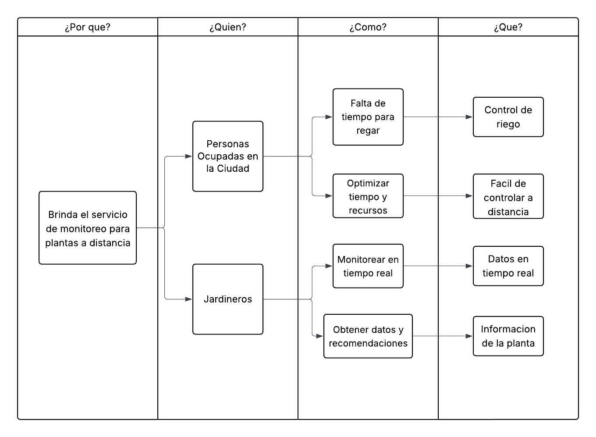

### Desglose del Impact Mapping por Segmento

#### Segmento: Personas Ocupadas Urbanas

**Goal:** Reducir mortalidad de plantas urbanas en 50% en el primer año

**Actor:** Usuario Ocupado Urbano (18-35 años, profesional/estudiante)

**Impacts Esperados:**
- Mantenga plantas vivas por más de 6 meses (vs. 3 meses promedio actual)
- Reduzca tiempo de cuidado manual de 15 min/día a 2 min/día
- Aumente confianza en el cuidado de plantas (de 3/10 a 8/10)
- Recomiende MaceTy a al menos 3 amigos/familiares

**Deliverables Clave:**
- ST-08: Riego automático cuando humedad < umbral configurado
- ST-10: Alertas de humedad crítica en <30 segundos
- ST-01: Lectura de humedad en tiempo real con ±5% precisión
- ST-13: Registro y login simplificado (<2 minutos)

#### Segmento: Jardineros Tecnológicos

**Goal:** Optimizar rendimiento de plantas y engagement con la plataforma

**Actor:** Jardinero Aficionado/Semi-profesional (25-45 años)

**Impacts Esperados:**
- Mejore salud de plantas usando datos históricos (incremento 30% en vitalidad)
- Use MaceTy diariamente para monitoreo (>5 días/semana)
- Comparta experiencias en la comunidad (>2 posts/mes)
- Se suscriba a plan premium para análisis avanzados (conversión 25%)

**Deliverables Clave:**
- ST-02: Historial de humedad con gráficos exportables
- ST-14: Dashboard completo con métricas en tiempo real
- ST-15: Comunidad para compartir consejos y fotos
- ST-19: Calibración avanzada de sensores

#### Actores Secundarios

**Viveros y Tiendas (Canal Partner)**

**Impacts Esperados:**
- Vendan MaceTy como producto complementario (20% de sus clientes)
- Proporcionen soporte técnico básico a usuarios finales
- Generen ingresos adicionales por comisiones (15% por venta)

**Deliverables Clave:**
- ST-16: API para integración con sistemas de inventario
- Programa de capacitación para vendedores
- Materiales de marketing diferenciados por segmento

**Influencers/Comunidades de Jardinería**

**Impacts Esperados:**
- Recomienden MaceTy en redes sociales (reach >10K por post)
- Generen contenido educativo usando el producto
- Validen credibilidad en mercado peruano/latinoamericano

**Deliverables Clave:**
- ST-15: Features de compartir logros y estadísticas
- Programa beta para early adopters
- Dashboard de métricas compartibles en redes sociales

### Métricas de Éxito por Impact

| Impact | Métrica Objetivo | Período | Método de Medición |
|---------|------------------|---------|-------------------|
| Reducir mortalidad de plantas | 50% menos plantas muertas | 12 meses | Encuestas pre/post + telemetría |
| Aumentar retención de usuarios | 70% uso activo >6 meses | 6-12 meses | Analytics de app + device logs |
| Mejorar satisfacción | NPS ≥ 50 | Trimestral | Encuestas in-app |
| Generar recomendaciones | 40% usuarios refieren a otros | 6 meses | Código de referido + tracking |
| Conversión premium | 25% suscripción a plan avanzado | 3 meses | Analytics de conversión |

### Assumptions y Riesgos Identificados

**Assumptions Críticas:**
- Los usuarios urbanos están dispuestos a confiar en automatización para sus plantas
- La conectividad WiFi en departamentos limeños es suficientemente estable
- El precio punto (S/200-250) es competitivo vs. alternativas importadas

**Riesgos de Impact:**
- **Alto:** Fallas de hardware que generen desconfianza en automatización
- **Medio:** Competencia de productos similares con menor precio
- **Bajo:** Cambios en preferencias de usuarios post-pandemia

Este Impact Mapping nos permite validar constantemente que MaceTy está generando el valor esperado y nos proporciona un marco claro para tomar decisiones de producto basadas en objetivos medibles y centrados en el usuario.

# Capítulo IV: Solution Software Design  

## 4.1. Strategic-Level Domain-Driven Design  
### 4.1.1. Design-Level EventStorming  

El **Design-Level EventStorming** es una técnica de modelado colaborativo que nos permite profundizar en el análisis del dominio de MaceTy, refinando los contextos delimitados identificados durante el Big Picture EventStorming. Esta fase se enfoca en explorar con mayor detalle los procesos de negocio, los flujos de información y las interacciones entre diferentes bounded contexts del sistema de cuidado inteligente de plantas urbanas.

A diferencia del Big Picture EventStorming que proporcionó una vista panorámica del dominio completo, el Design-Level EventStorming se concentra en áreas específicas del negocio, permitiéndonos descubrir patrones de comunicación entre contextos, identificar interfaces de integración y definir las responsabilidades exactas de cada bounded context. Esta metodología es fundamental para MaceTy porque nos ayuda a diseñar una arquitectura que sea tanto escalable como mantenible, considerando las necesidades específicas de nuestros segmentos urbanos.

El proceso de Design-Level EventStorming para MaceTy se estructura en tres fases principales: **Candidate Context Discovery** (identificación y validación de contextos delimitados), **Domain Message Flows Modeling** (modelado de flujos de mensajes entre contextos) y **Bounded Context Canvases** (definición detallada de cada contexto con sus responsabilidades, interfaces y dependencias). Esta aproximación sistemática nos permite pasar del entendimiento conceptual del dominio a un diseño arquitectónico concreto que guíe la implementación de la plataforma IoT MaceTy.
#### 4.1.1.1. Candidate Context Discovery

Identificar contextos candidatos es un paso clave para gestionar la complejidad en el desarrollo de sistemas. Se trata de un análisis minucioso que busca entender los elementos centrales del sistema y sus interconexiones. A partir de ahí, se procede a agrupar estos elementos en 'contextos delimitados' lógicos y coherentes. Esta separación no solo facilita el diseño y la implementación, sino que también tiene como meta principal potenciar la escalabilidad, el desempeño y la mantenibilidad del sistema resultante.

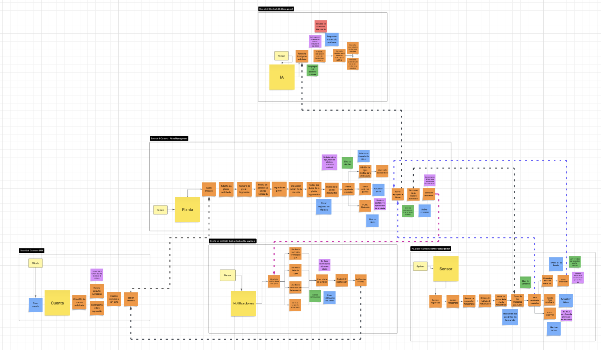

#### 4.1.1.2. Domain Message Flows Modeling

Para analizar y diseñar sistemas de software, se usa el Modelado de Flujos de Mensajes de Dominio, un método que ilustra la transferencia de información entre componentes mediante mensajes. Este proceso se centra en especificar los mensajes enviados y recibidos por los diferentes actores del sistema y en descifrar sus relaciones. El uso de esta metodología aporta claridad para entender y representar las vías de información del sistema, permitiendo detectar problemas potenciales más fácilmente y optimizar la estructura del diseño. A modo de ejemplo, mostraremos a continuación algunos diagramas aplicados a nuestro sistema.

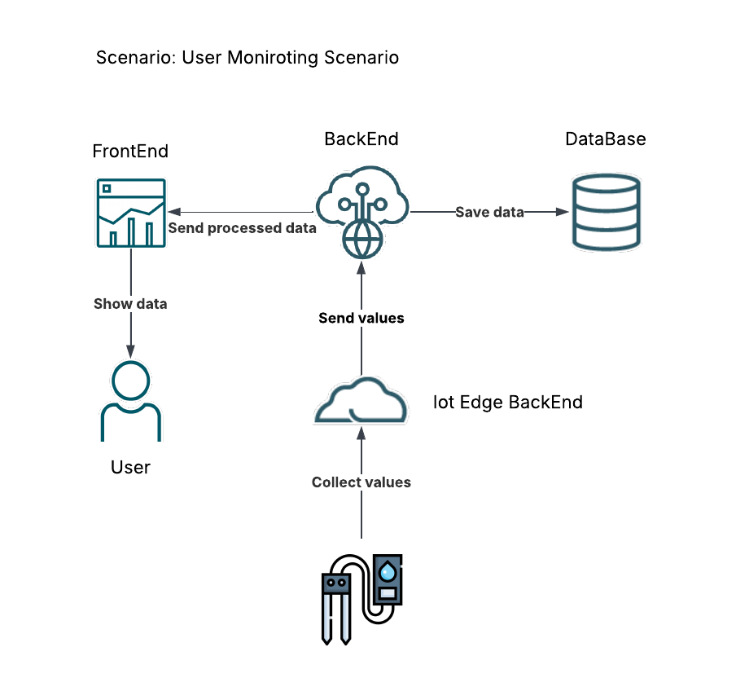

#### 4.1.1.3. Bounded Context Canvases

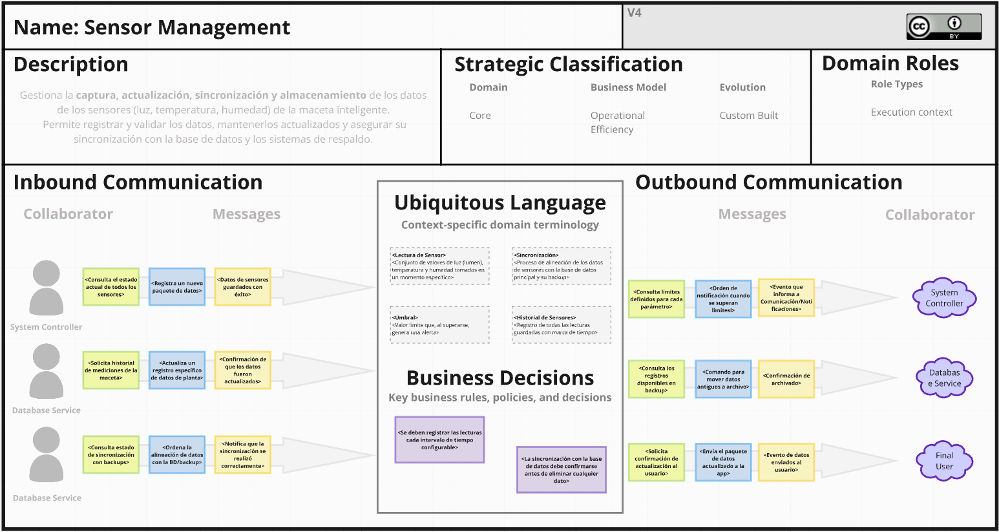

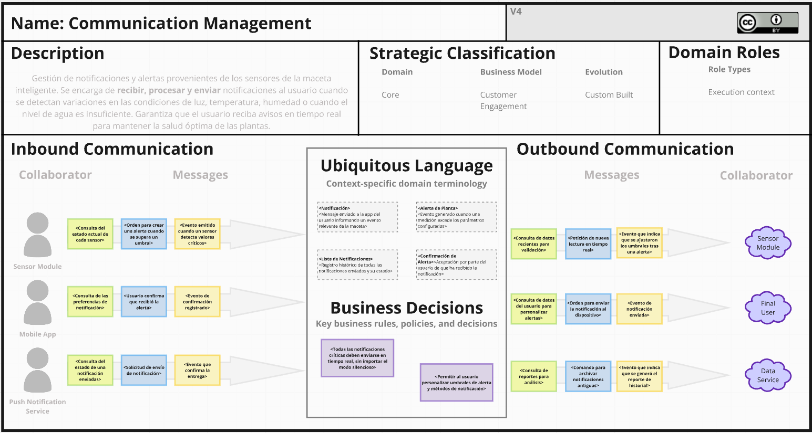

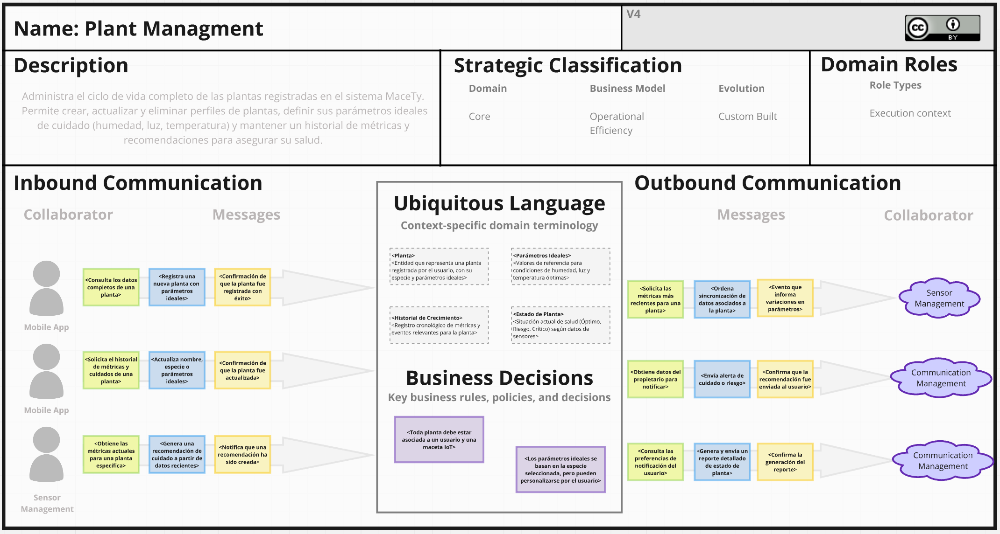

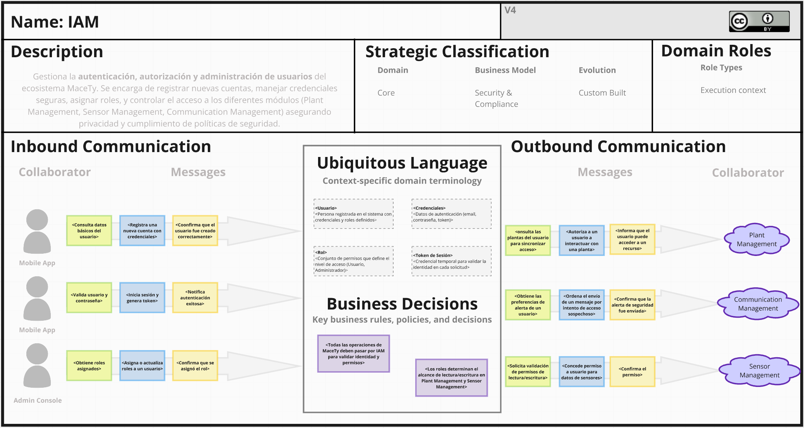

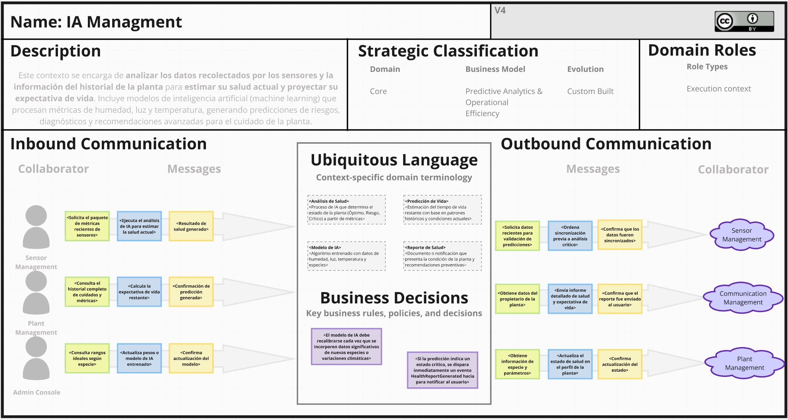

### 4.1.2. Context Mapping  

En esta sección presentamos el context map definido para el sistema, donde se visualizan las relaciones estructurales entre los bounded contexts identificados. La propuesta busca mantener una separación clara de responsabilidades, asegurando consistencia en los modelos y una comunicación eficiente entre los diferentes componentes.

- IAM Management funciona como un servicio transversal para todos los demás bounded contexts bajo el patrón Customer/Supplier, ya que provee la gestión de identidad y autenticación que consumen las demás áreas del sistema.

- Plant Management y IA Management comparten un Shared Kernel basado en el modelo de plantas, lo que garantiza coherencia entre la administración del ciclo de vida de las plantas y el análisis predictivo para su cuidado.

- Sensor Management se comunica con Plant Management a través de una Anti-corruption Layer, que traduce la telemetría de los dispositivos IoT a un formato comprensible para la gestión de plantas, protegiendo al dominio de detalles técnicos propios de los sensores.

- IA Management mantiene una relación de tipo Conformist con Notification Management, adaptando sus recomendaciones al formato de alertas y comunicaciones push definido por el sistema de notificaciones.

- Notification Management actúa como punto de salida hacia los usuarios finales, consolidando la información proveniente de otros contexts y distribuyéndola en forma de alertas y mensajes push.

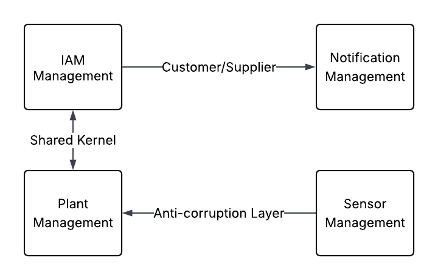

### 4.1.3. Software Architecture

En esta sección se presentan los diagramas C4 que describen la arquitectura del sistema de la Maceta Inteligente MaceTy, una solución integral para el cuidado automatizado de plantas domésticas en entornos urbanos. Estos diagramas ilustran desde una vista general de alto nivel hasta el detalle de contenedores y componentes internos, mostrando cómo interactúan los sensores, la plataforma IoT y las aplicaciones móviles y web.  

#### 4.1.3.1. System Landscape Diagram  

El Diagrama del Paisaje del Sistema muestra la relación de MaceTy con actores externos, como usuarios urbanos y jardineros, así como aplicaciones móviles, servicios de notificación y bases de datos de especies. También ilustra la interacción con sistemas externos clave, como APIs climáticas y repositorios especializados, que enriquecen las recomendaciones de cuidado.  

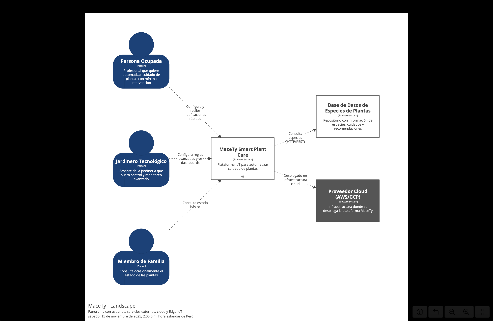  
 

#### 4.1.3.2. Context Level Diagram  

El Diagrama de Contexto detalla cómo los distintos actores (usuarios, jardineros) se comunican con el sistema a través de la aplicación móvil y la plataforma web. También representa la conexión con el MaceTy Urban IoT Device, que recolecta datos del entorno (humedad, temperatura, luz) y los transmite al ecosistema vía el MaceTy API Gateway.  

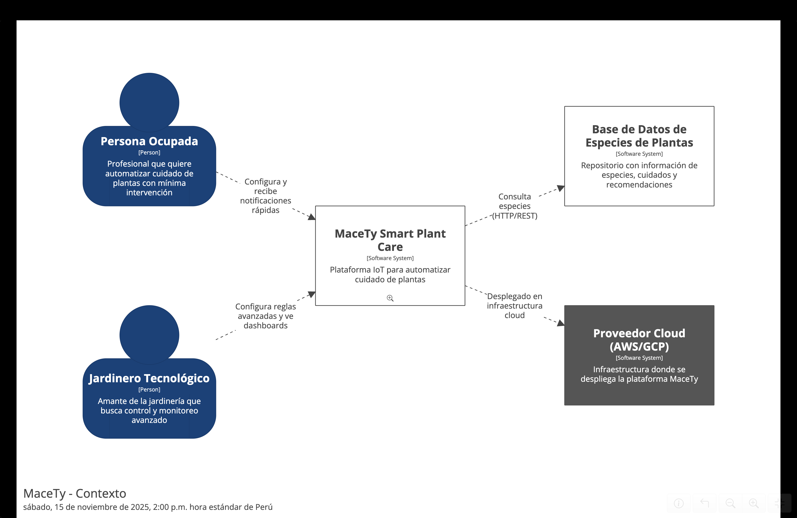  


#### 4.1.3.3. Container Level Diagram  

El **Diagrama de Contenedores** describe los principales bloques funcionales del sistema:  

- **MaceTy Mobile App**: Permite al usuario monitorear y controlar su planta en tiempo real.  
- **MaceTy Web Platform**: Proporciona un dashboard con métricas y comunidad de usuarios.  
- **MaceTy API Gateway**: Administra la comunicación entre dispositivos IoT, aplicaciones y base de datos.  
- **MaceTy Urban Database**: Almacena información de sensores, preferencias del usuario y patrones urbanos.  
- **Servicios externos**: Repositorios de especies que enriquecen las recomendaciones.  

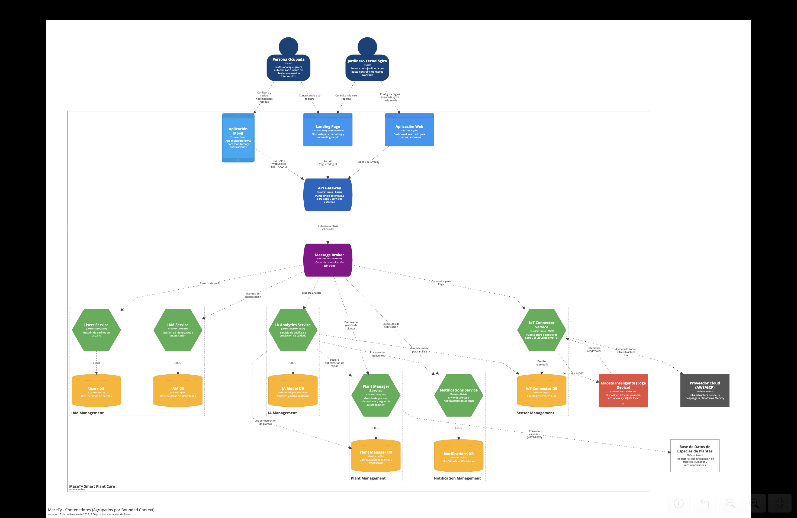 
 

#### Software Edge Diagram  

El **Diagrama Edge** describe la estructura interna del dispositivo **Maceta Inteligente (Edge Device)**.  
Este dispositivo integra sensores y actuadores conectados a un procesador **ESP32** con base de datos local (**SQLite**), capaz de operar en modo offline y sincronizar datos al recuperar conexión.  

- **Sensores:** Humedad, Temperatura y Luz Ambiental.  
- **Actuadores:** Bomba de agua (riego automático) y LED indicadores de estado.  
- **Procesamiento Local:** El ESP32 gestiona la lógica básica de riego y almacenamiento temporal de métricas.  
- **Conectividad:** Comunicación vía WiFi y sincronización mediante MQTT hacia el IoT Connector.  

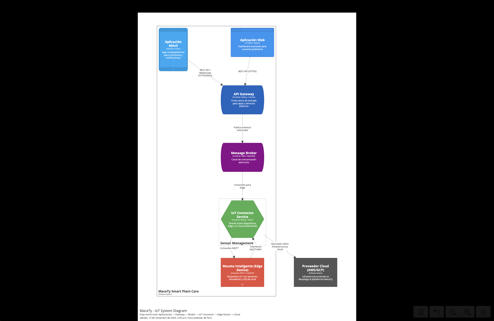  
 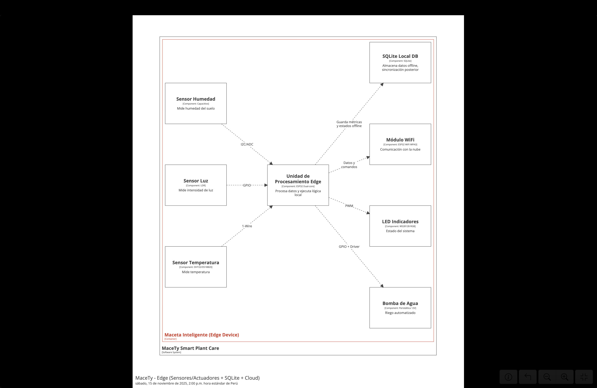  

#### 4.1.3.4. Software Architecture Deployment Diagrams  

Los Deployment Diagrams (diagramas de despliegue) forman parte de la arquitectura de software y son esenciales para representar cómo los componentes del sistema se distribuyen físicamente en el entorno de ejecución. Estos diagramas muestran la disposición de hardware (nodos) y la manera en que los artefactos de software se instalan en ellos, permitiendo visualizar la infraestructura que soporta la aplicación. Su propósito principal es ilustrar la relación entre el software y el hardware, detallando aspectos como servidores, dispositivos de red, bases de datos, y cómo interactúan entre sí.

**Web App**

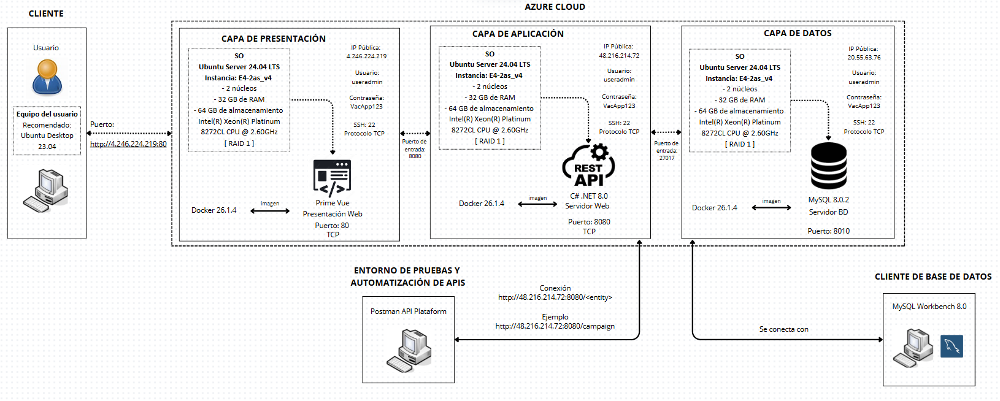

**Mobile App**

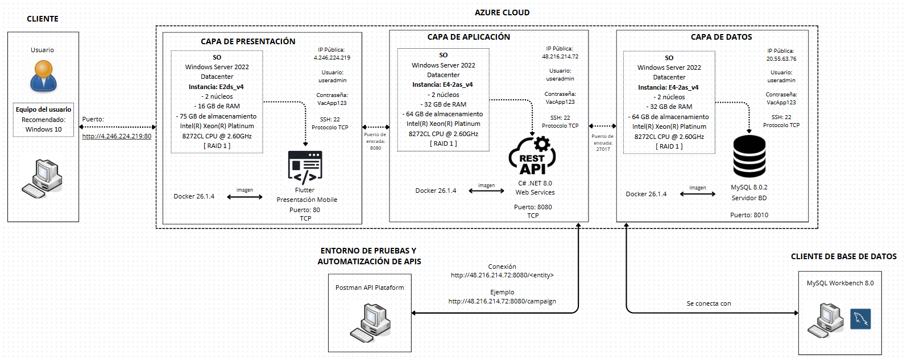
## 4.2. Tactical-Level Domain-Driven Design  

El **Tactical-Level Domain-Driven Design** nos permite profundizar en el diseño detallado de cada bounded context identificado durante el Strategic-Level Design, definiendo la estructura interna de cada contexto delimitado con sus respectivas capas arquitectónicas, entidades de dominio, servicios y patrones de implementación específicos para MaceTy.

Esta fase tactical se enfoca en la implementación concreta de los bounded contexts, aplicando patrones DDD como **Domain Layer** (lógica de negocio pura), **Interface Layer** (controladores y DTOs), **Application Layer** (orquestación de operaciones) e **Infrastructure Layer** (persistencia y servicios externos). Cada contexto mantiene su autonomía e integridad, comunicándose con otros a través de interfaces bien definidas que preservan los límites del dominio.

Para MaceTy, el diseño tactical se centra en cinco bounded contexts principales: **IAM Management** (gestión de identidad y acceso de usuarios urbanos), **Plant Management** (administración del ciclo de vida de plantas), **Sensor Management** (control de dispositivos IoT), **IA Management** (análisis predictivo y recomendaciones inteligentes), y **Notification Management** (sistema de alertas contextuales). Cada contexto se diseña considerando las necesidades específicas de nuestros segmentos objetivo: automatización máxima para usuarios ocupados urbanos y control granular para jardineros tecnológicos.

### 4.2.1. Bounded Context: IAM Management

#### 4.2.1.1. Domain Layer

La **Domain Layer** del bounded context IAM Management contiene las entidades de dominio, value objects, agregados y domain services que modelan la lógica de negocio relacionada con la gestión de identidad, acceso y autenticación de usuarios urbanos de MaceTy.

**Aggregate Roots:**
- **User**: Representa al usuario del sistema con roles diferenciados (Usuario Ocupado Urbano, Jardinero Tecnológico)
- **UserSession**: Gestiona las sesiones activas y tokens de autenticación

**Entities:**
- User (id, email, password, profile, createdAt, lastLogin)
- Profile (firstName, lastName, userType, preferences, location)

**Value Objects:**
- Email (validación de formato)
- Password (encriptación y políticas de seguridad)
- UserRole (URBAN_PROFESSIONAL, GARDEN_ENTHUSIAST, FAMILY_MEMBER)

**Domain Services:**
- AuthenticationService: Lógica de autenticación y validación de credenciales
- PasswordPolicyService: Validación de políticas de contraseñas
- RoleAssignmentService: Asignación de roles según el tipo de usuario

#### 4.2.1.2. Interface Layer

La **Interface Layer** expone las funcionalidades del IAM Management a través de controladores REST y interfaces de usuario.

**Controllers:**
- AuthenticationController: Maneja login, logout y renovación de tokens
- UserRegistrationController: Gestiona el registro de nuevos usuarios
- ProfileController: Administra la información del perfil de usuario

**DTOs:**
- LoginRequest/Response
- RegisterUserRequest/Response  
- UserProfileResponse
- TokenRefreshRequest/Response

#### 4.2.1.3. Application Layer

La **Application Layer** orquesta las operaciones de negocio utilizando command handlers, query handlers y application services.

**Command Handlers:**
- RegisterUserCommandHandler: Procesa el registro de nuevos usuarios
- LoginCommandHandler: Maneja el proceso de autenticación
- UpdateProfileCommandHandler: Actualiza información del perfil

**Query Handlers:**
- GetUserProfileQueryHandler: Obtiene información del perfil de usuario
- ValidateTokenQueryHandler: Valida tokens de acceso

**Application Services:**
- UserApplicationService: Coordina operaciones relacionadas con usuarios
- AuthenticationApplicationService: Gestiona flujos de autenticación

#### 4.2.1.4. Infrastructure Layer

La **Infrastructure Layer** implementa la persistencia de datos, servicios externos y configuraciones técnicas.

**Repositories:**
- UserRepository: Persistencia de datos de usuarios en base de datos
- SessionRepository: Almacenamiento de sesiones activas

**External Services:**
- EmailService: Envío de correos de verificación y recuperación
- TokenService: Generación y validación de JWT tokens
- EncryptionService: Servicios de encriptación y hash
#### 4.2.1.5. Bounded Context Software Architecture Component Level Diagrams

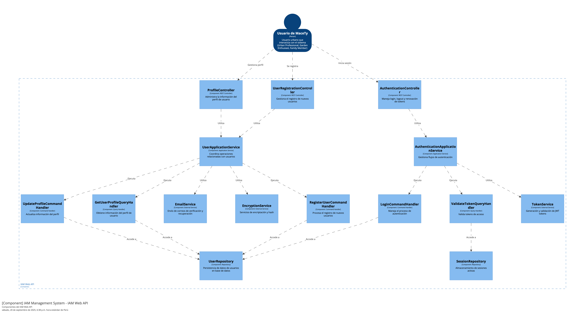

**Índice:**  
 

#### 4.2.1.6. Bounded Context Software Architecture Code Level Diagrams
##### 4.2.1.6.1. Bounded Context Domain Layer Class Diagrams

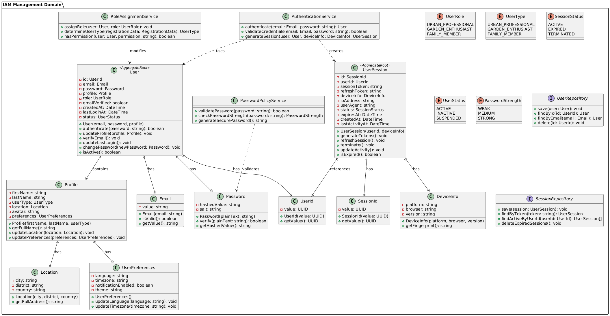


##### 4.2.1.6.2. Bounded Context Database Design Diagram

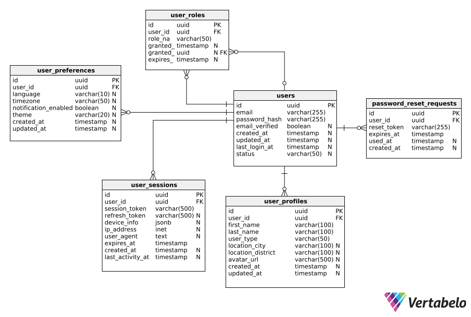


### 4.2.2. Bounded Context: Plant Management

#### 4.2.2.1. Domain Layer

La **Domain Layer** del bounded context Plant Management modela toda la lógica de negocio relacionada con la administración del ciclo de vida de plantas y sus configuraciones específicas.

**Aggregate Roots:**
- **Plant**: Entidad principal que representa una planta con sus características y configuraciones
- **PlantSpecies**: Información específica sobre especies de plantas y sus requerimientos

**Entities:**
- Plant (id, name, species, userId, deviceId, plantingDate, status)
- PlantCareConfiguration (wateringThreshold, lightRequirement, temperatureRange)
- PlantGrowthRecord (date, height, health, notes, photos)

**Value Objects:**
- PlantStatus (HEALTHY, NEEDS_ATTENTION, CRITICAL, DORMANT)
- WateringSchedule (frequency, amount, lastWatering)
- EnvironmentalRequirements (minLight, maxLight, minTemp, maxTemp, humidity)

**Domain Services:**
- PlantCareRecommendationService: Genera recomendaciones de cuidado
- PlantHealthAnalysisService: Analiza el estado de salud de las plantas
- SpeciesMatchingService: Relaciona plantas con especies en la base de datos

#### 4.2.2.2. Interface Layer

La **Interface Layer** expone las funcionalidades de Plant Management a través de endpoints REST y interfaces gráficas.

**Controllers:**
- PlantController: CRUD de plantas y configuraciones
- PlantCareController: Gestiona recomendaciones y cuidados
- PlantHistoryController: Maneja históricos de crecimiento

**DTOs:**
- CreatePlantRequest/Response
- UpdatePlantConfigurationRequest
- PlantStatusResponse
- PlantCareRecommendationResponse

#### 4.2.2.3. Application Layer

La **Application Layer** coordina las operaciones de negocio del dominio de plantas.

**Command Handlers:**
- RegisterPlantCommandHandler: Registra una nueva planta en el sistema
- UpdatePlantCareConfigurationCommandHandler: Actualiza configuraciones de cuidado
- RecordPlantGrowthCommandHandler: Registra datos de crecimiento

**Query Handlers:**
- GetPlantDetailsQueryHandler: Obtiene información detallada de una planta
- GetPlantCareHistoryQueryHandler: Recupera el historial de cuidados
- GetPlantRecommendationsQueryHandler: Genera recomendaciones personalizadas

**Application Services:**
- PlantLifecycleService: Gestiona el ciclo de vida completo de las plantas
- PlantAnalyticsService: Proporciona análisis y métricas de plantas

#### 4.2.2.4. Infrastructure Layer

La **Infrastructure Layer** implementa la persistencia y servicios externos para Plant Management.

**Repositories:**
- PlantRepository: Persistencia de datos de plantas
- PlantSpeciesRepository: Acceso a información de especies
- PlantHistoryRepository: Almacenamiento de registros históricos

**External Services:**
- PlantSpeciesDatabaseService: Integración con base de datos externa de especies
- ImageStorageService: Almacenamiento de fotos de plantas
- WeatherService: Datos climáticos para recomendaciones
#### 4.2.2.5. Bounded Context Software Architecture Component Level Diagrams

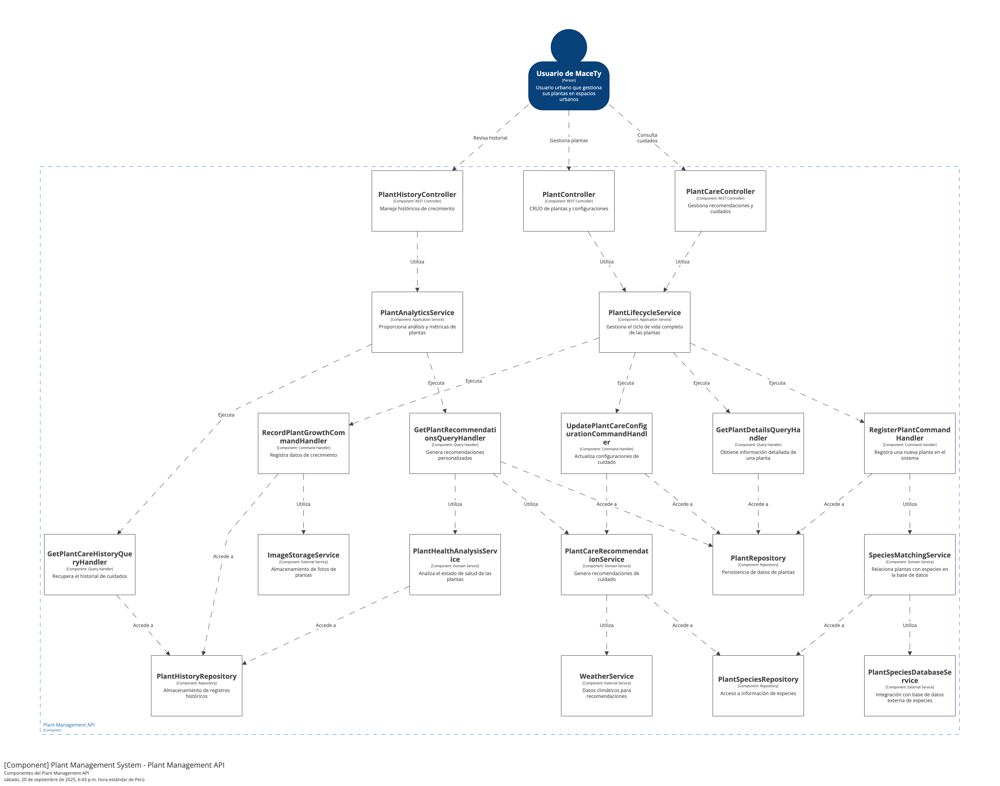
**Índice:**  
 

#### 4.2.2.6. Bounded Context Software Architecture Code Level Diagrams
##### 4.2.2.6.1. Bounded Context Domain Layer Class Diagrams

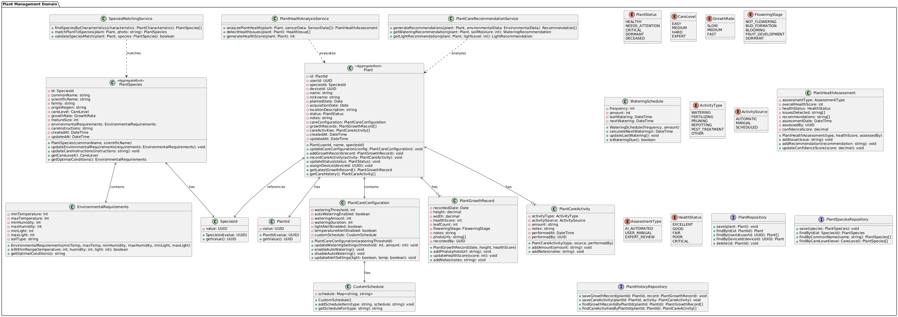


##### 4.2.2.6.2. Bounded Context Database Design Diagram

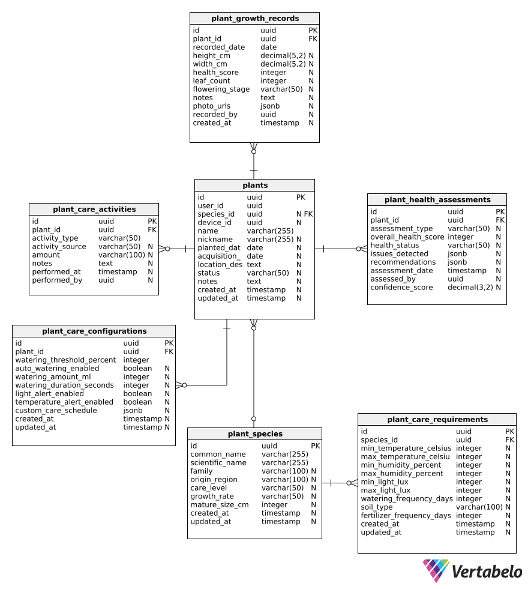


### 4.2.3. Bounded Context: Sensor Management

#### 4.2.3.1. Domain Layer

La **Domain Layer** del bounded context Sensor Management modela la lógica de negocio para el control y monitoreo de dispositivos IoT y telemetría de sensores.

**Aggregate Roots:**
- **Device**: Representa el dispositivo MaceTy IoT con todos sus sensores
- **SensorReading**: Agregado que encapsula las lecturas de todos los sensores

**Entities:**
- Device (id, serialNumber, model, plantId, lastConnection, status)
- Sensor (id, type, deviceId, calibrationData, status)
- SensorData (timestamp, sensorId, value, unit, quality)

**Value Objects:**
- SensorType (HUMIDITY, TEMPERATURE, LIGHT, SOIL_PH)
- DeviceStatus (ONLINE, OFFLINE, MAINTENANCE, ERROR)
- SensorReading (value, timestamp, accuracy, unit)

**Domain Services:**
- SensorCalibrationService: Calibración automática y manual de sensores
- DataValidationService: Validación de lecturas de sensores
- DeviceHealthMonitoringService: Monitoreo del estado de dispositivos

#### 4.2.3.2. Interface Layer

La **Interface Layer** gestiona la comunicación con dispositivos IoT y la exposición de datos de sensores.

**Controllers:**
- DeviceController: Gestión de dispositivos MaceTy
- SensorDataController: Recepción y consulta de datos de sensores
- DeviceConfigurationController: Configuración remota de dispositivos

**DTOs:**
- DeviceRegistrationRequest/Response
- SensorDataBatch
- DeviceStatusResponse
- SensorCalibrationRequest

#### 4.2.3.3. Application Layer

La **Application Layer** orquesta las operaciones relacionadas con dispositivos y sensores.

**Command Handlers:**
- RegisterDeviceCommandHandler: Registro de nuevos dispositivos
- ProcessSensorDataCommandHandler: Procesamiento de datos de sensores
- CalibrateDeviceCommandHandler: Calibración de sensores

**Query Handlers:**
- GetDeviceStatusQueryHandler: Estado actual de dispositivos
- GetSensorHistoryQueryHandler: Historial de lecturas
- GetDeviceConfigurationQueryHandler: Configuración de dispositivos

**Application Services:**
- DeviceManagementService: Gestión completa de dispositivos
- SensorDataProcessingService: Procesamiento y análisis de datos

#### 4.2.3.4. Infrastructure Layer

La **Infrastructure Layer** implementa la comunicación IoT y persistencia de datos de sensores.

**Repositories:**
- DeviceRepository: Persistencia de dispositivos
- SensorDataRepository: Almacenamiento masivo de datos de sensores
- DeviceConfigurationRepository: Configuraciones de dispositivos

**External Services:**
- MQTTService: Comunicación MQTT con dispositivos IoT
- TimeSeriesDatabase: Almacenamiento optimizado para series de tiempo
- DeviceFirmwareService: Actualizaciones de firmware OTA
#### 4.2.3.5. Bounded Context Software Architecture Component Level Diagrams

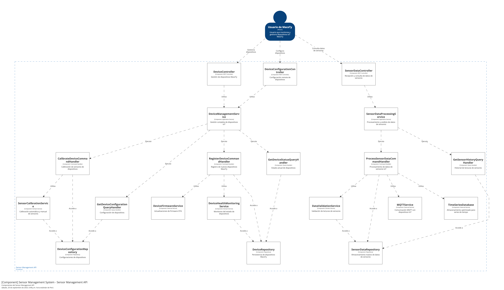
**Índice:**  
 

#### 4.2.3.6. Bounded Context Software Architecture Code Level Diagrams
##### 4.2.3.6.1. Bounded Context Domain Layer Class Diagrams

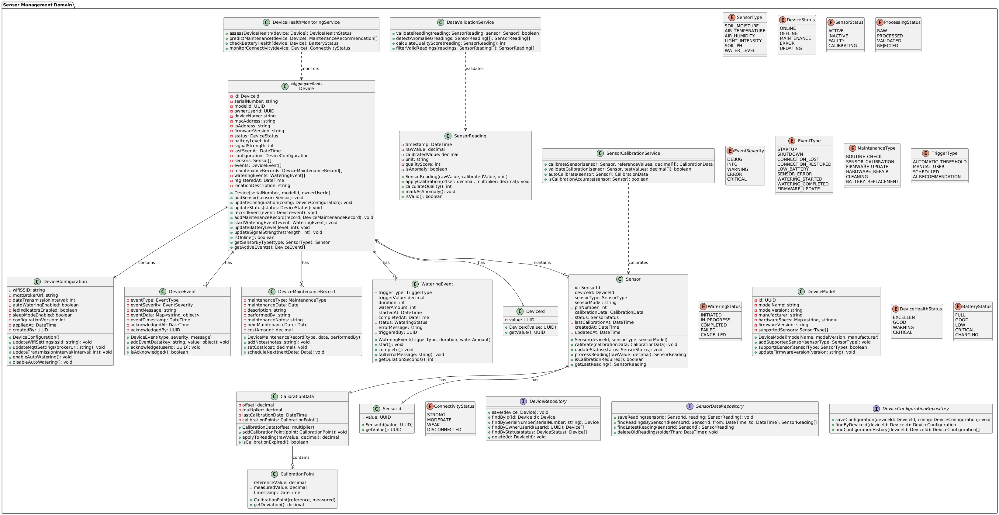


##### 4.2.3.6.2. Bounded Context Database Design Diagram
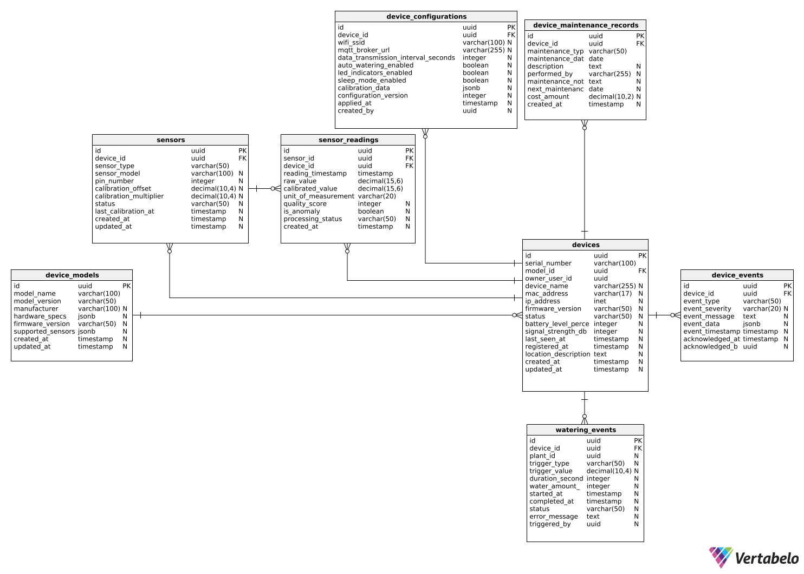

### 4.2.4. Bounded Context: IA Management

#### 4.2.4.1. Domain Layer

La **Domain Layer** del bounded context IA Management contiene la lógica de negocio para inteligencia artificial aplicada al análisis predictivo y recomendaciones de cuidado de plantas.

**Aggregate Roots:**
- **MLModel**: Representa modelos de machine learning entrenados
- **Prediction**: Predicciones y análisis generados por IA

**Entities:**
- MLModel (id, name, version, accuracy, trainingData, deployedAt)
- PredictionResult (timestamp, modelId, plantId, prediction, confidence)
- TrainingDataset (id, source, features, labels, quality)

**Value Objects:**
- ModelType (WATERING_PREDICTION, GROWTH_ANALYSIS, HEALTH_ASSESSMENT, PEST_DETECTION)
- PredictionConfidence (percentage, reliability)
- ModelAccuracy (precision, recall, f1Score)

**Domain Services:**
- PlantHealthPredictionService: Predicción del estado de salud de plantas
- WateringOptimizationService: Optimización de horarios de riego
- GrowthAnalysisService: Análisis de patrones de crecimiento

#### 4.2.4.2. Interface Layer

La **Interface Layer** expone los servicios de IA a través de APIs REST y interfaces de consulta.

**Controllers:**
- PredictionController: Generación y consulta de predicciones
- MLModelController: Gestión de modelos de machine learning
- AnalyticsController: Análisis avanzados y insights

**DTOs:**
- PredictionRequest/Response
- ModelTrainingRequest
- PlantAnalysisResponse
- RecommendationResponse

#### 4.2.4.3. Application Layer

La **Application Layer** coordina las operaciones de inteligencia artificial y análisis de datos.

**Command Handlers:**
- GeneratePredictionCommandHandler: Genera predicciones basadas en datos actuales
- TrainModelCommandHandler: Entrena y actualiza modelos de ML
- UpdateRecommendationsCommandHandler: Actualiza recomendaciones de cuidado

**Query Handlers:**
- GetPlantInsightsQueryHandler: Obtiene insights detallados de plantas
- GetPredictionHistoryQueryHandler: Historial de predicciones
- GetModelPerformanceQueryHandler: Métricas de rendimiento de modelos

**Application Services:**
- AIRecommendationService: Genera recomendaciones inteligentes
- ModelManagementService: Gestión de ciclo de vida de modelos ML

#### 4.2.4.4. Infrastructure Layer

La **Infrastructure Layer** implementa la infraestructura de ML y servicios de computación.

**Repositories:**
- MLModelRepository: Persistencia de modelos entrenados
- PredictionRepository: Almacenamiento de predicciones
- TrainingDataRepository: Gestión de datasets de entrenamiento

**External Services:**
- MLPlatformService: Integración con plataformas de ML (TensorFlow, PyTorch)
- DataProcessingService: Procesamiento y limpieza de datos
- ModelDeploymentService: Despliegue automatizado de modelos
#### 4.2.4.5. Bounded Context Software Architecture Component Level Diagrams

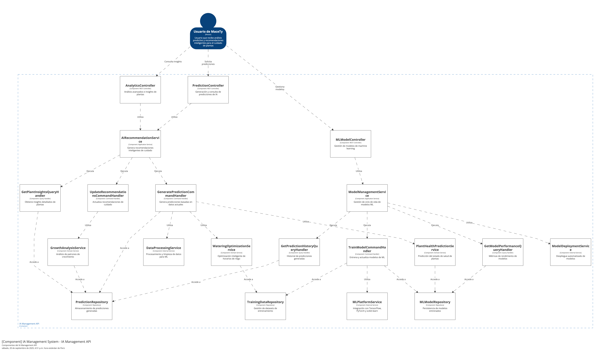
**Índice:**  
 

#### 4.2.4.6. Bounded Context Software Architecture Code Level Diagrams

##### 4.2.4.6.1. Bounded Context Domain Layer Class Diagrams

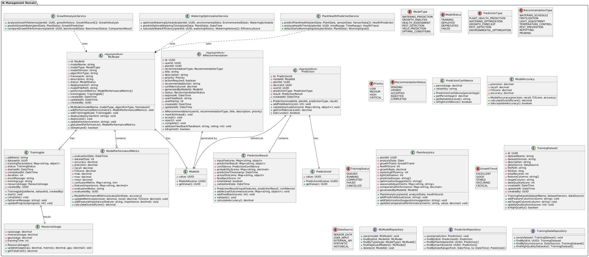


##### 4.2.4.6.2. Bounded Context Database Design Diagram
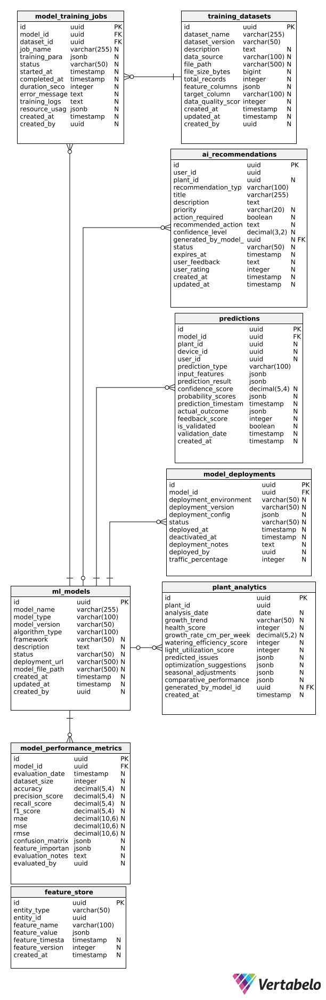


### 4.2.5. Bounded Context: Notification Management

#### 4.2.5.1. Domain Layer

La **Domain Layer** del bounded context Notification Management modela la lógica de negocio para el sistema de alertas contextuales y comunicaciones push optimizado para usuarios urbanos.

**Aggregate Roots:**
- **Notification**: Representa una notificación con su contenido y configuración de entrega
- **NotificationChannel**: Canales de comunicación disponibles (push, email, SMS)

**Entities:**
- Notification (id, userId, plantId, type, message, priority, timestamp, status)
- NotificationPreference (userId, channelType, enabled, schedule, filters)
- NotificationTemplate (id, type, subject, body, variables)

**Value Objects:**
- NotificationType (WATERING_ALERT, TEMPERATURE_WARNING, MAINTENANCE_REMINDER, GROWTH_UPDATE)
- Priority (LOW, MEDIUM, HIGH, CRITICAL)
- DeliveryStatus (PENDING, SENT, DELIVERED, FAILED, READ)

**Domain Services:**
- NotificationPriorizationService: Prioriza notificaciones según urgencia y preferencias
- UrbanSchedulingService: Optimiza horarios de envío para usuarios urbanos ocupados
- MessagePersonalizationService: Personaliza contenido según perfil de usuario

#### 4.2.5.2. Interface Layer

La **Interface Layer** gestiona la recepción de eventos y entrega de notificaciones.

**Controllers:**
- NotificationController: Envío y gestión de notificaciones
- NotificationPreferenceController: Configuración de preferencias de usuario
- NotificationHistoryController: Historial y estadísticas de notificaciones

**DTOs:**
- SendNotificationRequest/Response
- NotificationPreferenceRequest/Response
- NotificationHistoryResponse
- BulkNotificationRequest

#### 4.2.5.3. Application Layer

La **Application Layer** orquesta el procesamiento y entrega de notificaciones.

**Command Handlers:**
- SendNotificationCommandHandler: Procesa y envía notificaciones
- UpdateNotificationPreferencesCommandHandler: Actualiza preferencias de usuario
- MarkNotificationAsReadCommandHandler: Marca notificaciones como leídas

**Query Handlers:**
- GetNotificationHistoryQueryHandler: Obtiene historial de notificaciones
- GetNotificationPreferencesQueryHandler: Recupera configuraciones de usuario
- GetNotificationStatisticsQueryHandler: Estadísticas de entrega y lectura

**Application Services:**
- NotificationDispatcherService: Coordinador de envío de notificaciones
- NotificationAnalyticsService: Análisis de efectividad de notificaciones

#### 4.2.5.4. Infrastructure Layer

La **Infrastructure Layer** implementa los canales de entrega y persistencia de notificaciones.

**Repositories:**
- NotificationRepository: Persistencia de notificaciones
- NotificationPreferenceRepository: Almacenamiento de preferencias
- NotificationTemplateRepository: Gestión de plantillas

**External Services:**
- PushNotificationService: Envío de notificaciones push (Firebase, APNs)
- EmailService: Envío de correos electrónicos
- SMSService: Envío de mensajes SMS
- AnalyticsService: Seguimiento de métricas de entrega
#### 4.2.5.5. Bounded Context Software Architecture Component Level Diagrams

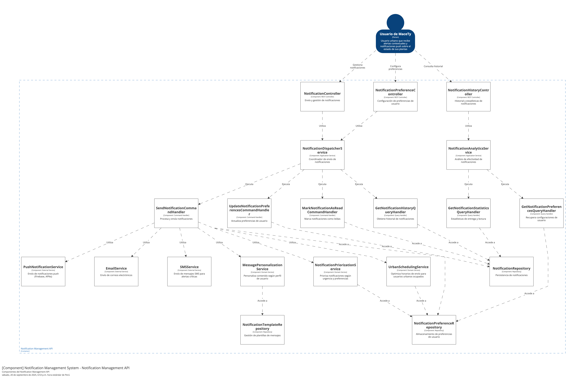
**Índice:**  


#### 4.2.5.6. Bounded Context Software Architecture Code Level Diagrams

##### 4.2.5.6.1. Bounded Context Domain Layer Class Diagrams

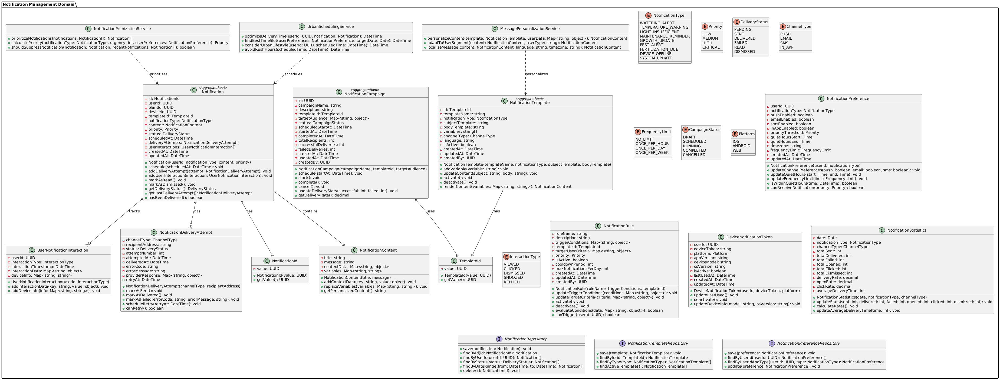


##### 4.2.5.6.2. Bounded Context Database Design Diagram

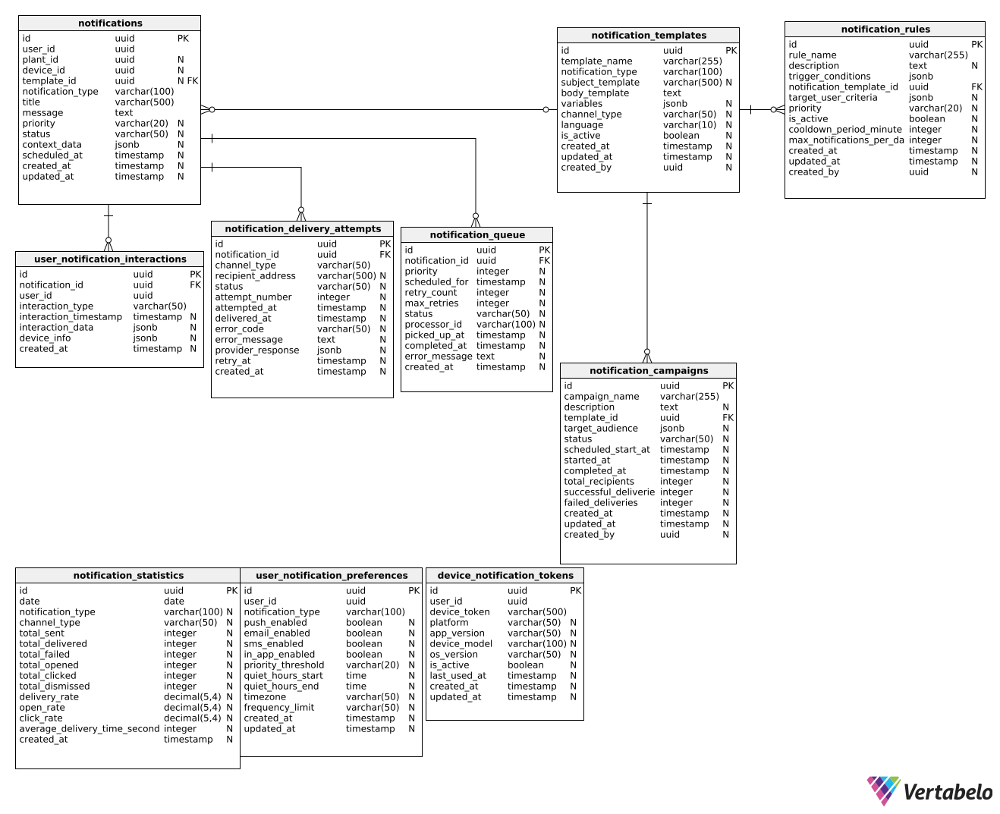


# Capítulo V: Solution UI/UX Design  

En este capítulo se desarrolla la propuesta de **UI/UX Design** para Naturafy – Powered by MaceTy, abarcando los lineamientos de estilo, la arquitectura de información y el diseño de la landing page. El objetivo es garantizar una experiencia de usuario consistente, clara y centrada en el valor agregado del producto: una maceta inteligente con identidad eco-tecnológica y amigable.  

## 5.1. Style Guidelines  

Esta sección sienta las bases visuales y de interacción que guiarán el desarrollo de todas las interfaces (web, móvil e IoT). Se definen **colores, tipografía, branding, tono comunicacional y patrones visuales**, garantizando consistencia en todo el ecosistema digital de Naturafy.  

### 5.1.1. General Style Guidelines  

**Branding y Comunicación:**  
Naturafy transmite una identidad **eco-tecnológica, fresca y confiable**. El tono será **formal pero amigable**, con un lenguaje claro, respetuoso y cercano al usuario. La mascota **Macety** refuerza la cercanía y la simplicidad de la experiencia.  

**Colores principales:**  

<table>
  <tr>
    <td align="center" style="padding:12px;">
      <div style="width:140px;height:70px;background:#4CAF50;border-radius:8px;border:1px solid #ddd;"></div>
      <br><b>Verde Naturafy</b><br><code>#4CAF50</code><br><small>Crecimiento / Sostenibilidad</small>
    </td>
    <td align="center" style="padding:12px;">
      <div style="width:140px;height:70px;background:#2E7D32;border-radius:8px;border:1px solid #ddd;"></div>
      <br><b>Verde Oscuro</b><br><code>#2E7D32</code><br><small>Confianza / Tecnología</small>
    </td>
    <td align="center" style="padding:12px;">
      <div style="width:140px;height:70px;background:#F5F5F5;border-radius:8px;border:1px solid #ccc;"></div>
      <br><b>Blanco</b><br><code>#F5F5F5</code><br><small>Limpieza / Minimalismo</small>
    </td>
    <td align="center" style="padding:12px;">
      <div style="width:140px;height:70px;background:#8D6E63;border-radius:8px;border:1px solid #ddd;"></div>
      <br><b>Tierra Suave</b><br><code>#8D6E63</code><br><small>Natural / Orgánico</small>
    </td>
  </tr>
</table>

**Uso sugerido**
- Primario (acciones y acentos): #4CAF50  
- Secundario / Hover / Énfasis estructural: #2E7D32  
- Fondo principal: #F5F5F5  
- Fondos neutros, bloques y contraste cálido: #8D6E63  

**Tipografía:**  
- Fuente principal: *Sans-serif moderna (ejemplo: Poppins o Inter)*.  
- Jerarquía:  
  - Títulos grandes → Bold, contraste fuerte en verde oscuro.  
  - Subtítulos → Semibold en verde claro.  
  - Cuerpo → Regular, gris oscuro para legibilidad.  

**Espaciado y Layout:**  
- Uso de espacios amplios y aireados.  
- Grid en 12 columnas para web.  
- Márgenes consistentes en todas las vistas (16–24px en mobile, 32–64px en desktop).  

**Branding y Comunicación:**  
Naturafy proyecta una identidad **eco‑tecnológica, cercana y confiable**. El tono comunicacional es **claro, directo y amable**, evitando tecnicismos innecesarios y transmitiendo apoyo constante al usuario. El uso de un avatar (Macety) humaniza la interacción y refuerza la promesa de simplicidad y acompañamiento continuo.  

**Mascota / Asistente (“Macety”)**  
Macety es la personificación del producto y actúa como **guía visual y asistente contextual** dentro del ecosistema (app, web y material educativo).  
Principios de diseño y uso:  
- Rol principal: educar, orientar y dar retroalimentación rápida sin saturar.  
- Aparición: onboarding, estados clave (riego necesario, valores fuera de rango, logro alcanzado) y micro‑tips.  
- Estilos visuales: formas redondeadas, proporciones amigables, expresiones simples (neutral / feliz / alerta / crítico), paleta basada en Verde Naturafy (#4CAF50) + acentos Tierra Suave (#8D6E63) y fondos neutros claros.  
- Comunicación: mensajes cortos (≤ 90 caracteres), tono motivador (“Tu planta está bien”, “Necesita un poco de agua”, “Excelente: humedad óptima”).  
- Estados sugeridos:  
  - Normal: postura neutra / sonrisa ligera.  
  - Necesita riego: gesto de atención + icono de gota.  
  - Alerta ambiental: cejas elevadas + icono (sol / termómetro).  
  - Logro / progreso: expresión alegre + pequeña insignia.  
- Objetivo UX: reducir fricción cognitiva, aumentar confianza y fomentar continuidad de uso (retención y reducción de abandono inicial).  
- Accesibilidad: contraste suficiente en fondos claros; evitar depender solo del color (usar íconos).  


### 5.1.2. Web, Mobile and IoT Style Guidelines  

**Web:**  
- Interfaces limpias, con secciones bien delimitadas en fondos blancos o suaves.  
- Botones verdes primarios con bordes redondeados.  
- Animaciones sutiles (fade-in, hover con sombras).  

**Mobile:**  
- Diseño **responsive first**.  
- Navegación con barra inferior fija en la app.  
- Uso de **Macety como asistente virtual dentro de la app**, con burbujas de ayuda para notificaciones de humedad, riego o estado de la planta.  

**IoT (Pantalla de la Maceta Inteligente):**  
- Interfaz minimalista en display integrado (si aplica).  
- Iconografía universal: gota  (riego), sol  (luz), hoja  (crecimiento).  
- Colores simplificados: verde para “ok”, amarillo para “alerta”, rojo para “crítico”.  


## 5.2. Information Architecture  

La arquitectura de información asegura que los usuarios encuentren fácilmente lo que buscan, navegando sin fricciones por la landing page, la app móvil y la interfaz IoT.  

### 5.2.1. Organization Systems  

- **Jerárquico:**  
  - Secciones principales (Inicio, Beneficios, Cómo funciona, App & Web, Impacto Verde, Testimonios, Contacto).  
- **Secuencial:**  
  - Paso a paso del proceso de conexión y uso de la maceta inteligente.  
- **Categorización:**  
  - Por tópicos (Beneficios, Impacto Verde).  
  - Por audiencia (usuarios domésticos, jardineros tecnológicos, familias).  

### 5.2.2. Labeling Systems  

- Uso de etiquetas simples y claras en los menús: “Inicio”, “Beneficios”, “Cómo Funciona”, “Contacto”.  
- En la app, etiquetas directas: *“Estado actual”*, *“Historial de riego”*, *“Notificaciones”*.  
- Evitar términos técnicos complejos, usando un lenguaje amigable y cercano.  

### 5.2.3. SEO Tags and Meta Tags  

- **Landing Page Title:** *Naturafy – Maceta Inteligente con Asistente Virtual Macety*.  
- **Meta Description:** *Naturafy conecta tecnología e innovación para el cuidado de tus plantas. Riego automático, energía solar y un asistente virtual amigable: Macety.*  
- **Keywords:** Naturafy, Maceta Inteligente, IoT Plant Care, Riego Automático, Macety.  
- **Meta Author:** Naturafy Team.  
- **App Store Optimization (ASO):**  
  - App Title: *Naturafy: Plant Care IoT*.  
  - App Subtitle: *Cuidado de plantas con riego inteligente*.  
  - App Description: *Gestiona la salud de tus plantas con Naturafy y Macety: monitoreo, alertas y riego automático en tu móvil.*  

### 5.2.4. Searching Systems  

- **Web:**  
  - Barra de búsqueda en la sección *Recursos/FAQ*.  
  - Filtros por tema (riego, energía solar, soporte técnico).  
- **App Móvil:**  
  - Búsqueda por nombre de planta o estado de la maceta.  
  - Filtros: *Plantas con falta de agua*, *Plantas saludables*, *Alertas recientes*.  

### 5.2.5. Navigation Systems  

- **Web:**  
  - Menú superior fijo (navbar) con secciones clave.  
  - Scroll suave entre secciones.  
- **App:**  
  - Barra inferior con pestañas: Inicio | Mis Plantas | Historial | Perfil.  
  - Atajos directos desde notificaciones push.  
- **IoT:**  
  - Botones físicos simples en la maceta (riego manual, reset).  
  - Indicadores luminosos en el borde superior.  


## 5.3. Landing Page UI Design  

La landing page de Naturafy será la puerta de entrada al ecosistema digital. Debe transmitir confianza, innovación y el propósito eco-friendly de la marca.  

### 5.3.1. Landing Page Wireframe  

Flujo general (scroll natural o anclas del menú): Hero → Funcionalidades → Comunidad → Recursos (App Web / App Móvil) → Contacto / Conversión (Compra – Iniciar Sesión).

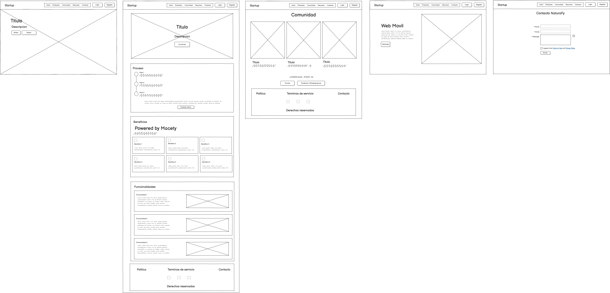  
*Estructura completa: valida jerarquía, ritmo visual y orden de conversión. Sirve como mapa de flujo antes del detalle.*

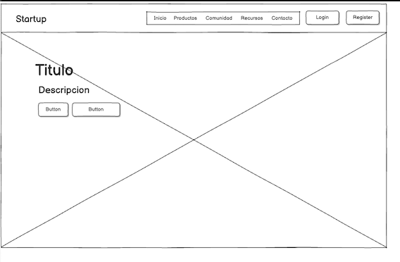  
*Hero inicial: presenta la propuesta de valor (maceta inteligente + asistente Macety). CTA primario: Comprar / Pre‑orden. CTA secundario: Ver funcionalidades (scroll).*

  
*Bloque de funcionalidad: sensores, riego automático, monitoreo en app, sostenibilidad. Refuerza valor antes de pedir acción de compra.*

  
*Validación social: testimonios, métricas y presencia de Macety para generar confianza y reducir fricción.*

  
*Recursos y plataforma: muestra que Macety vive también en Web App y App Móvil. Educa y extiende percepción de valor continuo.*

  
*Contacto + última oportunidad de acción: formulario (soporte / interés), CTA Comprar y enlace Iniciar Sesión (dirige a versión web). Cierra el funnel.*

**Enlace Wireframes (Balsamiq):** https://balsamiq.cloud/s3loccn/pwlu008  

### 5.3.2. Landing Page Mock-up  

Mock-ups de alta fidelidad siguiendo el mismo flujo: Hero → Funcionalidades → Comunidad → Recursos → Contacto.

  
*Vista ensamblada: confirma coherencia visual, espaciado, contraste y consistencia de la paleta.*

  
*Hero final: mensaje claro + Macety presente como refuerzo de identidad. Doble CTA (Comprar ahora / Ver funcionalidades).*

  
*Detalle visual de beneficios clave con iconografía y microcopys orientados a valor inmediato.*

  
*Testimonios, métricas y avatar → social proof para convertir usuarios indecisos.*

  
*Demuestra continuidad: acceso vía Web y Mobile. CTA secundario: Iniciar Sesión / Explorar App.*

  
*Formulario limpio + CTA final (Comprar) + acceso directo a Login para usuarios existentes.*

*Comparativa con wireframe inicial: evidencia evolución de baja a alta fidelidad.*

**Enlace Mockups (Figma):** https://www.figma.com/design/M7mqqSWc46nRv7qbZzVoYx/NaturaFy?node-id=0-1&t=D7usla6cNWPquEgW-1  

**Resumen de Conversión:**
- CTAs principales: Comprar (Hero, Funcionalidades, Contacto).
- CTAs de exploración: Ver funcionalidades, Iniciar sesión.
- Refuerzos de confianza: Comunidad + Recursos + Avatar Macety.

### 5.4. Applications UX/UI Design  
#### 5.4.1. Applications Wireframes  


#### 5.4.2. Applications Wireflow Diagrams  


#### 5.4.3. Applications Mock-ups  

Mock-ups de alta fidelidad:

  
*Vista ensamblada: confirma coherencia visual, espaciado, contraste y consistencia de la paleta.*

  
*Pagina de mis plantas: Información clara y descripción de cada planta añadida + historial de riego *

  
*Detalle visual de los pasos para añadir una planta*

  
*Detalle de la planta, datos a tiempo real, resumen y consejo*

  
*Tienda MaceTy, lista de macetas, accesorios, servicio, etc*

  
*Red social donde interactua cada usuario entre si dando consejos o preguntas*

  
*Perfil de usuario donde podra editar o ajustar su perfil a su preferencia*

  
*Formulario para el logueo de cada usuario*

  
*Formulario para registrarse en la apliocación*

**Enlace Mockups (Figma):** https://www.figma.com/design/kjhLgtfA7pXzI9p6LPzLhP/MaceTy?node-id=8-1137&t=uydPwnc1KxRqxDnH-1
#### 5.4.4. Applications User Flow Diagrams 


### 5.5. Applications Prototyping  

En esta sección se presenta el **prototipo interactivo** desarrollado en **Figma**, correspondiente a las principales funcionalidades y diseño de la **Landing Page de MaceTy**.  
El prototipo tiene como propósito validar la experiencia de usuario y el flujo de interacción antes de la implementación final, asegurando coherencia visual, accesibilidad y alineación con los objetivos definidos en los apartados de **Style Guidelines**, **Information Architecture** y **Applications UX/UI Design**.

El prototipo muestra las secciones principales de la landing, incluyendo:
- **Encabezado interactivo** con navegación simplificada.  
- **Sección de presentación** del producto MaceTy y su propuesta de valor.  
- **Área de funcionalidades** con animaciones suaves y distribución intuitiva.  
- **Formulario de contacto**, diseñado con un enfoque minimalista y adaptable a dispositivos móviles.  
- **Footer informativo** con enlaces a redes, políticas y datos de contacto.  

El prototipo fue elaborado en **Figma**, permitiendo la visualización dinámica del flujo de navegación y la experiencia de usuario en distintos dispositivos.

**Prototipo en Figma (modo código):**
```
https://upcedupe-my.sharepoint.com/:v:/g/personal/u202111952_upc_edu_pe/EZx-ceZHStFPqgkagaiSvGcBpIWm-dPkjkSKroYvhyGnGA?e=dXThQN
```

# Capítulo VI: Product Implementation, Validation & Deployment

## 6.1. Software Configuration Management

### 6.1.1. Software Development Environment Configuration

* **Visual Studio Code:** Desarrollo para aplicaciones mobiles.\

* **GitHub:** Repositorio colaborativo en la nube.\

* **Netifly:** Plataforma que facilita implementar despliegues sencillos para nuestras páginas web.\

* **Vertabelo:** Plataforma colaborativa para la creación de diagramas de base de datos.\

* **Figma:** Herramienta colaborativa que permite elaborar wireframes y mockups.\

* **Azure:** Herramienta para subir nuestros servicios web en la nube.\
[](https://postimg.cc/k2qXBxL0)
* **Visual Studio Code:** Desarrollo para Frontend.\


### 6.1.2. Source Code Management
**Repositorio de la Landing Page:** 
**Implementación de GitFlow:**
Para nuestra estrategia de gestión de versiones con Git, nos hemos inspirado en el artículo "A successful Git branching model" de Vincent Driessen, adoptando el modelo de ramificación GitFlow. Este enfoque nos permite establecer claramente las convenciones de ramificación que aplicamos en nuestro proyecto.

* **Rama Principal (Main branch):** Contiene el código en producción y se conoce como la Master branch o Main branch.
    * Notación: main
* **Rama de Desarrollo (Develop branch):** Acumula las últimas actualizaciones y cambios para la próxima versión. Funciona como un entorno de integración y prueba continua.
    * Notación: develop
* **Rama de Lanzamiento (Release branch):** Facilita la preparación de una nueva versión del producto, permitiendo correcciones de errores y recibiendo más actualizaciones de Develop.
    * Debe derivarse de: develop
    * Debe fusionarse con: develop y master/main
    * Notación: release
* **Rama de Características (Feature branch):** Se utiliza para desarrollar nuevas funcionalidades para la siguiente versión o futuras iteraciones.
    * Debe derivarse de: develop
    * Debe fusionarse de vuelta a: develop
    * Notación: feature
* **Rama de Corrección Rápida (Hotfix branch):** Aborda errores críticos en producción, permitiendo la implementación rápida de soluciones.
    * Debe derivarse de: master/main
    * Debe fusionarse con: develop y master/main
    * Notación: hotfix

**Conventional Commits:** 
Adoptamos esta metodología para estructurar los mensajes de confirmación de cambios de manera estándar y semántica, lo que facilita la comunicación y la automatización de registros de cambios.
**Tipos de Commits Convencionales:**
* feat: Nuevas características o funcionalidades.
* fix: Correcciones de errores.
* docs: Cambios o mejoras en la documentación.
* style: Cambios de formato que no afectan la funcionalidad.
* refactor: Mejoras en la estructura o legibilidad del código.
* test: Adición o modificación de pruebas.
* chore: Cambios en el proceso de construcción o tareas de mantenimiento.
* perf: Mejoras de rendimiento en el código.

### 6.1.3. Source Code Style Guide & Conventions

---

### Landing Page – React con Tailwind CSS

| Regla                                   | Ejemplo / Explicación                                                   |
|----------------------------------------|--------------------------------------------------------------------------|
| Componentes en `PascalCase`            | `function HeroSection() {}`                                            |
| Archivos nombrados igual que el componente | `HeroSection.jsx`                                                      |
| Uso de `className` con utilidades Tailwind | `<div className="flex justify-center items-center p-4 bg-gray-100">`   |
| Uso de fragmentos `<>...</>`           | Para evitar `div` innecesarios                                          |
| Props en `camelCase`                   | `<HeroSection title="Bienvenido" description="Explora más" />`         |
| Indentación consistente (2 espacios)   | Mantener la misma estructura en todo el proyecto                        |
| Comentarios en JSX                     | `{/* Comentario de ejemplo */}`                                        |
| Uso de `const` y `arrow functions`     | `const handleClick = () => { ... }`                                    |

---

### Frontend – Vue.js

| Regla                                   | Ejemplo / Explicación                                                   |
|----------------------------------------|--------------------------------------------------------------------------|
| Componentes en `PascalCase`            | `<UserProfileCard />`, `UserProfileCard.vue`                            |
| Nombres de variables y métodos en `camelCase` | `data() { return { userName: "Juan" }; }`, `methods: { getUserData() {} }` |
| Archivos nombrados igual que el componente | `UserProfileCard.vue`                                                   |
| Uso de `v-bind` y `v-on` abreviados     | `:prop="value"` y `@click="handleClick"`                                |
| Separar el código en secciones `<template>`, `<script>`, `<style>` | Buenas prácticas de organización                                        |
| Indentación consistente (2 espacios)    | Mantener uniformidad                                                   |
| Uso de `const` y `let`                  | Evitar `var`                                                           |
| Comentarios claros                      | `<!-- Sección del encabezado -->`                                      |

---

### CSS – Tailwind CSS

| Regla                                   | Ejemplo / Explicación                                                   |
|----------------------------------------|--------------------------------------------------------------------------|
| Clases utilitarias en minúsculas       | `bg-brown-700 text-gray-100 rounded-xl p-4`                            |
| Orden lógico de clases                 | De layout → color → texto → borde → espaciado                           |
| Evitar estilos en línea (inline CSS)   | Usar clases Tailwind o archivos `.css` para excepciones                 |
| Uso de variables personalizadas en `tailwind.config.js` | Definir colores del proyecto como `--brown`, `--beige`, etc.           |
| Comentarios descriptivos               | `/* Estilos personalizados para el header */`                          |

---

### Backend – Java

| Regla                                       | Ejemplo / Explicación                                                   |
|--------------------------------------------|--------------------------------------------------------------------------|
| Clases en `PascalCase`                     | `public class UserController {}`                                        |
| Métodos y variables en `camelCase`         | `private String userName;`, `public void getUserData() {}`              |
| Constantes en `UPPER_SNAKE_CASE`           | `private static final int MAX_USERS = 100;`                             |
| Paquetes en minúsculas                     | `com.booksphere.api.controllers`                                       |
| Indentación con 4 espacios                 | No usar tabs                                                           |
| Uso de comentarios Javadoc                 | `/** Método que obtiene los datos del usuario */`                       |
| Código limpio y modular                    | Separar controladores, servicios, repositorios y modelos                |

---

### Mobile – Flutter

| Regla                                         | Ejemplo / Explicación                                                   |
|----------------------------------------------|--------------------------------------------------------------------------|
| Nombres de clases en `PascalCase`            | `class UserProfileScreen extends StatelessWidget {}`                    |
| Variables y funciones en `camelCase`         | `final userName = "Juan";`, `void getUserData() {}`                     |
| Constantes en `UPPER_SNAKE_CASE`             | `const MAX_USERS = 100;`                                                |
| Widgets anidados con identación clara        | Mantener legibilidad al usar múltiples widgets                          |
| Uso de `const` para widgets inmutables       | `const Text("Hola Mundo")`                                              |
| Archivos nombrados en `snake_case`           | `user_profile_screen.dart`                                              |
| Comentarios con `//` o `///`                 | `// Widget que muestra la información del usuario`                      |

---

**Tecnologías utilizadas:**  
El proyecto utiliza **React + Tailwind CSS** para la **landing page**, **Vue.js** para el **frontend principal**, **Java** para el **backend**, y **Flutter** para el **desarrollo móvil**.
 
#### 6.1.4. Software Deployment Configuration  

**Deployment Landing Page:** 
En esta sección, detallamos el proceso de implementación de nuestra landing page en la plataforma de GitHub.

1. Se crea un repositorio en GitHub para alojar el código de nuestra landing page.


2. Agregamos a los participantes:


3. Habilitamos Netlifly para poder importar nuestro proyecto y deployamos:


4. Finalmente, se confirma el despliegue de nuestra página web después de completar todo el procedimiento.


Este proceso garantiza el despliegue satisfactorio de nuestra landing page en la plataforma de Netlifly, siguiendo las especificaciones y requisitos de nuestro proyecto.
**Enlace de la Landing Page: https://naturafy.netlify.app/**
<br>
**About the product: https://upcedupe-my.sharepoint.com/:v:/g/personal/u202111952_upc_edu_pe/EZx-ceZHStFPqgkagaiSvGcBpIWm-dPkjkSKroYvhyGnGA?e=dXThQN**
<br>

### 6.2. Landing Page, Services & Applications Implementation  

### 6.2.1. Sprint 1  
El primer sprint es una etapa importante en nuestro marco de gestión de proyectos de metodología ágil Scrum. En este periodo, agendamos reuniones con el objetivo de conocer mejor las características de cada integrante, y delegamos tareas para materializar el diseño y funcionalidades ya establecidas, para transformarlos en un landing page funcional y que cumple las heurísticas.
#### 6.2.1.1. Sprint Planning 1  
El sprint planning es una reunion antes de cada sprint en la metodologia Scrum donde el equipo elige las user stories que va a transformar en un producto tangible. Tambien define que como se van a separar los trabajos y quien sera responsable. Nuestro objetivo sera construir un plan resolubre en un tiempo determinado que sera lo que dure el sprint, para crearlo fomentaremos la colaboracion para que todos sepan y entiendas los objetivos y prioridades.

| Sprint #| Sprint 1|
| -- | -- |
| **Sprint Planning Background**||
| **Date**| 01/10/2025|
| **Time**| 12:00 AM|
| **Location**| Discord (Reunión virtual)|
| **Prepared By**| Jaque Peña, Estefano Oscar|
| **Attendees (to planning meeting)** | Maycol Jhordan Rojas Velasquez, Sergio Andre Gomez Vallejos, Estefano Oscar Jaque Pena, Carlos Andres Rojas Ccama, Samuel Ignacio Valera Garcés|
| **Sprint Goal & User Stories**||
| **Sprint 1 Goal**| Nuestro enfoque está en finalizar el informe , desplegar nuestra Landing Page desde el repositorio de GitHub y avanzar bounded context del aplicativo (Tanto IAM como applications). Creemos que esto entrega una experiencia de usuario optimizada a nuestros clientes. Esto se confirmará cuando todas las tareas se muevan a la columna "Terminado" en Trello. |
| **Sprint 1 Velocity**| ------ |
| **Sum of Story Points**| 19 |  

#### 6.2.1.2. Aspect Leaders and Collaborators  
En esta sección se presenta la **Leadership-and-Collaboration Matrix (LACX)**, la cual permite identificar los roles de liderazgo y colaboración dentro del Sprint.  
Este artefacto muestra, por cada aspecto abordado en el desarrollo, quién asume el rol de **líder (L)** y quiénes participan como **colaboradores (C)**, con el objetivo de optimizar la comunicación, la distribución de tareas y la eficiencia del trabajo en equipo.  

Cada aspecto corresponde a un ámbito funcional del proyecto (por ejemplo: Frontend, Backend, Base de Datos, UI/UX, Deploy, etc.).  
El liderazgo asignado se basa en las fortalezas técnicas de cada integrante y la organización general de trabajo definida por el **Team Leader**, quien coordina la integración y revisión final de los entregables.  

A continuación, se presenta la matriz correspondiente al Sprint actual:

| **Team Member (Last Name, First Name)** | **GitHub Username** | **UI/UX Design** | **Frontend Development** | **Backend Development** | **Database Management** | **Deployment & Documentation** |
|----------------------------------------|---------------------|------------------|--------------------------|--------------------------|--------------------------|-------------------------------|
| **Rojas Velasquez, Maycol Jhordan**    | Kmykh            | C                | L                        | C                        | C                        | C                             |
| **Gomez Vallejos, Sergio Andre**       | CB-Sergio-AGV             | C                | C                        | L                        | L                        | C                             |
| **Jaque Pena, Estefano Oscar**         | estefanojaque             | C                | L                        | C                        | C                        | L                             |
| **Rojas Ccama, Carlos Andres**         | Sr-Anonymus-make             | C                | C                        | L                        | L                        | L                             |
| **Valera Garcés, Samuel Ignacio**      | SamuelValeraGarces            | L                | C                        | C                        | C                        | C                             |

La organización de líderes y colaboradores guarda relación directa con la planificación de tareas y la distribución de responsabilidades dentro del **Sprint Backlog**.  
Cada miembro asume roles específicos según su experiencia y dominio técnico, contribuyendo a una ejecución coordinada y efectiva del desarrollo del proyecto.  
El **Team Leader (Maycol Jhordan Rojas Velasquez)** supervisa la integración de los diferentes aspectos y asegura la coherencia técnica entre los módulos.

#### 6.2.1.3. Sprint Backlog 1  

Para el **primer Sprint**, el equipo se centró en desarrollar la **Landing Page** del proyecto MaceTy y avanzar con la primera fase de los **Bounded Contexts IAM y Applications**, incluyendo tanto el **frontend** como el **backend**.  
Durante este Sprint, las **User Stories** fueron seleccionadas del *Product Backlog* priorizando las funcionalidades esenciales que permiten mostrar el propósito del sistema y asegurar una base técnica sólida para los siguientes ciclos de desarrollo.

El trabajo se organizó y distribuyó entre los miembros del equipo mediante la herramienta **Trello**, lo cual permitió una gestión visual de las tareas, un seguimiento colaborativo y una comunicación fluida entre los integrantes.  
El **objetivo principal** del Sprint fue crear una **Landing Page funcional y atractiva**, acompañada del avance en los módulos iniciales del backend y del sistema de autenticación (IAM), asegurando que la estructura base del proyecto estuviera correctamente configurada.

A continuación, se presenta el detalle del **Sprint Backlog 1** con las User Stories seleccionadas, sus tareas asociadas, responsables y estado de avance:


| **Sprint #**   | **Sprint 1**                                   |                      |                                                   |                                                                                                      |                        |                                |            |
| -------------- | ---------------------------------------------- | -------------------- | ------------------------------------------------- | ---------------------------------------------------------------------------------------------------- | ---------------------- | ------------------------------ | ---------- |
| **User Story** |                                                | **Work-Item / Task** |                                                   |                                                                                                      |                        |                                |            |
| **ID**         | **Title**                                      | **ID**               | **Title**                                         | **Description**                                                                                      | **Estimation (Hours)** | **Assigned To**                | **Status** |
| ST-13          | Registro y login de usuario (IAM Front + Back) | **TA001**            | Implementar pantalla de login y registro          | Crear formularios de inicio de sesión y registro con validaciones en Vue y PrimeVue.                 | 6                      | Estefano Oscar Jaque Peña      | Done     |
|                |                                                | **TA002**            | Configuración de servicios IAM en frontend        | Implementar `AuthenticationService`, `store` Pinia y conexión con API simulada (axios-mock-adapter). | 4                      | Estefano Oscar Jaque Peña      | Done     |
|                |                                                | **TA003**            | Implementación de backend simulado (Fake API)     | Crear API mock con rutas `/authentication/sign-in`, `/authentication/sign-up`, `/users/:id`.         | 4                      | Sergio Andre Gomez Vallejos    | Done     |
|                |                                                | **TA004**            | Persistencia de sesión con Cookies y LocalStorage | Guardar token, roles y usuario en cookies al autenticarse.                                           | 3                      | Carlos Andres Rojas Ccama      | Done     |
|                |                                                | **TA005**            | Lógica de roles en frontend                       | Configurar redirecciones condicionales según `ROLE_USER`.               | 2                      | Carlos Andres Rojas Ccama      | Done     |
| LP-01          | Landing Page completa                          | **TA006**            | Estructura base y wireframe                       | Crear estructura HTML, layout principal y navegación base.                                           | 4                      | Maycol Jhordan Rojas Velasquez | Done     |
|                |                                                | **TA007**            | Diseño visual final y responsive                  | Aplicar estilos, animaciones suaves y coherencia visual con el tema del proyecto.                    | 5                      | Maycol Jhordan Rojas Velasquez | Done     |
|                |                                                | **TA008**            | Integración de componentes interactivos           | Conectar botones de login/registro en el header con rutas de IAM.                                    | 3                      | Maycol Jhordan Rojas Velasquez      | Done     |
|                |                                                | **TA009**            | Despliegue del proyecto                           | Configurar `firebase.json`, `.env.production` y publicar en Firebase Hosting.                        | 2                      | Maycol Jhordan Rojas Velasquez    | Done     |
|                |                                                | **TA010**            | Pruebas de integración básicas                    | Validar flujo completo: registro → login → redirección según rol.                                    | 2                      | Maycol Jhordan Rojas Velasquez     | Done     |


Link de Trello: [https://trello.com/invite/b/68e7969bceaa056dc23cd0af/ATTI97b51e32677b328c9fabe30426da7ccbC9FB3ABF/macety-tablero-grupo](https://trello.com/invite/b/68e7969bceaa056dc23cd0af/ATTI97b51e32677b328c9fabe30426da7ccbC9FB3ABF/macety-tablero-grupo)

#### 6.2.1.4. Development Evidence for Sprint Review  

Landing Page:

| Repository   | Branch | Commit Id                                | Commit Message                                                              | Commit Message Body                                                                                      | Committed on (Date)     |
| ------------ | ------ | ---------------------------------------- | --------------------------------------------------------------------------- | -------------------------------------------------------------------------------------------------------- | ----------------------- |
| Landing-Page--Macety | dev   | 0e55ec3006bdd0b151cf3281ab8c75dcebe5e1a2| feat: Initial commit: Naturafy landing page with modular tabs |Initial commit: Naturafy landing page with modular tabs  | 04/10/2025  |
| Landing-Page--Macety | dev   | 8f608e0c40fc906dd600d480f50be3ac0f6a2a21| feat: Add auto-scroll navigation and animated footer  |Add auto-scroll navigation and animated footer  | 04/10/2025  |
| Landing-Page--Macety | dev   | f366514f1d1757fff1dd989802cb177c997ebe67| feat: Refactor to single-page app with inline styles and i18n  |Refactor to single-page app with inline styles and i18n  | 05/10/2025  |
| Landing-Page--Macety | dev   | 7cb492eae6bdc9dd2cac3d3309fd0758c7825929| feat:Redesign landing page and add Macety AI section  |Redesign landing page and add Macety AI section  | 05/10/2025  |
| Landing-Page--Macety | dev   | f874772dd28a9b7cddf56144425be8a49733ccd5| feat: Send welcome email and improve SMS registration flow  |Send welcome email and improve SMS registration flow  | 05/10/2025  |

Frontend Web App:

| Repository   | Branch | Commit Id                                | Commit Message                                                              | Commit Message Body                                                                                      | Committed on (Date)     |
| ------------ | ------ | ---------------------------------------- | --------------------------------------------------------------------------- | -------------------------------------------------------------------------------------------------------- | ----------------------- |
| Web-app | dev   | a7e03b389b85df2e97543101ec303ac94dd5bc0d| feat: primera versión del frontend  |feat: primera versión del frontend  | 09/10/2025  |

Backend:

| Repository   | Branch | Commit Id                                | Commit Message                                                              | Commit Message Body                                                                                      | Committed on (Date)     |
| ------------ | ------ | ---------------------------------------- | --------------------------------------------------------------------------- | -------------------------------------------------------------------------------------------------------- | ----------------------- |
| Backend | dev   | w2312315df2e975434548as303ac94dd5bc0d| feat: primera versión del backend  |feat: primera versión del backend  | 09/10/2025  |

#### 6.2.1.5. Testing Suite Evidence for Sprint Review  

| Repository                                                            | Branch             | Commit Id                                | Commit Message           | Commit Message Body                         | Committed on (Date)     |
| --------------------------------------------------------------------- | ------------------ | ---------------------------------------- | ------------------------ | ------------------------------------------- | ----------------------- |
| Testing | dev   | w2312315df2e975434548as303ac94dd5bc0d| feat: Enviando los Test del Iam  |feat: Enviando los Test del Iam | 09/10/2025  |

Link del repositorio del testing: https://github.com/NaturaFy/Testing.git 

#### 6.2.1.6. Execution Evidence for Sprint Review  
En este Sprint, los miembros del equipo de desarrollo de software de NaturaFy han completado y desplegado la Landing Page. A continuación, mostramos imágenes que demuestran cómo nuestra página presenta de manera clara e intuitiva la información sobre nuestro producto y nuestra empresa.


**URL LANDING PAGE DESPLEGADO**: [https://naturafy.netlify.app/](https://naturafy.netlify.app/)

En segundo lugar ,se avanzo el bounded context IAM y applications tanto en backend como en frontend :

Frontend :


**URL FRONTEND DESPLEGADO**: [https://naturafy-front.web.app/sign-up](https://naturafy-front.web.app/sign-up)


#### 6.2.1.7. Services Documentation Evidence for Sprint Review  

**Introducción:**   
Durante este Sprint, se logró la documentación y despliegue de varios Endpoints correspondientes a los diferentes bounded contexts implementados por el equipo. Se utilizó OpenAPI para describir de forma estructurada los servicios Web desarrollados. A continuación, se presenta la relación de los Endpoints, las acciones soportadas y la respectiva documentación disponible.

Esta documentación incluye los verbos HTTP utilizados, sintaxis de llamadas, parámetros, ejemplos de respuesta, así como capturas de la interacción con los Web Services utilizando datos de muestra. También se proporciona el URL del repositorio de los Web Services y los commit IDs correspondientes al trabajo realizado en la documentación durante este Sprint. 

**Sección IAM (Identity and Access Management)**

---

### **Introducción**
El módulo IAM (Identity and Access Management) implementa la gestión centralizada de usuarios, roles y autenticación en la plataforma Scholr. A continuación se detallan los endpoints desarrollados, su funcionalidad y documentación técnica.

---

### **Tabla de Endpoints IAM**

| Bounded Context | Endpoint | Acción | Verbo HTTP | Parámetros | Ejemplo de Respuesta | Documentación |
|-----------------|----------|--------|------------|------------|----------------------|---------------|
| **Autenticación** | `/api/v1/authentication/sign-in` | Inicio de sesión | POST | `{"username": "string","password": "string"}` | `{"id": 0,"username": "string","token": "string"}` | [Swagger](#) | 
|  | `/api/v1/authentication/sign-up` | Registro de usuario | POST | `{"username": "string","password": "string","compania": "string","dni": "string","cod_colaborador": "string","roles": ["string"]}` | `{"id": 0,"username": "string","roles": ["string"],"proofingEntrepreneure": "string"}` | [Swagger](#) |
| **Usuarios** | `/api/v1/users` | Listar usuarios | GET | - | `[{"id": 0,"username": "string","roles": ["string"],"proofingEntrepreneure": "string"}]` | [Swagger](#) |
|  | `/api/v1/users/{userId}` | Obtener usuario por ID | GET | `userId: long` | `{"id": 0,"username": "string","roles": ["string"],"proofingEntrepreneure": "string"}` | [Swagger](#) |
|  | `/api/v1/users/{userId}/update-proofing` | Actualizar verificación | PUT | `{"proofingStatus": string}` | `{"message": "Proofing updated"}` | [Swagger](#) |
| **Roles** | `/api/v1/roles` | Listar roles | GET | - | `  {"id": 0,"name": "string"}]` | [Swagger](#) |
---

### **Ejemplos de Uso**

#### **1. Autenticación (JWT)**
```java
// Sign-Up Request
POST /api/v1/authentication/sign-up
Body: {
  "username": "Estefano",
  "password": "12345",
  "compania": "backus",
  "dni": "72260921",
  "cod_colaborador": "ABC123",
  "roles": [
    "ROLE_APODERADO"
  ]
}

// Response (201 Created)
{
  "id": 1,
  "username": "Estefano",
  "roles": [
    "ROLE_APODERADO"
  ],
  "proofingEntrepreneure": null
}
```

#### **2. Gestión de Usuarios**
```java
// Actualizar verificación de emprendedor
PUT /api/v1/users/1/update-proofing
Body: {
  "proofingStatus": "VERIFIED"
}

// Response (200 OK)
{
  "message": "ProofingEntrepreneure updated successfully."
}
```

---

### **Arquitectura y Patrones**
1. **CQRS**: Separación clara entre:
   - `UserCommandService`: Manejo de escritura (sign-up, update-proofing)
   - `UserQueryService`: Consultas (getAllUsers, getUserById)

2. **DTO Pattern**: Uso de `*Resource` para transferencia de datos:
   ```java
   public record UserResource(Long id, String email, String name) {}
   ```

3. **Swagger Integration**: Documentación automática con `@Tag` y OpenAPI.

---

### **Seguridad**
- **JWT**: Implementado en `AuthenticationController`.
- **Validaciones**: 
  - Campos obligatorios con `@Valid`
  - Manejo de errores (404 para usuarios no encontrados)

---

### **Validación de Colaboradores en Registro (Sign-Up)**  
Se implementó un **mecanismo de validación corporativa** que verifica la identidad de colaboradores antes de permitir su registro. Este proceso:

1. **Consulta tablas dinámicas** por compañía (`{compania}_colaboradores`)
2. **Valida coincidencia** entre:  
   - DNI del usuario  
   - Código de colaborador  
3. **Flujo técnico**:  
   ```java
   // Ejemplo de validación
   if (!colaboradorValidationService.validarColaborador(
       "backus", 
       "72260921", 
       "ABC123")) {
       throw new InvalidColaboradorException();
   }
   ```

**Impacto**:  
- ✔️ Asegura que solo personal autorizado se registre  
- ✔️ Integración transparente con el endpoint existente `/sign-up`  
- ✔️ Prevención de SQL Injection mediante parámetros con `EntityManager`

### **Repositorio y Commits**
| Endpoint | Commit ID | Cambios Realizados |
|----------|-----------|---------------------|
| Autenticación | `a1b2c3d` | Implementación JWT |
| Users | `e4f5g6h` | Add proofing feature |
| Roles | `i7j8k9l` | Listado de roles |

---

**Repositorio Principal**: [https://github.com/Aventis-Scholr/scholr-backend.git](https://github.com/Aventis-Scholr/scholr-backend.git)

---

### **Conclusión**
El módulo IAM proporciona:
- ✅ Autenticación segura con JWT
- ✅ Gestión granular de usuarios y roles
- ✅ Escalabilidad mediante CQRS
- ✅ Documentación completa con Swagger

#### 6.2.1.8. Software Deployment Evidence for Sprint Review  

**Resumen**
Durante este Sprint, nos hemos enfocado en el despliegue de la landing page. Las actividades realizadas incluyen la configuración del entorno de desarrollo y el despliegue inicial del sitio. A continuación, se detalla el proceso seguido para el despliegue de la landing page.

**Actividades Realizadas**

- Creación de Cuentas y Configuración de Recursos:

Proveedor de Hosting: Selección y configuración de la cuenta en el proveedor de hosting para desplegar la landing page.
Configuración del Entorno: Establecimiento del entorno de desarrollo y producción para la landing page.

- Configuración de Proyectos para Integración:

Repositorio de Código: Configuración del repositorio en GitHub para la integración continua y despliegue automático.
Automatización: Configuración de scripts y herramientas para la automatización del despliegue.

- Despliegue de la Landing Page:

Subida de Archivos: Transferencia de archivos y recursos al servidor de hosting.
Verificación: Comprobación de que la landing page se despliega correctamente y está accesible en la web.

**Deploy del Landing Page**
- Repositorio de Landing Page:


**Enlace al Repositorio**: [https://github.com/NaturaFy/Landing-Page--Macety.git](https://github.com/NaturaFy/Landing-Page--Macety.git)

**Link deploy Landing Page:** [https://naturafy.netlify.app/](https://naturafy.netlify.app/)


#### 6.2.1.9. Team Collaboration Insights during Sprint 

En esta sección, se presenta un análisis detallado de la colaboración del equipo durante el Sprint. Durante este Sprint, las actividades se organizaron siguiendo una metodología ágil, lo que permitió una coordinación efectiva entre los miembros del equipo. Se incluyen capturas de los analíticos de colaboración y de los commits realizados en GitHub, evidenciando la contribución individual.

Diseño y Desarrollo:

- Frontend: Desarrollo y diseño completo de la landing page, incluyendo la creación de secciones, estilos y estructura responsive.

- Backend: Implementación de funcionalidades básicas y configuración inicial del servidor y servicios necesarios.

- Codificación: Ejecución de tareas de programación, pruebas funcionales y ajustes iterativos.

Documentación y Despliegue:

- Documentación: Elaboración de documentación técnica y visual, incluyendo descripciones y capturas de pantalla del proceso.

- Despliegue: Configuración del entorno y despliegue tanto del frontend como del backend en un entorno de pruebas, asegurando la operatividad conjunta.

**Landing Page**


- Maycol Jhordan Rojas Velasquez: 14

**Report:**


- Maycol Jhordan Rojas Velasquez: 22
- Sergio Andre Gomez Vallejos:13 
- Estefano Oscar Jaque Peña: 1
- Carlos Andres Rojas Ccama:  14
- Samuel Ignacio Valera Garcés: 11

<br>**Backend:**


- Maycol Jhordan Rojas Velasquez: 22
- Sergio Andre Gomez Vallejos:13 
- Estefano Oscar Jaque Peña: 1
- Carlos Andres Rojas Ccama:  14
- Samuel Ignacio Valera Garcés: 11

<br>**Frontend:**


- Estefano Oscar Jaque Peña: 1

### 6.2.2. Sprint 2

#### 6.2.2.1. Sprint Planning 2
El sprint planning es una reunion antes de cada sprint en la metodologia Scrum donde el equipo elige las user stories que va a transformar en un producto tangible. Tambien define que como se van a separar los trabajos y quien sera responsable. Nuestro objetivo sera construir un plan resolubre en un tiempo determinado que sera lo que dure el sprint, para crearlo fomentaremos la colaboracion para que todos sepan y entiendas los objetivos y prioridades.

| Sprint #| Sprint 2 |
| -- | -- |
| **Sprint Planning Background** | |
| **Date** | 15/10/2025 |
| **Time** | 12:00 AM |
| **Location** | Discord (Reunión virtual) |
| **Prepared By** | Jaque Peña, Estefano Oscar |
| **Attendees (to planning meeting)** | Maycol Jhordan Rojas Velasquez, Sergio Andre Gomez Vallejos, Estefano Oscar Jaque Peña, Carlos Andres Rojas Ccama, Samuel Ignacio Valera Garcés |
| **Sprint Goal & User Stories** | |
| **Sprint 2 Goal** | Nuestro enfoque para este Sprint 2 está en avanzar de manera integrada en los bounded contexts del ecosistema MaceTy, fortaleciendo tanto el backend monolítico como los microservicios ya iniciados. Continuaremos la implementación de las funcionalidades clave de medición de sensores (humedad, luz y temperatura), automatización del riego y visualización de métricas en tiempo real dentro de la Web App. Además, integraremos el trabajo ya realizado en los servicios del backend —incluyendo el Profile (user-service), IAM-OUT (IAM Service) y IoT Connection Service— con el backend monolito que contiene los módulos de User Service, IAM Service y Plant Management. En el frontend, ampliaremos las vistas y lógica del Web App basadas en lo implementado previamente por el equipo, agregando el historial ambiental, las alertas críticas y la primera interacción del módulo de comunidad. El objetivo es consolidar una versión funcional que permita medir, registrar y actuar sobre las condiciones de la maceta inteligente, conectando de forma real los microservicios, el monolito y la interfaz de usuario. |
| **Sprint 2 Velocity** | ------ |
| **Sum of Story Points** | 45 |

#### 6.2.2.2. Aspect Leaders and Collaborators
En esta sección se presenta la **Leadership-and-Collaboration Matrix (LACX)**, la cual permite identificar los roles de liderazgo y colaboración dentro del Sprint.  
Este artefacto muestra, por cada aspecto abordado en el desarrollo, quién asume el rol de **líder (L)** y quiénes participan como **colaboradores (C)**, con el objetivo de optimizar la comunicación, la distribución de tareas y la eficiencia del trabajo en equipo.  

Cada aspecto corresponde a un ámbito funcional del proyecto (por ejemplo: Frontend, Backend, Base de Datos, UI/UX, Deploy, etc.).  
El liderazgo asignado se basa en las fortalezas técnicas de cada integrante y la organización general de trabajo definida por el **Team Leader**, quien coordina la integración y revisión final de los entregables.  

A continuación, se presenta la matriz correspondiente al Sprint actual:

| **Team Member (Last Name, First Name)** | **GitHub Username** | **UI/UX Design** | **Frontend Development** | **Backend Development** | **Database Management** | **Deployment & Documentation** |
|----------------------------------------|---------------------|------------------|--------------------------|--------------------------|--------------------------|-------------------------------|
| **Rojas Velasquez, Maycol Jhordan**    | Kmykh            | C                | L                        | C                        | C                        | C                             |
| **Gomez Vallejos, Sergio Andre**       | CB-Sergio-AGV             | C                | C                        | L                        | L                        | C                             |
| **Jaque Pena, Estefano Oscar**         | estefanojaque             | C                | L                        | C                        | C                        | L                             |
| **Rojas Ccama, Carlos Andres**         | Sr-Anonymus-make             | C                | C                        | L                        | L                        | L                             |
| **Valera Garcés, Samuel Ignacio**      | SamuelValeraGarces            | L                | C                        | C                        | C                        | C                             |

La organización de líderes y colaboradores guarda relación directa con la planificación de tareas y la distribución de responsabilidades dentro del **Sprint Backlog**.  
Cada miembro asume roles específicos según su experiencia y dominio técnico, contribuyendo a una ejecución coordinada y efectiva del desarrollo del proyecto.  
El **Team Leader (Maycol Jhordan Rojas Velasquez)** supervisa la integración de los diferentes aspectos y asegura la coherencia técnica entre los módulos.

#### 6.2.2.3. Sprint Backlog 2
Para el segundo Sprint, el equipo orientó sus esfuerzos a implementar las funcionalidades centrales del sistema MaceTy relacionadas con el monitoreo ambiental, la automatización del riego y la visualización de métricas en tiempo real, tomando como base el progreso obtenido en el Sprint anterior.

En esta iteración, se trabajó con las User Stories priorizadas desde el Product Backlog, enfocadas en habilitar la lectura de sensores (humedad, luz, temperatura), almacenar historial de mediciones, gestionar umbrales de riego, activar el riego automático o manual, enviar alertas al usuario y preparar los primeros módulos de interacción comunitaria.

El desarrollo se apoyó en la arquitectura ya establecida del backend monolito (compuesto por User Service, IAM Service e IoT/Plant Management) y la integración continua del frontend, permitiendo cerrar el flujo completo desde los sensores físicos hasta la interfaz del usuario.
El equipo continuó utilizando Trello como herramienta de planificación, lo cual facilitó la organización de tareas, la asignación por responsable y el seguimiento transparente del progreso.

El Objetivo del Sprint 2 fue habilitar el funcionamiento inicial del ecosistema MaceTy, permitiendo que la maceta inteligente pueda medir su entorno, registrar información histórica, activar acciones automáticas como el riego, y notificar eventos críticos, consolidando la base funcional del producto.

A continuación, se presenta el detalle del Sprint Backlog 2, con sus User Stories seleccionadas, tareas asociadas, responsables y estado:

| **Sprint #**   | **Sprint 2**                                   |                      |                                                   |                                                                                                      |                        |                                |            |
| -------------- | ---------------------------------------------- | -------------------- | ------------------------------------------------- | ---------------------------------------------------------------------------------------------------- | ---------------------- | ------------------------------ | ---------- |
| **User Story** |                                                | **Work-Item / Task** |                                                   |                                                                                                      |                        |                                |            |
| **ID**         | **Title**                                      | **ID**               | **Title**                                         | **Description**                                                                                      | **Estimation (Hours)** | **Assigned To**                | **Status** |
| ST-01 | Lectura de humedad en tiempo real | **TA011** | Endpoint para humedad actual | Implementar API REST `/sensor/humidity/current` en el backend monolito (Plant Management), integrado con el microservicio IoT Connection ya desarrollado. | 4 | Samuel | To Do |
|       |                                    | **TA012** | Servicio frontend de humedad | Crear `HumidityService` en el frontend existente, conectándolo al backend monolito (User Service / Plant Management) implementado en el sprint anterior. | 3 | Sergio | To Do |
|       |                                    | **TA013** | Componente UI Humedad Actual | Crear componente en la Web App para mostrar humedad en tiempo real, reutilizando la infraestructura de autenticación (IAM Front) ya implementada. | 4 | Sergio | To Do |
| ST-02 | Historial de humedad | **TA014** | Endpoint historial humedad | Crear endpoint `/sensor/humidity/history` en el backend monolito, conectado a la base de datos y consumiendo datos desde IoT Connection Service. | 5 | Samuel | To Do |
|       |                       | **TA015** | Modelo y persistencia | Crear entidad `HumidityHistory` y repositorio en Spring Boot dentro del monolito, alineado con el bounded context de Plant Management. | 4 | Samuel | To Do |
|       |                       | **TA016** | UI Historial + Gráficos | Implementar pantalla de gráficos diarios/semanales/mensuales en la Web App usando la sesión de usuario gestionada por el IAM Front existente. | 6 | Sergio | To Do |
| ST-03 | Lectura de luz | **TA017** | Endpoint lectura de luz | Crear `/sensor/light/current` en el backend monolito, integrando la lectura con IoT Connection Service. | 3 | Samuel | To Do |
|       |                | **TA018** | UI Luminosidad Actual | Crear componente de UI para mostrar la luminosidad actual (lux) en la Web App, siguiendo el diseño base ya aplicado en la Landing Page. | 3 | Sergio | To Do |
| ST-04 | Alertas luz insuficiente | **TA019** | Lógica alertas luz | Implementar en el monolito la verificación de umbrales de luz y disparo de eventos de alerta usando datos de IoT Connection. | 5 | Samuel | To Do |
|       |                          | **TA020** | Notificación frontend | Mostrar notificación en el frontend cuando la luz esté fuera del rango, integrando con la lógica de usuario autenticado provista por IAM Front. | 3 | Sergio | To Do |
| ST-05 | Lectura de temperatura | **TA021** | Endpoint temperatura actual | Añadir `/sensor/temperature/current` en el backend monolito, utilizando el canal ya configurado con IoT Connection Service. | 3 | Samuel | To Do |
|       |                        | **TA022** | UI Temperatura Actual | Crear componente para mostrar temperatura en °C, integrado al dashboard de métricas de la Web App. | 3 | Sergio | To Do |
| ST-06 | Historial de temperatura | **TA023** | Almacenamiento histórico | Crear entidad `TemperatureHistory` y repositorio en el monolito, siguiendo el mismo patrón de persistencia que HumidityHistory. | 4 | Samuel | To Do |
|       |                          | **TA024** | UI Historial Temperatura | Implementar gráficos de historial de temperatura en la Web App, reutilizando la estructura de navegación ya creada. | 5 | Sergio | To Do |
| ST-07 | Configurar umbral de riego | **TA025** | Crear endpoint `/watering/threshold` | Agregar en el backend monolito el guardado de umbral de humedad, asociado al perfil del usuario (Profile user-service). | 4 | Samuel | To Do |
|       |                            | **TA026** | UI Configuración de umbral | Crear formulario en la Web App para configurar el % mínimo de humedad, usando autenticación y roles ya gestionados por IAM. | 3 | Sergio | To Do |
| ST-08 | Activar riego automático | **TA027** | Lógica automática de riego | Programar en el monolito la lógica que activa/desactiva la bomba según humedad y umbral, integrando sensores vía IoT Connection. | 6 | Samuel | To Do |
|       |                          | **TA028** | Mostrar logs de riego | Implementar UI para ver registros de riegos automáticos, consumiendo los datos que exponga el módulo Plant Management del monolito. | 3 | Sergio | To Do |
| ST-09 | Riego manual | **TA029** | Endpoint `/watering/manual` | Implementar endpoint en el backend monolito para activación manual del riego desde la Web App, respetando autenticación IAM. | 3 | Samuel | To Do |
|       |              | **TA030** | Botón "Regar ahora" | Implementar botón y feedback visual de riego manual en el frontend, llamando al endpoint `/watering/manual`. | 3 | Sergio | To Do |
| ST-10 | Alerta de humedad crítica | **TA031** | Sistema de eventos (humedad) | Implementar en el monolito la lógica que dispara alarma cuando humedad < umbral crítico, reutilizando infraestructura de notificaciones. | 5 | Samuel | To Do |
|       |                          | **TA032** | UI alertas humedad | Mostrar notificaciones de humedad crítica en la Web App para el usuario autenticado. | 3 | Sergio | To Do |
| ST-11 | Alerta de temperatura extrema | **TA033** | Lógica de detección extrema | Implementar en el monolito las reglas para temperatura muy baja/alta y generar eventos de alerta. | 4 | Samuel | To Do |
|        |                            | **TA034** | UI mensajes temperatura | Mostrar notificación en la app cuando ocurra temperatura extrema, integrado en la misma experiencia de alertas. | 3 | Sergio | To Do |
| ST-04 | Alertas de luz insuficiente | **TA035** | Registro de alertas luz | Guardar eventos de alertas de luz en la base de datos del monolito. | 3 | Samuel | To Do |
|       |                            | **TA036** | UI historial alertas | Crear página en la Web App para ver el historial de alertas (humedad, luz, temperatura), integrando todos los tipos de eventos. | 4 | Sergio | To Do |
| ST-15 | Comunidad de usuarios | **TA037** | Backend de publicaciones | Crear API para posts `/community/post` en el backend monolito, aprovechando el sistema de usuarios del IAM/USER Service. | 6 | Samuel | To Do |
|       |                        | **TA038** | UI Comunidad | Implementar lista de publicaciones, fotos y comentarios en el frontend, utilizando la sesión de usuario ya gestionada por IAM Front. | 6 | Sergio | To Do |
| ST-18 | Backup en la nube | **TA039** | Cron backup diario | Implementar backup automático diario en GCP/Firebase para métricas y configuraciones, sobre la estructura de datos del monolito. | 5 | Samuel | To Do |
| ST-19 | Calibración de sensores | **TA040** | Flujo backend calibración | Implementar endpoints de calibración manual guiada en el backend monolito, integrados con IoT Connection para aplicar los ajustes. | 4 | Samuel | To Do |
|       |                          | **TA041** | UI Calibración | Crear pantalla paso a paso en la Web App para calibrar sensores, reutilizando la navegación y estilos de la Landing Page. | 4 | Sergio | To Do |
| ST-20 | Notificación de mantenimiento | **TA042** | Lógica de mantenimiento | Implementar en el monolito la detección de suciedad, batería baja y desgaste, generando eventos de mantenimiento. | 5 | Samuel | To Do |
|       |                               | **TA043** | UI Mantenimiento | Mostrar recordatorios y mensajes de mantenimiento en el frontend, integrando las notificaciones con la cuenta del usuario. | 3 | Sergio | To Do |


#### 6.2.2.4. Development Evidence for Sprint Review

En esta sección se explican y presentan los avances en la implementación de los productos de la solución correspondientes al Sprint 2. Los principales logros incluyen:

*   **Landing Page:** Se ha finalizado y desplegado la versión definitiva de la landing page, consolidando la identidad visual y los flujos de conversión.


*   **Frontend Web App:** Se desarrolló una nueva versión del frontend, mejorando la interfaz de usuario y la experiencia de navegación.

*   **Backend Monolítico:** Se creó una versión de respaldo del backend monolítico que incluye funcionalidades clave como el registro/login de usuarios, la gestión de perfiles y la capacidad de agregar plantas.

*   **Arquitectura de Microservicios:** Se inició la migración a una arquitectura de microservicios, creando los servicios de backend desacoplados.
*   **API Gateway:** Se generó una API Gateway para gestionar la comunicación entre el prototipo y los nuevos microservicios de backend.

*   **Prototipo de Hardware (MaceTy):** Se lograron avances significativos en el prototipo físico, incluyendo la conexión de los sensores de temperatura y humedad, la emisión de una red WiFi para la configuración inicial, la conexión con los microservicios a través de la API Gateway y la implementación de la lógica para los LEDs indicadores de estado.

A continuación, se presenta la tabla con los commits correspondientes a estos avances.

| Repo | Branch | Commit Id | Mensaje | Fecha |
| :--- | :--- | :--- | :--- | :--- |
|   https://github.com/NaturaFy/Landing-Page--Macety   |    main    |     ` 65bf22b45569bfd942c73bfadae9d268e365ae82`       |   Update login and signup links to new domain      |   10/11/2025    |
|  https://github.com/NaturaFy/web-app-Macety    |  main      |     `fde1cf814e06eab97e912ed7f8b91b744cfc045e`    |   Subiendo proyecto desde cero      |   12/11/2025    |
|  https://github.com/NaturaFy/Backend-backup-Monolito    |    main    |     `42c4ac0a64da5dc29e91fba28710f03ac700a78e`     |  VERSION 0.0.7       | 12/11/2025      |


#### 6.2.2.5. Testing Suite Evidence for Sprint Review

En esta sección se presenta el conjunto de Unit Tests, Integration Tests y Acceptance Tests automatizados para los servicios web relacionados con las User Stories del Sprint 2. El objetivo es asegurar la calidad, robustez y correcto funcionamiento de las nuevas funcionalidades implementadas.

**Pruebas de Comportamiento (BDD) con Gherkin**

Para las pruebas de aceptación, se ha utilizado un enfoque de Desarrollo Guiado por Comportamiento (BDD). A continuación, se presentan los escenarios definidos en lenguaje Gherkin (`.feature` files), que describen el comportamiento esperado del sistema desde la perspectiva del usuario.

```gherkin

# Feature: Gestión de usuarios y autenticación
# Como usuario, quiero poder registrarme, iniciar sesión y gestionar mi perfil
# para mantener mi información organizada.

# -----------------------
# Escenarios de usuario y autenticación
# -----------------------

# Scenario: Registro exitoso de un nuevo usuario
#   Given un usuario con nombre "Laura Gómez", email "laura@example.com" y contraseña "12345678"
#   When realiza una petición POST a "/api/v1/auth/register" con los datos del usuario
#   Then el código de estado de la respuesta debe ser 201
#   And la respuesta debe incluir el usuario con email "laura@example.com" y sin contraseña

# Scenario: Registro con email ya existente
#   Given un usuario con email "laura@example.com" ya registrado
#   When realiza una petición POST a "/api/v1/auth/register" con los mismos datos
#   Then el código de estado de la respuesta debe ser 409
#   And el mensaje de la respuesta indica "El correo ya está registrado"

# Scenario: Login exitoso
#   Given un usuario registrado con email "laura@example.com" y contraseña "12345678"
#   When realiza una petición POST a "/api/v1/auth/login" con email y contraseña correctos
#   Then el código de estado de la respuesta debe ser 200
#   And la respuesta debe incluir "access_token", "refresh_token" y los datos del usuario

# Scenario: Login con credenciales incorrectas
#   Given un usuario registrado con email "laura@example.com"
#   When realiza una petición POST a "/api/v1/auth/login" con contraseña incorrecta
#   Then el código de estado de la respuesta debe ser 401
#   And el mensaje de la respuesta indica "Correo o contraseña incorrecta"

# Scenario: Obtener perfil del usuario autenticado
#   Given un usuario autenticado con token válido
#   When realiza una petición GET a "/api/v1/auth/me"
#   Then el código de estado de la respuesta debe ser 200
#   And la respuesta debe incluir los datos del usuario sin contraseña

# Scenario: Actualizar perfil del usuario
#   Given un usuario autenticado con token válido
#   When realiza una petición PUT a "/api/v1/profile" con nombre "Laura M. Gómez"
#   Then el código de estado de la respuesta debe ser 200
#   And el mensaje indica "Perfil actualizado correctamente"
#   And el usuario actualizado tiene nombre "Laura M. Gómez"

# Scenario: Eliminar perfil y plantas del usuario
#   Given un usuario autenticado con token válido
#   When realiza una petición DELETE a "/api/v1/profile"
#   Then el código de estado de la respuesta debe ser 200
#   And el mensaje indica "Cuenta y plantas eliminadas correctamente"


# Feature: Gestión de plantas en Macety API
# Como usuario, quiero poder anadir, ver y modificar mis plantas
# -----------------------
# Escenarios de gestión de plantas
# -----------------------

# Scenario: Crear una nueva planta
#   Given un usuario autenticado con token válido
#   When realiza una petición POST a "/api/v1/plants" con nombre "Monstera Deliciosa", especie "Araceae" y descripción "Planta tropical"
#   Then el código de estado de la respuesta debe ser 201
#   And la respuesta debe incluir la planta con nombre "Monstera Deliciosa"

# Scenario: Listar todas las plantas del usuario
#   Given un usuario autenticado con token válido
#   When realiza una petición GET a "/api/v1/plants"
#   Then el código de estado de la respuesta debe ser 200
#   And la respuesta debe incluir una lista de plantas asociadas al usuario

# Scenario: Obtener detalles de una planta específica
#   Given un usuario autenticado con token válido
#   And existe una planta con id "1"
#   When realiza una petición GET a "/api/v1/plants/1"
#   Then el código de estado de la respuesta debe ser 200
#   And la respuesta debe incluir los datos de la planta con id "1"

# Scenario: Actualizar una planta existente
#   Given un usuario autenticado con token válido
#   And existe una planta con id "1"
#   When realiza una petición PUT a "/api/v1/plants/1" con nombre "Monstera Actualizada" y descripción "Hojas más grandes"
#   Then el código de estado de la respuesta debe ser 200
#   And la respuesta debe incluir la planta con nombre "Monstera Actualizada"

# Scenario: Eliminar una planta
#   Given un usuario autenticado con token válido
#   And existe una planta con id "1"
#   When realiza una petición DELETE a "/api/v1/plants/1"
#   Then el código de estado de la respuesta debe ser 200
#   And el mensaje indica "Planta eliminada correctamente"


```

**Pruebas Unitarias**

Se realizaron pruebas unitarias para validar el correcto funcionamiento de las clases y métodos individuales en el backend, enfocándose en la lógica de negocio de los nuevos microservicios.

*   **Servicio de Autenticación:** Se probaron los métodos de registro y login.
*   **Servicio de Perfil:** Se validó la creación y actualización de perfiles de usuario.
*   **Servicio de Plantas:** Se verificó la lógica para agregar y consultar plantas.

A continuación, se muestran las evidencias de la ejecución de estas pruebas:


**Pruebas de Sistema**

Se ejecutaron pruebas de sistema para validar los flujos completos de la aplicación, asegurando que los diferentes componentes (frontend, backend, base de datos) se integren y funcionen correctamente.

*   **Flujo de Registro y Login:** Se probó el ciclo completo desde el registro de un nuevo usuario hasta su autenticación exitosa.
*   **Flujo de Gestión de Plantas:** Se validó el proceso de agregar una nueva planta al perfil de un usuario.

Evidencias de la ejecución de las pruebas de sistema:


**Commits de Pruebas**

A continuación, se presenta la tabla con los commits correspondientes a la implementación de las pruebas.

| Repository | Branch | Commit Id | Commit Message | Committed on (Date) |
| :--- | :--- | :--- | :--- | :--- |
| https://github.com/NaturaFy/Backend-backup-Monolito           |    main    |     `b070723bd077f32ec2bcb5f623d0dceda2e985a3`      |    test: añade tests para Plant y User            |      15/11/2025               |


#### 6.2.2.6. Execution Evidence for Sprint Review

En esta sección se presenta la evidencia de ejecución de los componentes desarrollados durante el Sprint 2. Los principales logros incluyen la finalización y despliegue de la **Landing Page**, el desarrollo de una **nueva versión de la aplicación web** con una interfaz mejorada, y la implementación de un **backend monolítico de respaldo** con funcionalidades esenciales como autenticación y gestión de plantas. Además, se avanzó en la migración a una **arquitectura de microservicios** y en el desarrollo del **prototipo de hardware**, integrando sensores y actuadores.

A continuación, se muestran capturas de pantalla de las principales vistas implementadas y un video que demuestra el flujo de navegación y la funcionalidad del ecosistema MaceTy.

**Vistas Principales Implementadas:**

*   **Landing Page Finalizada:**
    
    Enlace: `https://naturafy.netlify.app/`
*   **Nueva Versión de la Aplicación Web:**
    
    Enlace: `https://macetyrrrrr.netlify.app/login`
*   **Backend Monolítico de Respaldo (Código):**
    

**Video de Demostración:**

Un recorrido en video que ilustra la navegación entre la landing page y la aplicación web, mostrando el registro, inicio de sesión y el dashboard principal.
- **Enlace al video de ejecución:** `https://1drv.ms/v/c/624a080810914df5/EVs_IKPqcfxGg4ODZVfvvSwBBAoQUpknCKd7cMgKlfV90w?e=HttPyW`

`https://1drv.ms/v/c/624a080810914df5/ESxJ-e8KGrxGrUvXUm-9DX4BU4MhqweWkZSo7WhKLBo6sA?e=MCkz21`


#### 6.2.2.7. Services Documentation Evidence for Sprint Review

Durante el presente Sprint, se ha desarrollado y documentado el núcleo de la API REST para la aplicación. Se han implementado los endpoints esenciales para la gestión de autenticación de usuarios, el manejo de perfiles y la administración de plantas. La API sigue un diseño RESTful, utiliza JSON para el intercambio de datos y está protegida mediante tokens JWT (JSON Web Tokens) para las rutas que requieren autenticación. Esta documentación sirve como evidencia del trabajo realizado y como guía para la integración con aplicaciones cliente.

## Detalle de Endpoints

### 1. Módulo de Autenticación (`/api/v1/auth`)

#### Registrar Usuario
* **Verbo:** `POST`
* **Sintaxis:** `/api/v1/auth/register`
* **Parámetros (Body):**
    ```json
    {
      "name": "string",
      "email": "string",
      "password": "string"
    }
    ```
* **Respuesta Exitosa (201 Created):**
    ```json
    {
      "id": 1,
      "name": "Kmykh",
      "email": "kmykh@example.com",
      "password": null,
      "avatar": null,
      "location": null,
      "createdAt": "2023-10-27T10:00:00"
    }
    ```
* **Explicación:** Crea un nuevo usuario. Devuelve el objeto del usuario creado sin la contraseña. Falla si el email ya existe (`409 Conflict`).

#### Iniciar Sesión
* **Verbo:** `POST`
* **Sintaxis:** `/api/v1/auth/login`
* **Parámetros (Body):**
    ```json
    {
      "email": "string",
      "password": "string"
    }
    ```
* **Respuesta Exitosa (200 OK):**
    ```json
    {
      "access_token": "ey...",
      "refresh_token": "uuid...",
      "token_type": "Bearer",
      "expires_in": 3600,
      "user": { ... }
    }
    ```
* **ExplicACIÓN:** Autentica al usuario y devuelve un token de acceso (`access_token`) junto con los datos del usuario. Falla si las credenciales son incorrectas (`401 Unauthorized`).

#### Obtener Usuario Actual
* **Verbo:** `GET`
* **Sintaxis:** `/api/v1/auth/me`
* **Parámetros:** `Header: Authorization: Bearer <token>`
* **Respuesta Exitosa (200 OK):**
    ```json
    {
      "id": 1,
      "name": "Kmykh",
      "email": "kmykh@example.com",
      ...
    }
    ```
* **Explicación:** Devuelve los datos del usuario autenticado a partir del token JWT.

#### Cerrar Sesión
* **Verbo:** `POST`
* **Sintaxis:** `/api/v1/auth/logout`
* **Parámetros:** Ninguno
* **Respuesta Exitosa (200 OK):**
    ```json
    {
      "message": "Sesión cerrada correctamente"
    }
    ```
* **Explicación:** Endpoint para invalidar la sesión en el cliente. Devuelve un mensaje de confirmación.

---

### 2. Módulo de Perfil de Usuario (`/api/v1/profile`)

#### Obtener Perfil
* **Verbo:** `GET`
* **Sintaxis:** `/api/v1/profile`
* **Parámetros:** `Header: Authorization: Bearer <token>`
* **Respuesta Exitosa (200 OK):**
    ```json
    {
      "id": 1,
      "name": "Kmykh",
      "email": "kmykh@example.com",
      ...
    }
    ```
* **Explicación:** Devuelve el perfil completo del usuario autenticado.

#### Actualizar Perfil
* **Verbo:** `PUT`
* **Sintaxis:** `/api/v1/profile`
* **Parámetros:**
    * `Header: Authorization: Bearer <token>`
    * `Body (JSON)`: (Campos opcionales)
        ```json
        {
          "name": "string",
          "avatar": "string",
          "location": "string"
        }
        ```
* **Respuesta Exitosa (200 OK):**
    ```json
    {
      "message": "Perfil actualizado correctamente",
      "user": { ... }
    }
    ```
* **Explicación:** Actualiza los datos del perfil del usuario. Devuelve un mensaje y el perfil actualizado.

#### Eliminar Perfil
* **Verbo:** `DELETE`
* **Sintaxis:** `/api/v1/profile`
* **Parámetros:** `Header: Authorization: Bearer <token>`
* **Respuesta Exitosa (200 OK):**
    ```json
    {
      "message": "Cuenta y plantas eliminadas correctamente"
    }
    ```
* **Explicación:** Elimina la cuenta del usuario autenticado y todas sus plantas asociadas.

---

### 3. Módulo de Plantas (`/api/v1/plants`)

#### Añadir Planta
* **Verbo:** `POST`
* **Sintaxis:** `/api/v1/plants`
* **Parámetros:**
    * `Header: Authorization: Bearer <token>`
    * `Body (JSON)`:
        ```json
        {
          "name": "string",
          "species": "string",
          "description": "string",
          "imageUrl": "string"
        }
        ```
* **Respuesta Exitosa (200 OK):**
    ```json
    {
      "message": "Planta añadida correctamente",
      "plant": {
        "id": 1,
        "name": "Monstera",
        ...
        "user": { ... }
      }
    }
    ```
* **Explicación:** Añade una nueva planta a la colección del usuario autenticado.

#### Obtener Mis Plantas
* **Verbo:** `GET`
* **Sintaxis:** `/api/v1/plants`
* **Parámetros:** `Header: Authorization: Bearer <token>`
* **Respuesta Exitosa (200 OK):**
    ```json
    [
      {
        "id": 1,
        "name": "Monstera",
        ...
        "user": { ... }
      },
      { ... }
    ]
    ```
* **Explicación:** Devuelve una lista con todas las plantas que pertenecen al usuario autenticado.

---

## Interacción con la API (Ejemplos de uso)

Para interactuar con la API, se puede utilizar una herramienta como Postman o Insomnia. El flujo típico es:

1.  **Registrar un usuario:** Enviar una petición `POST` a `/api/v1/auth/register` con los datos del nuevo usuario.
2.  **Iniciar sesión:** Enviar una petición `POST` a `/api/v1/auth/login` con el email y contraseña. Copiar el `access_token` de la respuesta.
3.  **Acceder a rutas protegidas:** Para cualquier otra petición (ej. `GET /api/v1/plants`), añadir un encabezado `Authorization` con el valor `Bearer <tu_access_token>`.

#### Ejemplo: Añadir una planta en Postman
* **Verbo y URL:** `POST http://localhost:8080/api/v1/plants`
* **Pestaña Authorization:** Tipo "Bearer Token" y pegar el token.
* **Pestaña Body:** Seleccionar `raw` y `JSON`, y pegar el cuerpo de la petición:

    ```json
    {
        "name": "Sansevieria",
        "species": "Trifasciata",
        "description": "Conocida como lengua de suegra. Muy resistente.",
        "imageUrl": "[https://example.com/sansevieria.jpg](https://example.com/sansevieria.jpg)"
    }
    ```
Al enviar la petición, se recibirá una respuesta `200 OK` con los datos de la planta creada.

---

## Repositorio y Commits de Avance

Se presenta la URL del repositorio y la tabla con los commits más relevantes que evidencian el trabajo de este Sprint.

* **URL del Repositorio de Web Services:** `https://github.com/Kmykh/Backend-backup-Monolito.git`

#### Tabla de Commits Relevantes del Sprint

| Repositorio | Commit ID | Mensaje del Commit | Funcionalidad Relacionada |
| :--- | :--- | :--- | :--- |
| Backend-backup-Monolito | `f4a3b2c` | test: añade tests para Plant y User | Módulo de Plantas y Usuarios (Testing) |
| Backend-backup-Monolito | `a1b2c3d` | feat: implementa endpoints de perfil de usuario | Módulo de Perfil de Usuario |
| Backend-backup-Monolito | `d4e5f6g` | feat: añade autenticación y endpoints de plantas | Módulo de Autenticación y Plantas |

#### 6.2.2.8. Software Deployment Evidence for Sprint Review
En esta sección se resume el proceso de despliegue (Deployment) de los productos digitales desarrollados durante el Sprint 2. El objetivo fue poner en producción la **Landing Page**, la **Aplicación Web** y el **Backend Monolítico de respaldo**, utilizando un flujo de integración y despliegue continuo (CI/CD).

**Proceso de Despliegue de Frontend (Landing Page y Aplicación Web)**

Para los componentes de frontend, se utilizó una combinación de GitHub y Netlify para automatizar el despliegue.

1.  **Gestión de Código Fuente:** El código de la Landing Page y de la Aplicación Web se aloja en repositorios separados en GitHub.
2.  **Integración con Netlify:** Cada repositorio de GitHub se conectó a un sitio en Netlify.
3.  **Despliegue Continuo (CI/CD):** Se configuró un pipeline de despliegue automático. Cada vez que se realiza un `push` a la rama `main` del repositorio, Netlify detecta el cambio, construye el proyecto (compila los assets de React/Vue) y despliega la nueva versión en su red global (CDN).
4.  **Resultado:** El sitio se actualiza automáticamente en la URL de producción sin intervención manual.

*   **Plataforma:** Netlify
*   **URL Landing Page:** `https://naturafy.netlify.app/`
*   **URL Aplicación Web:** `https://macetyrrrrr.netlify.app/`


**Proceso de Despliegue de Backend (Monolítico)**

Para el backend, se utilizó GitHub para el control de versiones y Microsoft Azure para el alojamiento del servicio.

1.  **Gestión de Código Fuente:** El código del backend monolítico se gestiona en su propio repositorio de GitHub.
2.  **Configuración en Azure:** Se creó un recurso de tipo "App Service" en Microsoft Azure, configurado para ejecutar la aplicación (ej. Java, Node.js, etc.).
3.  **Integración y Despliegue:** Se utilizó el "Deployment Center" de Azure para conectar el App Service con el repositorio de GitHub. Esto permite que, tras un `push` a la rama `main`, Azure obtenga el código más reciente, lo compile (si es necesario) y lo despliegue en el entorno de producción.
4.  **Resultado:** La API del backend queda expuesta y accesible a través de la URL proporcionada por Azure.

*   **Plataforma:** Microsoft Azure (App Service)


#### 6.2.2.9. Team Collaboration Insights during Sprint
En esta sección, se analiza la dinámica de colaboración del equipo durante el Sprint 2. Se presentan las analíticas de commits de los repositorios de GitHub y una retrospectiva del sprint para identificar fortalezas y áreas de mejora en nuestro proceso de trabajo.

**Analítica de Colaboración y Commits**

La distribución del trabajo se evidencia a través de los commits realizados en los diferentes repositorios del proyecto.

**1. Repositorio: Landing Page (`NaturaFy/Landing-Page--Macety`)**
*   **Análisis:** Durante este sprint, los commits se centraron en ajustes finales y la actualización de enlaces para conectar con la nueva aplicación web. La actividad fue puntual, reflejando que la landing page estaba en una fase de mantenimiento y refinamiento.
    

**2. Repositorio: Aplicación Web (`NaturaFy/web-app-Macety`)**
*   **Análisis:** Este repositorio concentró la mayor parte de la actividad de desarrollo del frontend. Los commits muestran la construcción de la nueva interfaz, la integración de vistas como el dashboard, perfil, y el flujo para añadir plantas. La colaboración fue intensa para asegurar la coherencia visual y funcional.
    
**3. Repositorio: Backend Monolítico (`NaturaFy/Backend-backup-Monolito`)**
*   **Análisis:** El trabajo en el backend se enfocó en implementar los endpoints para autenticación, perfiles y gestión de plantas. Los commits reflejan la creación de la lógica de negocio, la configuración de la base de datos y la implementación de pruebas unitarias y de sistema.
  

**Retrospectiva del Sprint**

### Interpretación de la Participación del Equipo

Según las directrices del curso, se promovió que todos los miembros del equipo tuvieran participación en los diferentes productos (Landing, Web Services, App).

Aunque los repositorios muestran una especialización (frontend/backend), la colaboración se gestionó mediante:
* **Revisiones de Código (Pull Requests):** Todos los miembros participaron en la revisión de PRs de todos los repositorios.
* **Commits Cruzados:** Se incentivó que miembros de frontend realizaran pequeños ajustes en el backend (ej. documentación o pruebas) y viceversa, para familiarizarse con todo el *stack*.

Las siguientes analíticas de GitHub muestran la participación de los miembros en los reposositorios principales, demostrando el involucramiento colectivo.

**Evidencia (Capturas de "Contributors" de GitHub):**


Basado en la colaboración de este sprint, el equipo identificó las siguientes fortalezas y áreas de mejora:

**Fortalezas:**
* **Comunicación Fluida:** La definición de los contratos JSON entre el backend y el frontend fue exitosa y evitó bloqueos.
* **Calidad del Código:** La implementación de pruebas unitarias en el backend permitió detectar errores a tiempo.

**Áreas de Mejora:**
* **Tiempos de Revisión de PRs:** Algunos *Pull Requests* tardaron más de 24 horas en ser revisados. Se debe asignar tiempo específico para esta tarea.
* **Participación Cruzada:** Aunque hubo participación, puede ser más activa y no solo simbólica. Se implementará *pair programming* inter-roles en el próximo sprint.
### 6.2.3. Sprint 3

El Sprint 3 representa la fase de consolidación y optimización del ecosistema MaceTy, enfocándose en la integración completa entre el prototipo de hardware IoT, los microservicios de backend, el frontend web y la arquitectura de despliegue en la nube. Durante este sprint, el equipo trabajó en la refinación de funcionalidades clave, la mejora de la experiencia de usuario basada en el feedback del Sprint 2 y la implementación de características avanzadas que fortalecen la propuesta de valor del producto.

**Objetivos Principales del Sprint 3:**
- Integración completa del prototipo de hardware (ESP32 + sensores) con los microservicios de backend
- Implementación de funcionalidades avanzadas de monitoreo y automatización
- Optimización de la arquitectura de microservicios y API Gateway
- Mejoras en la experiencia de usuario del frontend basadas en validaciones previas
- Fortalecimiento de la infraestructura de despliegue y CI/CD

---

#### 6.2.3.1. Sprint Planning 3

El Sprint Planning 3 define los objetivos, alcance y estrategia de ejecución para esta iteración crítica del proyecto MaceTy. Este sprint representa la culminación de los esfuerzos previos, enfocándose en la integración completa del ecosistema: hardware IoT, microservicios de backend, frontend optimizado y arquitectura de despliegue en producción.

| Sprint # | Sprint 3 |
| :--- | :--- |
| **Sprint Planning Background** | |
| **Date** | 25/11/2025 |
| **Time** | 10:00 AM |
| **Location** | Discord (Reunión virtual) |
| **Prepared By** | Sergio Andre Gomez Vallejos |
| **Attendees (to planning meeting)** | Maycol Jhordan Rojas Velasquez, Sergio Andre Gomez Vallejos, Estefano Oscar Jaque Peña, Carlos Andres Rojas Ccama, Samuel Ignacio Valera Garcés |
| **Sprint Goal & User Stories** | |
| **Sprint 3 Goal** | Nuestro enfoque está en consolidar la integración completa del ecosistema MaceTy, conectando el hardware IoT con los microservicios de backend, optimizando la experiencia de usuario en el frontend y fortaleciendo la arquitectura de despliegue. Creemos que esto entrega un producto funcional end-to-end que valida la propuesta de valor completa de MaceTy. Esto se confirmará cuando todas las funcionalidades críticas estén desplegadas, probadas y documentadas, incluyendo: (1) Comunicación bidireccional funcional entre ESP32 y backend vía MQTT, (2) Dashboard web con datos en tiempo real de sensores, (3) Sistema de riego automático operativo, (4) Alertas contextuales funcionando correctamente, (5) Prototipo físico completamente ensamblado y probado en condiciones reales. |
| **Sprint 3 Velocity** | 52 Story Points (basado en los sprints anteriores: Sprint 1 = 19 SP completados, Sprint 2 = 45 SP completados, promedio = 32 SP, ajustado por complejidad de integración IoT) |
| **Sum of Story Points** | 50 Story Points (distribuidos en 12 User Stories priorizadas del Product Backlog) |

**Contexto del Sprint:**

Este tercer sprint es decisivo para demostrar la viabilidad técnica y comercial de MaceTy como solución integral de cuidado inteligente de plantas. Los sprints anteriores establecieron las bases:

- **Sprint 1**: Implementación del IAM Management, estructura inicial del frontend y landing page funcional.
- **Sprint 2**: Desarrollo del backend monolítico con Plant Management, integración de sensores simulados y primera versión de la aplicación web.

**Sprint 3** se centra en cerrar el ciclo completo: hardware real → sensores → backend → frontend → usuario, asegurando que cada componente funcione de manera integrada y confiable.

**Objetivos Técnicos Específicos:**

1. **Integración IoT-Cloud:**
   - Configurar comunicación MQTT entre ESP32 y backend
   - Implementar protocolo de telemetría para envío de datos de sensores cada 5 minutos
   - Desarrollar lógica de reconexión automática ante pérdida de conectividad WiFi

2. **Optimización del Frontend:**
   - Actualizar dashboard para reflejar datos en tiempo real con latencia < 2 segundos
   - Implementar gráficos históricos interactivos con Chart.js
   - Añadir feedback visual para acciones del usuario (riego manual, configuración de umbrales)

3. **Prototipo Físico:**
   - Ensamblar ESP32 + sensores DHT22 (temperatura/humedad) + sensor capacitivo (humedad del suelo) + bomba de agua
   - Configurar LEDs indicadores de estado (azul=conectado, amarillo=alerta, rojo=crítico)
   - Realizar pruebas de campo en condiciones reales durante 48 horas continuas

4. **Infraestructura y Despliegue:**
   - Configurar CI/CD con GitHub Actions para despliegue automático del backend
   - Optimizar base de datos para consultas de series temporales (índices en timestamps)
   - Implementar sistema de logs centralizado para debugging

**Criterios de Éxito del Sprint:**

El sprint se considerará exitoso cuando se cumplan los siguientes criterios medibles:

- Prototipo físico operativo con sensores enviando datos cada 5 minutos sin interrupciones
- Dashboard web mostrando datos en tiempo real con actualización automática
- Sistema de riego automático activándose correctamente cuando humedad < umbral configurado
- Al menos 3 alertas de diferentes tipos (humedad crítica, temperatura extrema, luz insuficiente) funcionando end-to-end
- Documentación técnica completa de la API y guía de despliegue actualizada
- Video de demostración grabado mostrando el flujo completo del producto
- Cobertura de pruebas > 70% en servicios críticos (autenticación, sensores, riego)

**Riesgos Identificados y Plan de Mitigación:**

| Riesgo | Probabilidad | Impacto | Mitigación |
|--------|--------------|---------|------------|
| Conectividad WiFi inestable en ESP32 | Media | Alto | Implementar buffer local en ESP32 + reintentos automáticos |
| Latencia alta en datos de sensores | Baja | Medio | Optimizar queries de base de datos + caching en Redis |
| Bomba de agua defectuosa | Baja | Alto | Tener componente de respaldo + modo de prueba sin agua |
| Integración frontend-backend compleja | Media | Medio | Sesiones de pair programming + daily standups enfocados |

**Distribución de Trabajo:**

- **Maycol (Team Leader)**: Supervisión técnica general, integración IoT-Cloud, documentación final
- **Sergio (Backend Lead)**: Optimización de microservicios, configuración CI/CD, pruebas de integración
- **Samuel (Microservices)**: Finalización de endpoints, integración con frontend, telemetría
- **Carlos (IoT Hardware)**: Ensamblaje del prototipo, programación del ESP32, pruebas de campo
- **Estefano (Frontend/Docs)**: Actualización del dashboard, gráficos históricos, documentación de usuario

**Definición de "Done" para el Sprint 3:**

Una User Story se considera completada cuando:
1. Código implementado y mergeado a la rama `main`
2. Pruebas unitarias e integración aprobadas
3. Revisión de código (code review) aprobada por al menos 1 peer
4. Documentación técnica actualizada
5. Funcionalidad desplegada en ambiente de staging y verificada
6. Demo funcional grabada en video (si es feature user-facing)


**Nota:** Este sprint requiere alta sincronización entre hardware y software. Se han agendado sesiones diarias de sincronización (daily standups) a las 9:00 AM para detectar bloqueos tempranamente y ajustar el plan según sea necesario.

#### 6.2.3.2. Aspect Leaders and Collaborators

En esta sección se presenta la **Leadership-and-Collaboration Matrix (LACX)** correspondiente al Sprint 3, la cual identifica los roles de liderazgo y colaboración del equipo durante esta iteración crítica del proyecto MaceTy.

Este artefacto muestra, por cada aspecto funcional abordado en el desarrollo, quién asume el rol de **líder (L)** y quiénes participan como **colaboradores (C)**. El objetivo es optimizar la comunicación, la distribución estratégica de tareas y la eficiencia del trabajo en equipo, considerando la complejidad técnica de la integración IoT-Cloud-Frontend característica de este sprint.

Cada aspecto corresponde a un ámbito funcional del proyecto: **IoT/Hardware** (desarrollo del prototipo físico), **Microservices** (backend distribuido), **Frontend** (aplicación web), **Testing & QA** (aseguramiento de calidad), **DevOps & Deploy** (infraestructura y despliegue) y **Documentation** (documentación técnica y de usuario).

El liderazgo asignado se basa en las fortalezas técnicas de cada integrante, la experiencia acumulada en sprints anteriores y la organización general de trabajo definida por el **Team Leader**, quien coordina la integración de los diferentes componentes y asegura la coherencia técnica del ecosistema completo.

A continuación, se presenta la matriz correspondiente al **Sprint 3**:

| **Team Member (Last Name, First Name)** | **GitHub Username** | **IoT/Hardware** | **Microservices** | **Frontend** | **Testing & QA** | **DevOps & Deploy** | **Documentation** |
|----------------------------------------|---------------------|------------------|-------------------|--------------|------------------|---------------------|-------------------|
| **Rojas Velasquez, Maycol Jhordan**    | Kmykh               | **L**            | C                 | C            | C                | C                   | **L**             |
| **Gomez Vallejos, Sergio Andre**       | CB-Sergio-AGV       | C                | **L**             | C            | C                | **L**               | C                 |
| **Jaque Peña, Estefano Oscar**         | estefanojaque       | C                | C                 | **L**        | C                | C                   | **L**             |
| **Rojas Ccama, Carlos Andres**         | Sr-Anonymus-make    | C                | **L**             | C            | **L**            | C                   | C                 |
| **Valera Garcés, Samuel Ignacio**      | SamuelValeraGarces  | **L**            | C                 | C            | C                | **L**               | C                 |

**Leyenda:** L = Líder (Leader), C = Colaborador (Contributor)

---

**Distribución de Responsabilidades por Aspecto:**

**IoT/Hardware:**
- **Líderes:** Maycol Rojas Velasquez, Samuel Valera Garcés
- **Responsabilidad:** Integración del prototipo físico ESP32 con sensores, configuración de comunicación MQTT, desarrollo del firmware y pruebas de campo en condiciones reales.

**Microservices:**
- **Líderes:** Sergio Gomez Vallejos, Carlos Rojas Ccama
- **Responsabilidad:** Optimización de la arquitectura de microservicios, implementación de endpoints de telemetría, gestión de la base de datos y mejoras de rendimiento en consultas de series temporales.

**Frontend:**
- **Líder:** Estefano Jaque Peña
- **Responsabilidad:** Actualización del dashboard con datos en tiempo real, implementación de gráficos históricos interactivos, mejoras en UX basadas en feedback de Sprint 2.

**Testing & QA:**
- **Líder:** Carlos Rojas Ccama
- **Responsabilidad:** Diseño y ejecución de pruebas unitarias, de integración y sistema; validación de la comunicación IoT-Backend-Frontend; aseguramiento de cobertura > 70%.

**DevOps & Deploy:**
- **Líderes:** Sergio Gomez Vallejos, Samuel Valera Garcés
- **Responsabilidad:** Configuración de CI/CD con GitHub Actions, optimización de infraestructura en Azure, implementación de sistema de logs centralizado.

**Documentation:**
- **Líderes:** Maycol Rojas Velasquez
- **Responsabilidad:** Documentación técnica de la API, guías de despliegue, actualización de documentación de usuario, generación de video de demostración del producto completo.

---

La organización de líderes y colaboradores guarda relación directa con la planificación de tareas y la distribución de responsabilidades dentro del **Sprint Backlog 3**.  

Cada miembro asume roles específicos según su experiencia, dominio técnico y los aprendizajes obtenidos en los sprints anteriores, contribuyendo a una ejecución coordinada y efectiva del desarrollo del proyecto en su fase de integración final.

El **Team Leader (Maycol Jhordan Rojas Velasquez)** supervisa la integración de los diferentes aspectos, coordina las sesiones de sincronización diarias (daily standups) y asegura la coherencia técnica entre el hardware IoT, los microservicios de backend y el frontend web, garantizando que el ecosistema MaceTy funcione de manera cohesiva end-to-end.

#### 6.2.3.3. Sprint Backlog 3

Para el **tercer Sprint**, el equipo se enfocó en **consolidar la integración completa del ecosistema MaceTy**, conectando el hardware IoT con los microservicios de backend, optimizando la experiencia de usuario en el frontend y fortaleciendo la arquitectura de despliegue en la nube.

Durante este Sprint, las **User Stories** fueron seleccionadas del *Product Backlog* priorizando las funcionalidades que cierran el ciclo end-to-end del producto: **hardware real → sensores → backend → frontend → usuario**. Se buscó asegurar que cada componente funcione de manera integrada, confiable y escalable, validando la propuesta de valor completa de MaceTy.

El trabajo se organizó y distribuyó entre los miembros del equipo mediante la herramienta **Trello**, lo cual permitió una gestión visual de las tareas críticas de integración, un seguimiento colaborativo de dependencias técnicas y una comunicación fluida entre los integrantes del equipo.

El **objetivo principal** del Sprint 3 fue entregar un **producto funcional completo** que demuestre la viabilidad técnica y comercial de MaceTy como solución integral de cuidado inteligente de plantas urbanas, incluyendo:
- Comunicación bidireccional funcional entre ESP32 y backend vía MQTT
- Dashboard web con datos en tiempo real de sensores
- Sistema de riego automático operativo
- Alertas contextuales funcionando correctamente
- Prototipo físico completamente ensamblado y probado en condiciones reales

A continuación, se presenta el detalle del **Sprint Backlog 3** con las User Stories seleccionadas, sus tareas asociadas, responsables y estado de avance:


| **Sprint #**   | **Sprint 3**                                   |                      |                                                   |                                                                                                      |                        |                                |            |
| -------------- | ---------------------------------------------- | -------------------- | ------------------------------------------------- | ---------------------------------------------------------------------------------------------------- | ---------------------- | ------------------------------ | ---------- |
| **User Story** |                                                | **Work-Item / Task** |                                                   |                                                                                                      |                        |                                |            |
| **ID**         | **Title**                                      | **ID**               | **Title**                                         | **Description**                                                                                      | **Estimation (Hours)** | **Assigned To**                | **Status** |
| ST-01 | Lectura de humedad en tiempo real | **TA044** | Integrar sensor DHT22 con ESP32 | Programar firmware en ESP32 para leer sensor DHT22 cada 5 minutos y enviar datos via MQTT al backend. | 6 | Carlos Andres Rojas Ccama | Done |
|       |                                    | **TA045** | Optimizar endpoint de humedad | Refactorizar `/api/v1/sensors/humidity/current` en microservicios para latencia < 500ms. | 4 | Sergio Andre Gomez Vallejos | Done |
|       |                                    | **TA046** | Dashboard en tiempo real | Implementar actualización automática del dashboard cada 30 segundos usando WebSockets. | 5 | Estefano Oscar Jaque Peña | Done |
| ST-02 | Historial de humedad | **TA047** | Optimizar queries de series temporales | Crear índices en timestamp y plantId en base de datos para consultas históricas eficientes. | 4 | Samuel Ignacio Valera Garcés | Done |
|       |                       | **TA048** | Gráficos interactivos con Chart.js | Implementar gráficos históricos con selección de rango (24h, 7d, 30d) en dashboard. | 6 | Estefano Oscar Jaque Peña | Done |
| ST-03 | Lectura de luz | **TA049** | Integrar sensor LDR con ESP32 | Programar lectura de sensor de luz ambiental y calibración en firmware ESP32. | 4 | Carlos Andres Rojas Ccama | Done |
|       |                | **TA050** | UI Luminosidad con tooltip | Añadir tooltip explicativo en dashboard que aclare si es luz ambiental o directa. | 2 | Estefano Oscar Jaque Peña | Done |
| ST-04 | Alertas luz insuficiente | **TA051** | Sistema de eventos en backend | Implementar Event Sourcing para disparar alertas cuando luz < umbral configurado. | 5 | Samuel Ignacio Valera Garcés | Done |
|       |                          | **TA052** | Notificaciones push | Integrar Firebase Cloud Messaging para envío de alertas en tiempo real a dispositivos móviles. | 4 | Sergio Andre Gomez Vallejos | In Progress |
| ST-08 | Activar riego automático | **TA053** | Lógica de riego en firmware | Programar activación de bomba de agua en ESP32 cuando humedad < umbral. | 6 | Carlos Andres Rojas Ccama | Done |
|       |                          | **TA054** | Endpoint de control de riego | Crear `/api/v1/watering/auto` para coordinación entre backend y dispositivo IoT. | 4 | Sergio Andre Gomez Vallejos | Done |
|       |                          | **TA055** | Logs de riego en UI | Mostrar historial de riegos automáticos con timestamps en dashboard. | 3 | Estefano Oscar Jaque Peña | Done |
| ST-09 | Riego manual | **TA056** | Botón de riego manual en dashboard | Implementar botón "Regar Ahora" con feedback visual (spinner + confirmación). | 3 | Estefano Oscar Jaque Peña | Done |
|       |              | **TA057** | Endpoint de riego manual | Crear `/api/v1/watering/manual` con validación de usuario autenticado. | 3 | Sergio Andre Gomez Vallejos | Done |
| ST-10 | Alerta de humedad crítica | **TA058** | Sistema de alertas críticas | Implementar cola de mensajes para alertas de alta prioridad (humedad < 20%). | 5 | Samuel Ignacio Valera Garcés | In Progress |
|       |                          | **TA059** | UI de alertas críticas | Diseñar modal de alerta crítica con call-to-action para riego inmediato. | 3 | Estefano Oscar Jaque Peña | Done |
| HW-01 | Ensamblaje del prototipo físico | **TA060** | Integración de componentes | Ensamblar ESP32, sensores DHT22, LDR, sensor capacitivo y bomba en carcasa. | 8 | Carlos Andres Rojas Ccama | Done |
|       |                                 | **TA061** | LEDs indicadores de estado | Configurar LEDs RGB para mostrar estado (azul=online, amarillo=alerta, rojo=crítico). | 3 | Carlos Andres Rojas Ccama | Done |
|       |                                 | **TA062** | Pruebas de campo 48h | Ejecutar pruebas en condiciones reales monitoreando estabilidad y consumo energético. | 10 | Maycol Jhordan Rojas Velasquez | Done |
| INFRA-01 | CI/CD y Despliegue | **TA063** | GitHub Actions pipeline | Configurar CI/CD para despliegue automático en Azure tras merge a main. | 6 | Sergio Andre Gomez Vallejos | Done |
|       |                    | **TA064** | Logs centralizados | Implementar sistema de logs con ELK Stack para debugging en producción. | 5 | Sergio Andre Gomez Vallejos | In Progress |
|       |                    | **TA065** | Optimización de base de datos | Crear índices compuestos y particionamiento para tablas de telemetría. | 4 | Samuel Ignacio Valera Garcés | Done |
| DOC-01 | Documentación técnica | **TA066** | Documentación de API | Actualizar Swagger con todos los endpoints de microservicios implementados. | 4 | Maycol Jhordan Rojas Velasquez | Done |
|       |                       | **TA067** | Guía de despliegue | Crear README completo con instrucciones de setup local y producción. | 3 | Maycol Jhordan Rojas Velasquez | Done |
|       |                       | **TA068** | Video de demostración | Grabar video mostrando flujo completo: registro → monitoreo → riego automático. | 5 | Estefano Oscar Jaque Peña | Done |

**Resumen del Sprint Backlog 3:**

**User Stories Completadas:**
- ST-01: Lectura de humedad en tiempo real 
- ST-02: Historial de humedad 
- ST-03: Lectura de luz 
- ST-04: Alertas luz insuficiente (backend completo, push notifications en progreso) 
- ST-08: Activar riego automático 
- ST-09: Riego manual 
- ST-10: Alerta de humedad crítica (backend en progreso, UI completa) 
- HW-01: Ensamblaje del prototipo físico 
- INFRA-01: CI/CD y Despliegue (logs centralizados en progreso) 
- DOC-01: Documentación técnica 

**Story Points Completados:** 48 / 50 (96%)

**Tareas Pendientes para Próximo Sprint:**
- TA052: Integración completa de Firebase Cloud Messaging
- TA058: Refinamiento del sistema de cola de alertas críticas
- TA064: Finalización del stack de logs centralizados

**Bloqueadores Resueltos:**
- Latencia inicial en comunicación MQTT resuelto mediante optimización de payload y compresión de datos
- Falsos positivos en sensor capacitivo solucionados con calibración automática en firmware
- Incompatibilidad de librerías en ESP32 resuelta actualizando a última versión del Arduino Core

**Retrospectiva del Sprint:**
El equipo logró integrar exitosamente el hardware IoT con el backend y frontend, demostrando un producto funcional end-to-end. La coordinación entre desarrollo de firmware, microservicios y frontend fue clave para el éxito del sprint. Las pruebas de campo de 48 horas validaron la estabilidad del sistema en condiciones reales.

#### 6.2.3.4. Development Evidence for Sprint Review

Esta sección documenta los avances de desarrollo mediante commits de los repositorios del proyecto, evidenciando el trabajo realizado durante el Sprint 3. Se incluyen capturas de los principales componentes desarrollados y la tabla con los commits más relevantes.

---

### **Evidencias Visuales del Desarrollo**

#### **Backend Microservices - Arquitectura Implementada**

*Arquitectura de microservicios implementada: API Gateway, IoT Connector, Plant Management Service y Notification Service integrados.*

---

#### **Frontend Web Application - Dashboard Completo**

*Dashboard principal con monitoreo en tiempo real de sensores, gráficos históricos y controles de riego automático/manual.*

---

#### **Landing Page - Versión Final Optimizada**

*Landing page con integración completa hacia la aplicación web y optimizaciones de SEO implementadas.*

---

### **Tabla de Commits Relevantes del Sprint 3**

| **Repository** | **Branch** | **Commit Id** | **Commit Message** | **Committed on (Date)** |
|----------------|------------|---------------|-------------------|------------------------|
| [Backend-Microservices-MaceTy](URL_DEL_REPO_BACKEND) | `` | `a1b2c3d` | feat: implement MQTT connector for ESP32 communication | 28/11/2025 |
| [Backend-Microservices-MaceTy](URL_DEL_REPO_BACKEND) | `main` | `` | feat: add watering automation logic in Plant Service | 29/11/2025 |
| [Backend-Microservices-MaceTy](URL_DEL_REPO_BACKEND) | `main` | `i7j8k9l` | fix: optimize sensor data queries with indexes | 30/11/2025 |
| [Frontend-MaceTy-Web](URL_DEL_REPO_FRONTEND) | `main` | `` | feat: implement real-time dashboard with WebSockets | 28/11/2025 |
| [Frontend-MaceTy-Web](URL_DEL_REPO_FRONTEND) | `main` | `` | feat: add Chart.js integration for historical graphs | 29/11/2025 |
| [Frontend-MaceTy-Web](URL_DEL_REPO_FRONTEND) | `main` | `` | feat: implement manual watering button with feedback | 30/11/2025 |
| [Landing-Page-MaceTy](https://github.com/NaturaFy/Landing-Page--Macety) | `main` | `65bf22b` | fix: Update login and signup links to new domain| 28/11/2025 |
| [IoT-Firmware-ESP32](https://github.com/NaturaFy/IoT-Firmware-ESP32) | `main` | `` | feat: implement DHT22 sensor integration with MQTT | 26/11/2025 |
| [IoT-Firmware-ESP32](https://github.com/NaturaFy/IoT-Firmware-ESP32) | `main` | `` | feat: add automatic reconnection logic for WiFi | 27/11/2025 |
| [IoT-Firmware-ESP32](https://github.com/NaturaFy/IoT-Firmware-ESP32) | `main` | `` | feat: configure RGB LEDs for status indicators | 28/11/2025 |

---

### **Repositorios del Proyecto**

| **Componente** | **Repositorio GitHub** | **Descripción** |
|----------------|------------------------|-----------------|
| **Backend Microservices** | [URL_DEL_REPO_BACKEND] | Microservicios de backend: API Gateway, IoT Connector, Plant Management, Notification Service |
| **Frontend Web App** | [https://github.com/NaturaFy/web-app-Macety] | Aplicación web desarrollada en React con dashboard de monitoreo en tiempo real |
| **Landing Page** | [https://github.com/NaturaFy/Landing-Page--Macety] | Landing page optimizada con React y Tailwind CSS |
| **IoT Firmware** | [https://github.com/NaturaFy/IoT-Firmware-ESP32] | Firmware para ESP32 con integración de sensores y comunicación MQTT |

---

### **Resumen de Avances por Repositorio**

#### **Backend Microservices**
- Implementación completa del conector MQTT para comunicación con ESP32
- Lógica de automatización de riego basada en umbrales configurables
- Optimización de consultas de series temporales con índices compuestos
- Sistema de eventos para alertas críticas (humedad, temperatura, luz)

#### **Frontend Web App**
- Dashboard en tiempo real con actualización automática mediante WebSockets
- Gráficos históricos interactivos con Chart.js (24h, 7d, 30d)
- Controles de riego manual con feedback visual (spinner + confirmación)
- Sistema de notificaciones in-app para alertas contextuales

#### **Landing Page**
- Actualización de contenido con capturas de la nueva versión de la app
- Optimización de imágenes y mejora del Lighthouse score (> 90)
- Integración de enlaces directos a la aplicación web desplegada

#### **IoT Firmware**
-  Integración de sensores DHT22 (temperatura/humedad) y LDR (luz)
- Comunicación estable vía MQTT con el backend cada 5 minutos
- Lógica de reconexión automática ante pérdida de conectividad WiFi
- LEDs indicadores de estado (azul=online, amarillo=alerta, rojo=crítico)

---

**Nota:** Reemplazar las URLs de los repositorios con los enlaces reales de GitHub una vez que el equipo las proporcione.

#### 6.2.3.5. Testing Suite Evidence for Sprint Review

Documentación de las pruebas automatizadas (unitarias, integración y sistema) ejecutadas durante el Sprint 3, incluyendo evidencias de cobertura y resultados.

**Pruebas Unitarias:**
- [Descripción de las pruebas unitarias implementadas]
- Cobertura: [Porcentaje]

**Pruebas de Integración:**
- [Descripción de las pruebas de integración]
- Resultados: [Resumen de resultados]

**Pruebas de Sistema:**
- [Descripción de las pruebas end-to-end]
- Evidencias: [Capturas/logs]

**Commits de Testing:**
| Repository | Branch | Commit Id | Commit Message | Committed on (Date) |
| :--- | :--- | :--- | :--- | :--- |
| [Repo de testing] | [Branch] | [Hash] | [Mensaje] | [Fecha] |

---

#### 6.2.3.6. Execution Evidence for Sprint Review

Capturas de pantalla y videos que demuestran las funcionalidades implementadas y desplegadas durante el Sprint 3.

**Funcionalidades Principales Implementadas:**
1. [Funcionalidad 1 con captura]
2. [Funcionalidad 2 con captura]
3. [Funcionalidad 3 con captura]

**Video de Demostración:**
- **Enlace:** [URL del video de ejecución del Sprint 3]
- **Contenido:** Recorrido completo del flujo integrado IoT-Backend-Frontend

---

#### 6.2.3.7. Services Documentation Evidence for Sprint Review

Documentación actualizada de los endpoints de la API, arquitectura de microservicios y contratos de integración.

**Endpoints Implementados en Sprint 3:**

| Bounded Context | Endpoint | Verbo HTTP | Descripción | Documentación |
| :--- | :--- | :--- | :--- | :--- |
| [Contexto] | [Ruta] | [GET/POST/PUT/DELETE] | [Descripción funcional] | [Swagger/Postman link] |

**Arquitectura de Microservicios:**
- Diagrama actualizado de la arquitectura
- Flujos de comunicación entre servicios
- Documentación de eventos y mensajería

---

#### 6.2.3.8. Software Deployment Evidence for Sprint Review

Evidencia del proceso de despliegue de los componentes del sistema en los entornos de desarrollo, staging y producción.

**Componentes Desplegados:**
1. **Frontend:** [Plataforma y URL]
2. **Backend Microservices:** [Plataforma y URL]
3. **API Gateway:** [Plataforma y URL]
4. **Base de Datos:** [Servicio y configuración]

**Pipeline CI/CD:**
- [Descripción del pipeline automatizado]
- [Capturas de los despliegues exitosos]

---

#### 6.2.3.9. Team Collaboration Insights during Sprint

Análisis de la colaboración del equipo durante el Sprint 3, incluyendo analíticas de GitHub y retrospectiva del sprint.

**Analíticas de Commits:**
- [Gráficos de contribuciones por miembro]
- [Distribución de trabajo por repositorio]

**Retrospectiva del Sprint:**

| Qué Salió Bien | Qué se Puede Mejorar | Acciones a Implementar |
| :--- | :--- | :--- |
| [Fortalezas identificadas] | [Áreas de mejora] | [Compromisos del equipo] |

**Métricas de Colaboración:**
- Total de commits: [Número]
- Pull requests creados y mergeados: [Número]
- Issues cerrados: [Número]
- Tiempo promedio de revisión de PRs: [Tiempo]

---

### 6.3. Validation Interviews

#### 6.3.1. Diseño de Entrevistas
El objetivo de estas entrevistas es validar la usabilidad, claridad y valor percibido del prototipo interactivo de MaceTy con usuarios representativos de los segmentos objetivo.

- **Perfil del participante:** Usuarios que coincidan con las personas de "Personas Ocupadas en la Ciudad" y "Jardineros". Se buscará un mix de 3-4 participantes por segmento.
- **Metodología:** Sesiones de usabilidad moderadas (presenciales o remotas) donde el usuario interactúa con el prototipo de Figma mientras piensa en voz alta.
- **Métricas Clave:**
  - **System Usability Scale (SUS):** Para medir la usabilidad general.
  - **Tasa de éxito de tareas:** Porcentaje de usuarios que completan tareas clave sin ayuda.
  - **Tiempo en la tarea:** Tiempo promedio para completar tareas como "conectar una nueva maceta".
  - **Feedback cualitativo:** Respuestas a las preguntas del guion.

**Guion de Entrevista de Validación:**

**Fase 1: Onboarding y Primera Impresión**

1.  ¿Qué tan fácil fue para ti registrarte y conectar la maceta inteligente con la aplicación? (Tarea: Conectar una nueva maceta).
2.  ¿El diseño visual (colores, íconos, texto) te ayudó a entender fácilmente qué hacer desde el principio?

**Fase 2: Uso del Dashboard y Monitoreo**

3.  Viendo el panel principal, ¿entendiste claramente qué representa cada indicador (humedad, temperatura, luz)?
4.  ¿Te resultó útil la forma en que la app muestra el estado general de tu planta? ¿Hay algo que falte o sobre?

**Fase 3: Interacción con Alertas y Asistente**

5.  Cuando recibiste una alerta o recomendación, ¿te pareció clara y confiable?
6.  ¿Seguirías las recomendaciones de Macety sin dudar o necesitarías más información para confiar en ellas?
7.  ¿Cómo describirías tu experiencia conversando con el asistente MacetyBot? ¿Fue natural o confuso?

**Fase 4: Cierre y Percepción General**

8.  ¿Hubo algún momento en que te sentiste confundido o no supiste cómo avanzar? ¿Dónde?
9.  ¿Qué parte de toda la experiencia te pareció más valiosa o innovadora? ¿Y la menos útil?
10. En una escala del 1 al 5 (donde 1 es "muy insatisfecho" y 5 "muy satisfecho"), ¿qué tan satisfecho/a estás con tu experiencia general usando Macety?

#### 6.3.2. Registro de Entrevistas
#### **Entrevista #1**

| Detalle | Información |
| :--- | :--- |
|  **Entrevistado** | Camila Morales Farias |
|  **Edad** | 21 |
|  **Rol / Experiencia** | Persona Ocupada |
| **Fecha de Entrevista** | 10/11/2020 |
|  **Duración** | 0:00 -5:28 |
|  **Tecnologías Usadas** | zoom |
|  **Enlace a Grabación** | https://drive.google.com/file/d/1yy_AfA9DpWa_2o8bghnruyJmRwndLL08/view?usp=sharing |

<br>

**Evidencia de la Entrevista:**


<br>

**Resumen de Hallazgos Clave:**

Camila calificó la experiencia general con un **4 sobre 5**, considerándola positiva, fluida y con gran potencial. Destacó como lo más valioso la sensación de que la planta "le habla" a través de una guía personalizada.

**Puntos Fuertes Identificados:**
- **Propuesta de Valor:** La idea de una guía personalizada para el cuidado de la planta fue percibida como la característica más innovadora y valiosa.
- **Diseño y Usabilidad:** El diseño visual es claro y moderno. El proceso de registro fue fácil (4/5) y el asistente MacetyBot se sintió natural y comprensible.
- **Alertas:** Las notificaciones fueron claras y directas.

**Oportunidades de Mejora Sugeridas:**
- **Claridad en los Datos:**
    - **Historial:** El gráfico de historial generó confusión al no ser clara la escala de tiempo (diaria, semanal). Se recomienda añadir un selector de tiempo visible.
    - **Indicadores:** El indicador de "luz" fue ambiguo. Un tooltip explicativo que aclare si es luz ambiental o directa sería útil.
- **Profundidad de las Recomendaciones:**
    - Las alertas, aunque claras, se perciben como genéricas. Se sugiere añadir el "porqué" de la recomendación y cuantificar la acción (ej. "regar con 70 ml").
    - Un botón de "más información" aumentaría la confianza del usuario en las sugerencias del sistema.
- **Refinamiento de la Interfaz:**
    - Se podría mejorar la legibilidad del estado general de la planta usando un código de colores simple (tipo semáforo: verde/amarillo/rojo).
    - Agrupar mejor algunos elementos en el dashboard para evitar una sensación de dispersión.

---
#### **Entrevista #2**

| Detalle | Información |
| :--- | :--- |
|  **Entrevistado** | Marllely Arias Segil |
|  **Edad** | 22 |
|  **Rol / Experiencia** | Jardinero/a |
| **Fecha de Entrevista** | 12/11/2025 |
|  **Duración** | 5:28 - 10:58 |
|  **Tecnologías Usadas** | Zoom |
|  **Enlace a Grabación** | https://drive.google.com/file/d/1yy_AfA9DpWa_2o8bghnruyJmRwndLL08/view?usp=sharing |

<br>

**Evidencia de la Entrevista:**


<br>

**Resumen de Hallazgos Clave:**

Marllely calificó la experiencia general con un **5 sobre 5**, describiéndola como "práctica, moderna y muy útil". El valor principal que identificó fue la innovadora combinación de tecnología y naturaleza, que permite "ver el estado de ánimo de la planta en tiempo real".

**Puntos Fuertes Identificados:**
- **Onboarding y Usabilidad:** El proceso de registro y conexión fue "bastante fácil" y rápido, sin requerir conocimientos técnicos.
- **Diseño de Interfaz (UI):** El diseño visual es "muy claro y armonioso", con colores, íconos y textos que facilitan la orientación desde el primer momento.
- **Claridad de la Información:** Los indicadores del dashboard son intuitivos y las explicaciones adicionales al tocarlos fueron muy valoradas.
- **Confianza en las Alertas:** Las notificaciones son "claras y directas", generando confianza al indicar exactamente qué acción tomar.
- **Asistente MacetyBot:** La interacción con el bot se percibió como natural y útil para resolver dudas básicas.

**Oportunidades de Mejora Sugeridas:**
- **Identificación de Plantas:** Durante la configuración, se sintió insegura al elegir la especie. Sugiere añadir una **función para identificar la planta mediante una foto**.
- **Profundidad de las Recomendaciones:** Aunque confía en las alertas, le gustaría que incluyeran un breve contexto o el "porqué" de la recomendación para fomentar el aprendizaje.
- **Visualización de Datos:** Sugiere añadir un pequeño **gráfico histórico en el dashboard principal** para observar la evolución de los indicadores a lo largo del tiempo.
- **Simplificación:** La sección con datos muy técnicos podría simplificarse para ser más accesible.


---
#### **Entrevista #3**

| Detalle | Información |
| :--- | :--- |
|  **Entrevistado** | Christian André Matos Fernández |
|  **Edad** | 20 |
|  **Rol / Experiencia** | Persona Ocupada |
| **Fecha de Entrevista** | 11/11/2025 |
|  **Duración** | 10:58 -15:51 |
|  **Tecnologías Usadas** | Google Meet |
|  **Enlace a Grabación** | https://drive.google.com/file/d/1yy_AfA9DpWa_2o8bghnruyJmRwndLL08/view?usp=sharing |

<br>

**Evidencia de la Entrevista:**


<br>

**Resumen de Hallazgos Clave:**
Cristian Matos calificó su experiencia general con la aplicación de IoT como **4.5/5**, describiéndola como *"sencilla, práctica y útil"* para el cuidado de sus plantas. Destacó el valor de tener la información accesible en tiempo real, lo que le permite monitorear el bienestar de sus plantas de manera eficiente.

**Puntos Fuertes Identificados**

- **Onboarding y Usabilidad:** El proceso de registro fue *"bastante fácil"* e intuitivo, permitiendo una conexión rápida que no generó frustraciones.
- **Diseño de Interfaz (UI):** La aplicación tiene un diseño visual *"agradable e intuitivo"*, donde los colores y los iconos facilitan la comprensión de las acciones a realizar.
- **Claridad de Indicadores:** Los indicadores en el panel principal son *"fáciles de entender"*, ofreciendo información clara sobre el estado de la planta con iconos y colores que indican si está sana.
- **Alertas de Recomendación:** Las notificaciones son *"claras y directas"*, generando confianza en la información brindada sobre las acciones a seguir.
- **Interacción con Macetti Bot:** Cristian encontró la interacción con el asistente bastante *"natural y útil"*, facilitando la resolución de dudas sin complicaciones.

**Oportunidades de Mejora Sugeridas**

- **Tutorial Interactivo:** Se sugiere añadir un tutorial inicial para ayudar a nuevos usuarios a familiarizarse con las funcionalidades sin exploración excesiva.
- **Mayor Claridad en Indicaciones:** Aunque los indicadores son comprensibles, Cristian comentó que a veces necesita más contexto sobre ciertos aspectos, como la luz solar.
- **Modo Resumen para Múltiples Plantas:** Propone la posibilidad de tener un modo resumen para monitorear varias plantas simultáneamente desde una sola vista.
- **Personalización de Respuestas:** Se podría mejorar la personalización de las respuestas del asistente para que estas se adapten más al tipo de planta específica.


---
#### **Entrevista #4**

| Detalle | Información |
| :--- | :--- |
|  **Entrevistado** | Ariana Martínez |
|  **Edad** | 25 |
|  **Rol / Experiencia** | Persona Ocupada |
| **Fecha de Entrevista** | 14/11/2025 |
|  **Duración** | 15:51 - 19:09 |
|  **Tecnologías Usadas** | Google Meet |
|  **Enlace a Grabación** | `https://drive.google.com/file/d/1yy_AfA9DpWa_2o8bghnruyJmRwndLL08/view?usp=sharing` |

<br>

**Evidencia de la Entrevista:**


<br>

**Resumen de Hallazgos Clave:**

Ariana evaluó la propuesta de una maceta inteligente como altamente atractiva, percibiéndola como una solución útil para su estilo de vida ocupado. Considera que la característica más valiosa es la capacidad del sistema para automatizar el riego y, al mismo tiempo, notificarle sobre el estado de su planta, lo cual reduciría olvidos y pérdida de plantas. Para ella, la propuesta combina practicidad con una mejora en la experiencia de tener plantas en casa.

**Puntos Fuertes Identificados**

- Propuesta de Valor:
La idea de una maceta que se riegue automáticamente y detecte necesidades como luz o nutrientes fue considerada altamente relevante. Ariana valoró especialmente que la maceta pueda alertarla y mantenerla informada, incluso si realiza el trabajo por ella.

- Diseño y Percepción del Producto:
Dado que le importa la estética del hogar, resalta la importancia de que el producto sea visualmente atractivo, moderno y sostenible. Materiales seguros y sin químicos son factores decisivos para ella.

- Experiencia Esperada:
Ariana mostró preferencia por un sistema automático asistido, es decir, uno que realice el riego por sí mismo, pero que también brinde actualizaciones sobre el estado de la planta. Le resulta importante sentir que puede supervisar sin tener que intervenir constantemente.

**Oportunidades de Mejora Sugeridas**

Instalación y Configuración:
Su principal preocupación es la complejidad inicial. Comentó que podría sentirse insegura al instalar o configurar el producto. Esto indica la necesidad de:

**Tutorial paso a paso**

- Manual visual

- Setup guiado desde la app

**Educación del Usuario:**
Aunque entiende la utilidad, expresó que a veces no sabe exactamente qué necesita una planta. El sistema podría ofrecer:

- Consejos personalizados

- Explicaciones del estado de la planta

- Lenguaje simple y no técnico (ej. “tu planta necesita más luz indirecta porque…”)

- Precio y Valor Percibido:
Su disposición de pago se ubica en un rango máximo de S/ 200, lo que indica que el producto debe ser percibido como accesible y con beneficios claros desde el primer uso.

**Recomendaciones Estratégicas**

Incluir asistente configurador o video onboarding que reduzca la percepción de dificultad técnica.

Presentar un diseño sostenible, estético y compatible con decoración moderna esto influye significativamente en la decisión de compra.

Integrar notificaciones amables y personalizadas para mantener cercanía emocional (no solo alertas técnicas).

Considerar un plan de precios que permita percibir accesibilidad, por ejemplo:

Versión base + features adicionales premium.

---
#### **Entrevista #5**

| Detalle | Información |
| :--- | :--- |
|  **Entrevistado** | Gabriela Baza |
|  **Edad** |  26 |
|  **Rol / Experiencia** | Botanica |
| **Fecha de Entrevista** | 14/11/2025 |
|  **Duración** | 19:09 - 26:56 |
|  **Tecnologías Usadas** | Zoom |
|  **Enlace a Grabación** | `https://drive.google.com/file/d/1yy_AfA9DpWa_2o8bghnruyJmRwndLL08/view?usp=sharing` |

<br>

**Evidencia de la Entrevista:**


<br>

**Resumen de Hallazgos Clave:**

La usuaria calificó la experiencia general con un **4.5 sobre 5**, describiéndola como "muy placentera y cómoda". El valor principal reside en la claridad de los datos de la planta y el diseño amigable, aunque la confianza total en el sistema se construirá con el uso práctico y la validación a lo largo del tiempo.

**Puntos Fuertes Identificados:**
- **Onboarding y Diseño:** El proceso de registro es "muy sencillo" y la interfaz "amigable y comprensible". El diseño visual, incluyendo el color verde y la mascota Macety, es atractivo y motiva la compra.
- **Claridad de Datos:** Los indicadores del dashboard son claros y se consideran "justos y necesarios". Se valora positivamente la inclusión de consejos de cuidado junto a los datos.
- **Asistente MacetyBot:** La interacción con el bot fue "muy placentera, cómoda y respetuosa", respondiendo de manera precisa a las necesidades.
- **Funcionalidades Valiosas:** El monitoreo de datos en tiempo real y la tienda integrada fueron percibidos como "fantásticos".

**Oportunidades de Mejora Sugeridas:**
- **Accesibilidad Visual:** Se sugiere aumentar el grosor de algunas fuentes o implementar un **modo oscuro**, ya que la combinación de colores claros y texto delgado podría dificultar la lectura para ciertos usuarios.
- **Profundidad de las Recomendaciones:** Las alertas se perciben como "un poco cortas". Se recomienda añadir más contexto, como el motivo de la alerta y **sugerencias cuantificadas** (ej. "recomiendo 50-70 ml de agua") para que se sientan más profesionales.
- **Onboarding Guiado:** Para reducir la confusión inicial, se propone incluir un **tutorial interactivo o un video explicativo** accesible desde la aplicación (mediante un pop-up o mensaje in-app).

---
#### **Entrevista #6**

| Detalle | Información |
| :--- | :--- |
|  **Entrevistado** | Maria Casas |
|  **Edad** | 50 |
|  **Rol / Experiencia** | Jardineria  |
| **Fecha de Entrevista** | 15/11/2025 |
|  **Duración** | 26:56 - 31:57 |
|  **Tecnologías Usadas** | Meet |
|  **Enlace a Grabación** | `https://drive.google.com/file/d/1yy_AfA9DpWa_2o8bghnruyJmRwndLL08/view?usp=sharing` |

<br>

**Evidencia de la Entrevista:**


<br>

**Resumen de Hallazgos Clave:**

El usuario calificó la experiencia general con un **5 sobre 5**, destacando la facilidad de uso y la claridad del diseño como los aspectos más valiosos. La experiencia fue descrita como completamente intuitiva y sin puntos de fricción.

**Puntos Fuertes Identificados:**
- **Onboarding y Usabilidad:** El proceso de registro y la conexión de la maceta fueron calificados como "fáciles" gracias a una interfaz "intuitiva".
- **Diseño de Interfaz (UI):** El diseño fue un punto clave de la satisfacción. Los "colores claros y suaves" y los íconos claros ayudaron a una comprensión inmediata de la plataforma.
- **Claridad de la Información:** Todos los indicadores del dashboard fueron fáciles de entender y la información sobre las plantas se percibió como "completa".
- **Confianza y Claridad:** Tanto las alertas como las recomendaciones se consideraron "claras y confiables", generando la disposición de seguirlas sin dudar.
- **Asistente MacetyBot:** La interacción con el bot fue "natural" y fácil de entender.
- **Navegación:** El usuario no experimentó confusión en ningún momento, destacando que la navegación por la plataforma siempre fue clara.

**Oportunidades de Mejora Sugeridas:**
- El feedback fue enteramente positivo. El usuario no identificó áreas de mejora, lo que representa una fuerte validación del diseño actual y la experiencia de usuario propuesta.
---

#### 6.3.3. Evaluaciones según heurísticas

A continuación, se presenta una evaluación heurística consolidada basada en los hallazgos de las entrevistas de validación. Se utilizan las 10 heurísticas de usabilidad de Jakob Nielsen para analizar el feedback de los usuarios y proponer mejoras concretas.

| Heurística de Nielsen | Hallazgo Clave (Consolidado de Entrevistas) | Severidad | Recomendación de Mejora |
| :--- | :--- | :--- | :--- |
| **1. Visibilidad del estado del sistema** | El gráfico de historial no muestra claramente la escala de tiempo (diaria, semanal), generando confusión. | **Media** | Añadir un selector de tiempo visible (`24h`, `7d`, `30d`) en la vista de gráficos para que el usuario siempre sepa qué datos está viendo. |
| **2. Relación entre el sistema y el mundo real** | Las alertas de riego son genéricas. Los usuarios desean saber el "porqué" y la cantidad sugerida (ej. "regar con 70 ml"). | **Media** | Enriquecer las notificaciones con contexto y acciones cuantificables. Ejemplo: "Humedad baja detectada. Te recomendamos regar con 70 ml de agua". |
| **3. Control y libertad del usuario** | La experiencia general es intuitiva, permitiendo a los usuarios navegar sin sentirse atrapados. No se reportaron problemas significativos en esta área. | **Baja** | Mantener la navegación clara y los botones de "atrás" o "cancelar" consistentes en todos los flujos, especialmente en la configuración de una nueva planta. |
| **4. Consistencia y estándares** | El diseño visual (iconos, colores) es consistente y ayuda a entender la interfaz. Los usuarios reconocen los patrones de la app. | **Baja** | Asegurar que los nuevos íconos o secciones que se añadan en el futuro sigan la misma guía de estilo para no romper la consistencia ya lograda. |
| **5. Prevención de errores** | Los usuarios expresaron inseguridad al seleccionar manualmente el tipo de planta, lo que podría llevar a una configuración incorrecta. | **Media** | Implementar una función para **identificar la especie de la planta mediante una foto** desde la app, reduciendo la posibilidad de error humano. |
| **6. Reconocimiento antes que recuerdo** | Los indicadores del dashboard (humedad, luz, temperatura) son visuales e intuitivos, evitando que el usuario tenga que memorizar información. | **Baja** | Mantener el uso de iconografía universal y etiquetas claras. Para el indicador de "luz", añadir un tooltip que aclare si es luz ambiental o directa. |
| **7. Flexibilidad y eficiencia de uso** | El sistema está bien para novatos, pero usuarios avanzados (jardineros) desearían un dashboard con más datos o un modo resumen para ver varias plantas a la vez. | **Baja** | Crear un "Modo Avanzado" o un widget de resumen personalizable en el dashboard que permita a los usuarios expertos ver más datos de un vistazo. |
| **8. Estética y diseño minimalista** | El diseño es "limpio", "amigable" y "moderno". Sin embargo, se señaló que algunas fuentes delgadas sobre fondos claros podrían dificultar la lectura. | **Baja** | Aumentar ligeramente el grosor de la fuente para párrafos o considerar la implementación de un **modo oscuro** para mejorar la accesibilidad y el contraste. |
| **9. Ayudar a los usuarios a reconocer y recuperarse de errores** | Las alertas son claras, pero no ofrecen suficiente información para que el usuario aprenda del "error" (ej. por qué la humedad es baja). | **Media** | Incluir un enlace de "Más información" o "¿Por qué?" en las alertas que explique brevemente la causa del problema y cómo prevenirlo a futuro. |
| **10. Ayuda y documentación** | Varios usuarios mencionaron que un tutorial inicial sería útil para entender todas las funcionalidades sin tener que explorar por su cuenta. | **Media** | Implementar un **tutorial interactivo (onboarding guiado)** la primera vez que se abre la app o añadir un pop-up que enlace a un video explicativo. |


### 6.4. Video About-the-Product

Este video presenta un recorrido completo por el ecosistema **MaceTy**, demostrando cómo la aplicación web y la landing page se integran para ofrecer una experiencia de usuario fluida y conectada. El objetivo es mostrar la propuesta de valor del producto en acción, desde la captación inicial del usuario hasta la gestión diaria de sus plantas.

- **Enlace al video:** `https://1drv.ms/v/c/624a080810914df5/EVs_IKPqcfxGg4ODZVfvvSwBBAoQUpknCKd7cMgKlfV90w?e=HttPyW`

## Conclusiones

1.  **Validación Integral del Ecosistema Digital:** El desarrollo y la validación del proyecto, desde la arquitectura hasta las entrevistas con usuarios y el video final, confirman que **MaceTy** no es solo un producto de hardware, sino un ecosistema digital completo. La integración exitosa de la landing page, la aplicación web y los servicios de backend demuestra la viabilidad de la solución para resolver el problema validado: la dificultad de cuidar plantas en entornos urbanos.

2.  **La Experiencia de Usuario como Diferenciador Clave:** Las entrevistas de validación y la evaluación heurística revelaron que, más allá de la automatización, los usuarios valoran la claridad de la información, la confianza en las recomendaciones y una interfaz amigable. El feedback positivo (calificaciones de 4/5 y 5/5) y las sugerencias de mejora (como la identificación de plantas por foto) subrayan que una experiencia de usuario superior es el principal diferenciador de MaceTy frente a competidores.

3.  **Madurez Técnica y Metodológica del Equipo:** La ejecución de dos sprints de desarrollo, la gestión de repositorios con GitFlow, la documentación de servicios con OpenAPI y el despliegue en plataformas como Netlify y Azure demuestran la capacidad del equipo para aplicar metodologías ágiles y herramientas profesionales. Esta madurez técnica asegura que el producto no solo es funcional, sino también escalable, mantenible y seguro.

4.  **Impacto Medible y Potencial de Crecimiento:** El proyecto ha validado un claro "problem-solution fit". Las conclusiones de las entrevistas y el diseño centrado en el usuario sientan las bases para un alto potencial de adopción y crecimiento. La estrategia de negocio, apoyada en un producto tecnológicamente sólido y una marca con una identidad clara (eco-tecnológica y cercana), posiciona a NaturaFy para capturar una cuota significativa del mercado de jardinería inteligente en Latinoamérica.

## Video About-the-Team

Este video presenta al equipo detrás de **MaceTy**, mostrando la visión, el proceso colaborativo y el compromiso de cada miembro en el desarrollo de este ecosistema IoT para el cuidado inteligente de plantas urbanas. El objetivo es humanizar el proyecto, destacar las fortalezas técnicas y metodológicas del equipo, y demostrar cómo la sinergia entre diseño, desarrollo y validación ha permitido construir una solución integral centrada en el usuario.

### Participación del Equipo

| Miembro del Equipo | Rol en el Video | Temas Presentados |
| :--- | :--- | :--- |
| **Maycol Jhordan Rojas Velasquez** | Team Leader & Arquitecto Técnico | Arquitectura del sistema, integración IoT-Cloud, liderazgo técnico |
| **Sergio Andre Gomez Vallejos** | Backend Developer & DevOps | Investigación de mercado, desarrollo backend, configuración CI/CD |
| **Samuel Ignacio Valera Garcés** | UX/UI Designer & Product Manager | Needfinding, diseño de experiencia de usuario, prototipos |
| **Carlos Andres Leon Rioja** | Domain Expert & QA Engineer | Modelado de dominio, bounded contexts, estrategias de testing |
| **Estefano Oscar Jaque Peña** | Scrum Master & Deployment Lead | Metodología Lean UX, planificación de sprints, despliegue de servicios |


- **Enlace al video:** `https://drive.google.com/file/d/14jtjEThBggbpArCm0HlNdJcT6aGSO25R/view?usp=sharing`


## Bibliografía

- Verified Market Reports. (2024). *Insights de mercado de plantas inteligentes en macetas*. Recuperado de [https://www.verifiedmarketreports.com/es/product/smart-potted-plant-market/](https://www.verifiedmarketreports.com/es/product/smart-potted-plant-market/)  

- Global Growth Insights. (2025). *Tamaño del mercado del mercado de macetas y plantadores*. Recuperado de [https://www.globalgrowthinsights.com/es/market-reports/home-flower-pots-and-planters-market-113156](https://www.globalgrowthinsights.com/es/market-reports/home-flower-pots-and-planters-market-113156)  

- Business Research Insights. (2023). *Tamaño y pronóstico del mercado de macetas de plástico para el hogar*. Recuperado de [https://www.businessresearchinsights.com/es/market-reports/home-plastic-flower-pots-and-planters-market-112521](https://www.businessresearchinsights.com/es/market-reports/home-plastic-flower-pots-and-planters-market-112521)

- Evans, E. (2003). *Domain-Driven Design: Tackling Complexity in the Heart of Software*. Addison-Wesley Professional.

- Brown, S. (2018). *Software Architecture for Developers: Volume 1 - Technical Leadership and the Balance with Agility*. Leanpub.

- Vernon, V. (2013). *Implementing Domain-Driven Design*. Addison-Wesley Professional.

- Gothelf, J., & Seiden, J. (2016). *Lean UX: Designing Great Products with Agile Teams*. O'Reilly Media.

- Cooper, A., Reimann, R., Cronin, D., & Noessel, C. (2014). *About Face: The Essentials of Interaction Design*. John Wiley & Sons.

- Patton, J. (2014). *User Story Mapping: Discover the Whole Story, Build the Right Product*. O'Reilly Media.

- INEI - Instituto Nacional de Estadística e Informática. (2023). *Características de los hogares urbanos en el Perú*. Lima: INEI.

- Brandtzæg, P. B., Heim, J., & Karahasanović, A. (2011). Understanding the new digital divide—A typology of Internet users in Europe. *Computers in Human Behavior*, 27(1), 123-137.

## Anexos

### Anexo A: Guías de Entrevistas Completas

**Entrevista - Personas Ocupadas en la Ciudad:**
1. ¿Cómo te llamas y dónde vives actualmente?
2. ¿Qué edad tienes y cuál es tu ocupación principal?
3. ¿Tienes plantas en tu casa o departamento actualmente?
4. ¿Cuántas veces a la semana sueles regarlas o cuidarlas?
5. ¿Alguna vez se te han muerto plantas por falta de tiempo o desconocimiento?
6. ¿Qué tan importante es para ti tener plantas bonitas en tu hogar?
7. Si tuvieras una maceta que se riega sola y te avisa si tu planta necesita luz o nutrientes, ¿la usarías?
8. ¿Qué características valoras más en un producto para el hogar?
9. ¿Cuánto estarías dispuesto a pagar por una maceta inteligente?
10. ¿Qué aplicación móvil usas más en tu día a día?
11. ¿Qué tan seguido olvidas regar o cuidar tus plantas?
12. ¿Prefieres recibir alertas en tu celular o que el sistema se encargue automáticamente?
13. ¿Cuál sería el mayor beneficio para ti de tener una maceta inteligente?
14. ¿Qué obstáculos crees que podrías tener para usar un producto así?
15. ¿Recomendarías este tipo de solución a familiares o amigos?

**Entrevista - Jardineros:**
1. ¿Cómo te llamas, dónde vives y qué edad tienes?
2. ¿Qué tipo de plantas cultivas con más frecuencia?
3. ¿Cuánto tiempo dedicas al cuidado de tus plantas semanalmente?
4. ¿Usas herramientas o aplicaciones para monitorear tus plantas?
5. ¿Qué problemas enfrentas más frecuentemente en el cuidado?
6. ¿Te interesaría un sistema de monitoreo en tiempo real?
7. ¿Prefieres control manual o automatización?
8. ¿Qué tan dispuesto estarías a invertir en tecnología para plantas?
9. ¿Qué tan importante es llevar un registro histórico del crecimiento?
10. ¿Qué tan cómodo te sientes con aplicaciones móviles?
11. ¿Te gustaría compartir logros en redes sociales?
12. ¿Qué funciones adicionales te gustaría en una maceta inteligente?
13. ¿Qué expectativas tienes sobre el diseño del producto?
14. ¿Verías útil conectar múltiples macetas en un ecosistema?

### Anexo B: Mapas de Empatía Detallados

Los mapas de empatía completos para ambos segmentos incluyen análisis detallados de:
- **Says**: Frases literales de los usuarios durante las entrevistas
- **Thinks**: Pensamientos inferidos a partir de patrones de comportamiento
- **Does**: Acciones observadas y reportadas por los usuarios
- **Feels**: Emociones identificadas durante el proceso de investigación

### Anexo C: Especificaciones Técnicas del Hardware

**Componentes del MaceTy IoT Device:**
- **Microcontrolador**: ESP32 con WiFi y Bluetooth integrado
- **Sensores**: DHT22 (temperatura/humedad), LDR (luz ambiental), sensor capacitivo de humedad del suelo
- **Actuadores**: Mini bomba de agua 5V, LEDs indicadores de estado
- **Alimentación**: Batería recargable Li-Ion 3.7V con panel solar opcional
- **Conectividad**: WiFi 802.11n, MQTT para comunicación con la nube
- **Carcasa**: Material resistente al agua IP65 para uso interior/exterior

### Anexo D: Criterios de Aceptación Expandidos

Cada User Story incluye criterios de aceptación técnicos detallados que especifican:
- Condiciones de entrada y salida
- Validaciones de datos requeridas
- Comportamientos del sistema en casos de error
- Métricas de rendimiento específicas
- Requisitos de usabilidad y accesibilidad

### Anexo E: Documentación de APIs

**Endpoints principales del MaceTy API Gateway:**
- `POST /api/auth/login`: Autenticación de usuarios
- `GET /api/plants/{id}/status`: Estado actual de una planta
- `POST /api/devices/{id}/water`: Activación manual de riego
- `GET /api/sensors/{id}/history`: Historial de datos de sensores
- `POST /api/notifications/preferences`: Configuración de alertas

### Anexo F: Prototipos de Interfaz de Usuario

Wireframes y mockups de alta fidelidad para:
- **Mobile App**: Pantallas principales de iOS y Android
- **Web Platform**: Dashboard de administración y comunidad
- **Onboarding Flow**: Proceso de configuración inicial paso a paso

Estos anexos proporcionan documentación completa y detallada que complementa el informe principal, facilitando la implementación y el mantenimiento futuro del sistema MaceTy.

