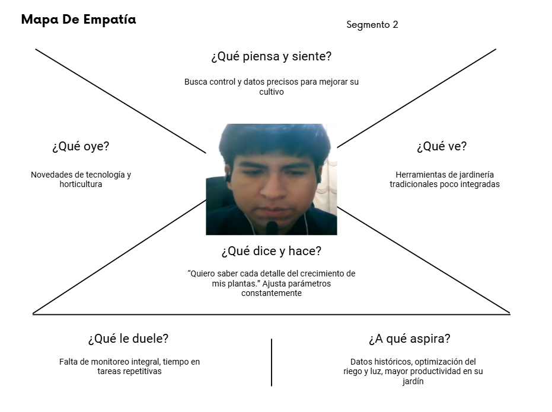

  

  <strong>UNIVERSIDAD PERUANA DE CIENCIAS APLICADAS</strong> 
  <strong>FACULTAD DE INGENIERÍA</strong> 
  <strong>PROGRAMA ACADÉMICO DE INGENIERÍA DE SOFTWARE</strong> 
  <strong>1ASI0572-2520-3414 - DESARROLLO DE SOLUCIONES IoT</strong>

  <em><strong>MaceTy</strong></em> 
  <em><strong>TB1</strong></em>

  <strong>DOCENTE:</strong> 
  Marco Antonio Leon Baca

  <strong>STARTUP:</strong> 
  NaturaFy

<h3 align="center">Team Members:</h3>

<table style="margin: 0 auto;">
<tr>
<th><b>Member</b></th>
<th><b>Code</b></th>
</tr>
<tr>
<td>Rojas Velasquez, Maycol</td>
<td>U202219984</td>
</tr>
<tr>
<td>Gómez Vallejos, Sergio</td>
<td>U20221D401</td>
</tr>
<tr>
<td>Leon Rioja, Carlos Andres</td>
<td>U202111451</td>
</tr>
<tr>
<td>Valera Garces, Samuel</td>
<td>U202111952</td>
</tr>
<tr>
<td>Jaque Peña, Estefano</td>
<td>U202225466</td>
</tr>
</table>

<strong>Septiembre 2025</strong>

# Registro de Versiones del Informe
| Versión | Fecha       | Autor                         | Descripción de modificación                |
|---------|-------------|-------------------------------|--------------------------------------------|
| TB1     | 14/09/2025  | Maycol Jhordan Rojas Velásquez | Creación inicial del documento  |
| TB1     | 14/09/2025  | Maycol Jhordan Rojas Velásquez | Estructuración del documento |
| TB1     | 14/09/2025  | Maycol Jhordan Rojas Velásquez | Descripción del StartUp |
| TB1     | 14/09/2025  | Sergio André Gómez Vallejos | Implementación de Antecedentes y problemática  |
| TB1     | 15/09/2025  | Estefano Jaque Peña | Lean UX Process   |
| TB1     | 15/09/2025  | Maycol Jhordan Rojas Velásquez | Segmento Objetivo |
| TB1     | 15/09/2025  | Sergio André Gómez Vallejos | Implementación de los Competidores  |
| TB1     | 15/09/2025  | Sergio André Gómez Vallejos | Implementación de Análisis de los competidores  |
| TB1     | 15/09/2025  | Sergio André Gómez Vallejos | Creación de las tácticas y estrategias frente a competidores  |
| TB1     | 16/09/2025  | Sergio André Gómez Vallejos | Creación de análisis de las entrevistas  |
| TB1     | 16/09/2025  | Samuel Valera Garces | Needfinding   |
| TB1     | 17/09/2025  | Maycol Jhordan Rojas Velásquez | Ubiquitous Language |
| TB1     | 17/09/2025  | Samuel Valera Garces | User Stories   |
| TB1     | 18/09/2025  | Samuel Valera Garces | Product Backlog   |
| TB1     | 19/09/2025  | Carlos Andres Leon Rioja | Candidate Context Discovery Diagram  |
| TB1     | 20/09/2025  | Carlos Andres Leon Rioja | Domain Message Flows Modeling Diagram  |
| TB1     | 20/09/2025  | Carlos Andres Leon Rioja | Bounded Context Canvases Diagram  |
| TB1     | 20/09/2025  | Samuel Valera Garces | Bounded Context: Notification Management   |
| TB1     | 20/09/2025  | Samuel Valera Garces | Bounded Context: Sensor Management   |
| TB1     | 20/09/2025  | Maycol Jhordan Rojas Velásquez | Software Architecture |
| TB1     | 20/09/2025  | Maycol Jhordan Rojas Velásquez | Software Architecture System Landscape Diagram |
| TB1     | 20/09/2025  | Maycol Jhordan Rojas Velásquez | Software Architecture Context Level Diagrams |
| TB1     | 20/09/2025  | Maycol Jhordan Rojas Velásquez | Software Architecture Container Level Diagrams |
| TB1     | 20/09/2025  | Maycol Jhordan Rojas Velásquez | Software Architecture Deployment Diagrams |
# Project Report Collaboration Insights
#### 1. URL del Repositorio en GitHub
| Repositorio del Informe en GitHub |
|-----------------------------------|
| https://github.com/orgs/NaturaFy/repositories |
#### 2. Actividades de Elaboración del Informe

| Actividad                           | Descripción                                                                                          |
|-------------------------------------|------------------------------------------------------------------------------------------------------|
| Comunicación de avances            | Se realizaron breves reuniones donde se comentaban los avances de cada integrante para garantizar un trabajo en equipo sincronizado y estar al tanto de cada modificación.                                |
| Delegación de responsabilidades    | Se organizaron charlas y reuniones para la delegación de tareas, promoviendo el trabajo en equipo y el avance continuo de manera asíncrona.                            |
| Recopilación de datos              | Se realizó un estudio del mercado, utilizando los segmentos objetivos para extraer datos significativos mediante entrevistas. Además, se utilizaron referencias bibliográficas para investigar información relevante dentro del desarrollo del informe                                                          |
| Documentación             | Se desarrollaron diferentes capítulos del informe, utilizando las técnicas, herramientas y metodologías requeridas.                                                         |
#### 3. Capturas de Imagen de los Analíticos de Colaboración y Commits en GitHub
| Métrica                         | Descripción                                                                                          |
|---------------------------------|------------------------------------------------------------------------------------------------------|
| Número de commits por autor     |  |
| Historial de cambios            |  |
#### 4. Participación de Todos los Miembros del Equipo
| Evidencia                       | Descripción                                                                                          |
|---------------------------------|------------------------------------------------------------------------------------------------------|
| Contribuciones en GitHub       | Cada integrante del equipo completó sus tareas y subió sus avances al repositorio de GitHub. Adempas, cada uno colaboró revisando el trabajo de sus compañeros. |
| Discusiones y actividades      | Se organizaron encuentros virtuales para compartir avances, resolver dudas y atender los desafíos de cada actividad. |
| Exposiciones del proyecto       | Se llevaron a cabo sesiones para exponer el trabajo realizado antes de la fecha orrespondiente y prepararnos adecuadamente para la presentación final. |

# Tabla de Contenidos  

## Capítulo I: Introducción  

- [1.1. Startup Profile](#11-startup-profile)  
  - [1.1.1. Descripción de la Startup](#111-descripción-de-la-startup)  
  - [1.1.2. Perfiles de integrantes del equipo](#112-perfiles-de-integrantes-del-equipo)  
- [1.2. Solution Profile](#12-solution-profile)  
  - [1.2.1.  y problemática](#121--y-problemática)  
  - [1.2.2. Lean UX Process](#122-lean-ux-process)  
    - [1.2.2.1. Lean UX Problem Statements](#1221-lean-ux-problem-statements)  
    - [1.2.2.2. Lean UX Assumptions](#1222-lean-ux-assumptions)  
    - [1.2.2.3. Lean UX Hypothesis Statements](#1223-lean-ux-hypothesis-statements)  
    - [1.2.2.4. Lean UX Canvas](#1224-lean-ux-canvas)  
- [1.3. Segmentos objetivo](#13-segmentos-objetivo)  

---

## Capítulo II: Requirements Elicitation & Analysis  

- [2.1. Competidores](#21-competidores)  
  - [2.1.1. Análisis competitivo](#211-análisis-competitivo)  
  - [2.1.2. Estrategias y tácticas frente a competidores](#212-estrategias-y-tácticas-frente-a-competidores)  
- [2.2. Entrevistas](#22-entrevistas)  
  - [2.2.1. Diseño de entrevistas](#221-diseño-de-entrevistas)  
  - [2.2.2. Registro de entrevistas](#222-registro-de-entrevistas)  
  - [2.2.3. Análisis de entrevistas](#223-análisis-de-entrevistas)  
- [2.3. Needfinding](#23-needfinding)  
  - [2.3.1. User Personas](#231-user-personas)  
  - [2.3.2. User Task Matrix](#232-user-task-matrix)  
  - [2.3.3. User Journey Mapping](#233-user-journey-mapping)  
  - [2.3.4. Empathy Mapping](#234-empathy-mapping)  
- [2.4. Ubiquitous Language](#24-ubiquitous-language)  
- [2.5. Big Picture EventStorming](#25-big-picture-eventstorming)  

---

## Capítulo III: Requirements Specification  

- [3.1. User Stories](#31-user-stories)  
- [3.2. Product Backlog](#32-product-backlog)  
- [3.3. Impact Mapping](#33-impact-mapping)  

---

## Capítulo IV: Solution Software Design  

- [4.1. Strategic-Level Domain-Driven Design](#41-strategic-level-domain-driven-design)  
  - [4.1.1. Design-Level EventStorming](#411-design-level-eventstorming)  
    - [4.1.1.1. Candidate Context Discovery](#4111-candidate-context-discovery)  
    - [4.1.1.2. Domain Message Flows Modeling](#4112-domain-message-flows-modeling)  
    - [4.1.1.3. Bounded Context Canvases](#4113-bounded-context-canvases)  
  - [4.1.2. Context Mapping](#412-context-mapping)  
  - [4.1.3. Software Architecture](#413-software-architecture)  
    - [4.1.3.1. Software Architecture System Landscape Diagram](#4131-software-architecture-system-landscape-diagram)  
    - [4.1.3.2. Software Architecture Context Level Diagrams](#4132-software-architecture-context-level-diagrams)  
    - [4.1.3.3. Software Architecture Container Level Diagrams](#4133-software-architecture-container-level-diagrams)  
    - [4.1.3.4. Software Architecture Deployment Diagrams](#4134-software-architecture-deployment-diagrams)  
- [4.2. Tactical-Level Domain-Driven Design](#42-tactical-level-domain-driven-design)  
  - [4.2.1. Bounded Context: IAM Management](#421-bounded-context-iam-management)  
    - [4.2.1.1. Domain Layer](#4211-domain-layer)  
    - [4.2.1.2. Interface Layer](#4212-interface-layer)  
    - [4.2.1.3. Application Layer](#4213-application-layer)  
    - [4.2.1.4. Infrastructure Layer](#4214-infrastructure-layer)  
    - [4.2.1.5. Bounded Context Software Architecture Component Level Diagrams](#4215-bounded-context-software-architecture-component-level-diagrams)  
    - [4.2.1.6. Bounded Context Software Architecture Code Level Diagrams](#4216-bounded-context-software-architecture-code-level-diagrams)  
      - [4.2.1.6.1. Bounded Context Domain Layer Class Diagrams](#42161-bounded-context-domain-layer-class-diagrams)  
      - [4.2.1.6.2. Bounded Context Database Design Diagram](#42162-bounded-context-database-design-diagram)  
  - [4.2.2. Bounded Context: Plant Management](#422-bounded-context-plant-management)  
    - [4.2.2.1. Domain Layer](#4221-domain-layer)  
    - [4.2.2.2. Interface Layer](#4222-interface-layer)  
    - [4.2.2.3. Application Layer](#4223-application-layer)  
    - [4.2.2.4. Infrastructure Layer](#4224-infrastructure-layer)  
    - [4.2.2.5. Bounded Context Software Architecture Component Level Diagrams](#4225-bounded-context-software-architecture-component-level-diagrams)  
    - [4.2.2.6. Bounded Context Software Architecture Code Level Diagrams](#4226-bounded-context-software-architecture-code-level-diagrams)  
      - [4.2.2.6.1. Bounded Context Domain Layer Class Diagrams](#42261-bounded-context-domain-layer-class-diagrams)  
      - [4.2.2.6.2. Bounded Context Database Design Diagram](#42262-bounded-context-database-design-diagram)  
  - [4.2.3. Bounded Context: Sensor Management](#423-bounded-context-sensor-management)  
    - [4.2.3.1. Domain Layer](#4231-domain-layer)  
    - [4.2.3.2. Interface Layer](#4232-interface-layer)  
    - [4.2.3.3. Application Layer](#4233-application-layer)  
    - [4.2.3.4. Infrastructure Layer](#4234-infrastructure-layer)  
    - [4.2.3.5. Bounded Context Software Architecture Component Level Diagrams](#4235-bounded-context-software-architecture-component-level-diagrams)  
    - [4.2.3.6. Bounded Context Software Architecture Code Level Diagrams](#4236-bounded-context-software-architecture-code-level-diagrams)  
      - [4.2.3.6.1. Bounded Context Domain Layer Class Diagrams](#42361-bounded-context-domain-layer-class-diagrams)  
      - [4.2.3.6.2. Bounded Context Database Design Diagram](#42362-bounded-context-database-design-diagram)  
  - [4.2.4. Bounded Context: IA Management](#424-bounded-context-ia-management)  
    - [4.2.4.1. Domain Layer](#4241-domain-layer)  
    - [4.2.4.2. Interface Layer](#4242-interface-layer)  
    - [4.2.4.3. Application Layer](#4243-application-layer)  
    - [4.2.4.4. Infrastructure Layer](#4244-infrastructure-layer)  
    - [4.2.4.5. Bounded Context Software Architecture Component Level Diagrams](#4245-bounded-context-software-architecture-component-level-diagrams)  
    - [4.2.4.6. Bounded Context Software Architecture Code Level Diagrams](#4246-bounded-context-software-architecture-code-level-diagrams)  
      - [4.2.4.6.1. Bounded Context Domain Layer Class Diagrams](#42461-bounded-context-domain-layer-class-diagrams)  
      - [4.2.4.6.2. Bounded Context Database Design Diagram](#42462-bounded-context-database-design-diagram)  
  - [4.2.5. Bounded Context: Notification Management](#425-bounded-context-notification-management)  
    - [4.2.5.1. Domain Layer](#4251-domain-layer)  
    - [4.2.5.2. Interface Layer](#4252-interface-layer)  
    - [4.2.5.3. Application Layer](#4253-application-layer)  
    - [4.2.5.4. Infrastructure Layer](#4254-infrastructure-layer)  
    - [4.2.5.5. Bounded Context Software Architecture Component Level Diagrams](#4255-bounded-context-software-architecture-component-level-diagrams)  
    - [4.2.5.6. Bounded Context Software Architecture Code Level Diagrams](#4256-bounded-context-software-architecture-code-level-diagrams)  
      - [4.2.5.6.1. Bounded Context Domain Layer Class Diagrams](#42561-bounded-context-domain-layer-class-diagrams)  
      - [4.2.5.6.2. Bounded Context Database Design Diagram](#42562-bounded-context-database-design-diagram)    
- [Conclusiones](#61-conclusiones)  
- [Bibliografía](#62-bibliografía)  
- [Anexos](#63-anexos)  

# STUDENT OUTCOME
El curso contribuye al cumplimiento del Student Outcome ABET: 
##### ABET – EAC - Student Outcome 5
Criterio:  La capacidad de funcionar efectivamente en un equipo cuyos miembros
juntos proporcionan liderazgo, crean un entorno de colaboración e inclusivo,
establecen objetivos, planifican tareas y cumplen objetivos.

| **Criterio específico** | **Acciones realizadas** | **Conclusiones** |  
|-------------------------|------------------------|------------------|
|Trabaja en equipo para proporcionar liderazgo en forma conjunta |   1. Rojas Velasquez, Maycol Jhordan *TB1:*  Apliqué liderazgo conjunto durante el desarrollo del proyecto MaceTy, coordinando con todo el equipo la distribución de tareas técnicas y de investigación. Lideré la arquitectura de software, diagramas C4 y el diseño del sistema IoT, mientras facilitaba la integración del trabajo de los cinco miembros del equipo, asegurando coherencia entre los bounded contexts y componentes técnicos.   2. Gómez Vallejos, Sergio André *TB1:*  Ejercí liderazgo compartido en la investigación de mercado y análisis competitivo. Coordiné con el equipo completo para asegurar coherencia entre los antecedentes, problemática y la propuesta técnica, liderando las secciones de competidores y análisis de entrevistas. Facilité la comunicación entre todos los miembros para mantener una visión unificada del proyecto.   3. Valera Garcés, Samuel Ignacio *TB1:*  Lideré la elaboración de **2.3 Needfinding**, **2.3.1 User Personas**, **2.3.2 User Task Matrix**, **2.3.3 User Journey Mapping**, **2.3.4 Empathy Mapping**, **2.5 Big Picture EventStorming**, la **entrevista con el segmento 1**, así como **3.1 User Stories** y **3.2 Product Backlog**. Coordiné con los cinco integrantes del equipo para integrar estos insumos al documento final, asegurando coherencia y cumplimiento de los objetivos del proyecto MaceTy.   4. Leon Rioja, Carlos Andres *TB1:*  Asumí el liderazgo en el diseño de contextos delimitados y modelado de dominios. Desarrollé el **4.1.1.1 Candidate Context Discovery**, **4.1.1.2 Domain Message Flows Modeling** y **4.1.1.3 Bounded Context Canvases**. Colaboré estrechamente con todo el equipo para asegurar que los bounded contexts reflejaran correctamente los procesos de negocio identificados en las fases previas del proyecto.   5. Jaque Peña, Estefano Oscar *TB1:*  Lideré la conceptualización y desarrollo del **1.2.2 Lean UX Process**, incluyendo problem statements, assumptions y hypothesis statements que sirvieron como base fundamental para todo el proyecto. Coordiné con los demás miembros para asegurar que el enfoque Lean UX se mantuviera consistente a lo largo de todas las fases del desarrollo, desde la investigación hasta la arquitectura técnica. | Durante el TB1, los cinco miembros del equipo demostraron capacidades de liderazgo complementarias y distribuidas estratégicamente. Maycol lideró los aspectos técnicos y arquitecturales, Sergio dirigió la investigación de mercado y análisis competitivo, Samuel se enfocó en el needfinding y especificación de requerimientos, Carlos desarrolló el modelado de dominio y contextos delimitados, mientras que Estefano estableció las bases metodológicas con Lean UX. Esta distribución de liderazgo permitió aprovechar las fortalezas individuales y crear un producto integral que combina solidez técnica, investigación de mercado robusta, análisis de usuarios profundo, arquitectura de dominio bien estructurada y metodología ágil sólida. |
| Crea un entorno colaborativo e inclusivo, establece metas, planifica tareas y cumple objetivos.|    1. Rojas Velasquez, Maycol Jhordan *TB1:*  Apliqué metodologías colaborativas estableciendo reuniones regulares de sincronización con los cinco miembros del equipo, utilizando GitHub para el control de versiones colaborativo y creando un ambiente donde todos pudieran contribuir según sus fortalezas técnicas. Establecí metas claras para cada sprint: definición de segmentos objetivo, arquitectura del sistema y documentación técnica, coordinando con Carlos para los bounded contexts y con Samuel para la integración de user stories.   2. Gómez Vallejos, Sergio André *TB1:*  Contribuí a crear un entorno inclusivo donde cada uno de los cinco miembros del equipo pudo aportar desde sus habilidades específicas. Planifiqué las tareas de investigación y análisis competitivo en coordinación con Samuel para las entrevistas y Estefano para el marco Lean UX, estableciendo metas semanales para el levantamiento de información. Cumplí con todos los objetivos propuestos facilitando la integración de todos los componentes del proyecto.   3. Valera Garcés, Samuel Ignacio *TB1:*  Organicé y planifiqué reuniones de coordinación con todos los integrantes del equipo, definí metas por sección a mi cargo y utilicé herramientas colaborativas (GitHub, documentos compartidos) para facilitar la integración y retroalimentación entre los cinco miembros. Cumplí los plazos acordados para cada entrega, manteniendo una comunicación constante y un ambiente inclusivo en el desarrollo del proyecto, especialmente coordinando con Sergio para las entrevistas y con Carlos para alinear el needfinding con los bounded contexts.   4. Leon Rioja, Carlos Andres *TB1:*  Establecí un ambiente colaborativo para el desarrollo de la arquitectura de dominio, coordinando estrechamente con Maycol para alinear los bounded contexts con la arquitectura técnica y con Samuel para asegurar que los contextos reflejaran las necesidades identificadas en el needfinding. Planifiqué las tareas de modelado de dominio con metas específicas semanales y mantuve comunicación constante con todo el equipo para validar los diseños propuestos.   5. Jaque Peña, Estefano Oscar *TB1:*  Creé un marco metodológico colaborativo basado en Lean UX que facilitó la participación equitativa de los cinco miembros del equipo. Establecí metas claras para cada fase del proceso Lean UX y planifiqué la integración de los aportes de cada integrante: coordinando con Sergio para los antecedentes, con Samuel para el needfinding, con Carlos para el domain modeling y con Maycol para la arquitectura técnica. Mantuve un ambiente inclusivo donde todas las perspectivas fueran valoradas y consideradas en las decisiones del proyecto. | El equipo de cinco integrantes logró crear un entorno altamente colaborativo donde cada miembro aportó desde sus fortalezas específicas: técnicas, de investigación, de análisis de usuarios, de modelado de dominio y metodológicas. La planificación clara y coordinada de tareas permitió cumplir con todos los objetivos del TB1: documentación completa del startup profile, análisis competitivo exhaustivo, needfinding profundo, arquitectura de software bien definida, bounded contexts coherentes, segmentos objetivo validados y un marco Lean UX sólido. La comunicación constante entre los cinco miembros y el uso de herramientas colaborativas como GitHub facilitaron la integración exitosa de todos los componentes del proyecto MaceTy, demostrando que un liderazgo distribuido y colaborativo puede generar resultados superiores a la suma de las contribuciones individuales. |
# Capítulo I: Introducción  
## 1.1. Startup Profile
### 1.1.1. Descripción de la Startup

  

Naturafy es una startup dedicada al desarrollo de soluciones IoT para el hogar, enfocada en mejorar la experiencia de los usuarios y optimizar el uso de recursos naturales. 

  

Su producto principal, **MaceTy**, es una maceta inteligente que combina sensores, conectividad y automatización para cuidar automáticamente las plantas de interior, haciendo el riego más eficiente y mejorando la salud de las plantas.  
### Objetivo  

Diseñar una maceta inteligente IoT que:  
- Mida la humedad del suelo  
- Controle automáticamente el riego mediante una mini bomba de agua  
- Permita monitoreo en tiempo real desde una app o plataforma web  
### Colaboraciones Estratégicas  
Naturafy establece alianzas con viveros, tiendas de jardinería, fabricantes de sensores y comunidades de usuarios de plantas de interior. Trabajamos con estos socios para garantizar que nuestras soluciones tecnológicas respondan a sus necesidades, facilitando el cuidado automatizado de plantas y mejorando la experiencia del usuario.  
### Innovación y Tecnología  
**MaceTy** utiliza tecnologías IoT avanzadas para ofrecer un sistema de riego inteligente y automatizado. Los sensores de humedad, luz y temperatura permiten monitoreo continuo, mientras que la bomba controlada automáticamente asegura un riego óptimo. La app/web proporciona datos en tiempo real, alertas y control remoto, integrando tecnología accesible y diseño centrado en el usuario.  
### Comunidad y Funciones Sociales  
MaceTy no es solo un producto; es también un espacio de aprendizaje y conexión. La plataforma permite a los usuarios compartir consejos de cuidado, estrategias de riego y mantenerse informados sobre nuevas prácticas de jardinería inteligente. Esta comunidad activa fomenta el intercambio de conocimiento y la adopción de hábitos sostenibles.  
### Visión  
Visualizamos hogares donde la tecnología y la naturaleza se integran para facilitar la vida de los usuarios y mejorar la salud de sus plantas. MaceTy será sinónimo de innovación en jardinería inteligente, un aliado indispensable para quienes buscan un cuidado eficiente, sostenible y conectado de sus plantas.  
### Misión  
Ofrecer un producto integral que empodere a los usuarios con herramientas inteligentes de cuidado de plantas, mejorando comodidad, eficiencia y bienestar en el hogar. Naturafy, a través de MaceTy, promueve el ahorro de agua, la sostenibilidad ambiental y la conexión con la naturaleza, siendo símbolo de excelencia, innovación y compromiso con un estilo de vida más verde y consciente.
### 1.1.2. Perfiles de integrantes del equipo  

| **Integrante** | **Conocimientos técnicos / Habilidades** |
|----------------|-------------------------------------------|
|  | **Maycol Jhordan Rojas Velasquez** – Ingeniería de Software – U202219984  Elegí la carrera de Ingeniería de Software debido a mi gusto por la innovación y la implementación de la tecnología en cualquier rubro social, de una manera creativa y en todos los aspectos. Me considero una persona creativa, en busca de ideas y estrategias con mente nueva. También me gusta escuchar ideas de mi equipo, dar propuestas de mejora, evaluar las ventajas y desventajas.  **Conocimientos técnicos:** C++, HTML, Python, Angular, Backend en Java, Flutter, LangChain aplicado con LLM y RAG.  **Habilidades:** Enfoque responsable y dedicado, aprendizaje rápido, liderazgo técnico, resolución de problemas.  **Hobbies:** Ver series, jugar videojuegos, escuchar música, nadar y manejar. |
|  | **Sergio André Gómez Vallejos** – Ingeniería de Software – U20221D401  Soy una persona resiliente que, sin importar cuántas veces caiga, siempre encuentra la manera de levantarse. Tengo habilidades sociales sólidas y una amplia experiencia en la resolución de problemas de código. Suelo ser el miembro más activo de mi equipo de trabajo.  **Conocimientos técnicos:** Diversos lenguajes de programación y tecnologías de desarrollo.  **Habilidades:** Liderazgo en investigación de mercado, análisis competitivo, resolución de problemas, comunicación efectiva.  **Fortalezas:** Me apasionan los lenguajes de programación y la tecnología, constantemente me esfuerzo por alcanzar mis objetivos y contribuir al desarrollo del startup. |
|  | **Carlos Andres Leon Rioja** – Ingeniería de Software – U202111451  Me considero una persona responsable, comprensible y con ganas de aprender. Mi enfoque principal está en el desarrollo de arquitecturas sólidas y el modelado de dominios complejos.  **Conocimientos técnicos:** C#, C++, Java, SQL, Vue, Angular, Python, Node.js, JavaScript.  **Habilidades:** Diseño de contextos delimitados, modelado de dominios, arquitectura de software, trabajo colaborativo.  **Especialización:** Domain-Driven Design, Context Discovery, Message Flows Modeling, Bounded Context Canvases. |
|  | **Samuel Ignacio Valera Garces** – Ingeniería de Software – U202111952  Hola, mi nombre es Samuel, estudiante de la carrera de Ingeniería de software. Me considero una persona responsable, empática y con adaptación rápida al trabajo en equipo. Mi objetivo a futuro es utilizar la tecnología para el desarrollo de aplicaciones que necesite la sociedad en el día a día.  **Conocimientos técnicos:** Diversos lenguajes de programación, diseño de experiencia de usuario, análisis de requerimientos.  **Habilidades:** Needfinding, User Stories, Product Backlog, investigación de usuarios, análisis de requerimientos.  **Hobbies:** Practicar guitarra y leer en mis tiempos libres. |
|  | **Estefano Oscar Jaque Peña** – Ingeniería de Software – U202225466  Me especializo en metodologías ágiles y marcos de trabajo centrados en el usuario. Mi enfoque principal está en establecer bases metodológicas sólidas que guíen el desarrollo de productos tecnológicos exitosos.  **Conocimientos técnicos:** Metodologías ágiles, Lean UX, Design Thinking, análisis de procesos de negocio.  **Habilidades:** Liderazgo metodológico, Lean UX Process, Problem Statements, Assumptions, Hypothesis Statements, facilitación de equipos.  **Especialización:** Conceptualización de productos, validación de hipótesis, marcos de trabajo ágiles. |

## 1.2. Solution Profile  
La solución propuesta por Naturafy, **MaceTy**, combina hardware y software para ofrecer un sistema de riego inteligente y automatizado para plantas de interior. La plataforma permite monitoreo en tiempo real, control remoto mediante app/web y optimización del uso de agua.  
Se busca que MaceTy no solo sea funcional, sino también accesible, escalable y fácil de usar, integrando principios de diseño centrado en el usuario y soluciones tecnológicas de bajo costo.
### 1.2.1. Antecedentes y problemática  
En los últimos años, el interés por la jardinería urbana y el cultivo de plantas de interior ha crecido en ciudades peruanas como Lima, Arequipa y Trujillo, donde los espacios reducidos y el estilo de vida acelerado limitan el tiempo y los conocimientos necesarios para un cuidado adecuado. Este fenómeno responde a una tendencia global hacia la búsqueda de bienestar, contacto con la naturaleza y sostenibilidad dentro del hogar.

Sin embargo, diversos estudios y experiencias muestran que la mayoría de los intentos por mantener plantas en entornos urbanos fracasan en los primeros meses. Entre los principales factores destacan:

- Riego inadecuado (exceso o falta de agua), responsable de la muerte de hasta el 60% de plantas en hogares urbanos.

- Falta de tiempo para realizar tareas constantes de monitoreo y riego.

- Desconocimiento sobre las necesidades específicas de cada especie en cuanto a humedad, luz y nutrientes.

Estas limitaciones generan frustración en los usuarios, abandono de la jardinería y pérdida de recursos económicos y naturales. Surge entonces la necesidad de una solución accesible, escalable y adaptada al contexto urbano peruano y latinoamericano, que permita automatizar el riego, monitorear en tiempo real y brindar recomendaciones confiables a los usuarios.
La problemática impacta tanto a personas urbanas ocupadas, que buscan plantas como parte de su decoración y bienestar sin invertir demasiado tiempo, como a jardineros aficionados, que desean optimizar el cuidado de sus plantas con apoyo tecnológico.
### 1.2.2. Lean UX Process 
El **Lean UX Process** es una metodología ágil que combina los principios del Design Thinking, Lean Startup y desarrollo ágil para crear productos centrados en el usuario de manera iterativa y eficiente. Esta aproximación nos permite validar rápidamente nuestras hipótesis sobre las necesidades de los usuarios urbanos y jardineros tecnológicos, reduciendo el riesgo de desarrollar características innecesarias y asegurando que MaceTy resuelva problemas reales.
En el contexto de MaceTy, aplicamos Lean UX para entender profundamente los desafíos que enfrentan las personas al cuidar plantas en entornos urbanos, donde factores como la falta de tiempo, espacios reducidos y conocimientos limitados sobre jardinería generan altas tasas de mortalidad vegetal. Esta metodología nos guía desde la identificación del problema hasta la formulación de hipótesis testeable, pasando por la comprensión de las necesidades del usuario y la definición de métricas de éxito.
El proceso Lean UX para MaceTy se estructura en cuatro etapas fundamentales: **Problem Statements** (definición clara del problema a resolver), **Assumptions** (suposiciones sobre usuarios, negocio y solución), **Hypothesis Statements** (hipótesis testeable con métricas específicas) y **Lean UX Canvas** (síntesis visual de todos los elementos). Esta estructura nos permite mantener el foco en el valor para el usuario mientras desarrollamos una solución IoT que sea tanto tecnológicamente viable como comercialmente sostenible.
#### 1.2.2.1. Lean UX Problem Statements  
Nuestro contexto requiere información oportuna y confiable para cuidar plantas de interior en hogares urbanos; con esta información, los usuarios esperan mantener la vitalidad de sus plantas y optimizar el consumo de agua.
Hemos observado que muchos usuarios reportan pérdidas recurrentes de plantas y riego inconstante, lo que se manifiesta en marchitez, hojas amarillas y variaciones bruscas de humedad que no son detectadas a tiempo.
¿Cómo podemos reducir la pérdida de plantas por riego inadecuado y mejorar la constancia del cuidado sin incrementar la carga diaria del usuario?
#### 1.2.2.2. Lean UX Assumptions  

Business Assumptions:

1. Creo que mis clientes necesitan mantener sus plantas sanas sin invertir tiempo ni conocimientos técnicos, evitando riegos incorrectos.

2. Estas necesidades se pueden resolver con una maceta IoT con sensores de humedad/luz/temperatura, riego automático, y app/web con alertas y recomendaciones.

3. Mis clientes iniciales son (early adopters) personas urbanas ocupadas de 18–40 años que ya usan dispositivos smart-home y jardineros aficionados tech-friendly de 25–55 años en Lima/Arequipa/Trujillo.

4. El valor #1 que un cliente quiere de mi servicio es “que la planta no se muera”: riego automático confiable.

5. El cliente también puede obtener estos beneficios adicionales: ahorro de agua (20–30%), historial y recomendaciones por especie, estética premium, comunidad en español, integración futura con asistentes de voz.

6. Voy a adquirir la mayoría de mis clientes a través de alianzas con viveros/tiendas, contenido en IG/TikTok, referidos in-app y demos en ferias universitarias.

7. Haré dinero a través de venta del hardware, suscripción freemium (analítica/recetas/alertas avanzadas/backup en la nube), consumibles (sustrato/fertilizante) y B2B para viveros e instituciones.

8. Mi competencia principal en el mercado será macetas inteligentes importadas (p. ej., Xiaomi, Click & Grow), sistemas de riego por goteo básicos y apps de recordatorios genéricas.

9. Los venceremos debido a precio local competitivo, soporte y posventa en LATAM, personalización por especie y clima local, comunidad en español y diseño plug-and-play.

10. Mi mayor riesgo de producto es fallas del riego automático o alertas imprecisas, fricción en instalación/pareo, y costo BOM no competitivo.

11. Resolveremos esto a través de pilotos en hogares + pruebas de bancada, calibración por especie, onboarding guiado con failsafe (botón de riego manual), telemetría/alertas robustas (MQTT/Cloud con reintentos), y pruebas de coste para asegurar margen.

User assumptions:

1. Quién es el usuario?
Personas urbanas ocupadas (profesionales, estudiantes) que desean tener plantas en casa pero carecen de tiempo o conocimientos, y jardineros aficionados que buscan optimizar el cuidado de sus plantas con tecnología.

2. Dónde encaja nuestro producto, en su trabajo o vida?
En su hogar o espacio personal (departamentos, casas, oficinas), como parte de su rutina diaria de decoración, bienestar y conexión con la naturaleza, integrándose también con otros dispositivos inteligentes del hogar.

3. Qué problemas tiene nuestro producto y cómo se pueden resolver?

Problema: Las plantas mueren por falta de riego o exceso de agua.
> Solución: Sensores de humedad + riego automático controlado por app/web.

Problema: Los usuarios no saben qué cuidados específicos requiere cada especie.
> Solución: App con recomendaciones personalizadas y alertas inteligentes.

Problema: Falta de tiempo para dedicar a la jardinería.
> Solución: Automatización del riego y monitoreo remoto.

4. Cuándo y cómo es usado nuestro producto?
Se usa todos los días, de manera pasiva (riego automático) y activa (consultando la app/web). El usuario recibe notificaciones en tiempo real sobre el estado de la planta y puede revisar métricas o activar funciones manualmente en cualquier momento.

5. Qué características son importantes?

Fácil instalación y configuración en menos de 10 minutos.

Riego automático confiable y configurable.

Alertas precisas y no invasivas.

Diseño estético y moderno que combine con la decoración del hogar.

Compatibilidad con dispositivos móviles (Android/iOS) y web.

Bajo consumo energético y eficiencia en el uso del agua.

6. Cómo debe verse nuestro producto y cómo debe comportarse?

Visualmente: Diseño minimalista, colores neutros y acabados elegantes que encajen en entornos urbanos modernos.

Comportamiento: Rápido, confiable, silencioso, con respuesta inmediata a la app, generando confianza en que la planta está bien cuidada incluso sin intervención constante del usuario.

* Business Outcomes (Empresa – NaturaFy / MaceTy)

1. Se busca incrementar la cartera de clientes en el mercado urbano y de jardineros aficionados.

2. Se busca posicionar a MaceTy como la maceta inteligente líder en Latinoamérica.

3. Se busca generar ingresos sostenibles mediante hardware, suscripciones y alianzas estratégicas.

4. Se busca expandir la marca a viveros, universidades y comunidades de jardinería.

5. Se busca fortalecer la innovación en IoT accesible y sostenible para el hogar.

* User Outcomes (Clientes/Usuarios de MaceTy)

1. El usuario busca mantener sus plantas sanas sin esfuerzo ni conocimientos especializados.

2. El usuario busca ahorrar tiempo y agua gracias a la automatización del riego.

3. El usuario busca recibir alertas claras y confiables para cuidar mejor sus plantas.

4. El usuario busca un producto estético que embellezca su hogar mientras cuida sus plantas.

5. El usuario busca participar en una comunidad que comparta consejos y experiencias de jardinería inteligente.
#### 1.2.2.3. Lean UX Hypothesis Statements  

HYPOTHESIS 1:

Creemos que al ofrecer un sistema de riego automático y confiable, lograremos incrementar la cartera de clientes urbanos y jardineros aficionados.

Sabremos que estamos bien.

Cuando alcancemos un aumento del 20% en ventas trimestrales y comentarios positivos sobre la facilidad de uso en entrevistas y encuestas.

HYPOTHESIS 2:

Creemos que posicionar a MaceTy como la primera maceta inteligente adaptada al mercado latinoamericano nos permitirá diferenciarnos de competidores internacionales.

Sabremos que estamos bien.

Cuando obtengamos un crecimiento del 15% en la participación de mercado local y comentarios cualitativos de usuarios que valoran la adaptación cultural y económica.

HYPOTHESIS 3:

Creemos que implementar un modelo mixto de ingresos (hardware + suscripciones + alianzas) generará sostenibilidad financiera.

Sabremos que estamos bien.

Cuando logremos que al menos el 30% de usuarios de hardware se conviertan en suscriptores activos y alianzas con 3 viveros en el primer año.

HYPOTHESIS 4:

Creemos que expandir la marca mediante alianzas con viveros, universidades y comunidades de jardinería aumentará la adquisición de clientes.

Sabremos que estamos bien.

Cuando firmemos convenios con al menos 5 instituciones y observemos un aumento del 25% en clientes provenientes de estos canales.

HYPOTHESIS 5:

Creemos que mantener la innovación en IoT accesible y sostenible fortalecerá la confianza de los clientes y la retención de usuarios.

Sabremos que estamos bien.

Cuando obtengamos un NPS ≥ 40, comentarios positivos sobre sostenibilidad y una tasa de recompra del 20% en clientes actuales.
#### 1.2.2.4. Lean UX Canvas  

<table border="1" cellpadding="10" cellspacing="0">
    <tr>
        <td><strong>Lean UX Canvas – Proyecto MaceTy</strong></td>
        <td><strong>Fecha:</strong> 14/04/2025</td>
        <td><strong>Primera Iteración</strong></td>
    </tr>
    <tr>
        <td>
            <strong>Business Problem</strong> 
            - Muchas personas desean tener plantas en casa, pero mueren por falta de tiempo o conocimientos. 
            - Esto genera frustración, pérdida de dinero y abandono de la jardinería. 
            - No existen soluciones accesibles y locales que integren riego automático, monitoreo en tiempo real y recomendaciones personalizadas.
        </td>
        <td>
            <strong>Solution Ideas</strong> 
            - Maceta IoT con sensores de humedad, luz y temperatura. 
            - Riego automático mediante mini bomba controlada digitalmente. 
            - App/web con notificaciones y métricas en tiempo real. 
            - Comunidad integrada para compartir consejos y experiencias. 
            - Integración futura con asistentes de voz y smart home.
        </td>
        <td>
            <strong>Business Outcomes</strong> 
            - Incrementar la cartera de clientes urbanos y jardineros aficionados. 
            - Posicionar a MaceTy como la maceta inteligente líder en Latinoamérica. 
            - Generar ingresos sostenibles con hardware, suscripción y alianzas. 
            - Expandir la marca en viveros, universidades y comunidades de jardinería. 
            - Fortalecer la innovación en IoT accesible y sostenible.
        </td>
    </tr>
    <tr>
        <td>
            <strong>Users & Customers</strong> 
            - Personas urbanas ocupadas (profesionales, estudiantes) que quieren plantas sin invertir demasiado tiempo. 
            - Jardineros aficionados y semi-profesionales interesados en optimizar y medir el cuidado de sus plantas.
        </td>
        <td>
            <strong>Hypotheses</strong> 
            - Creemos que al automatizar el riego y monitorear humedad, luz y temperatura, los usuarios podrán mantener sus plantas vivas con menos esfuerzo. 
            - Sabremos que hemos tenido éxito cuando logremos reducir la mortalidad de plantas en un 50% y recibamos comentarios positivos sobre ahorro de tiempo y facilidad de uso. 
            - Creemos que integrar alertas personalizadas y recomendaciones aumentará la confianza en el cuidado de plantas. 
            - Sabremos que hemos tenido éxito cuando un 30% de los clientes activos se suscriban al plan premium de la aplicación.
        </td>
        <td>
            <strong>User Benefits</strong> 
            - Ahorro de tiempo en el cuidado de las plantas. 
            - Mayor confianza y tranquilidad en el estado de sus plantas. 
            - Hogar más estético y natural sin esfuerzo adicional. 
            - Conexión con una comunidad de jardinería digital. 
            - Ahorro de agua gracias a un riego más eficiente.
        </td>
    </tr>
    <tr>
        <td>
            <strong>What's the most important thing we need to learn first?</strong> 
            - Validar si las personas urbanas aceptarían pagar por un sistema IoT de riego automático. 
            - Conocer cuánto valoran la automatización vs. control manual. 
            - Identificar las especies de plantas más comunes en hogares urbanos. 
            - Medir disposición a suscribirse a un servicio complementario.
        </td>
        <td colspan="2">
            <strong>What's the least amount of work we need to do to learn the most important?</strong> 
            - Encuestas y entrevistas con dueños de plantas en zonas urbanas. 
            - Prototipo de baja fidelidad (mockup app + demo hardware básico). 
            - Prueba piloto en 10–15 hogares con plantas de interior. 
            - Recoger métricas de uso, feedback y disposición de pago.
        </td>
    </tr>
</table>

## 1.3. Segmentos objetivo  

La **Maceta Inteligente** ha sido diseñada para atender a usuarios con distintos perfiles y necesidades, ofreciendo soluciones tecnológicas que faciliten el cuidado de las plantas y mejoren la experiencia de jardinería en el hogar. Cada segmento presenta motivaciones y desafíos específicos que nuestra plataforma busca atender con funcionalidades prácticas, accesibles y sostenibles.

A continuación, se detalla el perfil de nuestros principales segmentos objetivos, identificando sus características, motivaciones y problemáticas, con el fin de adaptar y mejorar constantemente nuestros servicios para ofrecerles el mayor valor posible.
## 1. Personas Ocupadas en la Ciudad
**Descripción:**  
Este segmento está compuesto por individuos que residen en zonas urbanas de Perú, principalmente en Lima, Arequipa y Trujillo. Buscan mantener plantas saludables sin invertir demasiado tiempo o esfuerzo, adaptándose a un estilo de vida acelerado y con limitaciones de espacio en departamentos o casas pequeñas.
**Objetivos Principales:**
- Facilitar el cuidado de sus plantas mediante riego automático y alertas inteligentes.
- Mantener plantas estéticamente atractivas con mínima intervención.
- Optimizar tiempo y recursos dedicados al cuidado de plantas.
**Problemáticas y Desafíos:**
- Falta de tiempo para regar y monitorear las plantas de forma constante.
- Desconocimiento sobre las necesidades específicas de riego, luz y nutrientes de cada planta.
- Espacios limitados que dificultan la instalación de plantas tradicionales.
**Datos Cuantitativos del Problema:**
- Se estima que el 70% de las personas en zonas urbanas de Perú que intentan cultivar plantas en casa abandonan su cuidado en los primeros 3 meses por falta de tiempo o conocimiento.
- Cerca del 60% de las plantas en hogares urbanos mueren por riego inadecuado o exposición incorrecta a la luz.
**Variables Geográficas, Demográficas y Psicográficas:**
- **Geográficas:** Zonas urbanas de Perú (Lima, Arequipa, Trujillo).  
- **Demográficas:** Edad: 18-50 años; Género: Femenino/Masculino; Nivel socioeconómico: medio a alto; Ocupación: profesionales, estudiantes, trabajadores con tiempo limitado.  
- **Psicográficas:** Buscan comodidad, eficiencia, valoran la estética y el diseño en el hogar; estilo de vida urbano y ocupado.
## 2. Jardineros
**Descripción:**  
Este segmento está compuesto por personas apasionadas por la jardinería, interesadas en la tecnología aplicada al cuidado de plantas. Incluye tanto aficionados como semi-profesionales que buscan monitorear y optimizar el crecimiento de sus plantas mediante dispositivos inteligentes y aplicaciones móviles.
**Objetivos Principales:**
- Monitorear en tiempo real las condiciones de humedad, luz y nutrientes de sus plantas.
- Automatizar funciones de cuidado avanzadas para mejorar la salud y el crecimiento de las plantas.
- Obtener datos y recomendaciones precisas sobre el cuidado de cada especie.
**Problemáticas y Desafíos:**
- Necesidad de herramientas precisas para medir y ajustar condiciones ambientales.
- Falta de soluciones tecnológicas que integren monitoreo y automatización de forma accesible.
- Deseo de personalización y control sobre cada planta sin perder tiempo en tareas repetitivas.
**Datos Cuantitativos del Problema:**
- Aproximadamente el 55% de los jardineros aficionados en Perú invierten más de 1 hora diaria en tareas de cuidado que podrían automatizarse.
- Solo el 30% de los sistemas de cuidado de plantas en el hogar ofrecen monitoreo en tiempo real y alertas personalizadas.
**Variables Geográficas, Demográficas y Psicográficas:**
- **Geográficas:** Zonas urbanas y suburbanas de Perú con espacio disponible para plantas.  
- **Demográficas:** Edad: 18-65 años; Género: Femenino/Masculino; Nivel socioeconómico: medio a alto; Ocupación: profesionales, técnicos, emprendedores y entusiastas de la jardinería.  
- **Psicográficas:** Personas curiosas, detallistas, interesadas en tecnología y sostenibilidad; disfrutan del control y optimización del cuidado de sus plantas.
# Capítulo II: Requirements Elicitation & Analysis  
## 2.1. Competidores  
### 2.1.1. Análisis competitivo
<table> <tr> <td align="center" colspan="6"><b>Competitive Analysis Landscape</b></td> </tr> <tr> <td colspan="2"><b>¿Porqué llevar a cabo este análisis?</b></td> <td colspan="4"> Para entender las fortalezas y debilidades de MaceTy frente a competidores internacionales y así definir estrategias de diferenciación en el mercado peruano y latinoamericano. </td> </tr> <tr> <td colspan="2"><b>¿Cómo podemos proporcionar un buen servicio?</b></td> <td colspan="4"> ¿Cómo podemos ofrecer un cuidado de plantas inteligente, accesible y sostenible que combine IoT, automatización y comunidad de usuarios para mejorar la experiencia de jardinería en el hogar? </td> </tr> <tr align="center"> <td colspan="2"></td><td><b>Naturafy – MaceTy</b></td><td><b>Click & Grow</b></td><td><b>Parrot Pot</b></td><td><b>Xiaomi Smart Flower Pot</b></td> </tr> <tr> <td rowspan="2"><b>Perfil</b></td><td><b>Overview</b></td> <td>Startup peruana con una maceta inteligente IoT que mide humedad, luz y temperatura, controla riego automático y se conecta vía app/web.</td> <td>Empresa internacional con sistema de jardinería inteligente basado en cápsulas y riego automático.</td> <td>Maceta inteligente con sensores de humedad, luz y fertilización, conectada vía app.</td> <td>Maceta de bajo costo con sensores básicos y conectividad Bluetooth/WiFi.</td> </tr> <tr> <td><b>Ventaja competitiva</b></td> <td>Accesible y adaptada al mercado latinoamericano; combina IoT + comunidad + sostenibilidad.</td> <td>Gran reconocimiento global, productos “plug & play” fáciles de usar.</td> <td>Alta precisión de sensores, diseño elegante y conectividad avanzada.</td> <td>Precios bajos, distribución masiva gracias al ecosistema Xiaomi.</td> </tr> <tr> <td rowspan="2"><b>Perfil de Marketing</b></td><td><b>Mercado Objetivo</b></td> <td>Usuarios urbanos peruanos y latinoamericanos (profesionales, estudiantes, jardineros aficionados).</td> <td>Consumidores urbanos de Europa y EE.UU. interesados en jardinería indoor.</td> <td>Amantes de la tecnología y plantas de gama media-alta.</td> <td>Usuarios de hogar inteligente en mercados asiáticos.</td> </tr> <tr> <td><b>Estrategias de Marketing</b></td> <td>Redes sociales, alianzas con viveros locales, ferias y comunidades de jardinería.</td> <td>E-commerce internacional, influencers de estilo de vida verde.</td> <td>Marketing en ferias tecnológicas y jardinería premium.</td> <td>Integración en ecosistema Xiaomi + ventas retail masivas.</td> </tr> <tr> <td rowspan="3"><b>Perfil de Producto</b></td><td><b>Productos & Servicios</b></td> <td>Maceta IoT con sensores, riego automático, app/web y comunidad integrada.</td> <td>Sistemas de cultivo inteligente con cápsulas de semillas.</td> <td>Maceta IoT con sensores avanzados y app.</td> <td>Maceta básica con sensores de humedad y luz.</td> </tr> <tr> <td><b>Precios & Costos</b></td> <td>Medio-bajo (adaptado al poder adquisitivo peruano).</td> <td>Alto (USD 80–150 + cápsulas).</td> <td>Alto (USD 90–120).</td> <td>Bajo (USD 30–50).</td> </tr> <tr> <td><b>Canales de distribución</b></td> <td>App/web, e-commerce local, alianzas con viveros y tiendas.</td> <td>Web oficial, Amazon, retailers.</td> <td>E-commerce y tiendas especializadas.</td> <td>Marketplace Xiaomi y distribuidores globales.</td> </tr> <tr> <td rowspan="5"><b>Análisis SWOT</b></td><td><b>Fortalezas</b></td> <td>Adaptación local, sostenibilidad, accesibilidad y comunidad en LATAM.</td> <td>Experiencia global y gran comunidad de usuarios.</td> <td>Alta precisión tecnológica.</td> <td>Precios accesibles y ecosistema Xiaomi.</td> </tr> <tr> <td><b>Debilidades</b></td> <td>Startup en desarrollo, requiere inversión para escalar.</td> <td>Costos altos y dependencia de cápsulas.</td> <td>Precio elevado y limitada disponibilidad.</td> <td>Funciones limitadas, enfoque en bajo costo.</td> </tr> <tr> <td><b>Oportunidades</b></td> <td>Creciente interés en sostenibilidad y cuidado de plantas en hogares urbanos de LATAM.</td> <td>Expansión hacia mercados emergentes.</td> <td>Alianzas con marcas de jardinería premium.</td> <td>Integración con otros dispositivos IoT.</td> </tr> <tr> <td><b>Amenazas</b></td> <td>Competencia de gigantes tecnológicos y falta de inversión local.</td> <td>Competencia de bajo costo y productos alternativos.</td> <td>Nuevas startups con precios más accesibles.</td> <td>Saturación del mercado asiático.</td> </tr> </table>
 

### 2.1.2. Estrategias y tácticas frente a competidores  
Para posicionar a **MaceTy** en el mercado latinoamericano frente a competidores internacionales, se plantean las siguientes estrategias y tácticas:  
**Estrategias:**  
- **Diferenciación local:** Ofrecer un producto adaptado al contexto peruano y latinoamericano, con precios accesibles y funciones útiles para usuarios urbanos.  
- **Valor agregado comunitario:** Crear una comunidad de usuarios que compartan experiencias, consejos y recomendaciones sobre jardinería urbana.  
- **Sostenibilidad como eje central:** Destacar el ahorro de agua, el uso responsable de recursos y la promoción de un estilo de vida verde.  
- **Alianzas estratégicas:** Establecer vínculos con viveros, universidades, municipalidades y empresas de tecnología local.  
**Tácticas:**  
- **Marketing digital segmentado:** Uso de redes sociales, influencers locales y contenido educativo sobre jardinería inteligente.  
- **Ferias y eventos verdes:** Participación activa en ferias de tecnología, sostenibilidad y agricultura urbana.  
- **Modelos de suscripción y servicios postventa:** Planes que incluyan soporte técnico, actualizaciones y recomendaciones personalizadas vía app/web.  
- **Distribución híbrida:** Venta en línea (e-commerce local) y presencia en viveros y tiendas de hogar.  
- **Innovación constante:** Integrar nuevas funciones como alertas inteligentes, compatibilidad con asistentes virtuales y mejoras en la experiencia de usuario.  
## 2.2. Entrevistas  
### 2.2.1. Diseño de entrevistas  
El diseño de entrevistas se centra en validar la propuesta de valor de **MaceTy**, una maceta inteligente que combina hardware y software para ofrecer un sistema de riego automatizado y monitoreo en tiempo real, con el fin de facilitar el cuidado de plantas de interior.  
Se busca comprender mejor las necesidades de los usuarios potenciales, sus hábitos, motivaciones y desafíos en relación al cuidado de plantas, además de explorar la disposición que tendrían hacia una solución tecnológica accesible y fácil de usar.  
Para ello, se definieron dos segmentos de entrevistas: **Personas Ocupadas en la Ciudad** y **Jardineros**, cada uno con un guion adaptado a sus características.  
#### Entrevista – Personas Ocupadas en la Ciudad  
**Preguntas iniciales (contexto):**  
1. ¿Cómo te llamas?  
2. ¿Dónde vives actualmente?  
3. ¿Qué edad tienes?  
**Preguntas principales:**  
4. ¿Tienes plantas en tu casa o departamento?  
5. ¿Cuántas veces a la semana sueles regarlas o cuidarlas?  
6. ¿Alguna vez se te han muerto plantas por falta de tiempo o desconocimiento? ¿Qué pasó?  
7. ¿Qué tan importante es para ti tener plantas bonitas en tu hogar? (Nada – Poco – Importante – Muy importante)  
8. Si tuvieras una maceta que se riega sola y te avisa si tu planta necesita luz o nutrientes, ¿la usarías? ¿Por qué?  
9. ¿Qué características valoras más en un producto para el hogar? (ej. estética, facilidad de uso, precio, tecnología)  
10. ¿Cuánto estarías dispuesto a pagar por una maceta inteligente que cuide tus plantas automáticamente?  
11. ¿Qué aplicación móvil usas más en tu día a día y por qué te gusta?  
12. ¿Qué tan seguido olvidas regar o cuidar tus plantas? (Casi nunca – A veces – Frecuente – Siempre)  
13. ¿Prefieres recibir alertas en tu celular o que el sistema se encargue solo sin notificaciones?  
14. ¿Cuál sería el mayor beneficio para ti de tener una maceta inteligente?  
15. ¿Qué obstáculos crees que podrías tener para usar un producto así? (precio, desconfianza en la tecnología, instalación, etc.)  
16. ¿Recomendarías este tipo de solución a familiares o amigos que también tienen plantas? ¿Por qué?  
---
#### Entrevista – Jardineros (aficionados o semi-profesionales)  
**Preguntas iniciales (contexto):**  
1. ¿Cómo te llamas?  
2. ¿Dónde vives actualmente?  
3. ¿Qué edad tienes?  
**Preguntas principales:**  
4. ¿Qué tipo de plantas cultivas con más frecuencia?  
5. ¿Cuánto tiempo al día o a la semana dedicas al cuidado de tus plantas?  
6. ¿Usas alguna herramienta o aplicación para monitorear riego, humedad o luz? ¿Cuál?  
7. ¿Qué problemas enfrentas más seguido en el cuidado de tus plantas?  
8. ¿Te interesaría un sistema que te muestre datos en tiempo real (riego, nutrientes, luz) de cada planta? ¿Por qué?  
9. ¿Prefieres tener el control total sobre el cuidado (ajustar tú mismo) o que el sistema se encargue automáticamente?  
10. ¿Qué tan dispuesto estarías a invertir en tecnología que mejore la salud y el crecimiento de tus plantas?  
11. ¿Qué tan importante es para ti llevar un registro histórico del crecimiento y estado de tus plantas?  
12. ¿Qué tan cómodo te sientes usando aplicaciones móviles o dispositivos inteligentes?  
13. ¿Te gustaría compartir tus logros (ej. fotos, estadísticas de crecimiento) en redes sociales o comunidades de jardinería?  
14. ¿Qué funciones extra te gustaría que tenga una maceta inteligente además de riego y monitoreo?  
15. ¿Qué esperas en cuanto al diseño? (ej. algo moderno, estético, simple, robusto)  
16. Si una maceta inteligente pudiera conectarse con otras (ej. crear un ecosistema de plantas), ¿lo verías útil? ¿Por qué?  
### 2.2.2. Registro de entrevistas  
## Segmento 1: Personas Ocupadas en la Ciudad:

| **Aspecto** | **Entrevista 1** | **Entrevista 2** | **Entrevista 3** |
|-------------|------------------|------------------|------------------|
| **Entrevistado** | Enzo Sanamamur | Ariana Martinez | Camila Morales |
| **Sexo** | Masculino | Femenino | Femenino |
| **Edad** | 23 años | 25 años | 20 años |
| **Domicilio** | Comas, Lima, Perú | Santiago de Surco, Lima, Perú | San Miguel, Lima, Perú |
| **Duración** | 03:35 | 03:30 | 04:47 |
| **Imagen** |  |  |  |

### Resúmenes de Entrevistas

**Entrevista 1: Enzo Sanamamur**

Enzo, estudiante de 23 años residente en Comas, considera las plantas como un elemento vital que aporta vida y mejora el ambiente de su hogar. Aunque mantiene una rutina de riego de 1-2 veces por semana, reconoce que frecuentemente olvida cuidarlas, resultando en la pérdida de plantas por falta de atención constante. Mostró gran interés en una maceta inteligente que automatice el riego y proporcione alertas sobre luz y nutrientes, valorando especialmente la facilidad de uso y un diseño atractivo que complemente su decoración. Su disposición de pago se sitúa entre 100-200 soles, identificando el precio y la complejidad de uso como principales barreras de adopción. Expresó su intención de recomendar el producto a amigos y familiares que, como él, viven en departamentos y valoran las plantas, evidenciando una oportunidad de mercado en jóvenes urbanos que buscan soluciones tecnológicas prácticas.

**Entrevista 2: Ariana Martinez**

Ariana, diseñadora de interiores de 25 años que vive en un departamento en Surco, mantiene plantas como elementos esenciales para crear ambientes más vivos y atractivos. Aunque revisa sus plantas diariamente, la inconsistencia en su rutina ha resultado en la pérdida de algunas por descuido. Demostró gran entusiasmo por una maceta inteligente capaz de detectar automáticamente necesidades de riego, temperatura y luz, valorando especialmente un sistema de notificaciones que le facilite el día a día y le permita ahorrar tiempo. Su disposición de pago alcanza los 300 soles, siempre que el producto incluya instrucciones claras para instalación y conectividad móvil. Identifica la complejidad de uso como el principal obstáculo potencial, pero confirma su intención de recomendar la solución a su círculo social, representando el segmento de jóvenes profesionales interesados en integrar tecnología práctica en sus hogares.

**Entrevista 3: Camila Morales**

Camila, estudiante universitaria de 20 años residente en San Miguel, mantiene varias plantas ornamentales y en macetas con un programa de riego de 2-3 veces por semana. Sin embargo, experimenta interrupciones en el cuidado durante períodos de exámenes y viajes, resultando en pérdida de plantas por olvidos o desconocimiento sobre cuidados específicos. Considera muy importante tener plantas bonitas en casa por el frescor y vida que aportan al ambiente. Expresó fuerte interés en una maceta inteligente con riego automático y alertas móviles, valorando la tranquilidad y continuidad del cuidado incluso durante ausencias o períodos de alta ocupación. Prioriza facilidad de uso, estética y precio razonable, con disposición de pago entre 150-200 soles. Identifica costo e instalación compleja como posibles barreras, pero confirma su intención de recomendar el producto a familiares y amigos con plantas, utilizando principalmente WhatsApp para comunicación diaria por su simplicidad y rapidez.

## Segmento 2: Jardineros:

| **Aspecto** | **Entrevista 1** | **Entrevista 2** |
|-------------|------------------|------------------|
| **Entrevistado** | Ramiro Guzmán | Gabriela Baza |
| **Sexo** | Masculino | Femenino |
| **Edad** | 24 años | 26 |
| **Domicilio** | Bellavista Callao, Lima, Perú | Yanahuara, Arequipa , Perú |
| **Duración** | 03:26 | 06:14 |
| **Imagen** |  |  |

### Resumen de Entrevista

**Entrevista 1: Ramiro Guzmán**

Ramiro, jardinero aficionado de 24 años residente en Bellavista, Callao, cultiva principalmente plantas ornamentales y algunas comestibles como tomates y lechugas, dedicando entre 1-2 horas diarias más tiempo adicional los fines de semana. Utiliza métodos manuales de observación para monitorear la tierra y las hojas, enfrentando desafíos como plantas que se secan por exceso de exposición solar o descuidos en el riego. Mostró gran interés en un sistema de monitoreo en tiempo real que mida riego, nutrientes y luz, prefiriendo una maceta inteligente que permita automatización con la posibilidad de ajustes manuales para mantener control sobre el proceso. Su disposición de inversión alcanza 250-300 soles para una maceta confiable, valorando especialmente la capacidad de registrar el crecimiento de sus plantas, recibir recomendaciones personalizadas y conectar múltiples plantas en un ecosistema controlable desde un dispositivo único. Prioriza un diseño moderno, minimalista y estético que se integre armoniosamente con su hogar, y disfruta compartir experiencias y estadísticas de jardinería en redes sociales y comunidades especializadas, evidenciando su perfil de jardinero tecnológico con interés en optimización y análisis de datos.

**Entrevista 2: Gabriela Baza**
Gabriela (26, Yanahuara–Arequipa) cuida rosas, suculentas y aromáticas; dedica ~1 h diaria y usa medidor de humedad y temporizador de goteo. Sus dolores: olvidos de riego, sol excesivo en verano y plagas detectadas tarde. Valora datos en tiempo real y un sistema automático con opción de ajuste manual; cómoda con apps/domótica y dispuesta a pagar S/ 250–S/ 300. Pide alertas de plagas y recomendaciones de fertilización; diseño moderno, robusto y fácil de limpiar, con gestión multi-maceta por zonas. Para adoptarlo, exige onboarding claro y eficiencia energética.
### 2.2.3. Análisis de entrevistas

#### Segmento 1: Personas Ocupadas en la Ciudad

**Análisis Demográfico:**
- **Rango de edad:** 20-25 años, representando jóvenes profesionales y estudiantes universitarios
- **Ubicación geográfica:** Concentrados en Lima metropolitana (Comas, Surco, San Miguel)
- **Perfil ocupacional:** Estudiantes y profesionales jóvenes con limitaciones de tiempo

**Análisis de Comportamiento y Hábitos:**

**Rutinas de Cuidado de Plantas:**
- **Frecuencia de riego:** 1-3 veces por semana, con inconsistencias frecuentes
- **Problema recurrente:** 100% de los entrevistados admitió haber perdido plantas por descuido u olvido
- **Factores de interferencia:** Períodos de exámenes, trabajo intenso, viajes y rutinas cambiantes

**Motivaciones Principales:**
- **Estética del hogar:** Valoran las plantas como elementos decorativos que aportan vida y frescura
- **Bienestar ambiental:** Reconocen los beneficios de las plantas para mejorar el ambiente del hogar
- **Conexión con la naturaleza:** Buscan mantener un vínculo con elementos naturales en entornos urbanos

**Receptividad hacia MaceTy:**
- **Nivel de interés:** 100% mostró entusiasmo por una solución automatizada
- **Beneficios valorados:**
  - Riego automático (eliminación del factor humano)
  - Alertas contextuales sobre necesidades de la planta
  - Tranquilidad durante ausencias prolongadas
  - Ahorro de tiempo en rutinas de cuidado

**Disposición de Pago:**
- **Rango promedio:** S/ 150 - S/ 300 soles
- **Factores determinantes:** Facilidad de uso, diseño atractivo, funcionalidad completa
- **Barreras identificadas:** Complejidad de instalación y configuración

**Preferencias Tecnológicas:**
- **Aplicación preferida:** WhatsApp (comunicación simple y directa)
- **Expectativas de UX:** Interfaces intuitivas, instalación guiada, notificaciones no intrusivas

#### Segmento 2: Jardineros

**Análisis Demográfico:**
- **Rango de edad:** 24-26 años, jardineros aficionados con conocimientos intermedios
- **Distribución geográfica:** Lima Metropolitana y Arequipa
- **Nivel de experiencia:** Aficionados con 1-3 años de experiencia práctica

**Análisis de Comportamiento y Prácticas:**

**Dedicación Temporal:**
- **Tiempo invertido:** 1-2 horas diarias + tiempo adicional los fines de semana
- **Tipos de plantas:** Combinación de ornamentales, aromáticas y comestibles
- **Métodos actuales:** Observación manual, herramientas básicas (medidores de humedad, temporizadores)

**Desafíos Técnicos Identificados:**
- **Problemas climáticos:** Exposición solar excesiva, variaciones estacionales
- **Detección tardía:** Plagas, enfermedades y deficiencias nutricionales
- **Optimización:** Necesidad de datos precisos para mejorar rendimiento

**Expectativas hacia la Tecnología:**
- **Monitoreo en tiempo real:** Datos continuos de humedad, luz, temperatura
- **Control híbrido:** Automatización con capacidad de intervención manual
- **Análisis de datos:** Históricos, tendencias y recomendaciones personalizadas
- **Escalabilidad:** Gestión simultánea de múltiples plantas

**Inversión y ROI:**
- **Disposición de pago:** S/ 250 - S/ 300 soles
- **Justificación:** Mejora en resultados de cultivo y optimización de recursos
- **Características valoradas:** Precisión de sensores, robustez del sistema, integración tecnológica

**Perfil Tecnológico:**
- **Competencia digital:** Alta comodidad con aplicaciones móviles y dispositivos inteligentes
- **Interés en comunidad:** Disposición a compartir experiencias y datos en redes especializadas

#### Insights Transversales y Conclusiones Estratégicas

**Validación del Problem-Market Fit:**
- **Problema confirmado:** Mortalidad alta de plantas urbanas (60-70% según entrevistados)
- **Causas principales:** Inconsistencia en cuidados, falta de tiempo, conocimientos limitados
- **Impacto emocional:** Frustración y sensación de fracaso al perder plantas

**Diferenciación por Segmento:**

| Aspecto | Personas Ocupadas | Jardineros |
|---------|------------------|------------|
| **Prioridad #1** | Automatización completa | Datos y control granular |
| **Interfaz ideal** | Minimalista, pocas alertas | Dashboard completo con métricas |
| **Frecuencia de uso** | Consulta esporádica | Monitoreo regular |
| **Valor percibido** | Ahorro de tiempo | Optimización de resultados |

**Oportunidades de Mercado Identificadas:**
- **Mercado primario:** Jóvenes urbanos 20-30 años en Lima metropolitana
- **Mercado secundario:** Jardineros aficionados en ciudades principales del país
- **Expansión geográfica:** Arequipa como segundo mercado prioritario

**Requerimientos del Producto Validados:**
- **Funcionalidad core:** Riego automático con sensores de humedad
- **Features diferenciadores:** Alertas inteligentes, diseño estético, app intuitiva
- **Requisitos técnicos:** Instalación simple (<10 min), conectividad estable, batería duradera

**Estrategia de Precio Confirmada:**
- **Sweet spot:** S/ 200 - S/ 250 soles para capturar ambos segmentos
- **Modelo freemium:** Hardware básico + suscripción opcional para features avanzadas

**Canales de Distribución Validados:**
- **Digital:** E-commerce y marketplace locales
- **Físico:** Viveros, tiendas de hogar y decoración
- **Referidos:** Boca a boca entre usuarios satisfechos (100% disposición a recomendar)

Esta investigación cualitativa confirma la viabilidad comercial de MaceTy y proporciona direcciones claras para el desarrollo del producto, la estrategia de mercado y la experiencia de usuario diferenciada por segmento.
## 2.3. Needfinding  

El **Needfinding** es una fase fundamental en el proceso de diseño centrado en el usuario que nos permite profundizar en la comprensión de las necesidades, comportamientos, motivaciones y desafíos reales de nuestros usuarios objetivo. Esta etapa va más allá de los datos cuantitativos obtenidos en las entrevistas, transformándolos en insights accionables que guían el desarrollo del producto MaceTy.

A través de diversas técnicas de investigación cualitativa y herramientas de síntesis, el needfinding nos ayuda a identificar patrones de comportamiento, puntos de dolor no expresados verbalmente y oportunidades de innovación que no son evidentes en un análisis superficial. Para MaceTy, este proceso es especialmente crítico dado que nuestros dos segmentos objetivos personas ocupadas urbanas y jardineros tecnológicos presentan necesidades y contextos de uso significativamente diferentes.

El proceso de needfinding para MaceTy se estructura en cuatro componentes principales: **User Personas** (arquetipos representativos basados en datos reales de investigación), **User Task Matrix** (mapeo de tareas y su importancia relativa), **User Journey Mapping** (visualización de la experiencia completa del usuario) y **Empathy Mapping** (comprensión profunda de pensamientos, sentimientos y motivaciones). Esta metodología integral nos permite diseñar una solución IoT que no solo sea técnicamente viable, sino que resuene genuinamente with las necesidades emocionales y prácticas de nuestros usuarios urbanos.

### 2.3.1. User Personas  

Las **User Personas** son representaciones semi-ficticias de nuestros usuarios ideales, construidas a partir de datos reales obtenidos durante la investigación de usuarios. Estas personas nos ayudan a mantener el foco en necesidades específicas y contextos de uso reales durante todo el proceso de diseño y desarrollo de MaceTy.

Para el proyecto MaceTy, hemos desarrollado dos personas principales que representan nuestros segmentos objetivo identificados: personas ocupadas en entornos urbanos y jardineros aficionados con interés tecnológico. Cada persona incluye información demográfica, psicográfica, objetivos, frustraciones, canales de comunicación preferidos y patrones de comportamiento específicos relacionados con el cuidado de plantas.

Estas personas sirven como herramienta de validación constante, asegurando que cada decisión de diseño, funcionalidad del producto y estrategia de comunicación esté alineada con las necesidades reales de nuestros usuarios objetivo en el contexto urbano peruano.

### Segmento Objetivo: Personas Ocupadas en la Ciudad

### Segmento Objetivo: Jardineros

### 2.3.2. User Task Matrix  

La **User Task Matrix** es una herramienta de análisis que nos permite identificar y priorizar las tareas que nuestros usuarios realizan en relación con el cuidado de plantas, evaluando tanto la frecuencia con la que las ejecutan como la importancia que les asignan. Esta matriz es fundamental para determinar qué funcionalidades debe priorizar MaceTy y cómo debe estructurarse la experiencia de usuario.

La matriz se construye sobre dos dimensiones clave: **Frequency** (qué tan frecuentemente el usuario realiza cada tarea) y **Importance** (qué tan crítica es esa tarea para lograr sus objetivos). Esta evaluación cruzada nos ayuda a identificar las tareas de alta frecuencia y alta importancia que deben ser automatizadas o simplificadas al máximo, así como aquellas tareas menos frecuentes pero críticas que requieren interfaces intuitivas y guías claras.

Para MaceTy, la User Task Matrix revela diferencias significativas entre nuestros dos segmentos: mientras las personas ocupadas priorizan tareas de bajo mantenimiento y automatización, los jardineros valoran el control granular y el acceso a datos detallados. Esta comprensión nos permite diseñar interfaces y funcionalidades diferenciadas que satisfagan las necesidades específicas de cada segmento.
### Segmento Objetivo: Personas Ocupadas en la Ciudad

| Task                                             | Frequency | Importance |
|--------------------------------------------------|-----------|-----------|
| Configurar la maceta y conectarla al WiFi/Bluetooth | Medium   | High      |
| Revisar humedad y temperatura desde la app       | High     | High      |
| Recibir alertas de riego y plagas                | High     | High      |
| Activar riego automático                         | Medium   | High      |
| Consultar historial de datos ambientales         | Low      | Medium    |

### Segmento Objetivo: Jardineros

| Task                                                     | Frequency | Importance |
|----------------------------------------------------------|-----------|-----------|
| Monitorear en tiempo real luz, humedad y temperatura     | High     | High      |
| Ajustar parámetros de riego desde la app                 | Medium   | High      |
| Analizar datos históricos para optimizar el crecimiento  | Medium   | High      |
| Detectar plagas mediante sensor de movimiento            | Medium   | High      |
| Personalizar notificaciones y reportes                   | Medium   | Medium    |

### 2.3.3. User Journey Mapping  

### 2.3.4. Empathy Mapping  

### Segmento Objetivo: Personas Ocupadas en la Ciudad

### Segmento Objetivo: Jardineros

## 2.4. Ubiquitous Language  
# Ubiquitous Language

A continuación se presenta un glosario de términos utilizados en el dominio de macetas inteligentes y jardinería, incluyendo tanto términos formales como coloquiales, para asegurar que todos los miembros del equipo y stakeholders compartan un lenguaje común.

| Término (Inglés)          | Término (Español)               | Definición                                                                                  |
|----------------------------|---------------------------------|---------------------------------------------------------------------------------------------|
| Plant                      | Planta                          | Organismo vivo que requiere agua, luz y nutrientes para crecer y desarrollarse.             |
| Pot                        | Maceta                          | Recipiente donde se cultiva la planta; puede ser de plástico, cerámica, barro u otros.     |
| Smart Pot                  | Maceta Inteligente              | Maceta equipada con sensores y sistemas automáticos para riego, monitoreo y cuidado de la planta. |
| Soil                       | Sustrato / Tierra               | Mezcla que sirve como soporte físico y nutricional para la planta.                          |
| Watering                   | Riego                           | Acción de suministrar agua a la planta según sus necesidades.                               |
| Light Exposure             | Exposición a la Luz             | Cantidad de luz que recibe la planta para su fotosíntesis.                                  |
| Humidity                   | Humedad                         | Nivel de agua presente en el aire o sustrato, importante para el crecimiento de la planta. |
| Fertilizer                 | Fertilizante                    | Sustancia que aporta nutrientes esenciales a la planta.                                     |
| Seedling                   | Plántula                        | Planta joven recién germinada o en etapa inicial de crecimiento.                            |
| Growth Stage               | Etapa de Crecimiento            | Fase de desarrollo de la planta: germinación, vegetativa, floración o fructificación.       |
| Sprout                     | Brote / Chiquita                | Primeros tallos o hojas que emergen del sustrato; término coloquial usado por aficionados. |
| Leaf Drop                  | Caída de Hojas                  | Pérdida de hojas de la planta, puede indicar estrés o necesidad de cuidado.                |
| Automated Care             | Cuidado Automatizado            | Funciones que regulan riego, luz o humedad sin intervención manual.                         |
| Health Monitoring          | Monitoreo de Salud              | Seguimiento del estado de la planta mediante sensores y alertas.                            |
| Water Sensor               | Sensor de Agua                  | Dispositivo que mide la humedad del sustrato.                                               |
| Light Sensor               | Sensor de Luz                   | Dispositivo que mide la cantidad de luz que recibe la planta.                               |
| User Preferences           | Preferencias del Usuario        | Configuraciones definidas por el usuario para el cuidado de sus plantas.                   |
| Plant Buddy                | Compañero de Planta             | Término coloquial para referirse a la planta que se cuida con atención.                    |
| Alert System               | Sistema de Alertas              | Notificaciones enviadas al usuario sobre necesidades de la planta (riego, luz, nutrientes).|
| Green Thumb                | Pulgar Verde                    | Expresión coloquial que describe habilidad o talento para cuidar plantas.                  |
## 2.5. Big Picture EventStorming

El Big Picture EventStorming es una técnica de modelado colaborativo que nos permite explorar y visualizar el dominio completo de MaceTy desde la perspectiva de eventos del negocio. Esta técnica nos ayuda a identificar los eventos más importantes que ocurren en el sistema de la maceta inteligente, desde el registro inicial del usuario hasta el mantenimiento continuo de las plantas urbanas.

### Metodología Aplicada para MaceTy

Para realizar este Big Picture EventStorming seguimos una metodología estructurada de 9 pasos consolidados, cada uno enfocado en aspectos específicos del dominio de cuidado inteligente de plantas urbanas:

#### Paso 1: Unstructured Exploration (Exploración No Estructurada)
Comenzamos con una lluvia de ideas identificando todos los eventos significativos que ocurren en el dominio de MaceTy. Durante esta fase exploratoria, nos enfocamos en capturar eventos críticos como "Usuario se registra en la plataforma", "Planta es configurada por primera vez", "Sensor detecta humedad crítica", "Sistema activa riego automático", "Usuario recibe notificación de alerta", entre otros eventos relevantes para el ecosistema de cuidado urbano de plantas.

#### Paso 2: Timelines (Líneas Temporales)
Organizamos los eventos identificados en una línea temporal coherente que representa el flujo natural del proceso de negocio. Esta organización temporal abarca desde la configuración inicial de MaceTy hasta el monitoreo continuo y mantenimiento de plantas en espacios urbanos, considerando los diferentes patrones de uso de nuestros segmentos objetivo: usuarios ocupados urbanos y jardineros tecnológicos.

#### Paso 3: Pain Points (Puntos de Dolor)
Identificamos y marcamos los puntos problemáticos o áreas de fricción en el flujo de eventos. Estos pain points incluyen situaciones como "Pérdida de conectividad WiFi", "Sensor defectuoso", "Depósito de agua vacío", "Usuario olvida configurar tipo de planta", que representan desafíos críticos que el sistema MaceTy debe resolver para garantizar una experiencia de usuario exitosa.

#### Paso 4: Pivotal Points (Puntos Pivotales)
Definimos los eventos pivotales o momentos críticos que determinan el éxito o fracaso del proceso. Estos puntos incluyen decisiones clave como "Usuario decide automatizar completamente el riego" vs "Usuario prefiere control manual", "Sistema detecta condiciones críticas de la planta", que bifurcan el flujo hacia diferentes escenarios de uso según las preferencias del segmento objetivo.

#### Paso 5: Commands (Comandos)
Para cada evento identificado, determinamos qué comandos o acciones específicas los desencadenan. Establecemos comandos como "Configurar nueva planta", "Solicitar datos de especie", "Activar riego manual", "Generar alerta de humedad", "Actualizar configuraciones de usuario", creando una relación clara de causa-efecto en el sistema MaceTy.

#### Paso 6: Policies (Políticas de Negocio)
Establecimos las reglas de negocio y políticas que conectan eventos con comandos subsecuentes. Definimos políticas críticas como "Cuando la humedad del sustrato está por debajo del 30%, activar riego automático", "Si el usuario es jardinero tecnológico, mostrar métricas detalladas y históricos", "En caso de falla del sensor, notificar inmediatamente y activar modo manual".

#### Paso 7: Read Models (Modelos de Lectura)
Determinamos qué información específica necesita consultar cada actor en diferentes momentos del proceso: dashboards simplificados para usuarios ocupados, métricas avanzadas y análisis para jardineros tecnológicos, históricos detallados de sensores, reportes de crecimiento de plantas, y alertas contextualizadas según el perfil del usuario.

#### Paso 8: External Systems (Sistemas Externos)
Mapeamos las integraciones necesarias con sistemas externos, principalmente la Base de Datos de Especies de Plantas que se consulta únicamente durante el registro inicial de una nueva planta. Esta optimización permite que el sistema funcione de forma autónoma después de la configuración inicial, reduciendo dependencias externas y mejorando el rendimiento general del sistema.

#### Paso 9: Aggregates & Bounded Contexts (Agregados y Contextos Delimitados)
Organizamos los eventos relacionados en contextos delimitados específicos para MaceTy: "Gestión de Usuarios Urbanos", "Monitoreo Inteligente de Plantas", "Control IoT de Dispositivos", "Automatización de Riego", y "Análisis de Datos de Plantas". Adicionalmente, marcamos las áreas problemáticas o hotspots de alta complejidad que requieren atención especial, como la sincronización entre dispositivos IoT y la nube, la gestión optimizada de alertas para usuarios ocupados, y la adaptación del sistema a condiciones urbanas específicas.

### Resultado del Big Picture EventStorming

El siguiente diagrama presenta el resultado consolidado de nuestro Big Picture EventStorming para MaceTy, integrando todos los elementos identificados en una vista unificada del dominio de cuidado inteligente de plantas urbanas:

**Enlace interactivo:** [https://lucid.app/lucidchart/b67df073-d2bc-4ff2-9ab6-425a3e713360/edit?invitationId=inv_43dc8df3-420e-4f16-bf31-d07c7c357ee1](https://lucid.app/lucidchart/b67df073-d2bc-4ff2-9ab6-425a3e713360/edit?invitationId=inv_43dc8df3-420e-4f16-bf31-d07c7c357ee1)

### Principales Descubrimientos del EventStorming

Durante el proceso de EventStorming identificamos varios aspectos clave específicos para MaceTy:

**Flujos Diferenciados por Segmento:**
- Los usuarios ocupados urbanos requieren automatización máxima con alertas mínimas y no intrusivas
- Los jardineros tecnológicos demandan datos detallados, control granular y métricas de rendimiento

**Eventos Críticos de Automatización:**
- La detección automática de humedad baja, falta de luz o temperatura inadecuada son eventos centrales
- Estos eventos disparan múltiples procesos de cuidado inteligente y notificaciones contextuales

**Optimizaciones para Entorno Urbano:**
- El sistema debe adaptarse a espacios urbanos limitados y redes WiFi inestables
- Consideración de variaciones de luz natural en departamentos y condiciones específicas de la ciudad

**Integración Externa Optimizada:**
- La consulta a la Base de Datos de Especies solo ocurre durante la configuración inicial
- El sistema funciona autónomamente con los parámetros configurados, mejorando la eficiencia

**Flujos de Recuperación:**
- Identificamos escenarios críticos: pérdida de conectividad, fallos de sensor, agotamiento del depósito
- Definimos estrategias de recuperación automática y notificaciones de contingencia

**Bounded Contexts Identificados:**
1. **IAM Management** - Gestión de identidad, acceso y autenticación de usuarios urbanos
2. **Plant Management** - Administración del ciclo de vida de plantas y sus configuraciones específicas
3. **IA Management** - Inteligencia artificial para análisis predictivo y recomendaciones de cuidado
4. **Notification Management** - Sistema de alertas contextuales y comunicaciones push
5. **Sensor Management** - Control y monitoreo de dispositivos IoT y telemetría de sensores

Este modelo nos proporciona una visión holística del dominio MaceTy y sirve como base sólida para el diseño de la arquitectura IoT y la implementación de los bounded contexts identificados, asegurando que el sistema responda efectivamente a las necesidades reales de cuidado de plantas en entornos urbanos peruanos.
# Capítulo III: Requirements Specification  

## 3.1. User Stories

Las **User Stories** son una técnica fundamental en el desarrollo ágil que nos permite traducir las necesidades y objetivos de nuestros usuarios en requerimientos específicos y accionables para el desarrollo de MaceTy. Cada historia de usuario sigue el formato estándar "Como [tipo de usuario], quiero [funcionalidad] para [beneficio]", asegurando que mantengamos el foco en el valor que proporcionamos a nuestros segmentos objetivo.

Para MaceTy, las User Stories se organizan en **Épicas** (EP) que representan funcionalidades de alto nivel y se descomponen en **Stories** (ST) más específicas y manejables. Esta estructura jerárquica nos permite priorizar el desarrollo basándose en el valor para el usuario y la complejidad técnica, mientras mantenemos la trazabilidad desde los insights del needfinding hasta la implementación final.

Las historias han sido priorizadas considerando los hallazgos de nuestras entrevistas y análisis de usuarios: los **usuarios ocupados urbanos** requieren automatización máxima y simplicidad de uso, mientras que los **jardineros tecnológicos** valoran el control granular y acceso a datos detallados. Esta diferenciación se refleja en nuestras épicas, que abarcan desde funcionalidades core como monitoreo de sensores y riego automático, hasta características avanzadas como integración con ecosistemas smart home y análisis predictivo.

Cada User Story incluye **Criterios de Aceptación** claros y medibles que definen exactamente cuándo una funcionalidad se considera completada y lista para ser entregada a nuestros usuarios. Estos criterios aseguran que el producto final no solo cumpla con las expectativas técnicas, sino que realmente resuelva los problemas identificados durante la fase de investigación de usuarios y proporcione una experiencia excepcional en el cuidado automatizado de plantas urbanas.
| Epic / Story ID | Título | Descripción | Criterios de Aceptación | Relacionado con (Epic ID) |
|-----------------|-------|------------|-------------------------|---------------------------|
| **EP-01** | Monitoreo de Humedad | Como usuario quiero que la maceta mida la humedad del suelo para conocer el nivel de riego necesario. | - La app muestra en tiempo real el porcentaje de humedad. - Actualización mínima cada 5 min. | — |
| ST-01 | Lectura de humedad en tiempo real | Mostrar el nivel actual de humedad del sustrato. | - Datos en % visibles en la app y web. - Error máximo de ±5%. | EP-01 |
| ST-02 | Historial de humedad | Guardar registros diarios de humedad. | - Consulta de gráficos por día/semana/mes. - Exportable en .csv. | EP-01 |
| **EP-02** | Monitoreo de Luz | Como usuario quiero conocer la cantidad de luz recibida para asegurar el crecimiento óptimo. | - Lectura en lux disponible en app/web. - Actualización cada 10 min. | — |
| ST-03 | Lectura de luz | Mostrar luminosidad actual. | - Datos en lux con precisión ±10%. | EP-02 |
| ST-04 | Alertas de luz insuficiente | Enviar alerta si la luz está fuera del rango óptimo configurado. | - Notificación push en <30 s del evento. | EP-02 |
| **EP-03** | Monitoreo de Temperatura | Como usuario quiero medir la temperatura ambiental de la planta para protegerla de cambios bruscos. | - Sensor registra temperatura °C cada 5 min. | — |
| ST-05 | Lectura de temperatura | Visualizar temperatura en tiempo real. | - Rango de 0–50 °C con precisión ±1 °C. | EP-03 |
| ST-06 | Historial de temperatura | Guardar histórico diario/semanal. | - Consulta de gráficos en la app. | EP-03 |
| **EP-04** | Riego Automático | Como usuario quiero que la maceta riegue automáticamente cuando la humedad esté por debajo del umbral. | - Bomba de agua se activa/desactiva según umbral. | — |
| ST-07 | Configurar umbral de riego | Permitir al usuario fijar % de humedad mínimo. | - Umbral configurable en la app. | EP-04 |
| ST-08 | Activar riego automático | Riego se activa cuando humedad < umbral. | - Log en la app de cada riego realizado. | EP-04 |
| ST-09 | Riego manual desde app | Permitir riego inmediato desde app. | - Botón “Regar ahora” ejecuta riego y confirma finalización. | EP-04 |
| **EP-05** | Notificaciones y Alertas | Como usuario quiero recibir alertas ante cambios críticos para actuar a tiempo. | - Push/email ante condiciones fuera de rango. | — |
| ST-10 | Alerta de humedad crítica | Enviar notificación si humedad < umbral de seguridad. | - Notificación push en <30 s. | EP-05 |
| ST-11 | Alerta de temperatura extrema | Avisar si temperatura excede rangos definidos. | - Mensaje claro con datos actuales. | EP-05 |
| ST-12 | Confirmación de envío | Registrar confirmación de que la alerta fue entregada. | - Estado “enviada” en panel. | EP-05 |
| **EP-06** | App/Web y Comunidad | Como usuario quiero administrar y compartir datos de mis plantas desde app y web. | - Acceso multiplataforma (iOS/Android/Web). | — |
| ST-13 | Registro y login de usuario | Permitir crear cuenta y autenticarse. | - Validar email/contraseña. - Mensajes de error claros. | EP-06 |
| ST-14 | Dashboard de métricas | Mostrar humedad, luz, temperatura y riego. | - Datos en tiempo real y gráficos. | EP-06 |
| ST-15 | Comunidad de usuarios | Compartir consejos y fotos. | - Publicar y comentar en foros internos. | EP-06 |
| **EP-07** | Integraciones Futuras | Como usuario quiero integrar la maceta con asistentes de voz y otros dispositivos smart home. | - API/documentación disponible. | — |
| ST-16 | API para integraciones | Ofrecer endpoints REST/ MQTT para terceros. | - Autenticación segura (token). | EP-07 |
| ST-17 | Compatibilidad con asistentes de voz | Enviar/recibir comandos básicos. | - Prueba con Alexa/Google Home. | EP-07 |
| **EP-08** | Mantenimiento y Seguridad | Como usuario quiero asegurar el correcto funcionamiento y la protección de mis datos. | - Encriptación y respaldo de datos. | — |
| ST-18 | Backup en la nube | Guardar configuraciones y métricas. | - Respaldo automático diario. | EP-08 |
| ST-19 | Calibración de sensores | Permitir calibración desde app. | - Opción de calibrar con guía paso a paso. | EP-08 |
| ST-20 | Notificación de mantenimiento | Avisar cuando se requiera limpieza/batería. | - Push y correo de recordatorio. | EP-08 |
| ST-21 | Gestión de usuarios y roles | Permitir varios usuarios por maceta con permisos. | - Rol administrador/invitado configurable. | EP-08 |

## 3.2. Product Backlog

El **Product Backlog** es una lista priorizada de funcionalidades, características y requerimientos que define lo que se debe construir para MaceTy. Esta lista viva y dinámica se organiza por valor de negocio, riesgo técnico y dependencies, asegurando que el equipo de desarrollo se enfoque en entregar las funcionalidades más críticas primero.

Para MaceTy, el Product Backlog se estructura considerando las necesidades diferenciadas de nuestros segmentos objetivo: **automatización máxima** para usuarios ocupados urbanos y **control granular** para jardineros tecnológicos. Las user stories se priorizan usando la técnica de **Story Points** (escala Fibonacci: 1, 2, 3, 5, 8) que estima la complejidad relativa y el esfuerzo requerido.

La priorización se basa en tres criterios principales: **valor para el usuario** (impacto directo en la experiencia), **viabilidad técnica** (complejidad de implementación) y **dependencies** (prerequisitos técnicos). Esta metodología asegura un desarrollo incremental que entrega valor temprano y continuo a nuestros usuarios urbanos.

# Product Backlog – MaceTy

| # Orden | User Story ID | Título | Descripción | Story Points (1/2/3/5/8) |
|--------|--------------|-------|-------------|-------------------------|
| 1 | ST-13 | Registro y login de usuario | Como usuario quiero crear cuenta y autenticarme para acceder a la app/web y mis dispositivos. | 3 |
| 2 | ST-14 | Dashboard de métricas | Como usuario quiero visualizar humedad, luz, temperatura y riego en tiempo real. | 8 |
| 3 | ST-01 | Lectura de humedad en tiempo real | Como usuario quiero ver el nivel actual de humedad del sustrato para decidir el riego. | 3 |
| 4 | ST-03 | Lectura de luz | Como usuario quiero conocer la luminosidad actual para verificar condiciones de la planta. | 2 |
| 5 | ST-05 | Lectura de temperatura | Como usuario quiero conocer la temperatura del ambiente para prevenir daños en la planta. | 2 |
| 6 | ST-07 | Configurar umbral de riego | Como usuario quiero fijar el % de humedad mínimo para activar el riego automático. | 3 |
| 7 | ST-08 | Activar riego automático | Como usuario quiero que el sistema riegue automáticamente cuando la humedad baje del umbral. | 5 |
| 8 | ST-09 | Riego manual desde app | Como usuario quiero activar el riego manualmente desde la app cuando lo considere necesario. | 3 |
| 9 | ST-10 | Alerta de humedad crítica | Como usuario quiero recibir alertas cuando la humedad sea demasiado baja. | 3 |
|10 | ST-11 | Alerta de temperatura extrema | Como usuario quiero recibir alertas si la temperatura excede los rangos definidos. | 3 |
|11 | ST-04 | Alertas de luz insuficiente | Como usuario quiero recibir alertas cuando la luz esté fuera del rango óptimo. | 3 |
|12 | ST-02 | Historial de humedad | Como usuario quiero ver gráficos de humedad por día/semana/mes para análisis. | 2 |
|13 | ST-06 | Historial de temperatura | Como usuario quiero ver el historial de temperatura para entender cambios ambientales. | 2 |
|14 | ST-15 | Comunidad de usuarios | Como usuario quiero compartir consejos y fotos con otros usuarios en la plataforma. | 2 |
|15 | ST-18 | Backup en la nube | Como usuario quiero guardar configuraciones y métricas en la nube para evitar pérdida de datos. | 5 |
|16 | ST-19 | Calibración de sensores | Como usuario quiero calibrar los sensores desde la app para asegurar lecturas correctas. | 4 |
|17 | ST-20 | Notificación de mantenimiento | Como usuario quiero recibir avisos de limpieza o batería baja para un uso continuo. | 2 |
|18 | ST-21 | Gestión de usuarios y roles | Como administrador quiero asignar permisos a varios usuarios por maceta. | 3 |
|19 | ST-16 | API para integraciones | Como desarrollador quiero endpoints para integrar MaceTy con otras plataformas. | 5 |

## 3.3. Impact Mapping

El **Impact Mapping** es una técnica de planificación estratégica que conecta los objetivos de negocio con las funcionalidades específicas del producto, asegurando que cada característica de MaceTy contribuya de manera medible al éxito de nuestros usuarios y del negocio. Esta metodología visual nos ayuda a mantener el foco en el impacto real que queremos generar: reducir la mortalidad de plantas urbanas y mejorar la experiencia de cuidado automatizado.

Para MaceTy, el Impact Mapping se estructura en cuatro niveles: **Goal** (objetivo de negocio), **Actors** (personas que pueden influir en el resultado), **Impacts** (comportamientos que queremos generar en estos actores) y **Deliverables** (funcionalidades específicas que habilitarán estos comportamientos). Esta estructura nos permite validar que cada funcionalidad desarrollada tenga un propósito claro y medible.

El mapa de impacto se enfoca en nuestros dos segmentos principales: usuarios ocupados urbanos que buscan automatización máxima, y jardineros tecnológicos que valoran datos detallados y control granular. Cada segmento requiere impactos diferenciados para lograr el objetivo común de mantener plantas saludables con mínimo esfuerzo.

### Impact Map - MaceTy: Reducir Mortalidad de Plantas Urbanas en 50%

### Desglose del Impact Mapping por Segmento

#### Segmento: Personas Ocupadas Urbanas

**Goal:** Reducir mortalidad de plantas urbanas en 50% en el primer año

**Actor:** Usuario Ocupado Urbano (18-35 años, profesional/estudiante)

**Impacts Esperados:**
- Mantenga plantas vivas por más de 6 meses (vs. 3 meses promedio actual)
- Reduzca tiempo de cuidado manual de 15 min/día a 2 min/día
- Aumente confianza en el cuidado de plantas (de 3/10 a 8/10)
- Recomiende MaceTy a al menos 3 amigos/familiares

**Deliverables Clave:**
- ST-08: Riego automático cuando humedad < umbral configurado
- ST-10: Alertas de humedad crítica en <30 segundos
- ST-01: Lectura de humedad en tiempo real con ±5% precisión
- ST-13: Registro y login simplificado (<2 minutos)

#### Segmento: Jardineros Tecnológicos

**Goal:** Optimizar rendimiento de plantas y engagement con la plataforma

**Actor:** Jardinero Aficionado/Semi-profesional (25-45 años)

**Impacts Esperados:**
- Mejore salud de plantas usando datos históricos (incremento 30% en vitalidad)
- Use MaceTy diariamente para monitoreo (>5 días/semana)
- Comparta experiencias en la comunidad (>2 posts/mes)
- Se suscriba a plan premium para análisis avanzados (conversión 25%)

**Deliverables Clave:**
- ST-02: Historial de humedad con gráficos exportables
- ST-14: Dashboard completo con métricas en tiempo real
- ST-15: Comunidad para compartir consejos y fotos
- ST-19: Calibración avanzada de sensores

#### Actores Secundarios

**Viveros y Tiendas (Canal Partner)**

**Impacts Esperados:**
- Vendan MaceTy como producto complementario (20% de sus clientes)
- Proporcionen soporte técnico básico a usuarios finales
- Generen ingresos adicionales por comisiones (15% por venta)

**Deliverables Clave:**
- ST-16: API para integración con sistemas de inventario
- Programa de capacitación para vendedores
- Materiales de marketing diferenciados por segmento

**Influencers/Comunidades de Jardinería**

**Impacts Esperados:**
- Recomienden MaceTy en redes sociales (reach >10K por post)
- Generen contenido educativo usando el producto
- Validen credibilidad en mercado peruano/latinoamericano

**Deliverables Clave:**
- ST-15: Features de compartir logros y estadísticas
- Programa beta para early adopters
- Dashboard de métricas compartibles en redes sociales

### Métricas de Éxito por Impact

| Impact | Métrica Objetivo | Período | Método de Medición |
|---------|------------------|---------|-------------------|
| Reducir mortalidad de plantas | 50% menos plantas muertas | 12 meses | Encuestas pre/post + telemetría |
| Aumentar retención de usuarios | 70% uso activo >6 meses | 6-12 meses | Analytics de app + device logs |
| Mejorar satisfacción | NPS ≥ 50 | Trimestral | Encuestas in-app |
| Generar recomendaciones | 40% usuarios refieren a otros | 6 meses | Código de referido + tracking |
| Conversión premium | 25% suscripción a plan avanzado | 3 meses | Analytics de conversión |

### Assumptions y Riesgos Identificados

**Assumptions Críticas:**
- Los usuarios urbanos están dispuestos a confiar en automatización para sus plantas
- La conectividad WiFi en departamentos limeños es suficientemente estable
- El precio punto (S/200-250) es competitivo vs. alternativas importadas

**Riesgos de Impact:**
- **Alto:** Fallas de hardware que generen desconfianza en automatización
- **Medio:** Competencia de productos similares con menor precio
- **Bajo:** Cambios en preferencias de usuarios post-pandemia

Este Impact Mapping nos permite validar constantemente que MaceTy está generando el valor esperado y nos proporciona un marco claro para tomar decisiones de producto basadas en objetivos medibles y centrados en el usuario.

# Capítulo IV: Solution Software Design  

## 4.1. Strategic-Level Domain-Driven Design  
### 4.1.1. Design-Level EventStorming  

El **Design-Level EventStorming** es una técnica de modelado colaborativo que nos permite profundizar en el análisis del dominio de MaceTy, refinando los contextos delimitados identificados durante el Big Picture EventStorming. Esta fase se enfoca en explorar con mayor detalle los procesos de negocio, los flujos de información y las interacciones entre diferentes bounded contexts del sistema de cuidado inteligente de plantas urbanas.

A diferencia del Big Picture EventStorming que proporcionó una vista panorámica del dominio completo, el Design-Level EventStorming se concentra en áreas específicas del negocio, permitiéndonos descubrir patrones de comunicación entre contextos, identificar interfaces de integración y definir las responsabilidades exactas de cada bounded context. Esta metodología es fundamental para MaceTy porque nos ayuda a diseñar una arquitectura que sea tanto escalable como mantenible, considerando las necesidades específicas de nuestros segmentos urbanos.

El proceso de Design-Level EventStorming para MaceTy se estructura en tres fases principales: **Candidate Context Discovery** (identificación y validación de contextos delimitados), **Domain Message Flows Modeling** (modelado de flujos de mensajes entre contextos) y **Bounded Context Canvases** (definición detallada de cada contexto con sus responsabilidades, interfaces y dependencias). Esta aproximación sistemática nos permite pasar del entendimiento conceptual del dominio a un diseño arquitectónico concreto que guíe la implementación de la plataforma IoT MaceTy.
#### 4.1.1.1. Candidate Context Discovery

Identificar contextos candidatos es un paso clave para gestionar la complejidad en el desarrollo de sistemas. Se trata de un análisis minucioso que busca entender los elementos centrales del sistema y sus interconexiones. A partir de ahí, se procede a agrupar estos elementos en 'contextos delimitados' lógicos y coherentes. Esta separación no solo facilita el diseño y la implementación, sino que también tiene como meta principal potenciar la escalabilidad, el desempeño y la mantenibilidad del sistema resultante.

#### 4.1.1.2. Domain Message Flows Modeling

Para analizar y diseñar sistemas de software, se usa el Modelado de Flujos de Mensajes de Dominio, un método que ilustra la transferencia de información entre componentes mediante mensajes. Este proceso se centra en especificar los mensajes enviados y recibidos por los diferentes actores del sistema y en descifrar sus relaciones. El uso de esta metodología aporta claridad para entender y representar las vías de información del sistema, permitiendo detectar problemas potenciales más fácilmente y optimizar la estructura del diseño. A modo de ejemplo, mostraremos a continuación algunos diagramas aplicados a nuestro sistema.

#### 4.1.1.3. Bounded Context Canvases

### 4.1.2. Context Mapping  

### 4.1.3. Software Architecture

En esta sección se presentan los diagramas C4 que describen la arquitectura del sistema de la Maceta Inteligente MaceTy, una solución integral para el cuidado automatizado de plantas domésticas en entornos urbanos. Estos diagramas ilustran desde una vista general de alto nivel hasta el detalle de contenedores y componentes internos, mostrando cómo interactúan los sensores, la plataforma IoT y las aplicaciones móviles y web.  

#### 4.1.3.1. System Landscape Diagram  

El Diagrama del Paisaje del Sistema muestra la relación de MaceTy con actores externos, como usuarios urbanos y jardineros, así como aplicaciones móviles, servicios de notificación y bases de datos de especies. También ilustra la interacción con sistemas externos clave, como APIs climáticas y repositorios especializados, que enriquecen las recomendaciones de cuidado.  

  

**Leyenda del diagrama:**  
  

#### 4.1.3.2. Context Level Diagram  

El Diagrama de Contexto detalla cómo los distintos actores (usuarios, jardineros) se comunican con el sistema a través de la aplicación móvil y la plataforma web. También representa la conexión con el MaceTy Urban IoT Device, que recolecta datos del entorno (humedad, temperatura, luz) y los transmite al ecosistema vía el MaceTy API Gateway.  

  

**Leyenda del diagrama:**  
  

#### 4.1.3.3. Container Level Diagram  

El **Diagrama de Contenedores** describe los principales bloques funcionales del sistema:  

- **MaceTy Mobile App**: Permite al usuario monitorear y controlar su planta en tiempo real.  
- **MaceTy Web Platform**: Proporciona un dashboard con métricas y comunidad de usuarios.  
- **MaceTy API Gateway**: Administra la comunicación entre dispositivos IoT, aplicaciones y base de datos.  
- **MaceTy Urban Database**: Almacena información de sensores, preferencias del usuario y patrones urbanos.  
- **Servicios externos**: Repositorios de especies que enriquecen las recomendaciones.  

  

**Leyenda del diagrama:**  
  

#### Software Component Diagram  

El Diagrama de Componentes detalla la lógica interna de los microservicios en el **MaceTy API Gateway**, como:  

- Procesamiento de datos de sensores.  
- Módulo de alertas inteligentes de riego.  
- Módulo de recomendaciones basadas en patrones urbanos y clima.  
- API de integración con aplicaciones móviles y web.  

  

**Leyenda del diagrama:**   
  

#### Software IoT Diagram  

El **Diagrama IoT** representa el **MaceTy Urban IoT Device**, un dispositivo basado en ESP32 con sensores de humedad, temperatura y luz ambiental, además de una mini bomba de riego controlada automáticamente. Este dispositivo envía telemetría cada 15–30 minutos mediante protocolos como MQTT/HTTP, asegurando comunicación confiable con el API Gateway y retroalimentación en tiempo real hacia las aplicaciones.  

  

**Índice:**  
  

#### 4.1.3.4. Software Architecture Deployment Diagrams  

Los Deployment Diagrams (diagramas de despliegue) forman parte de la arquitectura de software y son esenciales para representar cómo los componentes del sistema se distribuyen físicamente en el entorno de ejecución. Estos diagramas muestran la disposición de hardware (nodos) y la manera en que los artefactos de software se instalan en ellos, permitiendo visualizar la infraestructura que soporta la aplicación. Su propósito principal es ilustrar la relación entre el software y el hardware, detallando aspectos como servidores, dispositivos de red, bases de datos, y cómo interactúan entre sí.

**Web App**

**Mobile App**

## 4.2. Tactical-Level Domain-Driven Design  

El **Tactical-Level Domain-Driven Design** nos permite profundizar en el diseño detallado de cada bounded context identificado durante el Strategic-Level Design, definiendo la estructura interna de cada contexto delimitado con sus respectivas capas arquitectónicas, entidades de dominio, servicios y patrones de implementación específicos para MaceTy.

Esta fase tactical se enfoca en la implementación concreta de los bounded contexts, aplicando patrones DDD como **Domain Layer** (lógica de negocio pura), **Interface Layer** (controladores y DTOs), **Application Layer** (orquestación de operaciones) e **Infrastructure Layer** (persistencia y servicios externos). Cada contexto mantiene su autonomía e integridad, comunicándose con otros a través de interfaces bien definidas que preservan los límites del dominio.

Para MaceTy, el diseño tactical se centra en cinco bounded contexts principales: **IAM Management** (gestión de identidad y acceso de usuarios urbanos), **Plant Management** (administración del ciclo de vida de plantas), **Sensor Management** (control de dispositivos IoT), **IA Management** (análisis predictivo y recomendaciones inteligentes), y **Notification Management** (sistema de alertas contextuales). Cada contexto se diseña considerando las necesidades específicas de nuestros segmentos objetivo: automatización máxima para usuarios ocupados urbanos y control granular para jardineros tecnológicos.

### 4.2.1. Bounded Context: IAM Management

#### 4.2.1.1. Domain Layer

La **Domain Layer** del bounded context IAM Management contiene las entidades de dominio, value objects, agregados y domain services que modelan la lógica de negocio relacionada con la gestión de identidad, acceso y autenticación de usuarios urbanos de MaceTy.

**Aggregate Roots:**
- **User**: Representa al usuario del sistema con roles diferenciados (Usuario Ocupado Urbano, Jardinero Tecnológico)
- **UserSession**: Gestiona las sesiones activas y tokens de autenticación

**Entities:**
- User (id, email, password, profile, createdAt, lastLogin)
- Profile (firstName, lastName, userType, preferences, location)

**Value Objects:**
- Email (validación de formato)
- Password (encriptación y políticas de seguridad)
- UserRole (URBAN_PROFESSIONAL, GARDEN_ENTHUSIAST, FAMILY_MEMBER)

**Domain Services:**
- AuthenticationService: Lógica de autenticación y validación de credenciales
- PasswordPolicyService: Validación de políticas de contraseñas
- RoleAssignmentService: Asignación de roles según el tipo de usuario

#### 4.2.1.2. Interface Layer

La **Interface Layer** expone las funcionalidades del IAM Management a través de controladores REST y interfaces de usuario.

**Controllers:**
- AuthenticationController: Maneja login, logout y renovación de tokens
- UserRegistrationController: Gestiona el registro de nuevos usuarios
- ProfileController: Administra la información del perfil de usuario

**DTOs:**
- LoginRequest/Response
- RegisterUserRequest/Response  
- UserProfileResponse
- TokenRefreshRequest/Response

#### 4.2.1.3. Application Layer

La **Application Layer** orquesta las operaciones de negocio utilizando command handlers, query handlers y application services.

**Command Handlers:**
- RegisterUserCommandHandler: Procesa el registro de nuevos usuarios
- LoginCommandHandler: Maneja el proceso de autenticación
- UpdateProfileCommandHandler: Actualiza información del perfil

**Query Handlers:**
- GetUserProfileQueryHandler: Obtiene información del perfil de usuario
- ValidateTokenQueryHandler: Valida tokens de acceso

**Application Services:**
- UserApplicationService: Coordina operaciones relacionadas con usuarios
- AuthenticationApplicationService: Gestiona flujos de autenticación

#### 4.2.1.4. Infrastructure Layer

La **Infrastructure Layer** implementa la persistencia de datos, servicios externos y configuraciones técnicas.

**Repositories:**
- UserRepository: Persistencia de datos de usuarios en base de datos
- SessionRepository: Almacenamiento de sesiones activas

**External Services:**
- EmailService: Envío de correos de verificación y recuperación
- TokenService: Generación y validación de JWT tokens
- EncryptionService: Servicios de encriptación y hash

### 4.2.2. Bounded Context: Plant Management

#### 4.2.2.1. Domain Layer

La **Domain Layer** del bounded context Plant Management modela toda la lógica de negocio relacionada con la administración del ciclo de vida de plantas y sus configuraciones específicas.

**Aggregate Roots:**
- **Plant**: Entidad principal que representa una planta con sus características y configuraciones
- **PlantSpecies**: Información específica sobre especies de plantas y sus requerimientos

**Entities:**
- Plant (id, name, species, userId, deviceId, plantingDate, status)
- PlantCareConfiguration (wateringThreshold, lightRequirement, temperatureRange)
- PlantGrowthRecord (date, height, health, notes, photos)

**Value Objects:**
- PlantStatus (HEALTHY, NEEDS_ATTENTION, CRITICAL, DORMANT)
- WateringSchedule (frequency, amount, lastWatering)
- EnvironmentalRequirements (minLight, maxLight, minTemp, maxTemp, humidity)

**Domain Services:**
- PlantCareRecommendationService: Genera recomendaciones de cuidado
- PlantHealthAnalysisService: Analiza el estado de salud de las plantas
- SpeciesMatchingService: Relaciona plantas con especies en la base de datos

#### 4.2.2.2. Interface Layer

La **Interface Layer** expone las funcionalidades de Plant Management a través de endpoints REST y interfaces gráficas.

**Controllers:**
- PlantController: CRUD de plantas y configuraciones
- PlantCareController: Gestiona recomendaciones y cuidados
- PlantHistoryController: Maneja históricos de crecimiento

**DTOs:**
- CreatePlantRequest/Response
- UpdatePlantConfigurationRequest
- PlantStatusResponse
- PlantCareRecommendationResponse

#### 4.2.2.3. Application Layer

La **Application Layer** coordina las operaciones de negocio del dominio de plantas.

**Command Handlers:**
- RegisterPlantCommandHandler: Registra una nueva planta en el sistema
- UpdatePlantCareConfigurationCommandHandler: Actualiza configuraciones de cuidado
- RecordPlantGrowthCommandHandler: Registra datos de crecimiento

**Query Handlers:**
- GetPlantDetailsQueryHandler: Obtiene información detallada de una planta
- GetPlantCareHistoryQueryHandler: Recupera el historial de cuidados
- GetPlantRecommendationsQueryHandler: Genera recomendaciones personalizadas

**Application Services:**
- PlantLifecycleService: Gestiona el ciclo de vida completo de las plantas
- PlantAnalyticsService: Proporciona análisis y métricas de plantas

#### 4.2.2.4. Infrastructure Layer

La **Infrastructure Layer** implementa la persistencia y servicios externos para Plant Management.

**Repositories:**
- PlantRepository: Persistencia de datos de plantas
- PlantSpeciesRepository: Acceso a información de especies
- PlantHistoryRepository: Almacenamiento de registros históricos

**External Services:**
- PlantSpeciesDatabaseService: Integración con base de datos externa de especies
- ImageStorageService: Almacenamiento de fotos de plantas
- WeatherService: Datos climáticos para recomendaciones

### 4.2.3. Bounded Context: Sensor Management

#### 4.2.3.1. Domain Layer

La **Domain Layer** del bounded context Sensor Management modela la lógica de negocio para el control y monitoreo de dispositivos IoT y telemetría de sensores.

**Aggregate Roots:**
- **Device**: Representa el dispositivo MaceTy IoT con todos sus sensores
- **SensorReading**: Agregado que encapsula las lecturas de todos los sensores

**Entities:**
- Device (id, serialNumber, model, plantId, lastConnection, status)
- Sensor (id, type, deviceId, calibrationData, status)
- SensorData (timestamp, sensorId, value, unit, quality)

**Value Objects:**
- SensorType (HUMIDITY, TEMPERATURE, LIGHT, SOIL_PH)
- DeviceStatus (ONLINE, OFFLINE, MAINTENANCE, ERROR)
- SensorReading (value, timestamp, accuracy, unit)

**Domain Services:**
- SensorCalibrationService: Calibración automática y manual de sensores
- DataValidationService: Validación de lecturas de sensores
- DeviceHealthMonitoringService: Monitoreo del estado de dispositivos

#### 4.2.3.2. Interface Layer

La **Interface Layer** gestiona la comunicación con dispositivos IoT y la exposición de datos de sensores.

**Controllers:**
- DeviceController: Gestión de dispositivos MaceTy
- SensorDataController: Recepción y consulta de datos de sensores
- DeviceConfigurationController: Configuración remota de dispositivos

**DTOs:**
- DeviceRegistrationRequest/Response
- SensorDataBatch
- DeviceStatusResponse
- SensorCalibrationRequest

#### 4.2.3.3. Application Layer

La **Application Layer** orquesta las operaciones relacionadas con dispositivos y sensores.

**Command Handlers:**
- RegisterDeviceCommandHandler: Registro de nuevos dispositivos
- ProcessSensorDataCommandHandler: Procesamiento de datos de sensores
- CalibrateDeviceCommandHandler: Calibración de sensores

**Query Handlers:**
- GetDeviceStatusQueryHandler: Estado actual de dispositivos
- GetSensorHistoryQueryHandler: Historial de lecturas
- GetDeviceConfigurationQueryHandler: Configuración de dispositivos

**Application Services:**
- DeviceManagementService: Gestión completa de dispositivos
- SensorDataProcessingService: Procesamiento y análisis de datos

#### 4.2.3.4. Infrastructure Layer

La **Infrastructure Layer** implementa la comunicación IoT y persistencia de datos de sensores.

**Repositories:**
- DeviceRepository: Persistencia de dispositivos
- SensorDataRepository: Almacenamiento masivo de datos de sensores
- DeviceConfigurationRepository: Configuraciones de dispositivos

**External Services:**
- MQTTService: Comunicación MQTT con dispositivos IoT
- TimeSeriesDatabase: Almacenamiento optimizado para series de tiempo
- DeviceFirmwareService: Actualizaciones de firmware OTA

### 4.2.4. Bounded Context: IA Management

#### 4.2.4.1. Domain Layer

La **Domain Layer** del bounded context IA Management contiene la lógica de negocio para inteligencia artificial aplicada al análisis predictivo y recomendaciones de cuidado de plantas.

**Aggregate Roots:**
- **MLModel**: Representa modelos de machine learning entrenados
- **Prediction**: Predicciones y análisis generados por IA

**Entities:**
- MLModel (id, name, version, accuracy, trainingData, deployedAt)
- PredictionResult (timestamp, modelId, plantId, prediction, confidence)
- TrainingDataset (id, source, features, labels, quality)

**Value Objects:**
- ModelType (WATERING_PREDICTION, GROWTH_ANALYSIS, HEALTH_ASSESSMENT, PEST_DETECTION)
- PredictionConfidence (percentage, reliability)
- ModelAccuracy (precision, recall, f1Score)

**Domain Services:**
- PlantHealthPredictionService: Predicción del estado de salud de plantas
- WateringOptimizationService: Optimización de horarios de riego
- GrowthAnalysisService: Análisis de patrones de crecimiento

#### 4.2.4.2. Interface Layer

La **Interface Layer** expone los servicios de IA a través de APIs REST y interfaces de consulta.

**Controllers:**
- PredictionController: Generación y consulta de predicciones
- MLModelController: Gestión de modelos de machine learning
- AnalyticsController: Análisis avanzados y insights

**DTOs:**
- PredictionRequest/Response
- ModelTrainingRequest
- PlantAnalysisResponse
- RecommendationResponse

#### 4.2.4.3. Application Layer

La **Application Layer** coordina las operaciones de inteligencia artificial y análisis de datos.

**Command Handlers:**
- GeneratePredictionCommandHandler: Genera predicciones basadas en datos actuales
- TrainModelCommandHandler: Entrena y actualiza modelos de ML
- UpdateRecommendationsCommandHandler: Actualiza recomendaciones de cuidado

**Query Handlers:**
- GetPlantInsightsQueryHandler: Obtiene insights detallados de plantas
- GetPredictionHistoryQueryHandler: Historial de predicciones
- GetModelPerformanceQueryHandler: Métricas de rendimiento de modelos

**Application Services:**
- AIRecommendationService: Genera recomendaciones inteligentes
- ModelManagementService: Gestión de ciclo de vida de modelos ML

#### 4.2.4.4. Infrastructure Layer

La **Infrastructure Layer** implementa la infraestructura de ML y servicios de computación.

**Repositories:**
- MLModelRepository: Persistencia de modelos entrenados
- PredictionRepository: Almacenamiento de predicciones
- TrainingDataRepository: Gestión de datasets de entrenamiento

**External Services:**
- MLPlatformService: Integración con plataformas de ML (TensorFlow, PyTorch)
- DataProcessingService: Procesamiento y limpieza de datos
- ModelDeploymentService: Despliegue automatizado de modelos

### 4.2.5. Bounded Context: Notification Management

#### 4.2.5.1. Domain Layer

La **Domain Layer** del bounded context Notification Management modela la lógica de negocio para el sistema de alertas contextuales y comunicaciones push optimizado para usuarios urbanos.

**Aggregate Roots:**
- **Notification**: Representa una notificación con su contenido y configuración de entrega
- **NotificationChannel**: Canales de comunicación disponibles (push, email, SMS)

**Entities:**
- Notification (id, userId, plantId, type, message, priority, timestamp, status)
- NotificationPreference (userId, channelType, enabled, schedule, filters)
- NotificationTemplate (id, type, subject, body, variables)

**Value Objects:**
- NotificationType (WATERING_ALERT, TEMPERATURE_WARNING, MAINTENANCE_REMINDER, GROWTH_UPDATE)
- Priority (LOW, MEDIUM, HIGH, CRITICAL)
- DeliveryStatus (PENDING, SENT, DELIVERED, FAILED, READ)

**Domain Services:**
- NotificationPriorizationService: Prioriza notificaciones según urgencia y preferencias
- UrbanSchedulingService: Optimiza horarios de envío para usuarios urbanos ocupados
- MessagePersonalizationService: Personaliza contenido según perfil de usuario

#### 4.2.5.2. Interface Layer

La **Interface Layer** gestiona la recepción de eventos y entrega de notificaciones.

**Controllers:**
- NotificationController: Envío y gestión de notificaciones
- NotificationPreferenceController: Configuración de preferencias de usuario
- NotificationHistoryController: Historial y estadísticas de notificaciones

**DTOs:**
- SendNotificationRequest/Response
- NotificationPreferenceRequest/Response
- NotificationHistoryResponse
- BulkNotificationRequest

#### 4.2.5.3. Application Layer

La **Application Layer** orquesta el procesamiento y entrega de notificaciones.

**Command Handlers:**
- SendNotificationCommandHandler: Procesa y envía notificaciones
- UpdateNotificationPreferencesCommandHandler: Actualiza preferencias de usuario
- MarkNotificationAsReadCommandHandler: Marca notificaciones como leídas

**Query Handlers:**
- GetNotificationHistoryQueryHandler: Obtiene historial de notificaciones
- GetNotificationPreferencesQueryHandler: Recupera configuraciones de usuario
- GetNotificationStatisticsQueryHandler: Estadísticas de entrega y lectura

**Application Services:**
- NotificationDispatcherService: Coordinador de envío de notificaciones
- NotificationAnalyticsService: Análisis de efectividad de notificaciones

#### 4.2.5.4. Infrastructure Layer

La **Infrastructure Layer** implementa los canales de entrega y persistencia de notificaciones.

**Repositories:**
- NotificationRepository: Persistencia de notificaciones
- NotificationPreferenceRepository: Almacenamiento de preferencias
- NotificationTemplateRepository: Gestión de plantillas

**External Services:**
- PushNotificationService: Envío de notificaciones push (Firebase, APNs)
- EmailService: Envío de correos electrónicos
- SMSService: Envío de mensajes SMS
- AnalyticsService: Seguimiento de métricas de entrega

## Conclusiones

Existe un problema real y validado en el mercado peruano, donde la mayoría de usuarios urbanos pierde sus plantas por falta de tiempo o conocimiento, lo que abre una oportunidad clara para soluciones IoT accesibles como MaceTy.

La diferenciación local es la clave competitiva, ya que MaceTy se adapta al contexto latinoamericano con precios adecuados, soporte en español y funcionalidades pensadas para el estilo de vida urbano, lo que le da ventaja frente a productos importados.

El proyecto no solo es comercialmente viable, sino también sostenible y escalable, al contar con una arquitectura tecnológica robusta, segmentación clara de usuarios y un impacto positivo en el uso eficiente de recursos y la conexión de las personas con la naturaleza.

## Bibliografía

- Verified Market Reports. (2024). *Insights de mercado de plantas inteligentes en macetas*. Recuperado de [https://www.verifiedmarketreports.com/es/product/smart-potted-plant-market/](https://www.verifiedmarketreports.com/es/product/smart-potted-plant-market/)  

- Global Growth Insights. (2025). *Tamaño del mercado del mercado de macetas y plantadores*. Recuperado de [https://www.globalgrowthinsights.com/es/market-reports/home-flower-pots-and-planters-market-113156](https://www.globalgrowthinsights.com/es/market-reports/home-flower-pots-and-planters-market-113156)  

- Business Research Insights. (2023). *Tamaño y pronóstico del mercado de macetas de plástico para el hogar*. Recuperado de [https://www.businessresearchinsights.com/es/market-reports/home-plastic-flower-pots-and-planters-market-112521](https://www.businessresearchinsights.com/es/market-reports/home-plastic-flower-pots-and-planters-market-112521)

- Evans, E. (2003). *Domain-Driven Design: Tackling Complexity in the Heart of Software*. Addison-Wesley Professional.

- Brown, S. (2018). *Software Architecture for Developers: Volume 1 - Technical Leadership and the Balance with Agility*. Leanpub.

- Vernon, V. (2013). *Implementing Domain-Driven Design*. Addison-Wesley Professional.

- Gothelf, J., & Seiden, J. (2016). *Lean UX: Designing Great Products with Agile Teams*. O'Reilly Media.

- Cooper, A., Reimann, R., Cronin, D., & Noessel, C. (2014). *About Face: The Essentials of Interaction Design*. John Wiley & Sons.

- Patton, J. (2014). *User Story Mapping: Discover the Whole Story, Build the Right Product*. O'Reilly Media.

- INEI - Instituto Nacional de Estadística e Informática. (2023). *Características de los hogares urbanos en el Perú*. Lima: INEI.

- Brandtzæg, P. B., Heim, J., & Karahasanović, A. (2011). Understanding the new digital divide—A typology of Internet users in Europe. *Computers in Human Behavior*, 27(1), 123-137.

## Anexos

### Anexo A: Guías de Entrevistas Completas

**Entrevista - Personas Ocupadas en la Ciudad:**
1. ¿Cómo te llamas y dónde vives actualmente?
2. ¿Qué edad tienes y cuál es tu ocupación principal?
3. ¿Tienes plantas en tu casa o departamento actualmente?
4. ¿Cuántas veces a la semana sueles regarlas o cuidarlas?
5. ¿Alguna vez se te han muerto plantas por falta de tiempo o desconocimiento?
6. ¿Qué tan importante es para ti tener plantas bonitas en tu hogar?
7. Si tuvieras una maceta que se riega sola y te avisa si tu planta necesita luz o nutrientes, ¿la usarías?
8. ¿Qué características valoras más en un producto para el hogar?
9. ¿Cuánto estarías dispuesto a pagar por una maceta inteligente?
10. ¿Qué aplicación móvil usas más en tu día a día?
11. ¿Qué tan seguido olvidas regar o cuidar tus plantas?
12. ¿Prefieres recibir alertas en tu celular o que el sistema se encargue automáticamente?
13. ¿Cuál sería el mayor beneficio para ti de tener una maceta inteligente?
14. ¿Qué obstáculos crees que podrías tener para usar un producto así?
15. ¿Recomendarías este tipo de solución a familiares o amigos?

**Entrevista - Jardineros:**
1. ¿Cómo te llamas, dónde vives y qué edad tienes?
2. ¿Qué tipo de plantas cultivas con más frecuencia?
3. ¿Cuánto tiempo dedicas al cuidado de tus plantas semanalmente?
4. ¿Usas herramientas o aplicaciones para monitorear tus plantas?
5. ¿Qué problemas enfrentas más frecuentemente en el cuidado?
6. ¿Te interesaría un sistema de monitoreo en tiempo real?
7. ¿Prefieres control manual o automatización?
8. ¿Qué tan dispuesto estarías a invertir en tecnología para plantas?
9. ¿Qué tan importante es llevar un registro histórico del crecimiento?
10. ¿Qué tan cómodo te sientes con aplicaciones móviles?
11. ¿Te gustaría compartir logros en redes sociales?
12. ¿Qué funciones adicionales te gustaría en una maceta inteligente?
13. ¿Qué expectativas tienes sobre el diseño del producto?
14. ¿Verías útil conectar múltiples macetas en un ecosistema?

### Anexo B: Mapas de Empatía Detallados

Los mapas de empatía completos para ambos segmentos incluyen análisis detallados de:
- **Says**: Frases literales de los usuarios durante las entrevistas
- **Thinks**: Pensamientos inferidos a partir de patrones de comportamiento
- **Does**: Acciones observadas y reportadas por los usuarios
- **Feels**: Emociones identificadas durante el proceso de investigación

### Anexo C: Especificaciones Técnicas del Hardware

**Componentes del MaceTy IoT Device:**
- **Microcontrolador**: ESP32 con WiFi y Bluetooth integrado
- **Sensores**: DHT22 (temperatura/humedad), LDR (luz ambiental), sensor capacitivo de humedad del suelo
- **Actuadores**: Mini bomba de agua 5V, LEDs indicadores de estado
- **Alimentación**: Batería recargable Li-Ion 3.7V con panel solar opcional
- **Conectividad**: WiFi 802.11n, MQTT para comunicación con la nube
- **Carcasa**: Material resistente al agua IP65 para uso interior/exterior

### Anexo D: Criterios de Aceptación Expandidos

Cada User Story incluye criterios de aceptación técnicos detallados que especifican:
- Condiciones de entrada y salida
- Validaciones de datos requeridas
- Comportamientos del sistema en casos de error
- Métricas de rendimiento específicas
- Requisitos de usabilidad y accesibilidad

### Anexo E: Documentación de APIs

**Endpoints principales del MaceTy API Gateway:**
- `POST /api/auth/login`: Autenticación de usuarios
- `GET /api/plants/{id}/status`: Estado actual de una planta
- `POST /api/devices/{id}/water`: Activación manual de riego
- `GET /api/sensors/{id}/history`: Historial de datos de sensores
- `POST /api/notifications/preferences`: Configuración de alertas

### Anexo F: Prototipos de Interfaz de Usuario

Wireframes y mockups de alta fidelidad para:
- **Mobile App**: Pantallas principales de iOS y Android
- **Web Platform**: Dashboard de administración y comunidad
- **Onboarding Flow**: Proceso de configuración inicial paso a paso

Estos anexos proporcionan documentación completa y detallada que complementa el informe principal, facilitando la implementación y el mantenimiento futuro del sistema MaceTy.
